# Compile and Run a C Program
```c
#include <stdio.h>

int main() {
  printf("Hello World\n");

  return 0;
}

```
```bash
gcc -o [exe_filename] [filename].c
./exe_filename
```
> 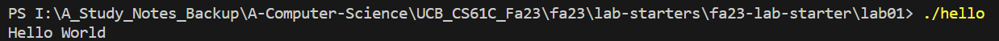


# Makefiles
## Sample Makefile
```makefile
UNAME_S := $(shell uname -s)
CC=gcc
LD=gcc
CFLAGS=-ggdb -Wall -std=c99
LDFLAGS=

ifeq ($(UNAME_S), Darwin)
    MEMCHECK=valgrind --tool=memcheck --leak-check=full --track-origins=yes --dsymutil=yes
endif

ifeq ($(UNAME_S), Linux)
    MEMCHECK=valgrind --tool=memcheck --leak-check=full --track-origins=yes
endif

BIT_OPS_OBJS = bit_ops.o test_bit_ops.o
BIT_OPS_PROG = bit_ops

LFSR_OBJS = lfsr.o test_lfsr.o
LFSR_PROG = lfsr

VECTOR_OBJS=vector.o vector-test.o
VECTOR_PROG=vector-test

BINARIES=$(VECTOR_PROG) $(BIT_OPS_PROG) $(LFSR_PROG)

all: $(BINARIES)

$(BIT_OPS_PROG): $(BIT_OPS_OBJS)
	$(CC) $(CFLAGS) -g -o $(BIT_OPS_PROG) $(BIT_OPS_OBJS) $(LDFLAGS)

$(LFSR_PROG): $(LFSR_OBJS)
	$(CC) $(CFLAGS) -g -o $(LFSR_PROG) $(LFSR_OBJS) $(LDFLAGS)

lfsr.c: lfsr.h
test_lfsr.c: lfsr.h

bit_ops.c: bit_ops.h
test_bit_ops.c: bit_ops.h

.c.o:
	$(CC) -c $(CFLAGS) $<

vector-memcheck: $(VECTOR_PROG)
	$(MEMCHECK) ./$(VECTOR_PROG)

clean:
	-rm -rf core *.o *~ "#"*"#" Makefile.bak $(BINARIES) *.dSYM

vector.c: vector.h
vector-test.c: vector.h

```
> The line that creates the lfsr program from its object files is $(CC) $(CFLAGS) -g -o $(LFSR_PROG) $(LFSR_OBJS) $(LDFLAGS). Its line number in the given Makefile would be 31 (assuming that the file starts with the UNAME_S line as line 1).


## Rules
### Setting Variables
```makefile
UNAME_S := $(shell uname -s)
CC=gcc
LD=gcc
CFLAGS=-ggdb -Wall -std=c99
LDFLAGS=
```
> - `UNAME_S`:  Determines the operating system by running the uname -s command.
> - `CC`: Specifies that the C compiler to use is gcc. **The compiler currently being used is gcc, as specified by the CC=gcc line.**
> - `LD`: Specifies that the linker to use is gcc.
> - `CFLAGS`: Compiler flags set for debugging (-ggdb), showing all warnings (-Wall), and adhering to the C99 standard (-std=c99). **The C standard being used is C99, as specified by the -std=c99 flag in CFLAGS.**
> - `LDFLAGS`: Linker flags are empty in this case.


### Setting Memcheck for Different OS
```makefile
ifeq ($(UNAME_S), Darwin)
    MEMCHECK=valgrind --tool=memcheck --leak-check=full --track-origins=yes --dsymutil=yes
endif
ifeq ($(UNAME_S), Linux)
    MEMCHECK=valgrind --tool=memcheck --leak-check=full --track-origins=yes
endif

```
> Sets the `MEMCHECK` variable based on the operating system. This is for running `Valgrind` with different options for macOS (Darwin) and Linux.
> **To reference a variable FOO in a Makefile, you would use $(FOO).**
> **The term "Darwin" represents the macOS operating system.**


### Specify Obbjects and Programs
```makefile
BIT_OPS_OBJS = bit_ops.o test_bit_ops.o
BIT_OPS_PROG = bit_ops
LFSR_OBJS = lfsr.o test_lfsr.o
LFSR_PROG = lfsr
VECTOR_OBJS=vector.o vector-test.o
VECTOR_PROG=vector-test

```
> Declares object files and program names for three separate programs: `bit_ops`, `lfsr`, and `vector-test`.


### all
```makefile
BINARIES=$(VECTOR_PROG) $(BIT_OPS_PROG) $(LFSR_PROG)
all: $(BINARIES)

```
> `all` is the default target. It will build all the binaries specified in `BINARIES`.
> **It is the rule that makes all the compiled programs**


### Compilation and Lining Rules
```makefile
$(BIT_OPS_PROG): $(BIT_OPS_OBJS)
    $(CC) $(CFLAGS) -g -o $(BIT_OPS_PROG) $(BIT_OBS_OBJS) $(LDFLAGS)
$(LFSR_PROG): $(LFSR_OBJS)
    $(CC) $(CFLAGS) -g -o $(LFSR_PROG) $(LFSR_OBJS) $(LDFLAGS)

```
> Defines how to build `bit_ops` and `lfsr` programs from their respective object files.


### Header File Dependencies
```makefile
lfsr.c: lfsr.h
test_lfsr.c: lfsr.h
bit_ops.c: bit_ops.h
test_bit_ops.c: bit_ops.h
```
> Specifies that certain `.c` files depend on certain `.h` (header) files.


### .c.o
```makefile
.c.o:
    $(CC) -c $(CFLAGS) $<

```
> Specifies how to compile `.c` files into `.o` object files.


### vector-memcheck
```makefile
vector-memcheck: $(VECTOR_PROG)
    $(MEMCHECK) ./$(VECTOR_PROG)

```
> Runs memory checking tool (`valgrind`) on the `vector-test` program.


### clean
```makefile
clean:
    -rm -rf core *.o *~ "#"*"#" Makefile.bak $(BINARIES) *.dSYM
```
> Deletes all the object files, temporary files, and binaries generated during the build.
> **It is the rule that deletes all the compiled programs.**


### More Header File Dependencies
```makefile
vector.c: vector.h
vector-test.c: vector.h

```
> Specifies that `vector.c` and `vector-test.c` depend on `vector.h`.


# Pointers
## Review
```c
int main() {
    int my_var = 20;
    int* my_var_p;
    my_var_p = &my_var;

    printf("Address of my_var: %p\n", my_var_p);
    printf("Address of my_var: %p\n", &my_var);
    printf("Address of my_var_p: %p\n", &my_var_p);

    *my_var_p += 2;

    printf("my_var: %d\n", my_var);
    printf("my_var: %d\n", *my_var_p);
}
```
**Output**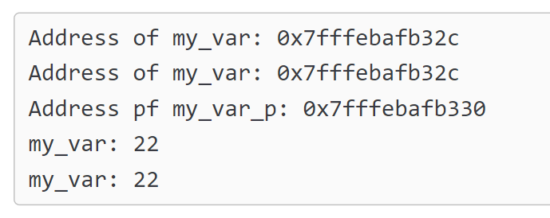
> 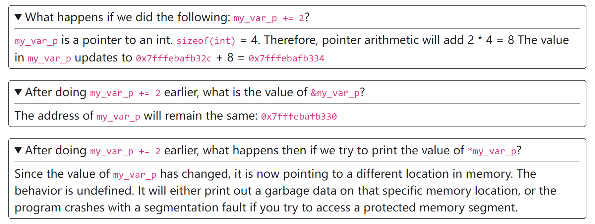


## Pointer Basics
```c
#include <stdio.h>

int main() {
  // Assign x (an integer) to 5
  int x = 5;

  // TODO: create a pointer to x
  // Hint: the first blank should be a variable type
  //       the second blank should be the address of x
  ______ pointer_to_x = ________;

  // This line should print 5
  printf("%d\n", *pointer_to_x);

  return 0;
}

```
```c
#include <stdio.h>

int main() {
  // Assign x (an integer) to 5
  int x = 5;

  // TODO: create a pointer to x
  // Hint: the first blank should be a variable type
  //       the second blank should be the address of x
  int* pointer_to_x = &x;

  // This line should print 5
  printf("%d\n", *pointer_to_x);

  return 0;
}

```


## Pointers&Functions
```c
#include <stdio.h>

void add_one(int input) {
  input += 1;
}

void add_one_pointer(int* input) {
  // TODO: add one to the integer that input points to
  ________ += 1;
}

int main() {
  // Assign x (an integer) to 5
  int x = 5;

  // Call add_one on x
  add_one(x);

  // This line should print 5
  // Why doesn't this work?
  printf("add_one: %d\n", x);

  // Let's try using add_one_pointer

  // TODO: use add_one_pointer to increment x
  // Hint: compare the type of x with the type of the argument
  //       for add_one_pointer
  add_one_pointer(______);

  // This line should print 6
  printf("add_one_pointer: %d\n", x);

  return 0;
}

```
```c
#include <stdio.h>

void add_one(int input) {
  input += 1;
}

void add_one_pointer(int* input) {
  // TODO: add one to the integer that input points to
  *input += 1;
}

int main() {
  // Assign x (an integer) to 5
  int x = 5;

  // Call add_one on x
  add_one(x);

  // This line should print 5
  // Why doesn't this work?
  printf("add_one: %d\n", x);

  // Let's try using add_one_pointer

  // TODO: use add_one_pointer to increment x
  // Hint: compare the type of x with the type of the argument
  //       for add_one_pointer
  add_one_pointer(&x);

  // This line should print 6
  printf("add_one_pointer: %d\n", x);

  return 0;
}

```
> 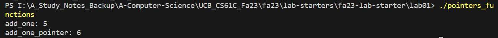


## Pointers to Stack vs Heap
```c
#include <stdio.h>
#include <stdlib.h>

int* int_on_stack() {
  // Allocates memory on the stack for an integer
  int x = 5;

  // Returns a pointer that points to the number 5
  return &x;
}

int* int_on_heap() {
  // TODO: allocate memory on the heap for an integer
  ______ ptr_to_5 = ______;

  // TODO: store the number 5 in memory you just allocated
  ______ = 5;

  // Returns a pointer that points to the number 5
  return ptr_to_5;
}

int main() {
  int* ptr_to_stack = int_on_stack();
  int* ptr_to_heap = int_on_heap();

  printf("ptr_to_stack is the address %p\n", ptr_to_stack);
  printf("ptr_to_heap is the address %p\n", ptr_to_heap);

  return 0;
}

```
> 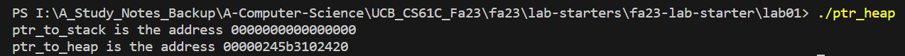

```c
#include <stdio.h>
#include <stdlib.h>

int* int_on_stack() {
  // Allocates memory on the stack for an integer
  int x = 5;

  // Returns a pointer that points to the number 5
  return &x;
}

int* int_on_heap() {
  // TODO: allocate memory on the heap for an integer
  int* ptr_to_5 = (int *) malloc(sizeof(int));

  // TODO: store the number 5 in memory you just allocated
  *ptr_to_5 = 5;

  // Returns a pointer that points to the number 5
  return ptr_to_5;
}

int main() {
  int* ptr_to_stack = int_on_stack();
  int* ptr_to_heap = int_on_heap();

  printf("ptr_to_stack is the address %p\n", ptr_to_stack);
  printf("ptr_to_heap is the address %p\n", ptr_to_heap);

  return 0;
}

```

## Pointer Arithmetics
```c
#include <stdint.h>
#include <stdio.h>
#include <stdlib.h>

int main() {
  // Creates an integer with value 5
  // Note: int8_t is a numerical datatype that takes up 1 byte of memory
  int16_t x = 5;

  // TODO: allocate an int8_t array of size 4
  // Hint: C represents arrays as a pointer to the first element
  // Hint: one malloc call allocates memory for the entire array
  //       it works because the elements are stored side by side
  ______ some_array = malloc(______);
  printf("address of the start of the array: %p\n", some_array);

  // TODO: compute the address of the element at index 2 (0-indexed)
  ______ ptr_to_idx_2 = ____________;
  printf("address of index 2: %p\n", ptr_to_idx_2);

  // TODO: store the value 10 at index 2, using ptr_to_idx_2
  __________ = 10;

  // TODO: print the value at index 2
  // Hint: this blank should be the same as the previous blank
  //       please don't hard code 10
  printf("value at index 2: %d\n", __________);

  return 0;
}
```
```c
#include <stdint.h>
#include <stdio.h>
#include <stdlib.h>

int main() {
  // Creates an integer with value 5
  // Note: int16_t is a numerical datatype that takes up 2 bytes of memory
  int16_t x = 5;

  // TODO: allocate an int16_t array of size 4
  // Hint: C represents arrays as a pointer to the first element
  // Hint: one malloc call allocates memory for the entire array
  //       it works because the elements are stored side by side
  int16_t* some_array = malloc(4 * sizeof(int16_t));
  printf("address of the start of the array: %p\n", some_array);

  // TODO: compute the address of the element at index 2 (0-indexed)
  int16_t* ptr_to_idx_2 = some_array + 2;
  printf("address of index 2: %p\n", ptr_to_idx_2);

  // TODO: store the value 10 at index 2, using ptr_to_idx_2
  *ptr_to_idx_2 = 10;

  // TODO: print the value at index 2
  // Hint: this blank should be the same as the previous blank
  //       please don't hard code 10
  printf("value at index 2: %d\n", *ptr_to_idx_2);

  return 0;
}

```
> 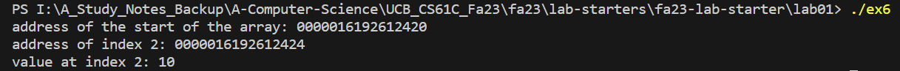


## Pointers to Pointers
> 本题中我们探究如何通过函数来创建对象指针，主要有两种方式:
> 1. 函数返回堆指针的方法。
> 2. 在栈上初始化一个指针，然后在函数内部通过双指针解引用来分配空间创建对象。

```c
#include <stdio.h>
#include <stdlib.h>

typedef struct {
    int id;
    char* name;
} Student;

Student* create_student_1(int id) {
  // TODO: allocate memory to store a Student struct
  ________ student_ptr = malloc(________);

  // TODO: set student_ptr's id to the id argument of this function
  ____________ = id;

  return student_ptr;
}

void create_student_2(Student** student_double_ptr, int id) {
  // TODO: fill the space that student_double_ptr points to with the address of
  //       some memory large enough for a Student struct
  // Hint: you may need to use the dereference operator here
  ______________ = malloc(________);

  // TODO: set student_double_ptr's id to the id argument of this function
  ____________ = id;
}


int main() {
  // TODO: use create_student_1 to create a pointer to a Student struct
  //       where the student has id of 5
  ______ student1_ptr = ______(______);

  // TODO: print the id of the student that student1_ptr points to
  printf("Student 1's ID: %d\n", ______);

  // TODO: create a pointer that can point to a Student struct
  //       do not allocate any memory
  ______ student2_ptr;

  // TODO: use create_student_2 to populate the student2_ptr
  //       where the student has id of 6
  // Hint: compare the type of student2_ptr with the type of
  //       the argument for create_student_2
  create_student_2(______, ______);

  // TODO: print the id of the student that student2_ptr points to
  printf("Student 2's ID: %d\n", ______);

  // Free everything allocated with `malloc`
  free(student1_ptr);
  free(student2_ptr);

  return 0;
}

```
```c
#include <stdio.h>
#include <stdlib.h>

typedef struct {
    int id;
    char* name;
} Student;

Student* create_student_1(int id) {
  // TODO: allocate memory to store a Student struct
  Student* student_ptr = malloc(sizeof(Student));

  // TODO: set student_ptr's id to the id argument of this function
  student_ptr->id = id;

  return student_ptr;
}

void create_student_2(Student** student_double_ptr, int id) {
  // TODO: fill the space that student_double_ptr points to with the address of
  //       some memory large enough for a Student struct
  // Hint: you may need to use the dereference operator here
  *student_double_ptr = malloc(sizeof(Student));

  // TODO: set student_double_ptr's id to the id argument of this function
  (*student_double_ptr)->id = id; // 括号是需要的
}


int main() {
  // TODO: use create_student_1 to create a pointer to a Student struct
  //       where the student has id of 5
  Student* student1_ptr = create_student_1(5);

  // TODO: print the id of the student that student1_ptr points to
  printf("Student 1's ID: %d\n", student1_ptr->id);

  // TODO: create a pointer that can point to a Student struct
  //       do not allocate any memory
  Student* student2_ptr;

  // TODO: use create_student_2 to populate the student2_ptr
  //       where the student has id of 6
  // Hint: compare the type of student2_ptr with the type of
  //       the argument for create_student_2
  create_student_2(&student2_ptr, 6);

  // TODO: print the id of the student that student2_ptr points to
  printf("Student 2's ID: %d\n", student2_ptr -> id);

  // Free everything allocated with `malloc`
  free(student1_ptr);
  free(student2_ptr);

  return 0;
}

```


# Arrays
```c
#include <stdint.h>
#include <stdio.h>
#include <stdlib.h>

int main() {
  // Creates an integer with value 5
  // Note: int8_t is a numerical datatype that takes up 1 byte of memory
  int8_t x = 5;

  // TODO: allocate an int8_t array of size 4
  // Hint: C represents arrays as a pointer to the first element
  // Hint: one malloc call allocates memory for the entire array
  //       it works because the elements are stored side by side
  ______ some_array = malloc(______);
  printf("address of the start of the array: %p\n", some_array);

  // TODO: compute the address of the element at index 2 (0-indexed)
  ______ ptr_to_idx_2 = ____________;
  printf("address of index 2: %p\n", ptr_to_idx_2);

  // TODO: store the value 10 at index 2, using ptr_to_idx_2
  __________ = 10;

  // TODO: print the value at index 2
  // Hint: this blank should be the same as the previous blank
  //       please don't hard code 10
  printf("value at index 2: %d\n", __________);

  return 0;
}
```
```c
#include <stdint.h>
#include <stdio.h>
#include <stdlib.h>

int main() {
  // Creates an integer with value 5
  // Note: int8_t is a numerical datatype that takes up 1 byte of memory
  int8_t x = 5;

  // TODO: allocate an int8_t array of size 4
  // Hint: C represents arrays as a pointer to the first element
  // Hint: one malloc call allocates memory for the entire array
  //       it works because the elements are stored side by side
  int8_t* some_array = malloc(4 * sizeof(int8_t));
  printf("address of the start of the array: %p\n", some_array);

  // TODO: compute the address of the element at index 2 (0-indexed)
  int8_t* ptr_to_idx_2 = some_array + 2;
  printf("address of index 2: %p\n", ptr_to_idx_2);

  // TODO: store the value 10 at index 2, using ptr_to_idx_2
  *ptr_to_idx_2 = 10;

  // TODO: print the value at index 2
  // Hint: this blank should be the same as the previous blank
  //       please don't hard code 10
  printf("value at index 2: %d\n", *ptr_to_idx_2);

  return 0;
}

```
> 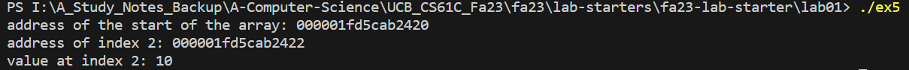


# Strings
```c
#include <stdio.h>
#include <stdlib.h>
#include <string.h>

int main() {
  // TODO: allocate memory to store the string "hello"
  // Hint: how many bytes do we need to store this string?
  ______ hello_str = malloc(______);

  // TODO: store the characters one at a time
  // Hint: don't forget the null terminator
  // Note: we use single quotes for characters
  ______ = 'h';
  ______ = 'e';
  ______ = 'l';
  ______ = 'l';
  ______ = 'o';

  // TODO: store the null terminator
  ______ = ______;

  // Prints hello_str
  printf("prints hello: %s\n", hello_str);

  // TODO: print the length of hello_str
  printf("length of hello: %lu\n", ______(hello_str));

  // TODO: allocate memory to store the string "world"
  ______ world_str = malloc(______);

  // TODO: fill in the type
  // Note: this automatically stores the string "world" in static memory
  //       but static memory is immutable, so you may need to copy it
  //       to the stack or the heap
  ______ static_world_str = "world";

  // TODO: use strcpy and static_world_str to store "world" into world_str
  // Hint: strcpy takes two arguments:
  //       first the destination, then the source
  ______(______, ______);

  // Prints world_str
  printf("prints world: %s\n", world_str);

  // Prints the address of world_str
  printf("address of world_str: %p\n", world_str);

  // TODO: compute the address of the letter r using world_str
  ______ ptr_to_r = ____________;
  printf("address of 'r': %p\n", ptr_to_r);

  // TODO: allocate memory to store the string "hello world"
  ______ hello_world_str = malloc(______);

  // TODO: use strcpy and hello_str to store
  //       the string "hello" into hello_world_str
  ______(______, ______);

  // TODO: store the space character in "hello world" at the correct index
  // Note: a space is not the same as null terminator
  //       a null terminator is represented by '\0'
  ______ = ' ';

  // TODO: use strcpy, pointer arithmetic, and world_str to store
  //       the string "world" into hello_world_str
  ______(______ + ______, ______);

  // Prints hello_world_str
  printf("prints hello world: %s\n", hello_world_str);

  return 0;
}

```
```c
#include <stdio.h>
#include <stdlib.h>
#include <string.h>

#define STRINGLEN 5
#define STRINGLEN2 12

int main() {
  // TODO: allocate memory to store the string "hello"
  // Hint: how many bytes do we need to store this string?
  char* hello_str = malloc(STRINGLEN + 1);

  // TODO: store the characters one at a time
  // Hint: don't forget the null terminator
  // Note: we use single quotes for characters
  hello_str[0] = 'h';
  hello_str[1] = 'e';
  hello_str[2] = 'l';
  hello_str[3] = 'l';
  hello_str[4] = 'o';

  // TODO: store the null terminator
  hello_str[5] = '\0';

  // Prints hello_str
  printf("prints hello: %s\n", hello_str);

  // TODO: print the length of hello_str
  printf("length of hello: %lu\n", strlen(hello_str));

  // TODO: allocate memory to store the string "world"
  char* world_str = malloc(STRINGLEN + 1);

  // TODO: fill in the type
  // Note: this automatically stores the string "world" in static memory
  //       but static memory is immutable, so you may need to copy it
  //       to the stack or the heap
  char* static_world_str = "world";

  // TODO: use strcpy and static_world_str to store "world" into world_str
  // Hint: strcpy takes two arguments:
  //       first the destination, then the source
  strcpy(world_str, static_world_str);

  // Prints world_str
  printf("prints world: %s\n", world_str);

  // Prints the address of world_str
  printf("address of world_str: %p\n", world_str);

  // TODO: compute the address of the letter r using world_str
  char* ptr_to_r = world_str + 2;
  printf("address of 'r': %p\n", ptr_to_r);

  // TODO: allocate memory to store the string "hello world"
  char* hello_world_str = malloc(STRINGLEN2 + 1);

  // TODO: use strcpy and hello_str to store
  //       the string "hello" into hello_world_str
  strcpy(hello_world_str, hello_str);

  // TODO: store the space character in "hello world" at the correct index
  // Note: a space is not the same as null terminator
  //       a null terminator is represented by '\0'
  hello_world_str[STRINGLEN] = ' ';

  // TODO: use strcpy, pointer arithmetic, and world_str to store
  //       the string "world" into hello_world_str
  strcpy(hello_world_str + STRINGLEN + 1, world_str);

  // Prints hello_world_str
  printf("prints hello world: %s\n", hello_world_str);

  return 0;
}
```


# Structs
```c
#include <stdio.h>
#include <stdlib.h>

// Structs allow you to hold data items of different types in a single variable
// Struct definitions can be used to declare a struct variable within your program
// Struct definitions are typically done outside of a function
struct Student {
    int id;
    char* name;
};

int main() {
  // TODO: declare a variable student1 of type struct Student
  // Note: this struct is stored on the stack
  ________________ student1;

  // TODO: set student1's id field to 5
  // Hint: the dot notation accesses a struct's fields
  ______.______ = 5;

  // TODO: print out student1's id field
  printf("Student 1's ID: %d\n", ______);

  // You can also store a struct on the heap

  // TODO: allocate memory to store a struct Student on the heap
  // Hint: sizeof(x) can be used to find the number of bytes that
  //       x takes up in memory, instead of manually computing it
  ______ student2_ptr = malloc(______);

  // TODO: set student2_ptr's id field to 6
  // Hint: you need to use both the dot operator and the dereference operator
  //       and use parentheses to guarantee order of operations
  ______________ = 6;

  // TODO: print out student2_ptr's id field
  printf("Student 2's ID: %d\n", ______);

  return 0;
}

```
> **在栈内存上给**`**Struct**`**分配内存:**
> `struct Student student;`
> **在堆内存上给**`**Struct**`**分配内存:**
> `struct Student *student = (struct Student *) malloc(sizeof(struct Student))`
> 注意`sizeof`里面一定要是`struct`本身，而不是指针。

```c
#include <stdio.h>
#include <stdlib.h>

// Structs allow you to hold data items of different types in a single variable
// Struct definitions can be used to declare a struct variable within your program
// Struct definitions are typically done outside of a function
typedef struct Student {
    int id;
    char* name;
} Student;

int main() {
  // TODO: declare a variable student1 of type struct Student
  // Note: this struct is stored on the stack
  Student s;

  // TODO: set student1's id field to 5
  // Hint: the dot notation accesses a struct's fields
  s.id = 5;

  // TODO: print out student1's id field
  printf("Student 1's ID: %d\n", s.id);

  // You can also store a struct on the heap

  // TODO: allocate memory to store a struct Student on the heap
  // Hint: sizeof(x) can be used to find the number of bytes that
  //       x takes up in memory, instead of manually computing it
  Student* student2_ptr = malloc(Student);

  // TODO: set student2_ptr's id field to 6
  // Hint: you need to use both the dot operator and the dereference operator
  //       and use parentheses to guarantee order of operations
  student2_ptr->id = 6;

  // TODO: print out student2_ptr's id field
  printf("Student 2's ID: %d\n", student2_ptr->id);

  return 0;
}
```
> 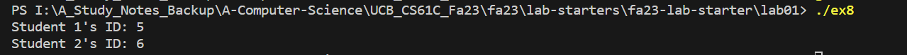


# Practice Examples
## Bit Operations
>  Bits are numbered from right (Least Significant Bit) to left (Most Significant Bit).
> 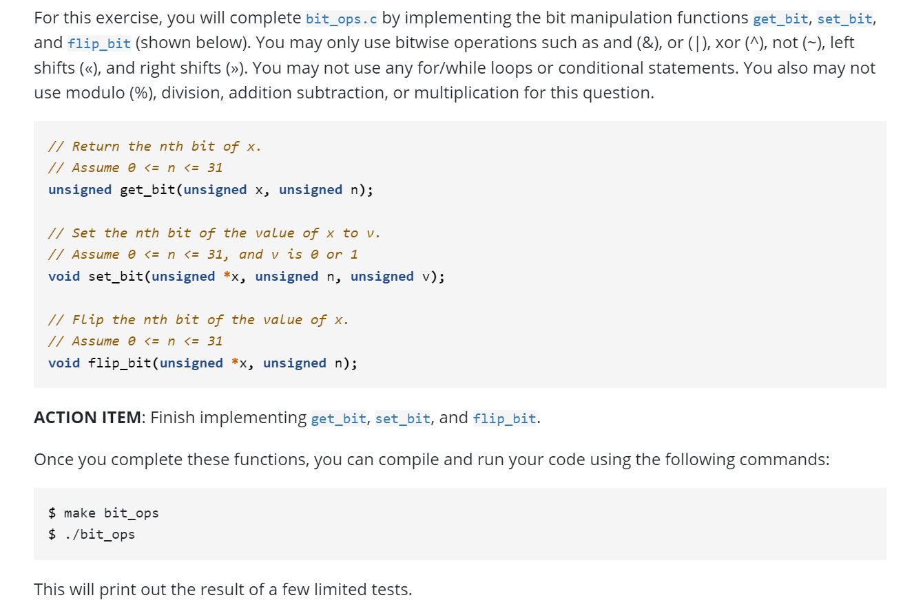
> 在电脑上如果遇到`make cannot be recognized as cmdlet`之类的问题，就参考:
> [https://blog.csdn.net/qingtu11/article/details/124073708](https://blog.csdn.net/qingtu11/article/details/124073708)
> 注意本题不能使用`%,+,-,*,/`。
> **本题使用到关于**`**&,|,^**`**的一些位运算的技巧:**
> 1. `&`: 通常用于`mask bits off`, 比如`0b100`, 我们想要把`MSB`的`1`变成零，可以使用一个`0b011`的`mask`和其进行位与运算, 即在我们想要设置为零的位`mask`的值为`0`，其余为零。
> 2. `|`: 通常用于`mask bits on`, 比如`0b001`, 我们想把前两位的`0`变成`1`, 则我们可以使用一个`0b110`的`mask`和其进行位或运算, 即在我们想要设置为`1`的位处的`mask`的值设置为`1`，其余为零。
> 3. `^`: 通常用于`Flip bits`, 比如`0b001`, 我们想把`LSB`处的`1`变成零，其余位不变，则我们可以使用一个`0b001`的`mask`和其进行位异或运算, 即在我们想要`Flip`的位处的`mask`的值设置为`1`, 其余为零即可。

```c
#include <stdio.h>
#include "bit_ops.h"
#include <stdio.h>
#include "bit_ops.h"

// Return the nth bit of x.
// Assume 0 <= n <= 31
unsigned get_bit(unsigned x,
                 unsigned n) {
    // YOUR CODE HERE
    // Returning -1 is a placeholder (it makes
    // no sense, because get_bit only returns 
    // 0 or 1)
    return (x >> n) & 1;
}
// Set the nth bit of the value of x to v.
// Assume 0 <= n <= 31, and v is 0 or 1
void set_bit(unsigned * x,
             unsigned n,
             unsigned v) {
    // YOUR CODE HERE
    unsigned n_bit = get_bit(*x, n);

    unsigned mask = 1;

    mask = (mask << n);

    unsigned flipped_mask = ~mask;

    // & 111...101....111 when we want to set v from 1 to 0
    if (n_bit == 1 && v == 0) {
        (*x) = (*x) & flipped_mask;
    }


    // | 000...010....000 when we want to set v from 0 to 1
    if (n_bit == 0 && v == 1) {
        (*x) = (*x) | mask;
    }

    // Otherwise, unchanged.
    return;
}
// Flip the nth bit of the value of x.
// Assume 0 <= n <= 31
void flip_bit(unsigned * x,
              unsigned n) {
    // YOUR CODE HERE
    unsigned n_bit = get_bit(*x, n);
    if (n_bit == 0) {
        set_bit(x, n, 1);
    } else {
        set_bit(x, n, 0);
    }
}

```
> 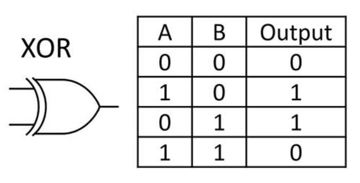

```c
#include <stdio.h>
#include "bit_ops.h"

// Return the nth bit of x.
// Assume 0 <= n <= 31
unsigned get_bit(unsigned x,
                 unsigned n) {
    // YOUR CODE HERE
    // Returning -1 is a placeholder (it makes
    // no sense, because get_bit only returns
    // 0 or 1)
    return (1&(x>>n));
}
// Set the nth bit of the value of x to v.
// Assume 0 <= n <= 31, and v is 0 or 1
void set_bit(unsigned * x,
             unsigned n,
             unsigned v) {
    // YOUR CODE HERE
    unsigned mask = ~(1<<n);

    // 先用&重置，再用|设置值
    (*x) = ((*x) & mask)|(v << n);
}
// Flip the nth bit of the value of x.
// Assume 0 <= n <= 31
void flip_bit(unsigned * x,
              unsigned n) {
    // YOUR CODE HERE
    // Use XOR to flip the bit
    (*x)^=(1<<n);
}
```


## Linear Feedback Shift Register
> 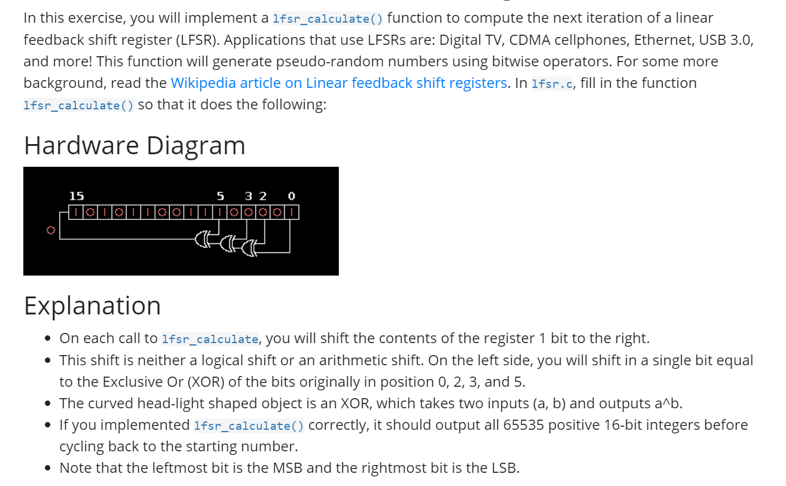
> 本质上这个`LSFR`的逻辑就是:
> 1. 获取第`0,2,3,5`位的`bit`
> 2. 然后根据第`0,2,3,5`位的`bit`通过一系列异或门得到第`15`位的`bit`
> 3. `Logic-Shift-Right`一位。
> 4. 设置第`15`位的`bit`
> 
[https://en.wikipedia.org/wiki/Linear-feedback_shift_register](https://en.wikipedia.org/wiki/Linear-feedback_shift_register)
> 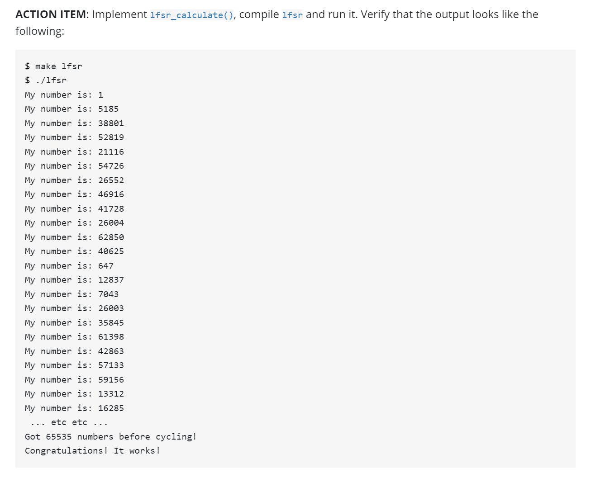

```c
#include <stdio.h>
#include <stdint.h>
#include <stdlib.h>
#include <string.h>
#include "lfsr.h"

uint16_t get_bit(uint16_t reg, uint16_t n) {
    return (1 & (reg >> n));
}


void set_bit(uint16_t *reg, uint16_t n, uint16_t v) {
    uint16_t mask = ~(1<<n);
    (*reg) = ((*reg) & mask) | (v << n);
}


void lfsr_calculate(uint16_t *reg) {
    /* YOUR CODE HERE */
    uint16_t reg0 = get_bit(*reg, 0);
    uint16_t reg2 = get_bit(*reg, 2);
    uint16_t reg3 = get_bit(*reg, 3);
    uint16_t reg5 = get_bit(*reg, 5);
    (*reg) = (*reg) >> 1;
    uint16_t new_reg_15 = ((reg0^reg2)^reg3)^reg5;
    set_bit(reg, 15, new_reg_15);
}

```
> 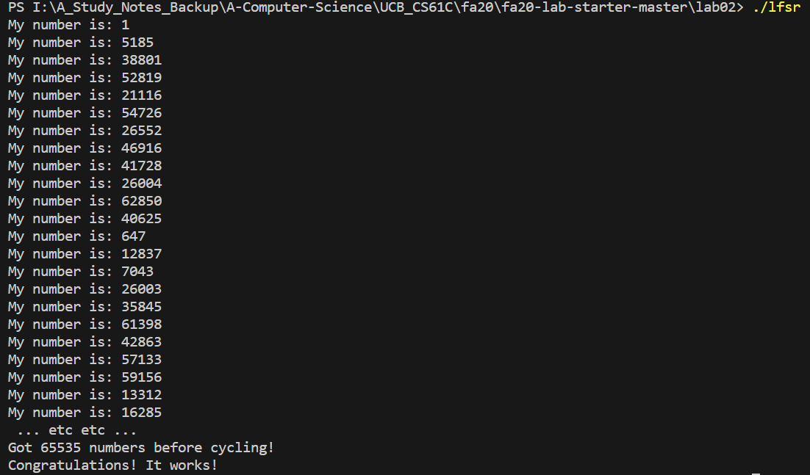


## Reverse A SLList - 双指针法
> 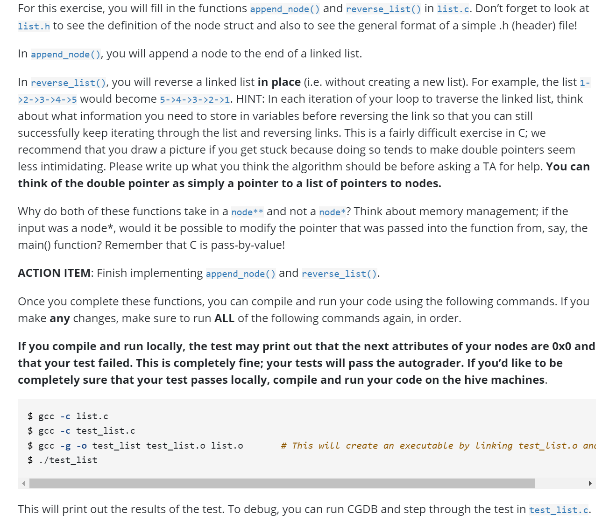

```c
#include <stdlib.h>

typedef struct node {
	int val;
	struct node *next;
} node;

void append_node(node** head_ptr, int new_data);
void reverse_list(node** head_ptr);

```
```c
#include "list.h"

/* Add a node to the end of the linked list. Assume head_ptr is non-null. */
void append_node (node** head_ptr, int new_data) {
	/* First lets allocate memory for the new node and initialize its attributes */
	/* YOUR CODE HERE */

	/* If the list is empty, set the new node to be the head and return */
	if (*head_ptr == NULL) {
		/* YOUR CODE HERE */
	}
	node* curr = *head_ptr;
	while (/* YOUR CODE HERE */ != NULL) {
		curr = curr->next;
	}
	/* Insert node at the end of the list */
	/* YOUR CODE HERE */
}

/* Reverse a linked list in place (in other words, without creating a new list).
   Assume that head_ptr is non-null. */
void reverse_list (node** head_ptr) {
	node* prev = NULL;
	node* curr = *head_ptr;
	node* next = NULL;
	while (curr != NULL) {
		/* INSERT CODE HERE */
	}
	/* Set the new head to be what originally was the last node in the list */
	*head_ptr = /* INSERT CODE HERE */
}
```
```c
#include "list.h"

/* Add a node to the end of the linked list. Assume head_ptr is non-null. */
void append_node (node** head_ptr, int new_data) {
	/* First lets allocate memory for the new node and initialize its attributes */
	/* YOUR CODE HERE */
	node* new_head = (node*) malloc(sizeof(node));
	new_head->val = new_data;
	new_head->next = NULL;

	/* If the list is empty, set the new node to be the head and return */
	if (*head_ptr == NULL) {
		/* YOUR CODE HERE */
		*head_ptr = new_head;
		return;
	}
	node* curr = *head_ptr;
	while (curr->next != NULL) {
		curr = curr->next;
	}
	/* Insert node at the end of the list */
	/* YOUR CODE HERE */
	curr->next = new_head;
}

/* Reverse a linked list in place (in other words, without creating a new list).
   Assume that head_ptr is non-null. */
void reverse_list (node** head_ptr) {
	node* prev = NULL;
	node* curr = *head_ptr;
	node* next = NULL;
	while (curr != NULL) {
		/* INSERT CODE HERE */
		next = curr -> next;
		curr -> next = prev;
		prev = curr;
		curr = next;
	}
	/* Set the new head to be what originally was the last node in the list */
	*head_ptr = prev;
}

```


## Detect Cycle in SLList - 双指针法
> 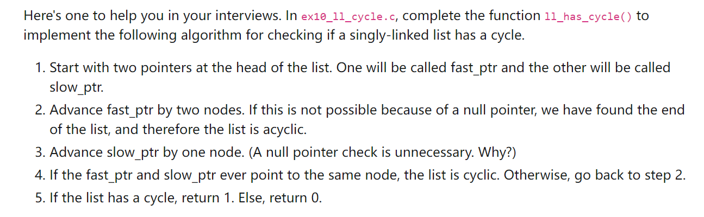

```c
#include <stddef.h>
#include "ll_cycle.h"

int ll_has_cycle(node *head) {
    /* your code here */
    node* slow = head;
    node* fast = head;

    while (fast != NULL) {
        fast = fast -> next;
        if (fast -> next == NULL) {
            break;
        }
        fast = fast -> next;
        slow = slow -> next;
        if (slow == fast) {
            return 1;
        }
    }

    if (slow == fast) {
        return 1;
    }

    return 0;
}
```


# Related Resources
> Fa23 Basic C
> Su20 Advanced C


