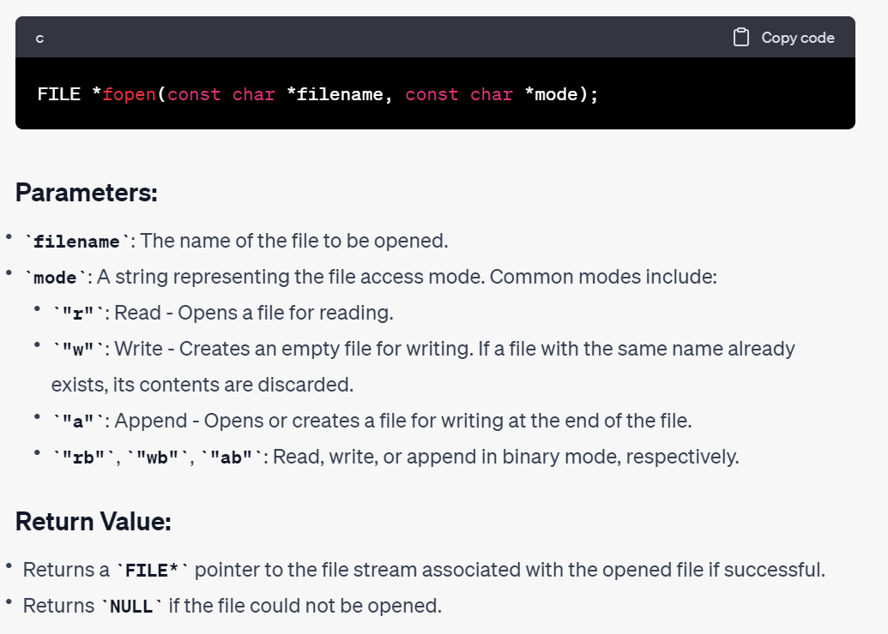
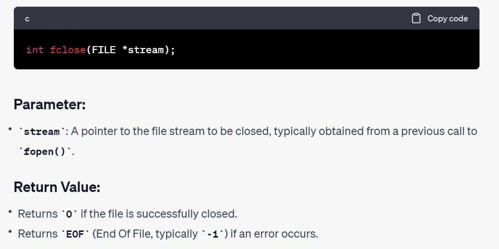
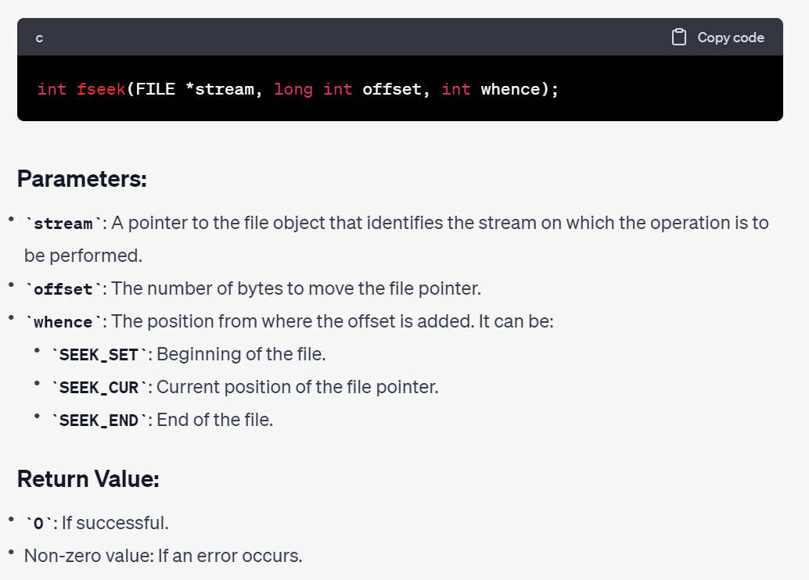
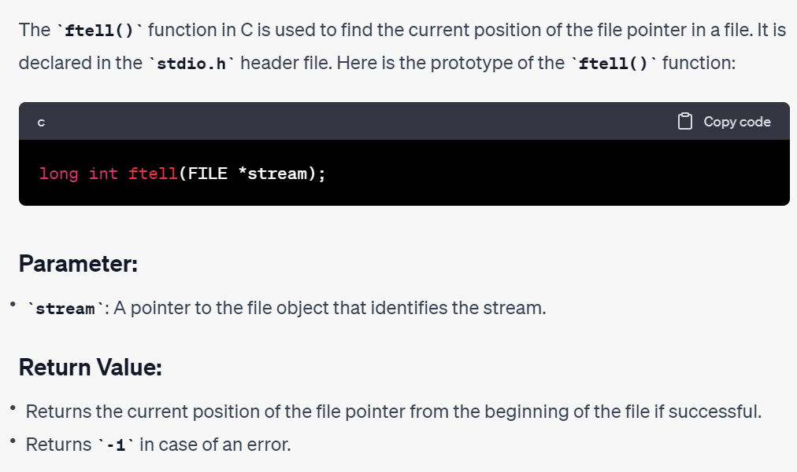
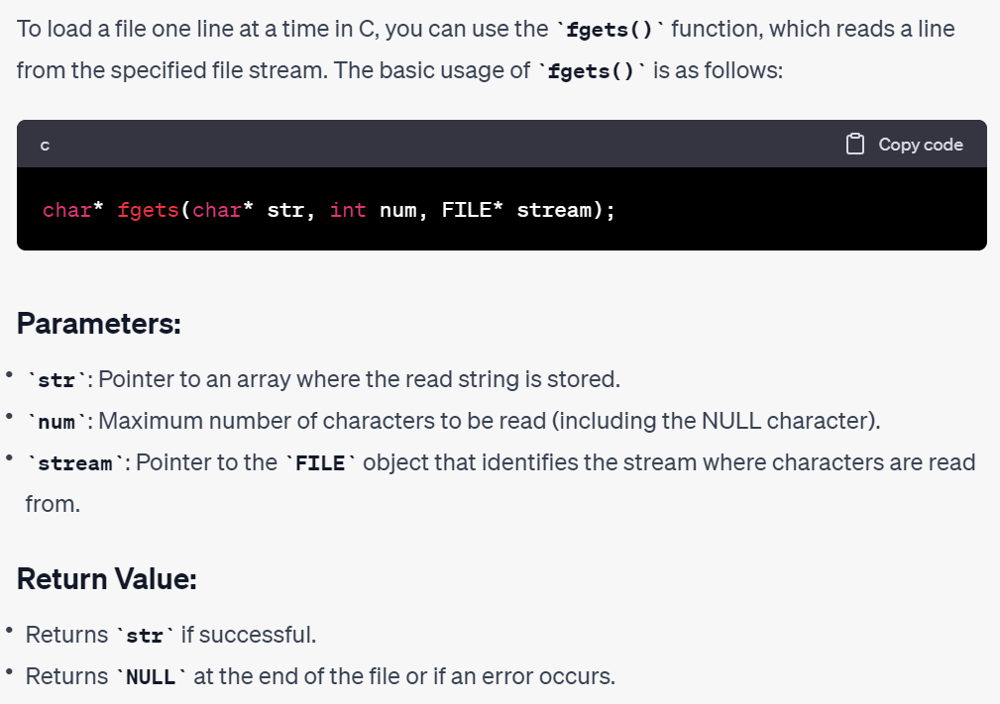
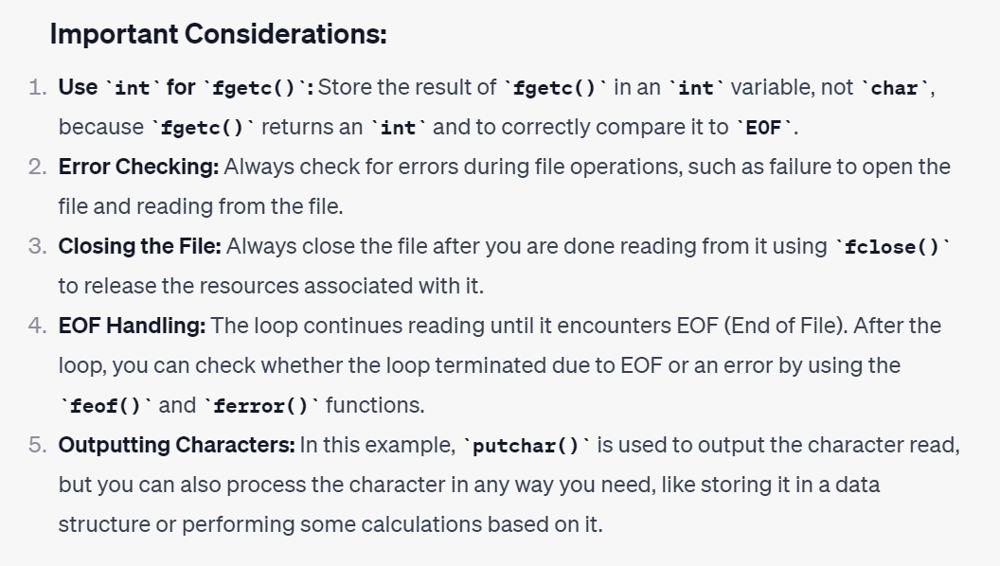
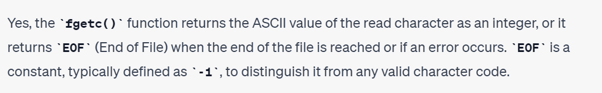
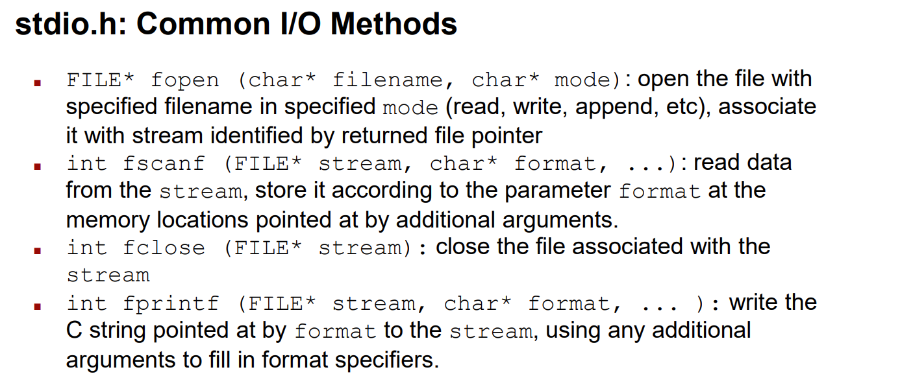

# 打开/关闭文档 - fopen/fclose
## fopen
> 

```c
#include <stdio.h>

int main() {
    FILE *file;

    file = fopen("example.txt", "r"); // Open the file in read mode

    if (file == NULL) {
        perror("Error opening file");
        return 1;
    }

    // Perform file operations, such as reading or writing

    fclose(file); // Close the file when done

    return 0;
}
```


## fclose
> 

```c
#include <stdio.h>

int main() {
    FILE *file;
    
    file = fopen("example.txt", "r"); // Open the file in read mode
    
    if (file == NULL) {
        perror("Error opening file");
        return 1;
    }
    
    // Perform file operations, such as reading or writing
    
    if (fclose(file) == EOF) { // Close the file when done
        perror("Error closing file");
        return 2;
    }

    return 0;
}
```


# 计算文档长度 - fseek, ftell
## fseek
> 

```c
#include <stdio.h>

int main() {
    FILE *file;
    file = fopen("example.txt", "r");

    if (file == NULL) {
        perror("Error opening file");
        return 1;
    }

    // Move the file pointer 10 bytes ahead from the beginning of the file
    if (fseek(file, 10, SEEK_SET) != 0) {
        perror("Error performing fseek");
        fclose(file);
        return 2;
    }

    char buffer[20];
    if (fgets(buffer, sizeof(buffer), file) == NULL) {
        perror("Error reading file");
        fclose(file);
        return 3;
    }

    printf("Read string: %s\n", buffer);
    fclose(file);

    return 0;
}
```


## ftell
> 

```c
#include <stdio.h>

int main() {
    FILE *file;
    file = fopen("example.txt", "r");

    if (file == NULL) {
        perror("Error opening file");
        return 1;
    }

    long int position;

    // Getting the current position of file pointer
    position = ftell(file);
    printf("Initial file pointer position: %ld\n", position);

    // Moving the file pointer 10 bytes ahead from the beginning of the file
    fseek(file, 10, SEEK_SET);

    // Getting the new position of file pointer
    position = ftell(file);
    printf("File pointer position after fseek: %ld\n", position);

    char buffer[20];
    if (fgets(buffer, sizeof(buffer), file) == NULL) {
        perror("Error reading file");
        fclose(file);
        return 2;
    }

    // Getting the position of the file pointer after reading some data
    position = ftell(file);
    printf("File pointer position after reading: %ld\n", position);
    printf("Read string: %s\n", buffer);

    fclose(file);

    return 0;
}
```


## 计算文档长度
```c
FILE* f = fopen("FILENAME", "r");
fseek(f, 0, SEEK_END); // Move the pointer to the end of the file
unsigned int f_len = (unsigned int) ftell(f); // Calculate the offset from the start of the file to the end.
rewind(f); // Bring the file pointer to the front.
```


# 读取文档内容
## fgets
> 

```c
#include <stdio.h>
#include <stdlib.h>

int main() {
    FILE *file;
    char line[256]; // Buffer to store the read line, assuming each line is less than 256 characters

    file = fopen("example.txt", "r");

    if (file == NULL) {
        perror("Error opening file");
        return 1;
    }

    while (fgets(line, sizeof(line), file) != NULL) {
        // If you want to remove the newline character at the end of the line
        size_t len = strlen(line);
        if (len > 0 && line[len - 1] == '\n') {
            line[len - 1] = '\0';
        }

        printf("Read line: %s\n", line);
    }

    // Check if fgets exited due to an error and not due to reaching EOF
    if (ferror(file)) {
        perror("Error reading from file");
        fclose(file);
        return 2;
    }

    fclose(file);

    return 0;
}
```

## fgetc
> 

```c
#include <stdio.h>

int main() {
    FILE *file;
    int ch; // int, not char, to hold EOF
    
    file = fopen("example.txt", "r");
    if (file == NULL) {
        perror("Error opening file");
        return 1;
    }
    
    while ((ch = fgetc(file)) != EOF) {
        putchar(ch); // print the character read
    }
    
    // Check if fgetc() exited due to an error and not due to reaching EOF
    if (ferror(file)) {
        perror("Error reading from file");
        fclose(file);
        return 2;
    }
    
    fclose(file);
    return 0;
}
```


# Common I/O Methods
> 

