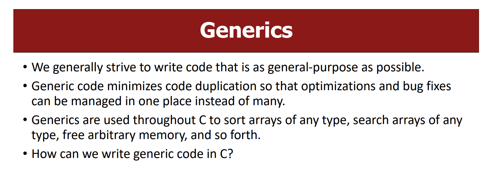
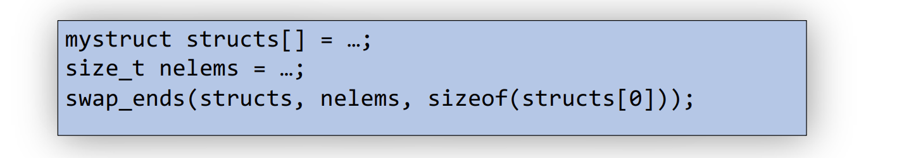
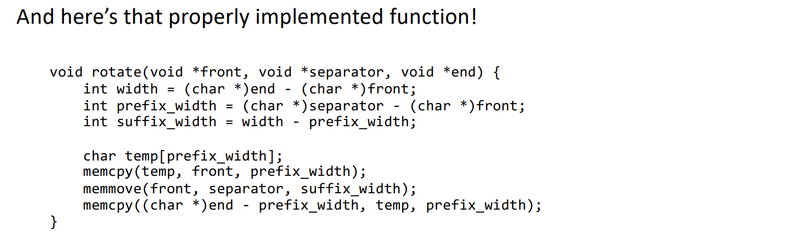
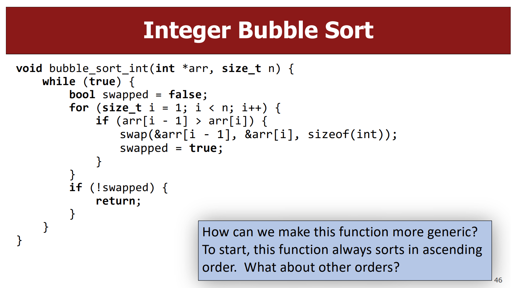

# Generics
> [!concept]
> 

# Swap Elements
## Swap two ints
> [!code]
> 

## Swap two shorts
> [!code]
> 

## Swap two strings
> [!code]
> 

# Generic Swap - void*/memcpy/memmove
> [!important]
> 
> The goal is this chapter is to create just ==one== generic function(using function pointers) that could handle all the cases above instead of writing individual pieces of code to consider for all input cases.

## Step 1: Change method signature
> [!code]
> 
> So that we want to transform our code into the following:
> 
> 
> For these three lines, we have to tackle two problems:
> - Line 1: Each type may need a different size temp.
> - Line 2: Each type needs to copy a different amount of data.
> - Line 3: Each type needs to copy a different amount of data.
> 
> 
> C knows the size of `temp`, inferring from its static type, and knows how many bytes to replicate, because of the variable types. But is there a way to make a version that doesn't care about the variable types?
> 
> The answer in that we could use `void*` as the pointer to data, `void *` doesn't make any assumption on the size of the data, and thus we cannot use static typing to infer the size of data. So we should introduce a new parameter that indicates the size of the data we are dealing with, which gives the following codes:
> 

## Step 2: Change function body - memcpy/memmove
> [!code]
> Now the second problem is that we want to first copy the data 1 to some temporary variable. Doing this requires:
> 1. We have someplace to store data 1. Since data1 is of `nbytes`, we could create a buffer `char buf[nbytes]` to hold data1.
> 2. We have to read data 1. The first thought would be dereferencing the `data1ptr`, but note that `void*` could indicate any data types and thus may access arbitrary amount/location of memory space, which may cause segment fault. **Moreover, C doesn’t know what it points to! Therefore, it doesn’t know how many bytes there it should be looking at.**
> 
> The solution turns out to be rather simple, just using the `memcpy/memmove` function provided by standard C library.
> 
> Finally, our code becomes:
> 
> 

## Design of memcpy and memmove
> [!concept]
> 

## Void* Pitfalls
> [!important]
> 

# Generic Swap Array Elements
## Generic Implementation - Type Casting
> [!motiv] Motivation
> 
> Now we can use the swap element function written above and replace the body of swap_ends_int():
> 
> 
> Other version of the swap looks like the following:
> 
> 

> [!code]
> We want to rewrite the following function to support any types:
> 
> The first idea that comes up should be using `void *`, since it can potentially be any types, it's just that we don't know exactly which type it will be. So let's modify the first argument type to be statically `void*`:
> 
> 
> It is generic for sure, but it doesn't work. Since in the function we have `arr + nelems - 1` which means we are doing pointer arithmetics. But pointer arithmetics depends on the type of data being pointed to, with `void*` we will lose that information. So we need to know the element size, which prompt us to add a paramter as follows:
> 
> 
> Now in order to get to the last element of the arr, we would have to perform certain kind of pointer arithmetics, like `arr + some bytes`, since we already know the total number of elements in the array and the size of each elements. If we could move one byte at a time, the pointer arithmetic would be `arr + (nelems - 1) * elem_bytes`. So the last missing piece of the function should be to make the pointer access the memory one byte when we perform `arr + 1`, which can be realized using type casting feature:
> 
> 

## Array Rotations
> [!example]
> 

# Integer Bubble Sort - Function Pointer
## Integer Version
> [!concept] Implementation Idea
> 

## Generic on Swap
> [!important]
> 
> So our function should look like this:
> 
> 
> Back to the bubble sort function, we could do the following modifications:
> 
> 
> If we want to sort the element according to there absolute value, then we can do the following:
> 
> 

## Function Pointer Details
> [!concept]
> 

## Comparison Functions
> [!important]
> 

# Generic Bubble Sort
> [!motiv] Motivation
> 

## Generic Parameters
> [!concept]
> 

## Generify Bubble Sort
> [!important]
> Given the original function:
> 
> We first generify the element type by making arr type arbitrary, setting to `void *`:
> 
> 
> In order to call our generic version of `swap_array_element`, we need to match its parameter static type as follows:
> 
> 
> Then, let's generify the comparater function as follows:
> 
> 
> Finally, the comparator function:
> 
> 

## Function Pointer Pitfalls
> [!important]
> 
> It wil return the wrong answer, since the logic of comparison is different from other types.

