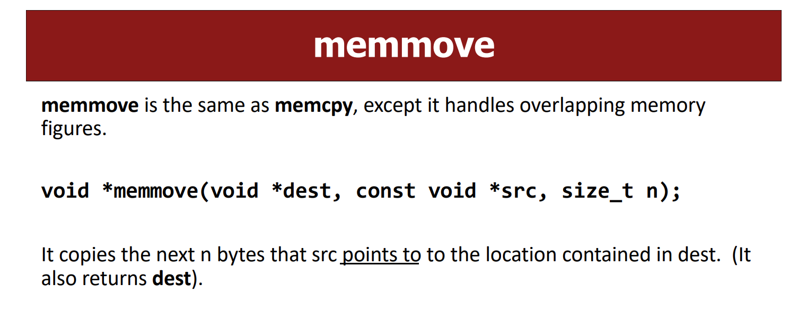
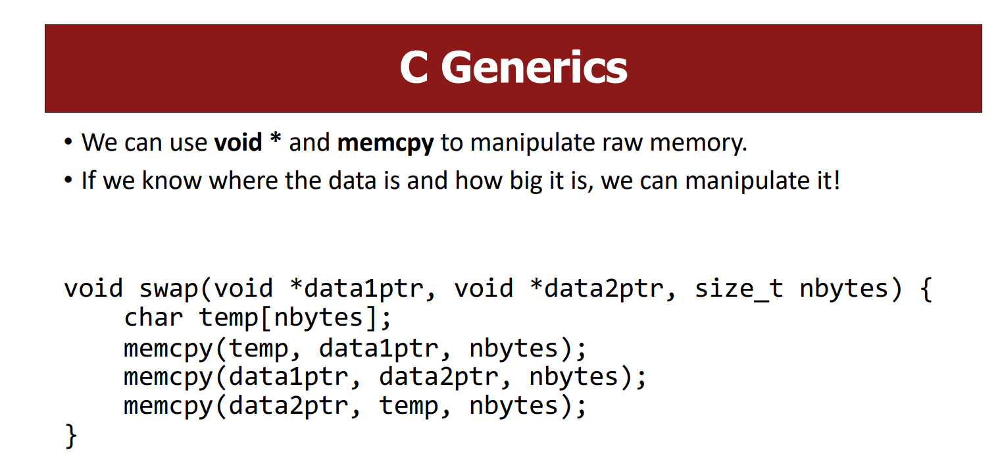

# Generics
> [!concept]
> 

# Swap Example
## Swap two ints
> [!code]
> 

## Swap two shorts
> [!code]
> 

## Swap two strings
> [!code]
> 

# Generic Swap - void*/memcpy/memmove
> [!important]
> 
> The goal is this chapter is to create just ==one== generic function(using function pointers) that could handle all the cases above instead of writing individual pieces of code to consider for all input cases.

## Step 1: Change method signature
> [!code]
> 
> So that we want to transform our code into the following:
> 
> 
> For these three lines, we have to tackle two problems:
> - Line 1: Each type may need a different size temp.
> - Line 2: Each type needs to copy a different amount of data.
> - Line 3: Each type needs to copy a different amount of data.
> 
> 
> C knows the size of `temp`, inferring from its static type, and knows how many bytes to replicate, because of the variable types. But is there a way to make a version that doesn't care about the variable types?
> 
> The answer in that we could use `void*` as the pointer to data, `void *` doesn't make any assumption on the size of the data, and thus we cannot use static typing to infer the size of data. So we should introduce a new parameter that indicates the size of the data we are dealing with, which gives the following codes:
> 

## Step 2: Change function body - memcpy/memmove
> [!code]
> Now the second problem is that we want to first copy the data 1 to some temporary variable. Doing this requires:
> 1. We have someplace to store data 1. Since data1 is of `nbytes`, we could create a buffer `char buf[nbytes]` to hold data1.
> 2. We have to read data 1. The first thought would be dereferencing the `data1ptr`, but note that `void*` could indicate any data types and thus may access arbitrary amount/location of memory space, which may cause segment fault. **Moreover, C doesn’t know what it points to! Therefore, it doesn’t know how many bytes there it should be looking at.**
> 
> The solution turns out to be rather simple, just using the `memcpy/memmove` function provided by standard C library.
> 
> Finally, our code becomes:
> 
> 

## Design of memcpy and memmove
> [!concept]
> 

## Void* Pitfalls
> [!important]
> 

# Swap Ends

