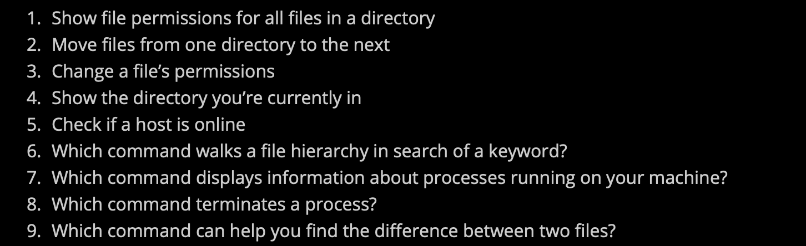

# Installing Ubuntus
> **Windows:**
> 1. 安装VirtualBox 6.1
> 2. 安装VirtualBox 6.0.0 Extension Packages
> 3. 下载Ubuntus xx.xx 镜像, 安装系统

# Basic CLI commands
> 
> `<ctrl>+c`退出当前程序执行。

# Working with Files
## touch&cat
> 

## man
> 
> 对于`man`指令来说，我们可以使用它查找其他的指令: `man -k "keywords and phrases"`
> 使用`man`查找到指令之后，我们可以使用`man [command_name] | less`获取该指令的详细使用方法。

## vim
> 

# Finding Commands
> 
> 1. ls -la
> 2. mv filename.txt directory
> 3. chmod u=rwx,q=rx,o=r [filename]
> 4. pwd
> 5. ping
> 6. find [directory] -name filename.txt
> 7. ps
> 8. kill [pid]
> 9. diff filename1.txt filename2.txt

