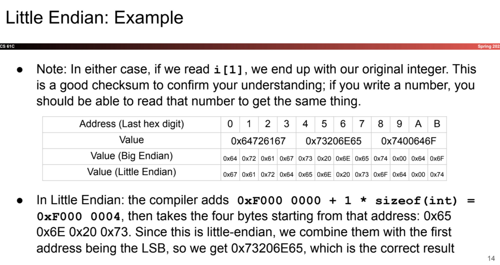
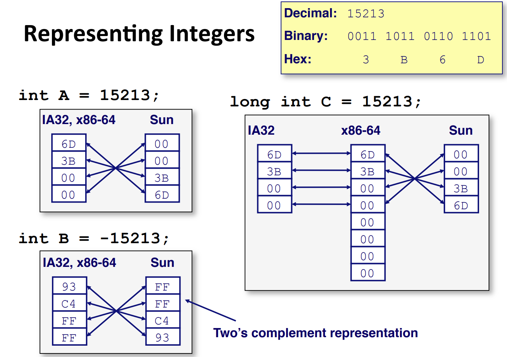
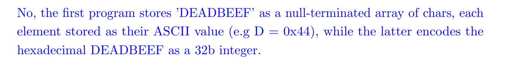
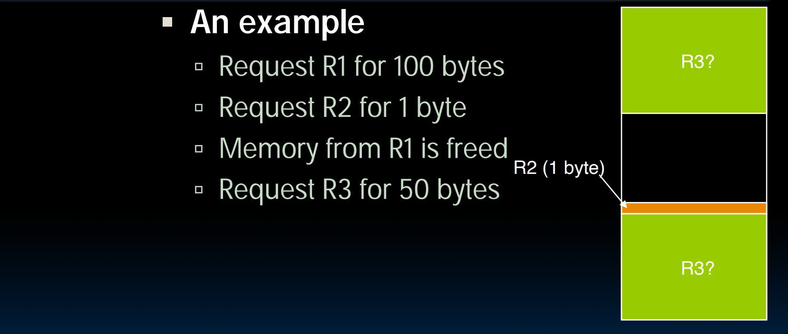
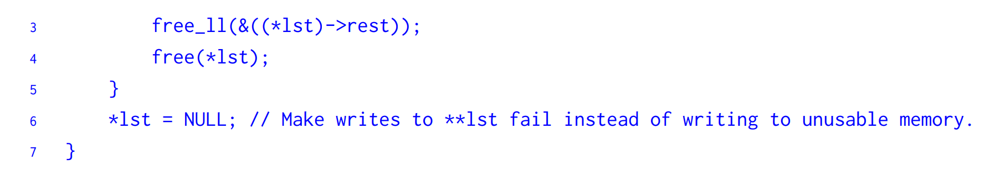

# Addressing and Endianness
## Addresses
> 


## Endianness
> 


### Big Endian
> 


### Little Endian
> 


### Common Mistakes
> 


### Difference between OS
> 


## Code for Endinaness
> 

```c
typedef unsigned char *pointer;
void show_bytes(pointer start, size_t len){
     size_t i;
     for (i = 0; i < len; i++)
     printf(”%p\t0x%.2x\n",start+i, start[i]);
     printf("\n");
} 
```

## Representing Pointers
> 


## Representing Strings
> 
> `**Endianness**`**only takes effect on multi-byte objects.**


### String Storation Exercise
> **Sp23 Disc02**
> 


# C Memory Layout
## Memory Layout/Sectors
> 


## Stack
> 
> 注意，当例程执行结束后，仅仅是`SP`指向的内存地址发生变化(向上缩减)，例程活跃期间的局部变量仍然存在于原来的栈帧中，可以访问到，详见下面的例子:
> 
> 这里第一个`printf`调用时，由`ptr()`函数调用产生的栈帧中的局部变量`y=3`依然能够被`printf`访问到。但是在调用第二次时，调用`printf()` 产生的栈帧会将`y`的位置覆盖掉，无法用指针解引用访问内容。
> 


## Static Data
> 


## Code(Text)
> 


## Heap
> 


## Summary⭐⭐⭐⭐⭐
> 


# Dynamic Memory Allocation
## Heap Management
> 


## Malloc/Calloc/Realloc
### Basics
> 
> 分配`char*`的时候要注意，需要分配`strlen + 1`的长度给`0 terminator`用。
> 


### Tips when using realloc
> The point to note is that **realloc() should only be used for dynamically allocated memory**. If the memory is not dynamically allocated, then behavior is undefined.

```c
#include <stdio.h>
#include <stdlib.h>
int main()
{
int arr[2], i;
int *ptr = arr;
int *ptr_new;
	
arr[0] = 10;
arr[1] = 20;	
	
// incorrect use of new_ptr: undefined behaviour
ptr_new = (int *)realloc(ptr, sizeof(int)*3);
*(ptr_new + 2) = 30;
	
for(i = 0; i < 3; i++)
	printf("%d ", *(ptr_new + i));

getchar();
return 0;
}

```
```c
#include <stdio.h>
#include <stdlib.h>
int main()
{
int *ptr = (int *)malloc(sizeof(int)*2);
int i;
int *ptr_new;
	
*ptr = 10;
*(ptr + 1) = 20;
	
ptr_new = (int *)realloc(ptr, sizeof(int)*3);
*(ptr_new + 2) = 30;
for(i = 0; i < 3; i++)
	printf("%d ", *(ptr_new + i));

getchar();
return 0;
}

```
> **What will realloc do to the old pointer?**
> - Realloc will copy the content of the old pointer.
> - Pointer `a` still point to the same address, but the content is changed.
> - That's because realloc() may first try to increase the size of the block that `a` points to. However, it can instead allocate a new block, copy the data (or as much of the data as will fit) to the new block, and free the old block. You really shouldn't use `a` after calling `b = realloc(a, 200000 * sizeof(int))` since the realloc call may move the block to a new location, leaving a pointing to memory that is no longer allocated. Use `b` instead.


## Free
> 


## Malloc/Free Implementation
> 


# Memory Management Failure
## Using Uninitialized Values
> 


## Using Memory You Don't Own
> 


## Using Memory You Haven's Allocated
> 


## Returning Pointers into Stack
> 
> 这里第一次调用`printf`的时候，由于


## Freeing Invalid Memory
> 


## Memory Leaks
> 


# Linked List Example
## Struct
> 


## Add Node to the Front
> 


## Delete First Node
> 


# Exercises
> **Fa20 Disc02**
> 


## Initialize variables on heap
> 


## Debug Memory  - Buffer Overflow
> 


## Linked List Memory Allocation/Free
> 


### prepend
> 


### free_ll - Recursive
> 
> 注意，第`6`行的步骤不是必须的，仅仅是为了防止我们后续修改这个地址的内容。因为当一个指针的地址被设置为`NULL`后就不具有`write`的功能了。


