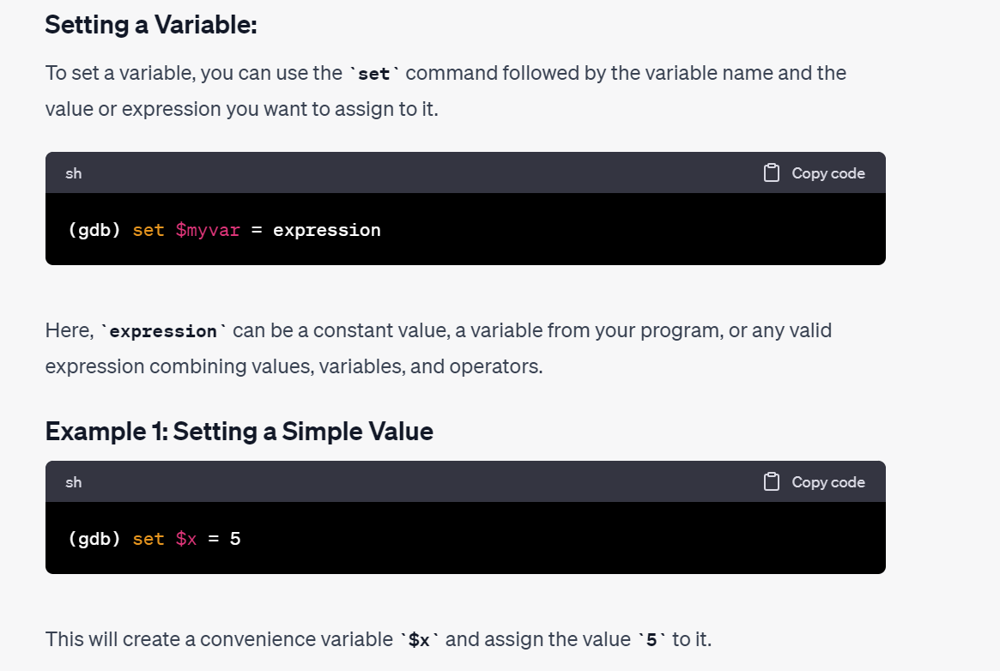

> `b filename.c:line_number if cond`: Set a breakpoint at a specific file at a specific line.
> `info break`: check out all the breakpoints that you have set, indexed by break point id.
> `delete <break_id>`
> `n <num>`: jump multiple lines of codes
> `c`: continue until the next break point
> `s`: step into the function
> `p <variable_name>`: print the value of the variable
> - `p /a <variable_name>`: print the address of the variable
> - `p /s <variable_name>`: print the value of the variable, for pointer variable, this could cause illegal memory access problems.
> 
`set $temp_var = variable_name`: 设置辅助变量
> 

