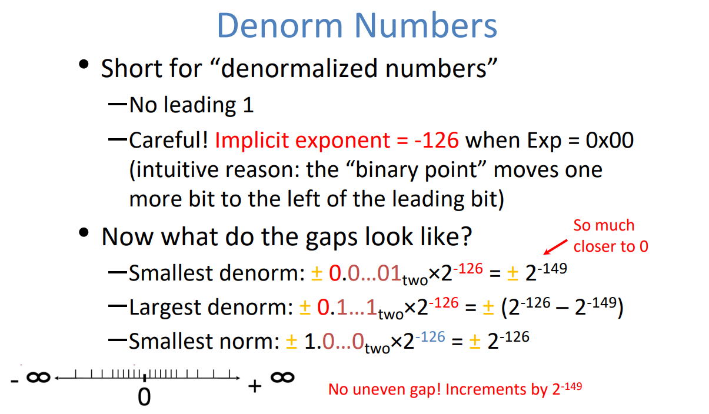
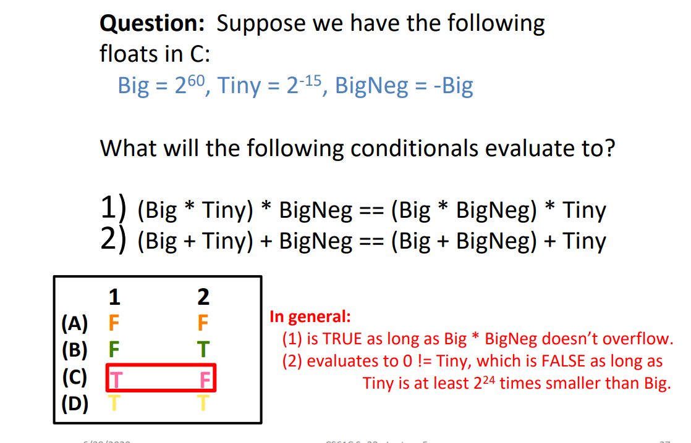
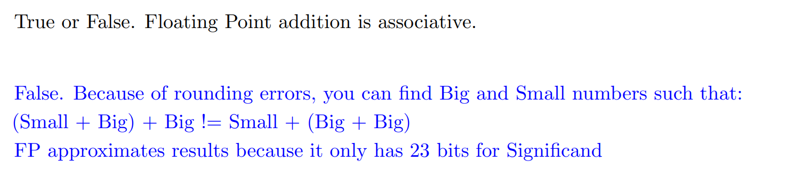
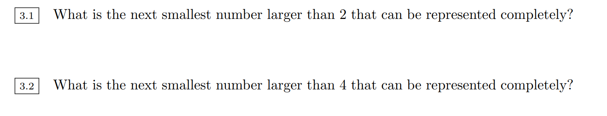

# Floating Number Basics
> 

## Goal of FP - IEEE 754 Standard
> 

## Scientific Notation
### Decimal
> 

### Binary
> 

### Translation
> 

## Three Fields
### Sign Field
> 就是第一位。

### Exponent Field
> 

### Significand Field
> 

## Single/Double FP Encoding
### Single FP Encoding
> 

### Double FP Encoding
> 

# Floating Number Special Cases
## Representing Special Numbers
### Representing Zero
> 

### Representing Infinity
> 

### Representing NaN
> 

## Representing Small Numbers
### Denormalized Numbers
> 

### Why denormalized?
> 

## Overflow&Underflow
> 
> 1. `Overflow/Underflow`是针对`Exponent`是否向上超过了`255`或者向下超过了`1`而言的。
> 2. `Rounding`是针对`Significand`的精度无法满足而言的。

## Summary Table
> 

## Concept Check
> 

# Floating Point Operations
## Rounding
### Rounding Decimal Float
> 

### Rounding Binary Float
> 
> 这里`2 3/32`表示$x=2\frac{3}{32}$(假分数)。

## FP Addition - Non Associative
### Algorithm
> 
> **这里我们介绍加法的过程：**
> ** Big:**$2^{60}=1.000...\times 2^{60}, 2^{-15}=1.000...\times 2^{-15}$**Tiny:**$2^{-15}=1.000...\times 2^{-15}$**, BigNeg:**$-2^{60}=-1.000...\times 2^{60}$
> `**(Big+Tiny)+BigNeg**`**:**
> 1. `Denormalize to **match with the bigger exponent**`, 我们只能选择`Denormalize`$2^{-15}=0.000.0000\times 2^{60}$, 这要求我们将小数点向右移动$75$位，但这显然超过了单精度浮点数中`Significand`的容量(`1`被`Right Shift`出去了), 结果是$2^{-15}=0.000...0\times 2^{60}$。
> 2. `Add the significand together`: $1.000...\times 2^{60}+0.000...0\times 2^{60}=1.000...00\times 2^{60}$
> 3. `Normalize it`得到$1.000...00\times 2^{60}$。
> 4. 最终我们有`Big + Tiny`结果是`Big`。
> 5. 所以`(Big + Tiny) + BigNeg = 0`:
> 
`**(Big+BigNeg)+Tiny**`**: 因为**`**Big+BigNeg**`**可以直接相加得到**`**0**`**，所以**`**(Big+BigNeg)+Tiny=Tiny**`
> **于是**`**(Big+Tiny)+BigNeg**`** isn't equal to **`**(Big+BigNeg)+Tiny**`
> 
> 

### Mathematical Properties
> 

## FP Multiplication
### Algorithm
> 

### Mathematical Properties
> 

## Precision&Accuracy
> 

# Floating Point Step Size
## Floating Point Gaps
> 

## Step Size Derivations⭐⭐⭐⭐⭐
> 
> **方法是:**
> 1. 先找到对应数字的`FP Representation`
> 2. 然后`Significand + 1`即可。
> 
**本题我们可以结合数轴来考虑:**
> 我们知道随着$x$(Exponent) 的增长，两个连续的浮点数之间的步长也在增加。
> 而总有一个$y$, 使得所有大于$x$的`Exponent`下，步长为偶数，此时因为每一个`Exponent`对应的最小的数字就是偶数，于是我们增加步长之后也还是偶数。
> 所以问题的关键就是我们需要找到那个步长首次为偶数的`Exponent`然后`-1`得到最大的奇数。
> 

# Floating Number in C
## Type Casting
> 对于`Signed`和`unsigned int`之间进行`casting`操作的时候，`Bit representation`没有改变，改变的只是解读`bit`的方式，比如对于`MSB`的解读。
> 但是对于`Float/Double`和`int`之间的`casting`会因为`rounding/truncating`而改变`Bit representation`。
> 
> 1. `x == (int)(float) x` is **False.** 在`Step Size`一章中我们提到过，用浮点数表示整数的精度问题会因为步长的逐渐加大而出现。假设十进制下`Exponential Field`evaluates to $x$, 我们的`Bias`是$127$, 则我们的步长是$2^{x-127-23}=2^{x-150}$。所以当$x>150$, 即$2^E$中的$E>150-127=23$时, 两个整数之间的步长就从$1$变成$2$了。此时如果`Cast`前的整数大于$1.0000...0\times 2^{24}$, 则某些整数我们就无法表示了，会触发`Rounding`，此时如果我们再从`Float`转回`Int`则有些`Bits`就会因为`Rounding`而被修改。
> 2. `x == (int) (double) x`is **True**. 对于双精度浮点来说，我们的`Exponential Field`有`11`位，`Significand`有`52`位，且`Bias`为$2^{10}-1=1023$, 则我们的步长是$2^{x-1023-52}=2^{x-1075}$, 所以当$x>1075$, 即$2^E$中的$E>1075-1023=52$时，步长才会变成$2$, 才会触发`Rounding`，但是对于`32 bit integer`来说，其最大值也就$2^{31}-1<2^{52}$, 所以永远不会触发`Rounding`, 所以如果我们再从`double`转回`int`是不会有问题的。
> 3. `f == (float) (double) f`is **True**. 因为双进度浮点就是为了解决单精度浮点的精度不够而设计的，所以来回转换不会造成`Bit`信息的丢失。
> 4. `d == (double) (float) f`is **False**. 精度下降造成`Rounding`, 结果变化。
> 5. `f == -(-f)`is** True**. 就只改变`Sign Bit`, 其余不变。
> 6. `2/3 == 2/3.0`is **False**. 因为`2/3`是整型除法，结果为`0`, 而`2/3.0`结果是一个经过`Rounding`的非零浮点数。
> 7. `d < 0.0 => (d*2 < 0.0)` is **True**. 因为如果`d < 0.0`则`Sign bit`一定是`1`, 如果乘以`2`则`Sign bit`还是`1`, 所以正确。 
> 8. `d > f => -f > -d`is **True**. 
> 9. `d * d >= 0.0`is **True**.
> 10. `(d + f) - d == f` is **False**. Non Associativity.

## Type Casting Between Float and Int
> 

# Conversion between FP and Decimal
## General Rules
> 

## Binary to Decimal
> 

## Decimal to Binary
> 

## Concept Check
> 
> **详解如下:**
> 1. 0x00000000, 很明显是`0`
> 2. 39.5625
>    1. 转成二进制，得到`100111.1001`
>    2. 转成`Scientific Notation/Normalize`(移动小数点), 得到$1.001111001\times 2^5$
>    3. 计算`Exponent(+bias)`: $5+127=132_{10}=0b10000100$
>    4. 转成二进制`bits`: `0 10000100 00111100100000000000000`
>    5. 转换成十六进制: `0100 0010 0001 1110 0100 0000 0000 0000`, 即`0x421E4000`
> 3. 8.25
>    1. 转成二进制，得到`1000.0100`
>    2. 转成`Scientific Notation/Normalize`(移动小数点), 得到$1.0000100\times 2^3$
>    3. 计算`Exponent(+bias)`: $3+127=130_{10}=0b10000010$
>    4. 转成二进制`bits`: `0 10000010 00001000000000000000000`
>    5. 转换成十六进制: `0100 0001 0000 0100 0000 0000 0000 0000`, 即`0x41040000`
> 4. 0xFF94BEEF
>    1. 转成二进制, 得到`0b 1111 1111 1001 0100 1011 1110 1110 1111`
>    2. 抽取出三个`Field`, 并计算值
>       1. `Sign Field`: `1`
>       2. `Exponential Field`: `11111111` -> 255
>       3. `Significand Field`: `00101001011111011101111` -> Non Zero
>    3. 结合表格判断得到`NaN`。
> 5. `0x00000F00`
>    1. 转成二进制, 得到`0b 0000 0000 0000 0000 0000 1111 0000 0000`
>    2. 抽取出三个`Field`, 并计算值
>       1. `Sign Field`: `0`
>       2. `Exponential Field`: `00000000` -> 0
>       3. `Significand Field`: `0000 0000 000111100000000` 
>    3. 结合表格判断是`Denorm`
>    4. 计算十进制的值，$(2^{-12}+2^{-13}+2^{-14}+2^{-15})\times 2^{-126}$
> 6. $-\infty$
>    1. 根据表格判断
>       1. `Sign Field`: `1`
>       2. `Exponent Field`: `0b11111111`
>       3. `Significand`: `0b 00000000000000000000000`
>    2. 组合起来得到: `0b1 11111111 00000000000000000000000`
>    3. 转化成十六进制: `0xFF800000`

# Exam Exercises
## IEEE-754&Two's Complement
> 

## 8-bit Floating Numbers
> 

### Normalized
> 

### Denormalized
> 

## Nearest Representation of Constants
> 方法就是小数点前后分开看。
> 然后移动小数点到科学计数法表示，然后得到想要的答案。

### pi
> 
> 算法在[EECS16B - DAC&ADC](https://www.yuque.com/alexman/edfboy/nkzk8x9emiy25tte)中有介绍。

### e
> 

### sqrt(2)
> 

#### epsilon
> 

## Number of Float Numbers
> 

  
