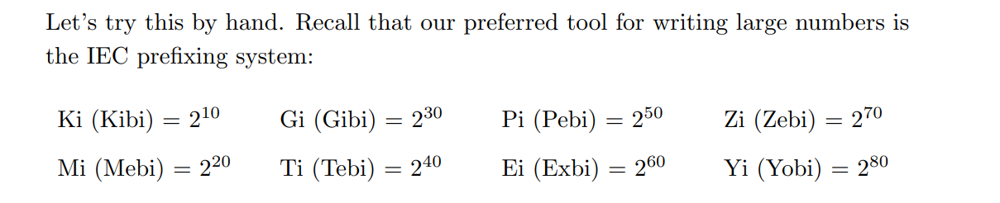
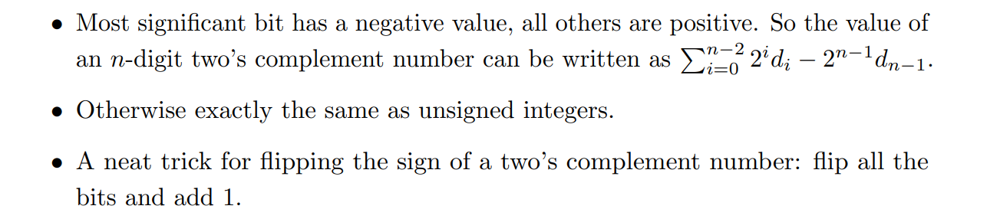
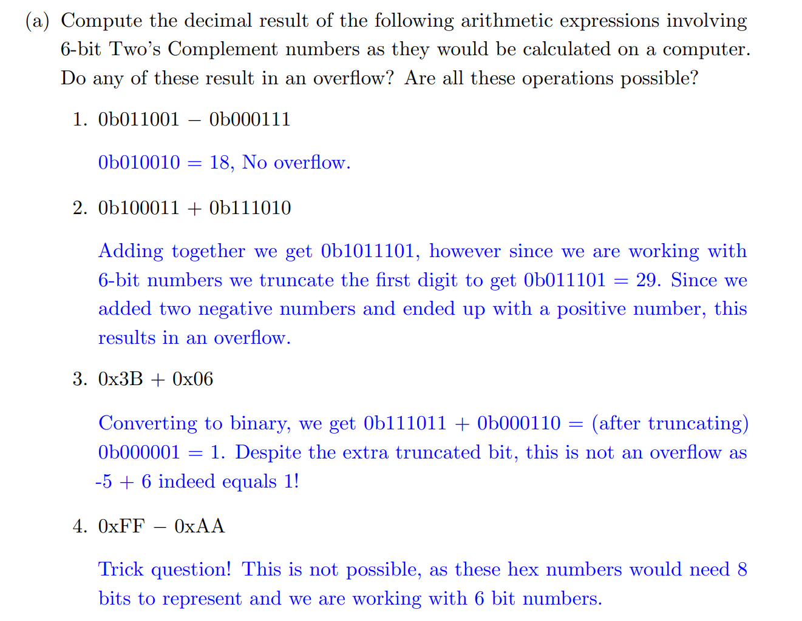
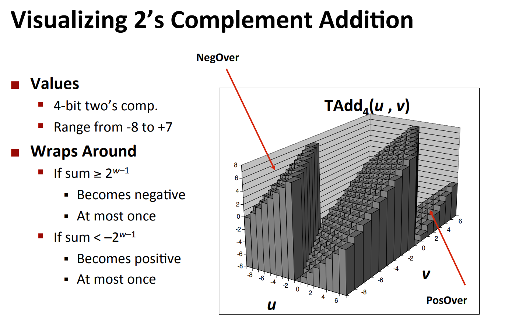

# Number of Bits
> 
> 对于一个自然数$N$来说，我们需要$\lceil log_2 N\rceil$`Bits`来表示。
> 对于$N$个不同的物体来说，我们需要$\lceil log_2 N\rceil$`Bits`来表示。

**Conpect Check**


# Conversion Between Radices
## Concepts
> 


## Exam Exercises
> 
> 方法就是，先转成二进制，再转化成其他进制。
> 
> $3210_4 = (11)(10)(01)(00)_2=11100100_2=(11)(100)(100)_2=344_8$
> 
> $0x3C=0011~1100_2 = (00)(11)(11)(00)_2=0330_4=(00)(111)(100)_2=074_8$


# Conversion Between Units
> 

**Concept Check**


# Integer Number Representation
## Unsigned Integer
> 


## Sign and Magnitude
> 
> In the sign and magnitude representation, the leftmost bit is the sign bit. A 1 means the number is negative where as 0 means it is positive. 
> Also, incrementing bits** sometimes increases values, and sometimes decreases**! **Therefore sign and magnitude used only in signal process.**
> **The downside **to this is when overflow occurs, adding one does not wrap the bits properly.


## Biased Notations
> 


## One's Complement
> 
> 这种方法就是如果$010$是$2$, 则我们按位取反$101$就是$-2$。
> **To negate:** **Flip the bits** –Example: +7 = 0b 0000 0111, -7 = 0b 1111 1000  
> **Shortcomings:**
> - Arithmetic still somewhat complicated
> - **Still two zeros** 0x00000000 = +0ten 0xFFFFFFFF = -0ten 
> - Although used for a while on some computer products, one's complement was eventually abandoned because another solution was better.  


## Two's Complement
### Concept
> 
> - Used by all modern hardware
> - Roughly evenly split between positive and negative – **One more negative # because positive side has 0**
> - Can still use MSB as sign bit 
> - **To negate: Flip the bits and add one** –Example: +7 = 0b 0000 0111, -7 = 0b 1111 1001  
> 


### Exercises&Tricks
> 
> 最后一个`Trick`非常重要，在`datalab`中使用。


# Caveats with Sign and Unsigned Ints
## Sign Extension
> 


## Type Casting
> 


### Unsigned Int& Signed Int
> 


### Mixing Sign/Unsigned
> 


## Bugs when counting down
> 
> 上面的代码的问题在于当`i=0`的循环体执行结束之后，`i--`导致`i=-1`, 在计算机中表示为`0xffffffff`, 但是此时`a[i]`就会出现数组越界问题。
> 下面代码的问题在于`sizeof(int)`返回的是一个`size_t`类型(`unsigned long`), 此时在我们更新循环条件的时候`i-DELTA`的运算包含一个`signed`和一个`unsigned`, 此时根据我们的`Type Casting`规则`i`会被`cast`成`unsigned long`进行运算，所以会出现和第一份代码一样的结果，数组越界。
> **那么怎么修改这两段代码呢?**
> 1. Don't use unsigned. 这种解决方法比较简单粗暴。
> 2. 按照黄金标准编写代码:
> 

> 如果`cnt`is signed and `< 0`, 则在进行`i = cnt - 2`比较的时候, `cnt`会被`cast`成`unsigned long`, 得到的`i`将会是一个很大的整数，会造成数组越界。


## Exam Exercises
> **Calculating Tricks:**
> Biased Notation: 对于$N$- bit Integers 来说，首先我们求出`Bias`是$-(2^{N-1}-1)$， 所以求任何数字$n$的`Biased Notation`相当于求$n+2^{N-1}-1$的`Unsigned Integer Representation`。
> 
> A问不可能相同。B问如果bias=0相同。C问对于8-bit则bias=$2^7$相同。D问`1's complement`的区间长度总是比`biased notation`小`1`， 因为`one's complement`有两个零。


# Integer Overflow
## Computational Overflow
### Concept
> 


### Don't manually cause overflow!
> 

```c
#include <stdio.h>


int isTmax(int x) {
  printf("Parameter,%x\n", x + 0x01);
  printf("Mask, %x\n", 1 << 31);
  printf("inside the function 1, %d\n",(x + 0x01)^(1 << 31));
  printf("inside the function 2, %d\n",!((x + 0x01)^(1 << 31)));
  return !((x + 0x01)^(1 << 31));
}

int main(){
    
    printf("Function return, %d\n", isTmax(0x7fffffff));
    // printf("%d\n",1 << 31);
    // printf("%d\n",2147483647 + 0x01);
    // printf("%d\n",(2147483647 + 0x01 == 1 << 31) );
    printf("Outside the function,%d\n", !((2147483647 + 0x01)^(1 << 31)));
    return 0;
}
```
**Outputs**
我们看到这里会由于`signed int overflow`导致`undefined behaviors`, 导致`line 7/8`结果不可预测。


### 

## Arithmetic Operaion Examples
> 


### Addition
#### Unsigned
> 


#### Signed
> 


#### Mathematical Properties
> 


### Positive/Negative Overflow
#### Algorithm
> 我们有下面的两个判断条件:
> 1. 如果$a>0\&b>0\&a+b<0$或者$a<0\&b<0\&a+b>0$, 则`Overflow`。正数+负数永远不会导致`Overflow`, 因为永远在`Two's Complement's`的表示范围之内。所以如果我们要判断`add`是否有溢出，只需要判断上面两个条件即可。
> 2. 如果$a>0\&b<0\&a-b<0$或者$a<0\&b>0\&a-b>0$, 则`Overflow`。正数-正数/负数-负数永远不会导致`Overflow`, 因为永远在`Two's Complement's`的表示范围之内。所以如果我们要判断`add`是否有溢出，只需要判断上面两个条件即可。


#### Exam Exercises
> 
> 0b100010 = -30, 0b011110 = 30, -30+30=0, 而 0b100010 + 0b011110 = 0b000000 = 0，所以即便6-bit不足以表示结果，但是结果没错，所以不算Overflow.
> 
> 0b111110 = -2, 0b100010 = -30, -2-30=-32, 而0b111110 + 0b100010 = 0b100000 = -32，所以即便6-bit不足以表示结果，但是结果没错，所以不算Overflow.
> 
> 0b011111 = 31, 0b000001 = 1, 1+31=32, 而0b011111 + 0b000001 = 0b100000 = -32，所以即便6-bit足以表示结果，但是结果错了，因为`Two's Complement`的规定，所以是Overflow.
> 
> 0b101010 = -22, 0b010101 = 21, -22+21=-1, 而0b101010 + 0b010101 = 0b111111 = -1，所以6-bit足以表示结果，而且结果是对的，所以不是Overflow.


### Multiplication
#### Unsigned
> 


#### Signed
> 


#### Mathematical Properties
> 


### Power of 2 Multiply with Shift
> 
> **为什么**`**Shift Left**`**就是翻倍呢，我们可以简单证明一下:**
> 对于一个二进制表示下为$00000x_2x_1x_0$的数，我们有$x_{dec}=x_2\times 2^2+x_1\times 2+x_0$, 而我们左移一位之后权重发生变化$0000x_2x_1x_00$，$x_{dec,new}=x_2\times 2^3+x_1\times 2^2+x_0\times 2=2x_{dec,old}$。


### Power of 2 Divide with Shift
> 
> 注意到对于那些不能被$2$整除的奇数，小数点位会被`Truncated`（因为是整型）。


