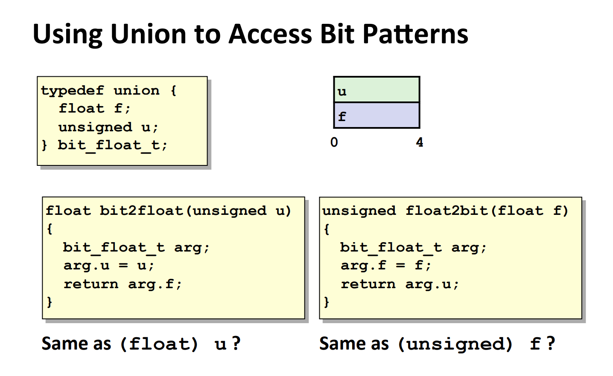

# X86 Memory Layout
> 

# Buffer Overflow
## Code Example
> 

## Code Injection Attack
> 
> 常见的情况是，我们必须找到诸如`P`和`Q`这样的`Caller/Callee Pair`, 但是这样不够，我们还得知道`Q`这个函数在栈上分配了多少内存(因为尽管我们知道`char buf[64]`一定会在栈上创建`64 bytes`的缓冲区，但是一般而言操作系统会**再多分配一些内存在栈上**，而这多分配的内存具体大小需要黑客对于操作系统的行为了如指掌才可以)，比如上面的`Buffer Overflow`的例子中，尽管代码中明确写了`char buf[4]`, 但是实际上我们的`Stack Pointer`向下移动了`24 bytes`, 这多出来的`20 bytes`是操作系统干的事。
> 总的来说，`Code Injection Attack`依赖于我们必须能够准确知道栈上的缓冲区大小。
> 
> 只有我们准确知道了函数的内存分配行为，我们才能从栈顶开始注入适合长度的二进制代码，人为造成`Buffer Overflow`，并进行攻击。

## Practice Problem
> 
> **Solution:**
> 

# How to Avoid
## Method 1: Limit Input String Length
> 

## Method 2: System-Level Protections
> 

## Method 3: Stack Canaries
> 这种方法就是检测我们的缓冲区有没有被`Code Injection`篡改。
> 

# Return-Oriented Attacking
## Definition
> 

## Gadget Examples
> 

# Union in C
## Union Allocation
> 
> 1. 联合体会使用占用空间最大的域的大小来分配内存
> 2. 它假设你最后只会使用一个域
> 3. `double`会覆盖`char`和`int`

## Access Bit Patterns
> 
> 和`(float) u/(unsigned) f`不一样，因为上述操作不会造成`rounding effect`。

## Byte Ordering in Union
> 

