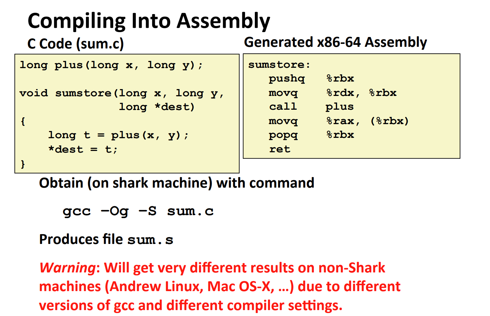
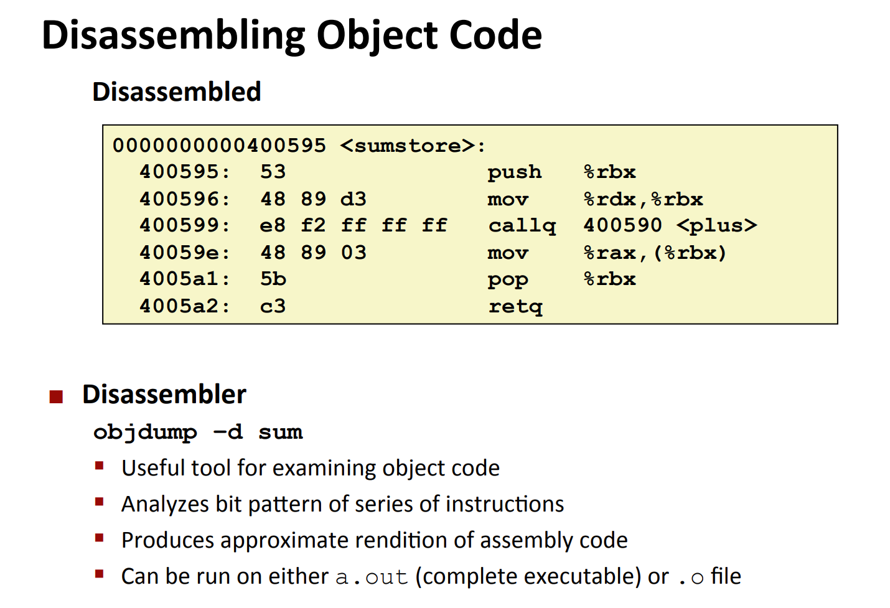
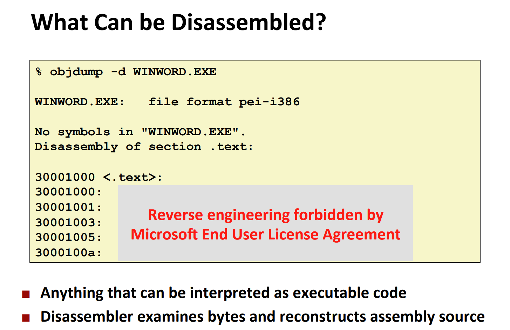

# Compile C Codes
## Into Object Files
> 

## Into Assembly
> 

## Into Object Code
> 
> `gcc -Og sum.c -o sum`
> 

# Diassemble Object Codes
> 
> 从`Object File`to `Assembly Codes`(Reverse Engineering)
> 

# X86 Integer Registers
> 
> **总结一下:**
> 1. 总共有`16`个`64-bit registers`
> 2. `%r`开始的寄存器最多能够存放`64-bit integer`
> 3. `%e`开头的寄存器最多能够存放`32-bit integer`
> 

> 在`Old IA32`机器上，只有`8`个`%eax`寄存器。`%ebp`现在也不常用了(base pointer)。
> 

# X86 Operations
## Move Instructions
> 

## Memory Addressing Modes
### Simple Mode
> 

### Complete Mode
> 

### Summary
> 

## Address Computation Instructions
> 

## Arithmetic Instructions
> 

