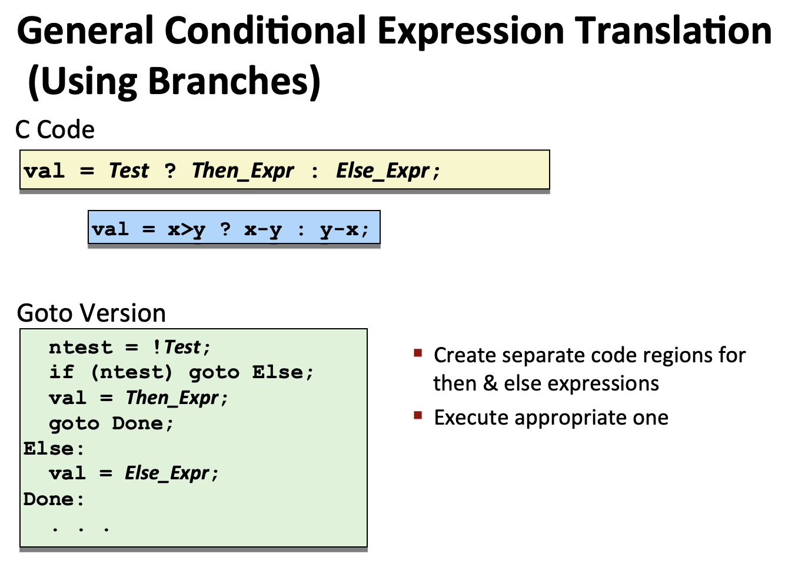
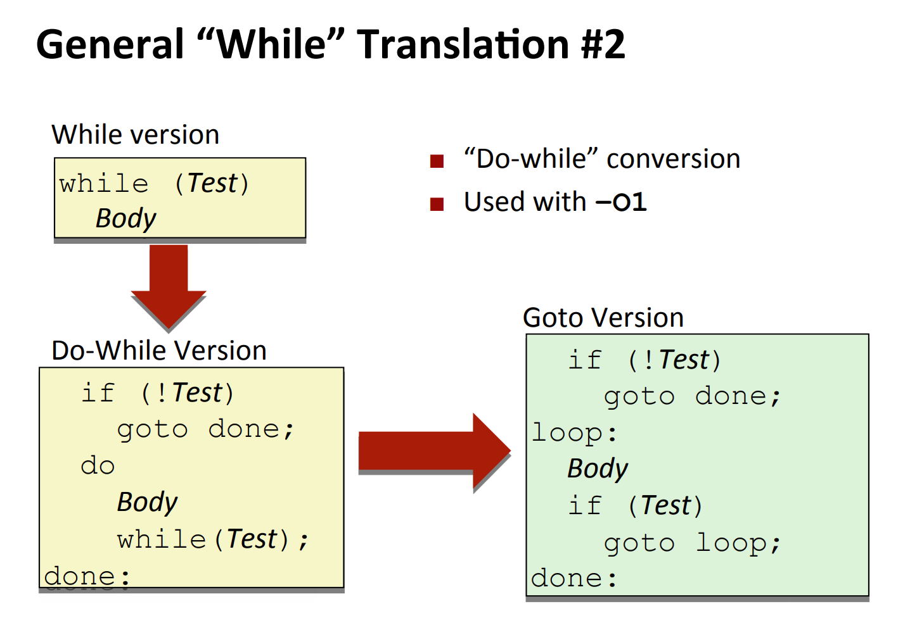
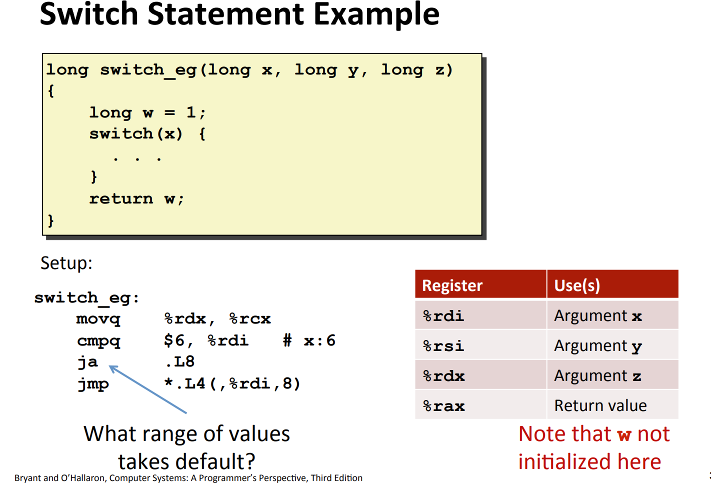
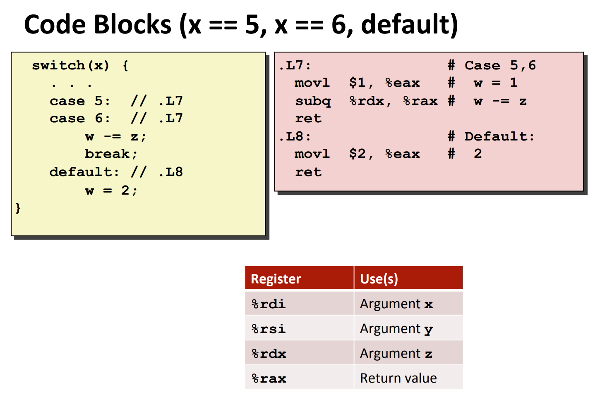

# Processor State
> 

# Conditional Logic
## Condition Codes
> 

## SetX Instructions⭐⭐⭐⭐⭐
> 
> **这个表值得细看:**
> `~(SF^OF)`的意思是:
> 1. 如果`x-y<=0`但发生了`overflow`(`x`是很大的正数，`y`是很小的负数), 即`SF=1`且`OF=1`, `SF^OF=0`, 这种情况实际上应该是`x>y`的，毕竟正数>负数。
> 2. 如果`x-y<=0`且没有发生`overflow`，则`SF^OF=1^0=1`。
> 3. 如果`x-y>=0`但发生了`overflow`(`x`是很小的负数，`y`是很大的正数)，则`SF^OF=0^1=1`, 这种情况实际上应该是`x<y`的，毕竟负数< 正数。
> 4. 如果`x-y>=0`且没有发生`overflow`，则`SF^OF=0^0=0`。
> 
总的来说，`~(SF^OF)`的存在就是为了考虑到`overflow`的因素。
> `~CF&~ZF`的意思是:
> 1. 如果两个`unsigned int`的差值`x-y`使得`CF=1`, 则`x<y`。
> 

## JX - Jumping
> 
> 下面是一个使用`jX`的例子:
> 

# Computing Absolute Values
## Conditional Branch
### Old Style (If-else)
> 假设我们要编写一个求$|x-y|$的程序，一个很自然的想法是使用下面的代码。这里的`gcc`目的是为了不让代码成为`Conditional Move`
> 

### Goto Version
> 我们也可以使用`C`语言自带的`goto`关键字和`Labeling`, 这种方式会使得`C`语言的方式更接近汇编。
> 
> 这种方式下，只有`Branch`的其中一支会执行，另一支的结果会被彻底抛弃，有很多情况下，我们会需要执行得到两种情况下的结果，然后最后根据条件返回其中一个，这就需要介绍一种全新的代码编写方式。

## Conditional Move
> 这是一种新的汇编方式：
> 
> `Conditional Branch`的特点是我们的结果在`Branch`中才能被计算出来。如果我们采用流水线机制来执行我们的指令，则`Branch Prediction`失败导致的惩罚(Pipeline Flushing)会非常大，因为每个`Branch`中都有很多代码用于计算结果。
> 使用`Conditional Move`的好处是，我们要返回的结果在进入`Branch`之前就全部计算好了。这样`Branch`只负责决定要返回什么结果，`branch`分支中的代码数量就减少了很多，这样即使我们`Branch prediction`失败了，我们的惩罚也并不多。
> 但是使用`Conditional Move`的坏处也同样明显：
> 1. 需要计算更多的结果，`Two branches instead of one branch`。
> 2. 计算两个结果的时候某些分支可能产出奇怪的结果。比如`if(p==NULL){ int a = 0;}else{int b =*p}; `, 如果我们两个分支都执行，会出现`Segment Fault`, 因为非法访问了空指针的地址。
> 3. 或者两个分支的结果会互相影响。
> 

# Loops
## Do-While Loop
> 
> 虽然`Do-While`在实际代码中使用的很少，但是在汇编中经常会使用这种方式进行代码层面的优化。比如编译器常常会使用`Do-While`来省略初始判断条件。

## While Loop - Optimization
> `gcc`在翻译`while-loop`的时候会有两种方式:
> 1. `Jump-to-Middle Translation`(Informal): 先进行`test`, 然后再进入循环体，使用`gcc -Og`
> 2. `Do-while Translation`: 先进行循环体再`test`, 使用`gcc -O1`

### Jump to Middle Translation
> Jump to middle的test在代码块的中间位置，同构`gcc -Og`实现
> 

### Do-While Translation
> `Do-while Translation`更常见，使用`gcc -O1`实现，好处是可以省略一个`test`标签。
> 

## For Loop
> 

# Switch Statements
## Fall Through Effect
> `switch`语句可能是设计最糟糕的一种流程控制语句了，但是大部分语言都将这个特性保留了下来。
> 
> 如果某个`case`中没有写`break`, 那么代码会一直向下执行直到遇到一个有`break`的`case`。
> 如果我们真的想要这种行为发生，记得加注释告知别人。

## Jump Table
> 
> **下面是几种特殊情况下的表建立过程：**
> 1. 如果`case`的值为负数，则编译器内部会进行偏置处理使得，我们在`indexing jump table`的时候避免出现负数索引造成内存访问异常。
> 2. 如果`case`的最小值很大，比如`8900`, 则编译器内部同样会进行偏置处理我们在`indexing jump table`的时候避免出现巨大的索引造成内存访问异常。
> 3. 如果`case`的数量很稀疏，比如只有`case 0, case 2, case 10000`, 则编译器可能会将其转换成`if-else test`。或者建立一个`binary search tree`，使得`index`的时间复杂度从$O(n)$变为$O(log_2n)$。

## Handling Fall Through
> 

