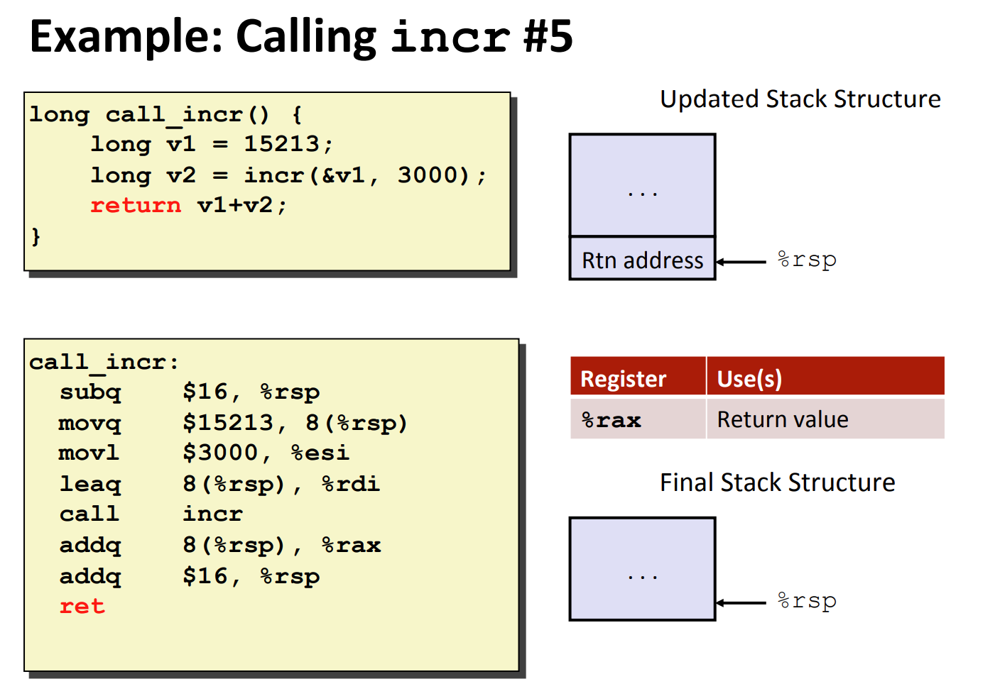
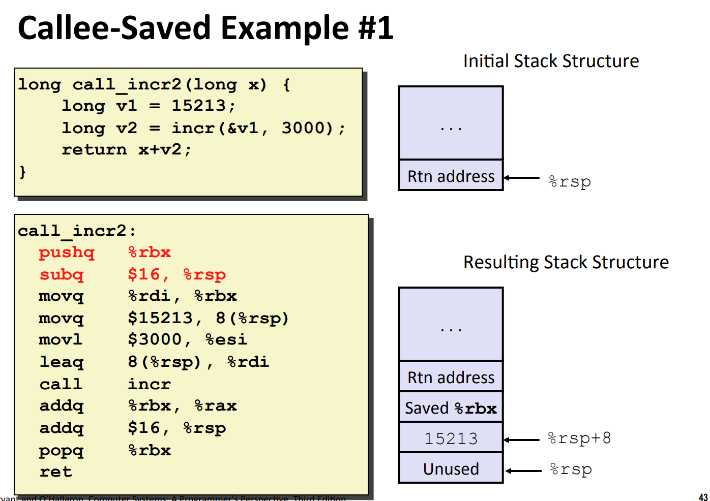

# Overview
> 

# X86 Data Structure
## Stack Structure
> 

## Stack Push (Register -> Stack)
> 
> 可以看到`pushq`实际上是一个`pseudo instruction`, 包含了**增长栈顶**和**从寄存器读取值并写入栈顶**两个步骤。

## Stack Pop(Stack -> Register)
> 
> `popq`也是一个`pseudo instruction`, 包含了**从栈顶读取值并写入寄存器**和**缩减栈顶**两个步骤。

# X86 Calling Convention
## Procedure Control Flow
> 

## Procedure Data Flow
> 
> 注意，只能有一个返回值。
> 🔔**如果函数有超过**`**6**`**个参数，则多余的参数会被放置在栈内存上，这点很重要，在**`**bomb lab**`**和**`**attack lab**`**中会用到。**

## Calling Chain
> 

## X86 Linux Stack Frame
> 

## Register Saving Conventions
> 

## 
## Summary
> 

# X86 Calling Example
## Control Flow Example
> 
> `**callq**`**会做两件事情:**
> 1. 将`callq`之后的一条指令的地址通过`pushq %rip + 4`指令压入栈。
> 2. 修改`%rip`,从`0x400544->0x400550`，从而跳转到函数`mult2`所在的地址`0x400550`并开始执行`callee`函数。
> 
有同学问，`pushq`可以通过`subq $8 %rsp`和`movq %src, (%rsp)`组合实现，那么`callq`行吗?
> 答案是不行，因为用户不能显式地**修改/读取**`%rip`(`Program Counter`)，**it is implicitly part of call instruction.**
> 
> `**retq**`**会做两件事:**
> 1. `jump to`栈顶存放的地址（通过修改`%rip`的方式。）。
> 2. `popq dest`。
> 
同样，`retq`无法通过用户级别的指令组合实现，原因还是`%rip`无法在用户级别读写。
> 

## Data Flow Example
> 

## Increment Example
> 
> 首先注意到`v1`的值不能储存在寄存器中，因为我们无法通过`X86`获取寄存器的地址，所以`v1`必须储存在栈上，所以第一行代码会被汇编成两行指令用于在栈上分配空间，将`v1`储存在`8(%rsp)`(离栈顶`8 bytes`的地方)。一般而言程序会分配比所需字节数更多的字节数量。
> 所以除了参数数量过多，创建指针也需要利用栈空间。
> 
> 现在我们需要准备调用`incr()`函数，所以需要为其准备参数，下面两行汇编做了这个事情。
> **有几个注意点:**
> 1. 指令`movl`而不是`movq`，因为$3000$这个数足够小。同时`movl`会将高位的32位设置成全零，因为$3000$式个正数，我们不需要担心是否需要因为最高位为`1`而进行`Sign Extension`。
> 2. 设置参数的顺序是从最后一个参数开始设置，上例中是先设置第二个参数，再设置第一个参数。
> 3. `leaq 8(%rsp), %rdi`是一种设置`pointer`的方式。
> 

> 准备好参数就调用`incr`, 函数的返回值储存在`%rax`中。
> 
> 从栈上获取之前储存的`v1`变量的值，和`incr`的返回值加总返回。
> 

## Callee Saved Register Example
> 

## Recursive Function Example
> 

