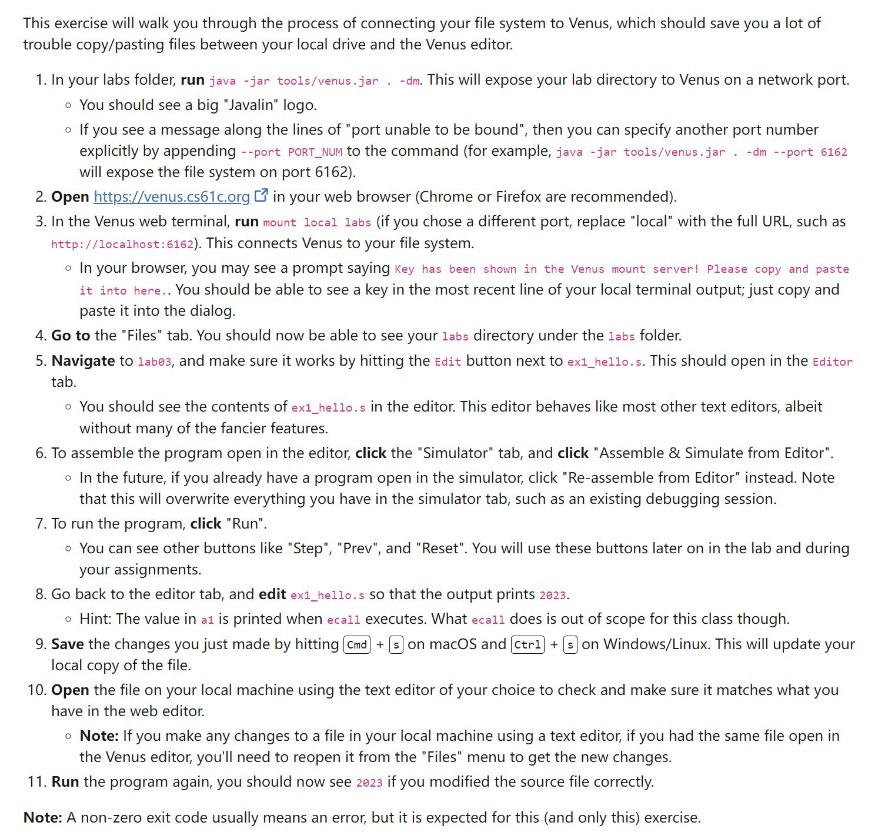

[lab03_spec.pdf](https://www.yuque.com/attachments/yuque/0/2023/pdf/12393765/1695135740084-a5b5199e-006a-465d-81a6-8ab99e20f033.pdf)
# How to use Venus
> [!important]
> 


# Basic RISC-V Program
```c
#include <stdio.h>

int n = 12;   // Global Variable, saved in .data(static) section

// Function to find the nth Fibonacci number
int main(void) {
    int curr_fib = 0, next_fib = 1;
    int new_fib;
    for (int i = n; i > 0; i--) {
        new_fib = curr_fib + next_fib;
        curr_fib = next_fib;
        next_fib = new_fib;
    }
    printf("%d\n", curr_fib);  // System Call ecall(1, t0)
    return 0;
}
```
```bash
.data
n: .word 12  # Here n is just an address, like main: and fib:

.text
main:
    add t0, x0, x0 # curr_fib = 0
    addi t1, x0, 1 # next_fib = 1
    la t3, n # load the address of the label n
    lw t3, 0(t3) # get the value that is stored at the adddress denoted by the label n
fib:
    beq t3, x0, finish # exit loop once we have completed n iterations
    add t2, t1, t0 # new_fib = curr_fib + next_fib;
    mv t0, t1 # curr_fib = next_fib;
    mv t1, t2 # next_fib = new_fib;
    addi t3, t3, -1 # decrement counter
    j fib # loop
finish:
    addi a0, x0, 1 # argument to ecall to execute print integer
    addi a1, t0, 0 # argument to ecall, the value to be printed
    ecall # print integer ecall
    addi a0, x0, 10 # argument to ecall to terminate
    ecall # terminate ecall
```
                                                                                                                                                                                                                                                                                                                                            
# Array Accessing
> 
> **要求是要实现函数**`**f**`**的行为，这个函数接收两个参数:**
> 1. `a0`: 表示`domain input`, 也就是`-3,-2,-1,0,1,2,3`
> 2. `a1`: 表示`Output`值组成的数组
> 
本质上`f(-3)=0(a1)`, `f(-2)=4(a1)`, ..., `f(3)=24(a1)` 

```bash
.globl f # this allows other files to find the function f

# f takes in two arguments:
# a0 is the value we want to evaluate f at
# a1 is the address of the "output" array (defined above).
# The return value should be stored in a0
f:
    # Your code here
    # Initialize the registers
    
    addi t0 a0 3  # Compute the index, -3 -> 0, -2 -> 1, -1 -> 2
    slli t0 t0 2  # Compute the bytes offset, index*4
    add t1 a1 t0  # Compute the current address of the element
    lw a0 0(t1)   # put the result in the a0 register and return

    # This is how you return from a function. You'll learn more about this later.
    # This should be the last line in your program.
    jr ra

```


# Recursive Function Call in RISC-V
## Factorial in RISC-V
### Iterative Implementation
```bash
.globl factorial

.data
n: .word 8

.text
# Don't worry about understanding the code in main
# You'll learn more about function calls in lecture soon
main:
    la t0, n
    lw a0, 0(t0)
    jal ra, factorial

    addi a1, a0, 0
    addi a0, x0, 1
    ecall # Print Result

    addi a1, x0, '\n'
    addi a0, x0, 11
    ecall # Print newline

    addi a0, x0, 10
    ecall # Exit

# factorial takes one argument:
# a0 contains the number which we want to compute the factorial of
# The return value should be stored in a0
factorial:
    # YOUR CODE HERE
    mv t0 a0       # Index
    addi t1 x0 1   # Output
    
Loop:    
    beq t0 x0 Exit
    
    mul t1 t1 t0
    addi t0 t0 -1
    
    j Loop
    
Exit:
    mv a0 t1
    # This is how you return from a function. You'll learn more about this later.
    # This should be the last line in your program.
    jr ra
```

### Recursive Implementation
```bash
.globl factorial

.data
n: .word 8

.text
# Don't worry about understanding the code in main
# You'll learn more about function calls in lecture soon
main:
    la t0, n
    lw a0, 0(t0)
    jal ra, factorial

    addi a1, a0, 0
    addi a0, x0, 1
    ecall # Print Result

    addi a1, x0, '\n'
    addi a0, x0, 11
    ecall # Print newline

    addi a0, x0, 10
    ecall # Exit

# factorial takes one argument:
# a0 contains the number which we want to compute the factorial of
# The return value should be stored in a0
factorial:
    # YOUR CODE HERE
    # Base Case, n = 0, return 0! = 1
    beq a0 x0 Exit
    
    # Prologue
    addi sp sp -8

    # Caller Saved Registers
    sw ra 0(sp)
    sw a0 4(sp)

    # Here as the callee of main(), we don't use any saved register in the 
    # function body, so we don't need to save s0-s11
   
    # Prepare the argument
    addi a0 a0 -1
   
    # Call the function
    jal ra factorial
    
    # Get the return value from nested recursion
    addi t0 a0 0
    
    # Epilogue
    # Restore the stack frame, restore values from the stack
    lw a0 4(sp)
    lw ra 0(sp)
    addi sp sp 8
    
    # Put the return value in a0
    mul a0 a0 t0
    
    jr ra
    
Exit:
    addi a0 x0 1
    # This is how you return from a function. You'll learn more about this later.
    # This should be the last line in your program.
    jr ra

```


## Map SLLs
> 

```bash
.globl map

.text
main:
    jal ra, create_default_list
    add s0, a0, x0  # a0 = s0 is head of node list

    #print the list
    add a0, s0, x0
    jal ra, print_list

    # print a newline
    jal ra, print_newline

    # load your args
    add a0, s0, x0  # load the address of the first node into a0

    # load the address of the function in question into a1 (check out la on the green sheet)
    ### YOUR CODE HERE ###
    la a1 square

    # issue the call to map
    jal ra, map

    # print the list
    # See here, the main function still need s0, so the call
    # to the map()(which is the callee) should at least make sure
    # that the s0 register is unchanged before and after.
    add a0, s0, x0      
    jal ra, print_list

    # print another newline
    jal ra, print_newline

    addi a0, x0, 10
    ecall #Terminate the program

map:
    # Prologue: Make space on the stack and back-up registers
    ### YOUR CODE HERE ###
    # map is the callee to main and caller to square
    addi sp sp -8
    # caller saved registers
    sw ra 0(sp)
    # We will have to save s0, which is used by caller later on
    sw s0 4(sp)
    # We don't have to save s1, because main() is not using it, so
    # we can safely use s1 as our backup register instead of stack
    
    beq a0, x0, done    # If we were given a null pointer (address 0), we're done.

    add s0, a0, x0  # Save address of this node in s0
    add s1, a1, x0  # Save address of function in s1


    # Remember that each node is 8 bytes long: 4 for the value followed by 4 for the pointer to next.
    # What does this tell you about how you access the value and how you access the pointer to next?


    # Prepare for calling
    # load the value of the current node into a0
    # THINK: why a0? Since it is the first argument to the f() to be called by map()
    ### YOUR CODE HERE ##
    lw a0 0(a0)

    # Call the function in question on that value. DO NOT use a label (be prepared to answer why).
    # What function? Recall the parameters of "map"
    ### YOUR CODE HERE ###
    jalr ra a1 0

    # store the returned value back into the node
    # Where can you assume the returned value is?
    ### YOUR CODE HERE ###
    sw a0 0(s0)


    # Load the address of the next node into a0
    # The Address of the next node is an attribute of the current node.
    # Think about how structs are organized in memory.
    ### YOUR CODE HERE ###
    lw a0 4(s0)


    # Put the address of the function back into a1 to prepare for the recursion
    # THINK: why a1? What about a0?
    ### YOUR CODE HERE ###
    add a1 s1 x0


    # recurse
    ### YOUR CODE HERE ###
    jal ra map

done:
    # Epilogue: Restore register values and free space from the stack
    ### YOUR CODE HERE ###
    # Restore ra
    lw ra 0(sp)

    # Restore saved register, s0
    lw s0 4(sp)

    # Restore volatile registers
    add a0 s0 x0
    add a1 s1 x0

    addi sp sp 8

    jr ra # Return to caller

square:
    mul a0 ,a0, a0
    jr ra

create_default_list:
    addi sp, sp, -12
    sw  ra, 0(sp)
    sw  s0, 4(sp)
    sw  s1, 8(sp)
    li  s0, 0       # pointer to the last node we handled
    li  s1, 0       # number of nodes handled
loop:   #do...
    li  a0, 8
    jal ra, malloc      # get memory for the next node
    sw  s1, 0(a0)   # node->value = i
    sw  s0, 4(a0)   # node->next = last
    add s0, a0, x0  # last = node
    addi    s1, s1, 1   # i++
    addi t0, x0, 10
    bne s1, t0, loop    # ... while i!= 10
    lw  ra, 0(sp)
    lw  s0, 4(sp)
    lw  s1, 8(sp)
    addi sp, sp, 12
    jr ra

print_list:
    bne a0, x0, printMeAndRecurse
    jr ra       # nothing to print
printMeAndRecurse:
    add t0, a0, x0  # t0 gets current node address
    lw  a1, 0(t0)   # a1 gets value in current node
    addi a0, x0, 1      # prepare for print integer ecall
    ecall
    addi    a1, x0, ' '     # a0 gets address of string containing space
    addi    a0, x0, 11      # prepare for print string syscall
    ecall
    lw  a0, 4(t0)   # a0 gets address of next node
    jal x0, print_list  # recurse. We don't have to use jal because we already have where we want to return to in ra

print_newline:
    addi    a1, x0, '\n' # Load in ascii code for newline
    addi    a0, x0, 11
    ecall
    jr  ra

malloc:
    addi    a1, a0, 0
    addi    a0, x0 9
    ecall
    jr  ra

```
> **总结一下：**
> 1. 对于`Caller`来说，我们需要`save volatile registers`, 保存方法有两种
>    1. 将`volatile registers`保存在`stack`中，最简单。
>    2. 将`volatile registers`保存在`saved registers`中
>       1. 如果`saved registers`在这个函数的`caller()`中被占用(此时这个函数为另一个函数的`callee`)，则我们需要先将这个`saved register`中的值保存到`stack`中，如上面代码中的`s0`。
>       2. 如果`saved registers`在这个函数的`caller()`中没有被占用，我们可以将这类`saved register`当作`stack`使用而不用保存到`stack`上，如上面代码中的`s1`, 我们无需在`pro-epilogue`中保存和取回他们。
> 2. 对于`Caller`需要保存的`volatile registers`, 我们只需要关注那些在`Caller`调用完内部函数之后还需要用到其值（`read`操作）的那些寄存器，只有这些`Votaile Registers`是有必要保存的。
> 3. 对于`Callee`来说，我们需要`save saved registers`, 方法就是保存在栈内存中，上面的代码没有体现。但是我们考虑一下这种情况，就是`map`函数在内部调用了`square`函数，如果`square`函数使用了`map`中的`saved registers`, 那么在`square`函数内部就需要保存这些寄存器的值，但是很幸运它没有，所以`square`函数也相当简单，就两行代码。
> 4. 其实，上述代码中`a1`不保存也无所谓，因为我们在递归调用的时候从未修改过`a1`的值, 即函数地址`square`的地址指向。结果也是正确的。
> 5. 只要某个函数试图在内部调用另一个函数，则需要将`ra`保存到`stack`上。

```bash
.globl map

.text
main:
    jal ra, create_default_list
    add s0, a0, x0  # a0 = s0 is head of node list

    #print the list
    add a0, s0, x0
    jal ra, print_list

    # print a newline
    jal ra, print_newline

    # load your args
    add a0, s0, x0  # load the address of the first node into a0

    # load the address of the function in question into a1 (check out la on the green sheet)
    ### YOUR CODE HERE ###
    la a1 square

    # issue the call to map
    jal ra, map

    # print the list
    # See here, the main function still need s0, so the call
    # to the map()(which is the callee) should at least make sure
    # that the s0 register is unchanged before and after.
    add a0, s0, x0      
    jal ra, print_list

    # print another newline
    jal ra, print_newline

    addi a0, x0, 10
    ecall #Terminate the program

map:
    # Prologue: Make space on the stack and back-up registers
    ### YOUR CODE HERE ###
    # map is the callee to main and caller to square
    addi sp sp -8
    # caller saved registers
    sw ra 0(sp)
    # We will have to save s0, which is used by caller later on
    sw s0 4(sp)
    # We don't have to save s1, because main() is not using it, so
    # we can safely use s1 as our backup register instead of stack
    
    beq a0, x0, done    # If we were given a null pointer (address 0), we're done.

    add s0, a0, x0  # Save address of this node in s0
    # add s1, a1, x0  # Save address of function in s1(OPTIONAL)


    # Remember that each node is 8 bytes long: 4 for the value followed by 4 for the pointer to next.
    # What does this tell you about how you access the value and how you access the pointer to next?


    # Prepare for calling
    # load the value of the current node into a0
    # THINK: why a0? Since it is the first argument to the f() to be called by map()
    ### YOUR CODE HERE ##
    lw a0 0(a0)

    # Call the function in question on that value. DO NOT use a label (be prepared to answer why).
    # What function? Recall the parameters of "map"
    ### YOUR CODE HERE ###
    jalr ra a1 0

    # store the returned value back into the node
    # Where can you assume the returned value is?
    ### YOUR CODE HERE ###
    sw a0 0(s0)


    # Load the address of the next node into a0
    # The Address of the next node is an attribute of the current node.
    # Think about how structs are organized in memory.
    ### YOUR CODE HERE ###
    lw a0 4(s0)


    # Put the address of the function back into a1 to prepare for the recursion
    # THINK: why a1? What about a0?
    ### YOUR CODE HERE ###
    # add a1 s1 x0 (OPTIONAL)


    # recurse
    ### YOUR CODE HERE ###
    jal ra map

done:
    # Epilogue: Restore register values and free space from the stack
    ### YOUR CODE HERE ###
    # Restore ra
    lw ra 0(sp)

    # Restore saved register, s0
    lw s0 4(sp)

    # Restore volatile registers.
    add a0 s0 x0

    addi sp sp 8

    jr ra # Return to caller

square:
    mul a0 ,a0, a0
    jr ra

create_default_list:
    addi sp, sp, -12
    sw  ra, 0(sp)
    sw  s0, 4(sp)
    sw  s1, 8(sp)
    li  s0, 0       # pointer to the last node we handled
    li  s1, 0       # number of nodes handled
loop:   #do...
    li  a0, 8
    jal ra, malloc      # get memory for the next node
    sw  s1, 0(a0)   # node->value = i
    sw  s0, 4(a0)   # node->next = last
    add s0, a0, x0  # last = node
    addi    s1, s1, 1   # i++
    addi t0, x0, 10
    bne s1, t0, loop    # ... while i!= 10
    lw  ra, 0(sp)
    lw  s0, 4(sp)
    lw  s1, 8(sp)
    addi sp, sp, 12
    jr ra

print_list:
    bne a0, x0, printMeAndRecurse
    jr ra       # nothing to print
printMeAndRecurse:
    add t0, a0, x0  # t0 gets current node address
    lw  a1, 0(t0)   # a1 gets value in current node
    addi a0, x0, 1      # prepare for print integer ecall
    ecall
    addi    a1, x0, ' '     # a0 gets address of string containing space
    addi    a0, x0, 11      # prepare for print string syscall
    ecall
    lw  a0, 4(t0)   # a0 gets address of next node
    jal x0, print_list  # recurse. We don't have to use jal because we already have where we want to return to in ra

print_newline:
    addi    a1, x0, '\n' # Load in ascii code for newline
    addi    a0, x0, 11
    ecall
    jr  ra

malloc:
    addi    a1, a0, 0
    addi    a0, x0 9
    ecall
    jr  ra

```


# Calling Convention Debugs
[lab04_spec.pdf](https://www.yuque.com/attachments/yuque/0/2023/pdf/12393765/1695238634404-d20f2ee6-05da-45fe-b349-a2075d6ccd39.pdf)
## Ex1 Fix Calling Convention Errors
> 

```bash
.globl pow inc_arr

.data
fail_message: .asciiz "%s test failed\n"
pow_string: .asciiz "pow"
inc_arr_string: .asciiz "inc_arr"

success_message: .asciiz "Tests passed.\n"
array:
    .word 1 2 3 4 5
exp_inc_array_result:
    .word 2 3 4 5 6

.text
main:
    # pow: should return 2 ** 7 = 128
    li a0, 2
    li a1, 7
    jal pow
    li t0, 128 # verifies that pow returned the right value
    beq a0, t0, next_test
    la a0, pow_string
    j failure

next_test:
    # inc_arr: increments "array" in place
    la a0, array
    li a1, 5
    jal inc_arr
    jal check_arr # Verifies inc_arr returned the right value
    # all tests pass, exit normally
    li a0, 4
    la a1, success_message
    ecall
    li a0, 10
    ecall

# Computes a0 to the power of a1.
# This is analogous to the following C pseudocode:
#
# uint32_t pow(uint32_t a0, uint32_t a1) {
#     uint32_t s0 = 1;
#     while (a1 != 0) {
#         s0 *= a0;
#         a1 -= 1;
#     }
#     return s0;
# }
#
pow:
    # BEGIN PROLOGUE
    # FIXME Need to save the calle saved register(s), pow 函数使用了s0 寄存器, 作为main
    # 的callee 需要保存s0的值
    addi sp sp -4
    sw s0 0(sp)
    
    # END PROLOGUE
    li s0, 1
pow_loop:
    beq a1, zero, pow_end
    mul s0, s0, a0
    addi a1, a1, -1
    j pow_loop
pow_end:
    mv a0, s0
    # BEGIN EPILOGUE
    # FIXME Need to restore the calle saved register(s)
    lw s0 0(sp)
    addi sp sp 4
    # END EPILOGUE
    ret

# Increments the elements of an array in-place.
# a0 holds the address of the start of the array, and a1 holds
# the number of elements it contains.
#
# This function calls the "helper_fn" function, which takes in an
# address as argument and increments the 32-bit value stored there.
inc_arr:
    # BEGIN PROLOGUE
    # FIXME What other registers need to be saved?
    addi sp, sp, -4
    sw ra, 0(sp)
    
    addi sp, sp, -12
    # 由于inc_arr作为caller调用了helper_fn并且在调用后不需要使用a0，或者说inc_arr没有返回值
    # 所以这里a0可以不保存
    #sw a0, 0(sp)    #OPTIONAL

    # 这些s0, s1 必须要保存，因为inc_arr作为callee使用了saved registers就需要保存这些值使得
    # main 函数调用inc_arr前后s0, s1的值看起来没有发生过改变
    sw s0, 4(sp) 
    sw s1, 8(sp)    # Careful, we still have to save the s1 register. Even if we are not using it after the call from the main function.
    
    # END PROLOGUE
    mv s0, a0 # Copy start of array to saved register
    mv s1, a1 # Copy length of array to saved register
    li t0, 0 # Initialize counter to 0
inc_arr_loop:
    beq t0, s1, inc_arr_end
    slli t1, t0, 2 # Convert array index to byte offset
    add a0, s0, t1 # Add offset to start of array
    # Prepare to call helper_fn
    #
    # FIXME Add code to preserve the value in t0 before we call helper_fn
    addi sp, sp, -4
    sw t0, 0(sp)
    # Also ask yourself this: why don't we need to preserve t1?
    # Because we don't have to use the value in register t1 after function call.
    #
    jal helper_fn
    # FIXME Restore t0
    lw t0, 0(sp)
    addi sp, sp, 4
    # Finished call for helper_fn
    addi t0, t0, 1 # Increment counter
    j inc_arr_loop
inc_arr_end:
    # BEGIN EPILOGUE
    # FIXME What other registers need to be restored?
    # lw a0, 0(sp)
    lw s0, 4(sp)
    lw s1, 8(sp)
    
    addi sp, sp, 12
    lw ra, 0(sp)
    addi sp, sp, 4
    # END EPILOGUE
    ret

# This helper function adds 1 to the value at the memory address in a0.
# It doesn't return anything.
# C pseudocode for what it does: "*a0 = *a0 + 1"
#
# This function also violates calling convention, but it might not
# be reported by the Venus CC checker (try and figure out why).
# You should fix the bug anyway by filling in the prologue and epilogue
# as appropriate.
helper_fn:
    # BEGIN PROLOGUE
    # FIXME: YOUR CODE HERE
    addi sp, sp, -4
    sw s0, 0(sp)
    
    # END PROLOGUE
    lw t1, 0(a0)
    addi s0, t1, 1
    sw s0, 0(a0)
    # BEGIN EPILOGUE
    # FIXME: YOUR CODE HERE
    lw s0, 0(sp)
    addi sp, sp, 4
    # END EPILOGUE
    ret

# YOU CAN IGNORE EVERYTHING BELOW THIS COMMENT

# Checks the result of inc_arr, which should contain 2 3 4 5 6 after
# one call.
# You can safely ignore this function; it has no errors.
check_arr:
    la t0, exp_inc_array_result
    la t1, array
    addi t2, t1, 20 # Last element is 5*4 bytes off
check_arr_loop:
    beq t1, t2, check_arr_end
    lw t3, 0(t0)
    lw t4, 0(t1)
    beq t3, t4, continue
    la a0, inc_arr_string
    j failure
continue:
    addi t0, t0, 4
    addi t1, t1, 4
    j check_arr_loop
check_arr_end:
    ret


# prints a failure message, then terminates the program
# Since we don't return back to the caller, this is like executing an exception
# inputs: a0 = the name of the test that failed
failure:
	mv a3, a0 # load the name of the test that failed
    li a0, 4 # String print ecall
    la a1, fail_message

    ecall
    li a0, 10 # Exit ecall
    ecall

```

## Ex2 Fix CC Errors
> 

```bash
.data
# please don't change these!
n: .word 2
exp: .word 10

.text
main:
    # load the value of n into a0
    la a0 n
    lw a0 0(a0)

    # load the value of exp into a1
    la a1 exp
    lw a1 0(a1)

    # call ex2
    jal ex2

    # prints the output of ex2
    mv a1 a0
    li a0 1
    ecall # Print Result

    # exits the program
    li a0 17
    li a1 0
    ecall

ex2:
    # this function is a recursive pow function
    # a0 contains the base
    # a1 contains the power to raise to
    # the return value should be the result of a0^a1
    #     where ^ is the exponent operator, not XOR
    # ADDED: Prologue
    addi sp sp -8
    sw s0 0(sp)  # saved register, 必须保存，尤其是我们后续要用到s0储存factorial的递归结果
    sw ra 4(sp)  # 必须保存

    # return 1 if a0 == 0
    beq a1 x0 ex2_zero_case

    # otherwise, return ex2(a0, a1-1) * a0
    # 这里其实也属于prologue, 将当前值保存到了s0, s0用于存放当前的factorial, 因为此时a0的值就是
    # 参数
    mv s0 a0      # save a0 in s0
    addi a1 a1 -1 # decrement a1

    # Function Call
    jal ex2       # call ex2(a0, a1-1)

  	# 在调用完函数之后，a0的值就变成零factorial(a0-1)的结果了，此时因为我们要保证递归函数jal ex2
    # 调用前后s0仍然存放的是之前的值，也就是a0, 这样我们才能保证a0*factorial(a0-1)是正确的结果。所以
    # 我们需要在每次递归调用的prologue中保存好s0的值(callee saved value)。
    mul a0 a0 s0  # multiply ex2(a0, a1-1) by s0
                  # (which contains the value of a0)

    j ex2_end

ex2_zero_case:
    li a0 1
  

ex2_end:
    # ADDED: Epilogue
    lw s0 0(sp)
    lw ra 4(sp)
    addi sp sp 8

    ret
```

## Ex3: Fix CC Errors
> 

```bash
.data
# please don't change these!
n: .word 2
exp: .word 10

.text
main:
    # load the value of n into a0
    la a0 n
    lw a0 0(a0)

    # load the value of exp into a1
    la a1 exp
    lw a1 0(a1)

    # call ex3
    jal ex3

    # prints the output of ex3
    mv a1 a0
    li a0 1
    ecall # Print Result

    # exits the program
    li a0 17
    li a1 0
    ecall

ex3:
    # this function is a recursive pow function
    # a0 contains the base
    # a1 contains the power to raise to
    # the return value should be the result of a0^a1
    #     where ^ is the exponent operator, not XOR

    # ADDED: Prologue
    addi sp sp -4
    sw ra 0(sp)

    # return 1 if a0 == 0
    beq a1 x0 ex3_zero_case

    # otherwise, return ex3(a0, a1-1) * a0
    # 注意这里使用t0暂时保存a0的值，但是callee不能保证t0在caller调用它前后保持不变，需要callee
    # 主动save一下t0的值。但是我们要在哪行代码处保存呢?

    # 因为我们希望在递归函数调用前后t0中的值保持不变，所以我们需要在t0的值被修改完毕后，递归函数
    # 调用前保存t0的值到stack上。
    
    mv t0 a0      
    # ADDED: save a0 in t0, this is where it is different from ex2. We use volatile registers to store output.
    # Unfortunately, t0 is not guaranteed to be restored after ex3 is returned, so as the caller we have to store t0
    # onto the stack
    # 下面两行代码是用于保存t0的值。
    addi sp sp -4
    sw t0 0(sp)
    
    addi a1 a1 -1 # decrement a1

    jal ex3       # call ex3(a0, a1-1)
    
    lw t0 0(sp)
    addi sp sp 4

    mul a0 a0 t0  # multiply ex3(a0, a1-1) by t0
                  # (which contains the value of a0)

    j ex3_end

ex3_zero_case:
    li a0 1
    

ex3_end:
    # ADDED: Epilogue
    lw ra 0(sp)
    addi sp sp 4
   
    ret
```
