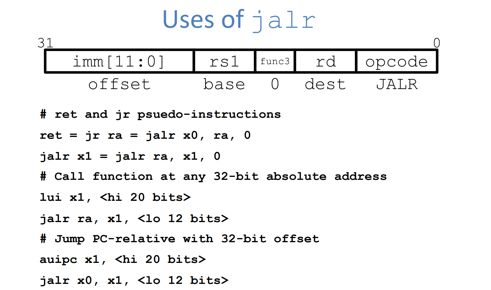
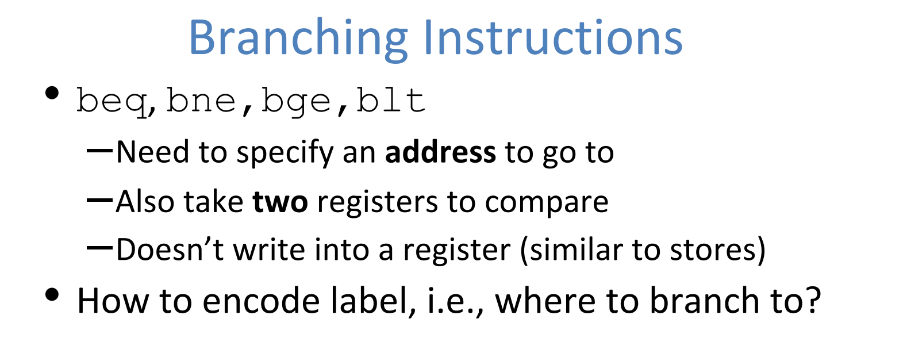
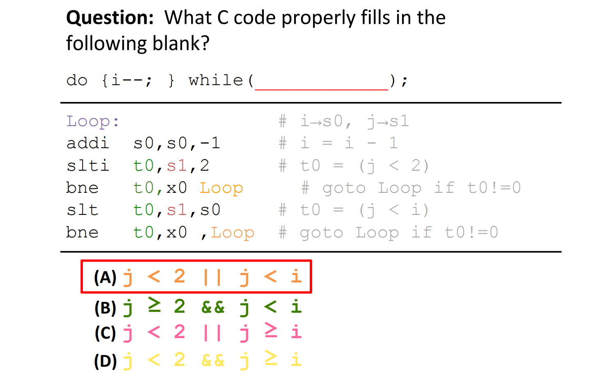

# Overview
> 

# 
# Registers
> 

# Basic Instruction Types
[lec06.pdf](https://www.yuque.com/attachments/yuque/0/2023/pdf/12393765/1694609457998-48cdc036-9188-4471-a6bf-e07d74b15f32.pdf)

## Word Instructions
### Word/Byte Memory Alignment
> 

### Arithmetic Instructions
> 

### Logical Instructions
> 

### Shifting Instructions
> 
> **注意:**
> 1. When using immediate, only values 0-31 are practical.
> 2. When using variable, only lowest 5 bits are used (read as unsigned).
> 
这取决于`Instruction Format`带来的限制。

**Example 1**

### Immediate Instruction
> 

### Data Transfer Instructions
#### Data Transfer
> 

#### Instructions
> 

#### Endianness in RISC-V
> 

#### Sign Extension in RISC-V
> 

## Non-word Instructions
> 

### Byte Instructions
> 

### Half-Word Instructions
> 

**Example 1 - Build lbu with lw**
**Example 2 - Build sb with sw**

## Decision Making Instructions -  Control
### Branch Instructions
> 
> 一个问题是: 为什么我们没有`Branch Greater Then`或者`Branch Less Than Or Equal`这两个指令？
> **这里有一个**`**RISC-V**`**的设计哲学，就是说：**
> 1. `Branch Greater Than`可以通过`Branch Less Than`来实现(交换`reg1`和`reg2`的顺序)。
> 2. `Branch Less Than Or Equal`可以通过已有的`Branch Greater Than or Equal`来实现(交换`reg1`和`reg2`的顺序)。
> 
所以我们无需设计额外的两个指令`bgt`和`ble`。

### Compare Instructions
> 

### If-Else in RISC-V
> 

### Loop in RISC-V
> 

## Program Counter
> 

## Summary
> 

# Pseudoinstructions
> 

# Instruction Formats
[lec08.pdf](https://www.yuque.com/attachments/yuque/0/2023/pdf/12393765/1694886564141-2960e1df-a8e2-4e4a-884b-9927c6a247ea.pdf)
## Overview
> 
> **几个注意点:**
> 1. `opcode`用于区分指令的类型(`Instruction Format`)。
> 2. `funct`用于确定具体是哪一个指令，相当于唯一标识。
> 

## R-Format(3 regs)
> 
> 1. 运算指令，比如`add, xor, mul`, 这类型的指令含有三个寄存器，`rs1, rs2, rd`, 代表两个`operand`和一个结果寄存器
> 2. 指令有`6`个`Field`, 其中`7+5+5+3+5+7`，所有长度为`5`的都用于表示寄存器是哪个，因为`RISC-V`有`32`个寄存器，所以我们只需要`5`位就可以表示所有的寄存器。
> 

> 3. 每一个`Field`都被当做是`unsigned int`来`evaluate`。
> 

> `func7+func3`一共可以表示`1024`种不同的运算指令。

## I-Format(12 bit imm&load, 2 regs)
> `I-Format`主要是那些包括了两个`Registers`和一个`Immediate Field`的指令集。
> 

### addi...
> 

### load
> 

### jalr
> 

## S-Format(2 regs, no rd)
> `S-Format`主要用于将寄存器内的值保存到内存地址中。因为这样的指令不需要`rd`(目标寄存器)，所以`rd`段
> 
> The sb instruction itself does not perform any sign extension; it merely stores the least significant byte of the source register to the specified memory address.

## SB-Format(branching)
### PC-Relative Addressing
> 

### Branch Instructions
> 

### RISC-V SB Format(2 bytes incre)
> 

### Branch Example
> 

## U-Format(20 bit Imm)
> 

### lui+addi Corner Cases⭐⭐⭐⭐⭐
> 

### auipc
> 

## UJ-Format(Jump Anywhere, 1 reg)
> 

# Exercises
> 

   

## C to RISC-V Examples
**Example 1 - while loop**
**Example 2 - do while loop**
**Example 3 - More practices Su20 Disc04**

## RISC-V to C Examples
**Example 1 - Su20 Disc04**
**Example 2 - Su20 Disc04**

## RISC-V With Arrays
**Example 1 - Su20 Disc04 P6**
> 如果我们要遍历`int[]`则我们有一个常用的办法，就是使用一个临时寄存器`t0`作为`index`, 每个循环增加`1`, 但是因为`int`的长度是`4-byte`, 所以我们需要对`t0`做`t0<<2`(扩大四倍)获得真正的地址值差异。

