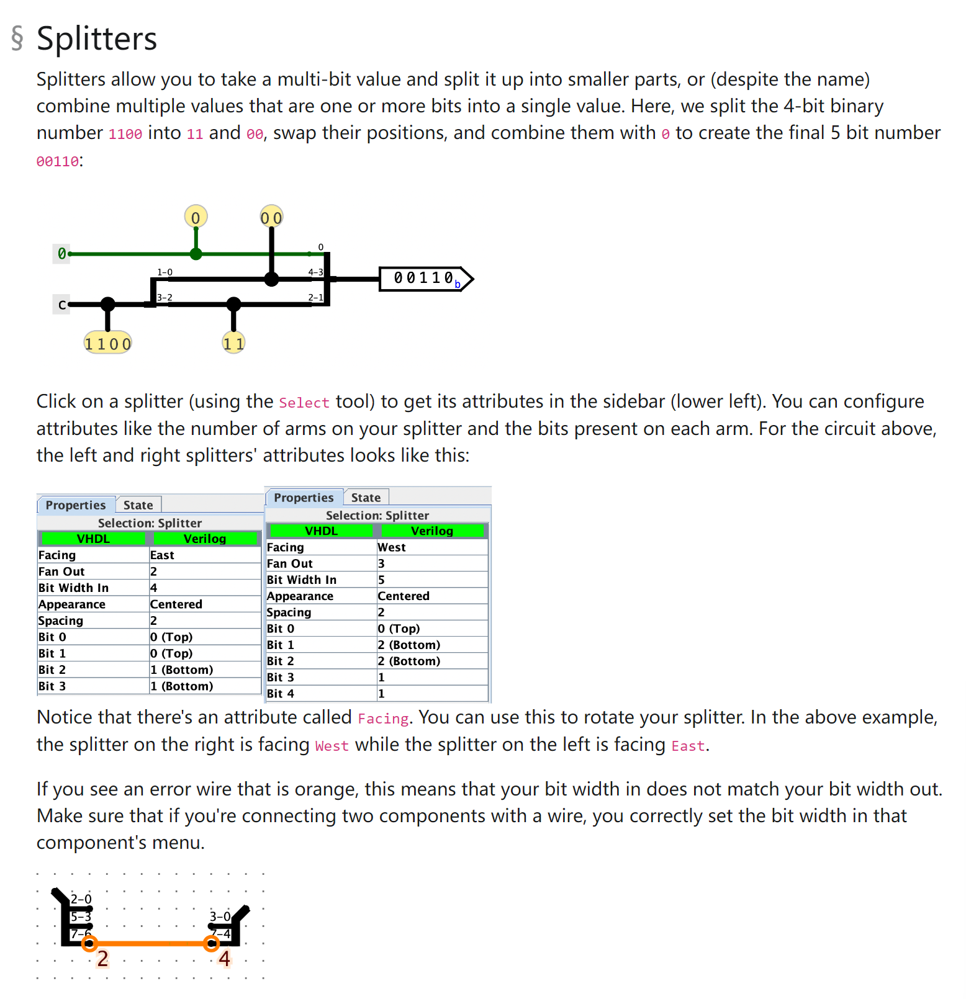

[lab05_spec.pdf](https://www.yuque.com/attachments/yuque/0/2023/pdf/12393765/1696038701051-6cb5a960-92c4-4b77-b085-3ca24ef76f71.pdf)
[lab05.zip](https://www.yuque.com/attachments/yuque/0/2023/zip/12393765/1696039324476-6fe4e213-cf1c-4ddc-8e47-3302ff641ee5.zip)

# Exercise 1: Introduction
## Build Our Circuit
> 

## List of Wire Colors and Values
> 

# Exercise 2: Sub-Circuits
> 

## AND Gate
> 

## NAND Gate
> 

## NOR Gate
> 

## XOR Gate
> 

## 2-1 MUX
> 

## 4-1 MUX
> 

## Testing Results
> 

# Exercise 3: Storing State
> 

**Sample Solution**

# Advanced Logism Features
## Splitters
> 

## Tunnels
> 

## Extenders
> 

# Exercise 4: Rotate Right
> 

## rot 1
> 

## rot 2
> 

## rot 4
> 

## rot 8
> 

## RotRight
> 

## Test Results
> 

