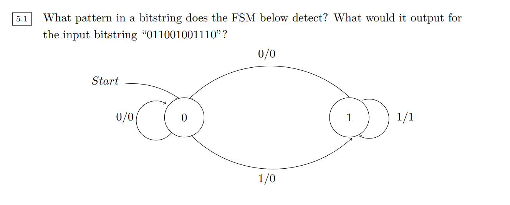
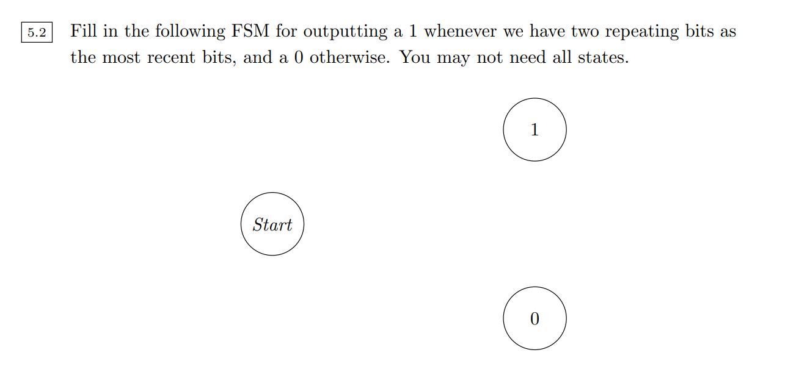
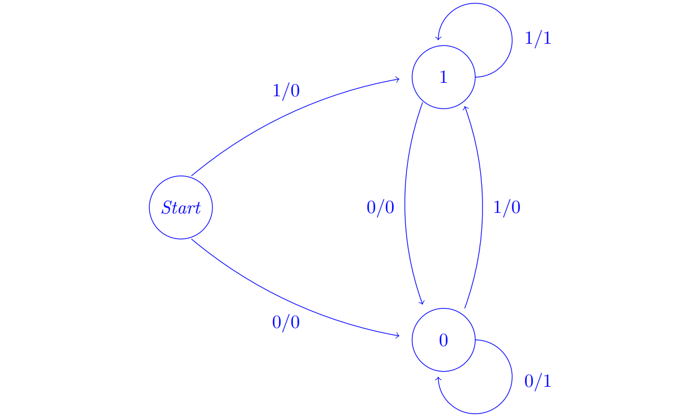
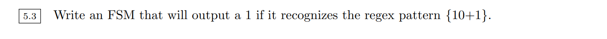
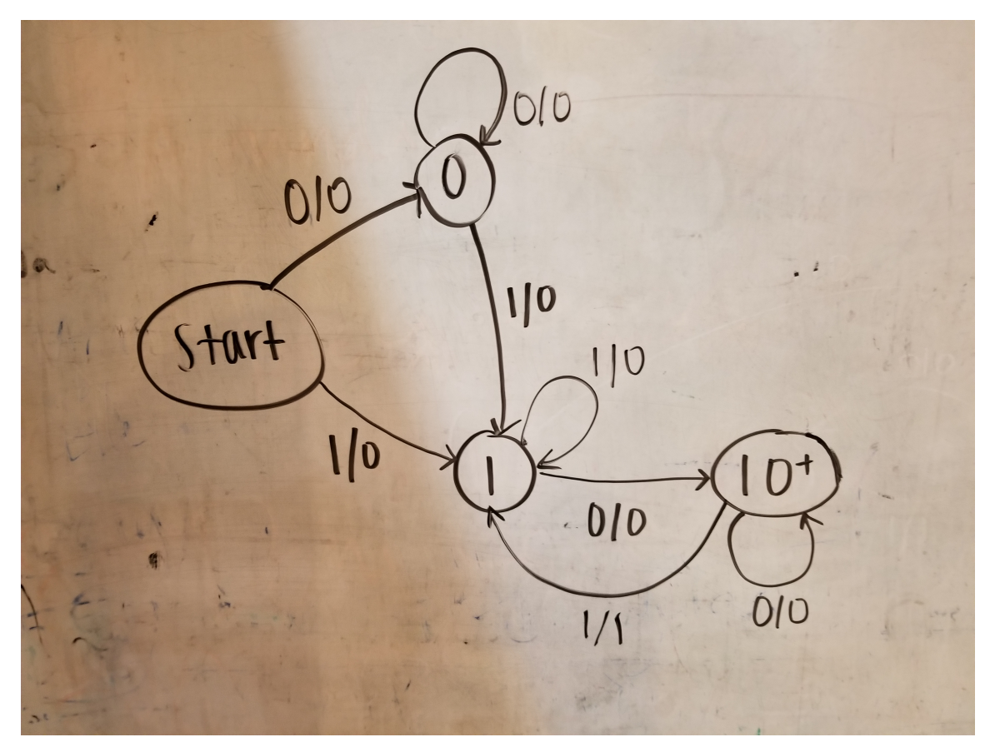
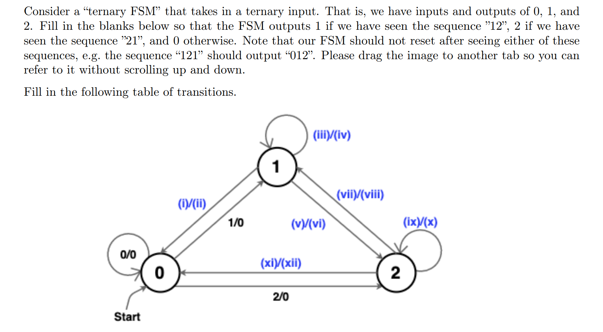
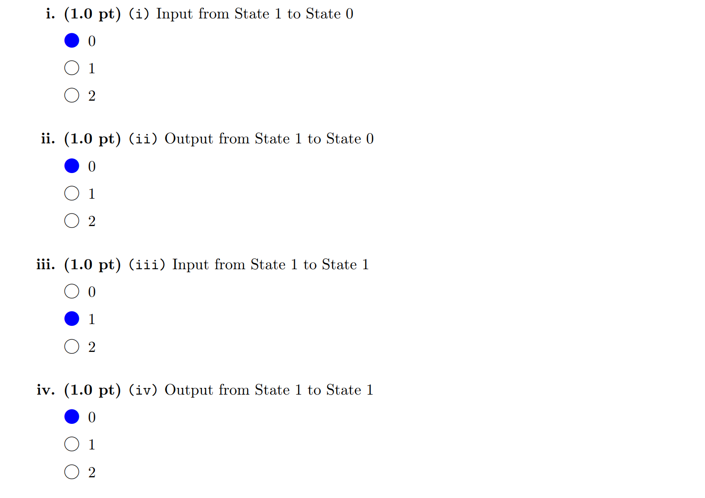
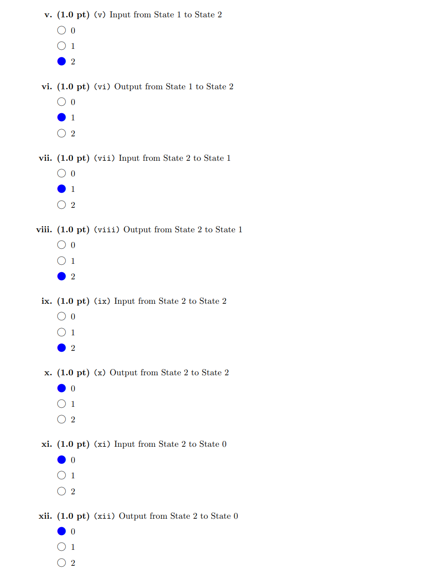
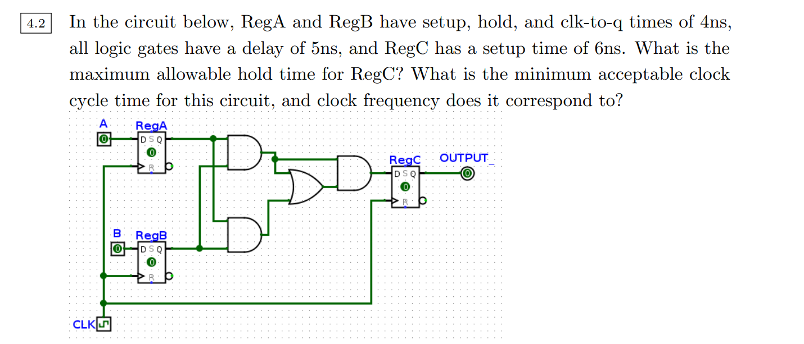
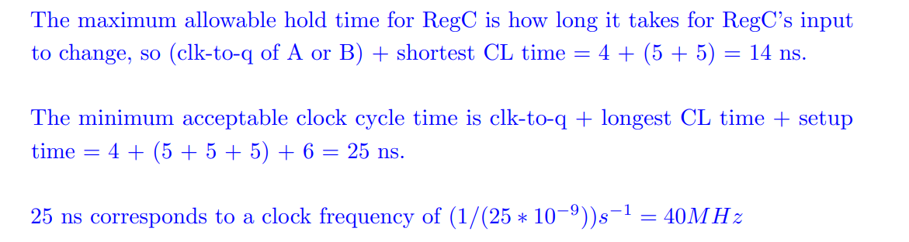

# Registers&FSM
[state_handout.pdf](https://www.yuque.com/attachments/yuque/0/2023/pdf/12393765/1696029712729-d0347779-8121-43b3-ba15-56b81e73651d.pdf)
[sds_handout.pdf](https://www.yuque.com/attachments/yuque/0/2023/pdf/12393765/1696087993250-57c9354f-b862-4c6c-9b6f-84e5e704bd49.pdf)

## FSM
### Example 1
> 

### Example 2
> 

### Example 3
> 

## Exam Practices
> 

# Clocks
[allan_boolean_circuit_notes.pdf](https://www.yuque.com/attachments/yuque/0/2023/pdf/12393765/1696029737844-45120eef-deeb-4e2b-a92a-530a022b354f.pdf)

## Register Exercises - Delays
> 

