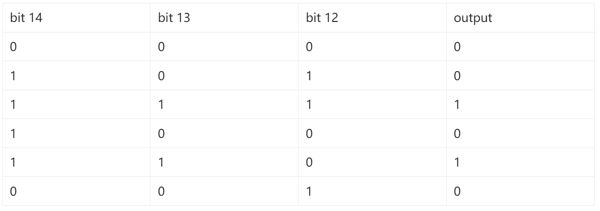

[lab06.zip](https://www.yuque.com/attachments/yuque/0/2023/zip/12393765/1696275196267-1cbaf2d7-2571-49c9-a6a5-91463adb5532.zip)
[lab06_spec.pdf](https://www.yuque.com/attachments/yuque/0/2023/pdf/12393765/1696275234458-a9429631-428d-4abe-91d4-fa28e07fb137.pdf)

# Exercise 1: Constructing Immediates
> 
> **Sample Solution:**
> 

# Exercise 2: Constructing the BrUn Control Signal
> 
> **本题其实很简单，主要是一个**`**Combinational Logic**`**的简单运用:**
> 我们可以将`func3`看成一个`Truth Table`如下：
> 于是我们可以发现：如果我们将`bit 12~14`看成三个`Input`$ABC$的话， 则`Output`使用`DNF`表示就是：$ABC+AB\overline{C}=AB$, 所以我们只需要简单地对$AB$(Bit 13 和Bit 14)做一个`AND GATE`即可。
> **Sample Solution:**
> 

# Exercise 3: Inefficiencies Everywhere
> **Question 1: 10ns+60ns+45ns+10ns=125ns**

# Exercise 4: Pipe that Line
> 
> **Question 1: 10ns + 45ns + 10ns = 65ns**
> **Question 2: 1000/65 **$\approx$**15.38 MHz**

