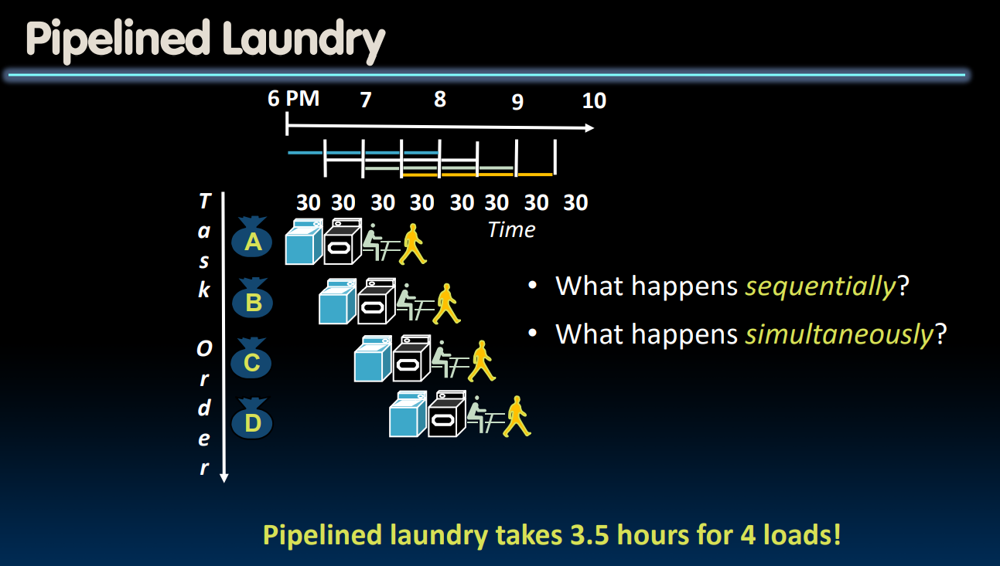
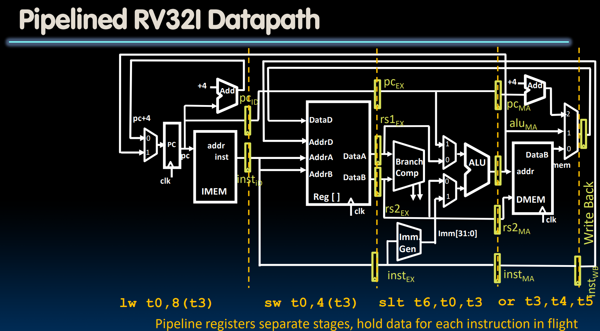
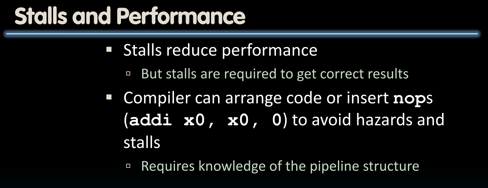
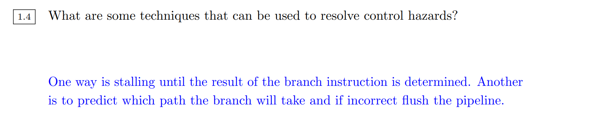
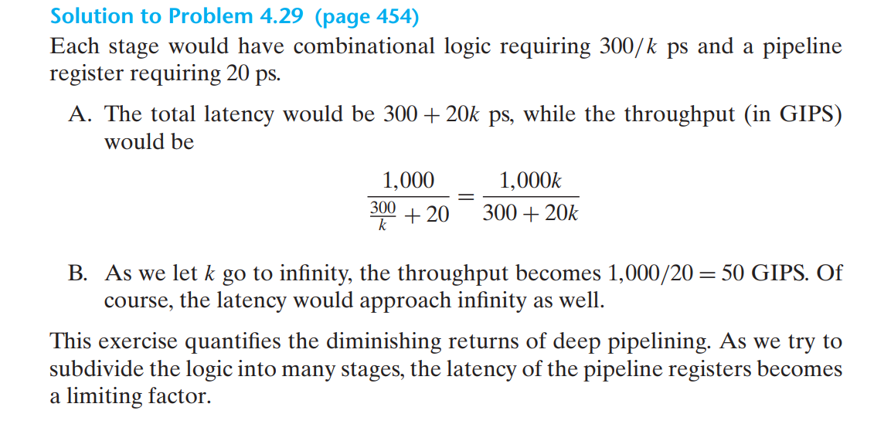
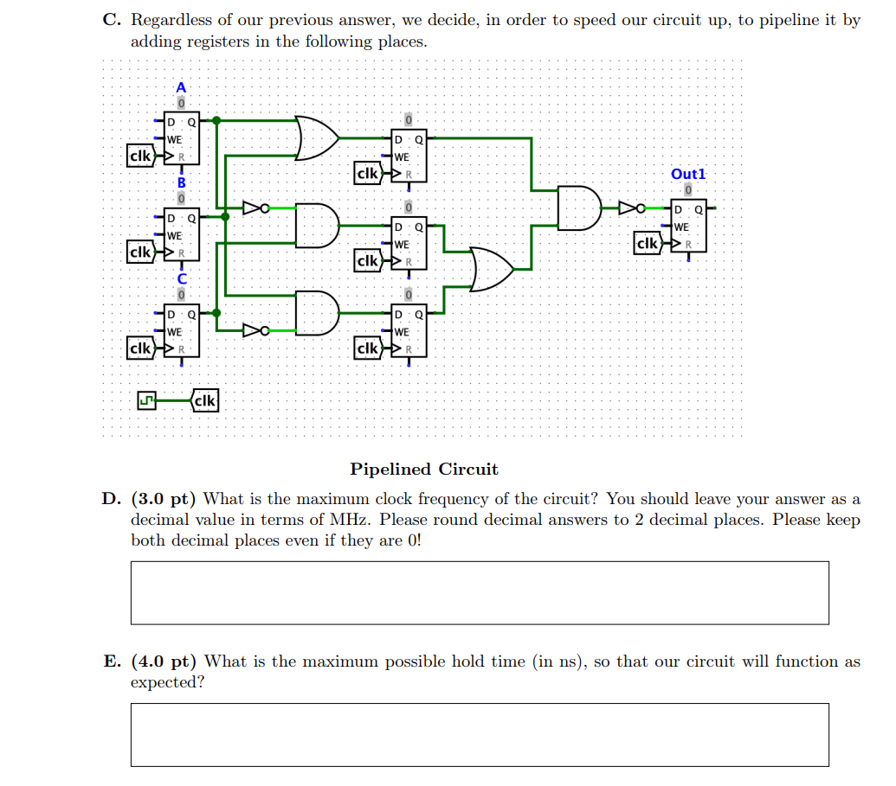
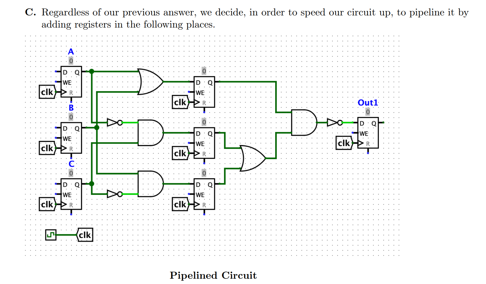

# Instruction Timing
> 

# Speed Efficiency of A Program
> 

## Instructions/Program
> 

## Cycles/Instruction(CPI)
> 

## Time/Cycle
> 

## Speed Tradeoff
> 
> **我们来计算一下:**
> 1. Processor A: $1\times 10^6\times 2.5\times \frac{1}{2.5\times 10^9}=1000s$
> 2. Processor B: $1.5\times 10^6\times 1\times \frac{1}{2\times 10^9}=750s$

# Energy Efficiency of A Program
## Energy Per Task
> 

## Energy "Iron Law"
> 

# Pipelining
## Basics - Latency&Throughput
> 
> **Latency: **The time to finish one instruction.
> **Throughput: **Number of instructions that can be processed(not finished) at the same time.
> 

## RISC-V Pipelining
### Sequential
> 

### Pipelined
> 

### Summary
> - **Pipelining doesn't help latency of single task, it helps throughput of entire workload**
> - Multiple tasks operating simultaneously using different resources
> - Potential speedup = Number of pipe stages
> - Time to "fill" pipeline and time to "drain" it reduces speedup: 2.3X v. 4X in this example
> - **Pipeline rate limited by the slowest pipeline stage**
> - **Unbalanced lengths of pipe stages reduce speedup**
> 

## RISC-V Pipelined Datapath
> 

## RISC-V Pipelined Control
> 

# RISC-V Pipelining Hazards
> 

## Structural Hazard
> 

### RegFile Structural Hazards
> 

### Memory Access
> 

## Data Hazard
### Register Access - ID and WB
> 

### ALU Result -  EX & EX
> 

#### Solution 1: Stalling
> 

#### Solution 2: Forwarding
> 

### Load Data Hazard - WB & EX
> 

#### Solution 1: Stall Pipeline
> 

#### Solution 2: Code Rescheduling
> 

### Detecting Data Hazards
> 

### Exercises - Disc08 Su20
#### Forwarding
> 

**Solution**
> 

**Solution**

#### Stalls
> 

### Exam Practices - MT2 Su20
> 

## Control Hazard
> 

### Solution 1: Kill Instructions After Branch
> 

### Solution 2: Branch Prediction
> 

### Exercises - Disc08 Su20
> 

## Complicated Exercises
> 

# Superscalar Processors
> 

# Pipelineing Registers
> 

## How to Insert Pipeline Registers
> 

## Diminishing Returns on Deep Pipelining
### Definition
> 

### Numerical Example
> 
> 注意这里的一些单位转换，$1s=10^{12}ps$, $1GI = 10^{9}I$。

# Performance Analysis
## Single Cycle Datapath
> 
> **Disc08 Sp23 P3**
> 
> 

## Pipelined Datapath - MT2 Su20
### Critical Path
> 

### Max Clock Frequency
> 

