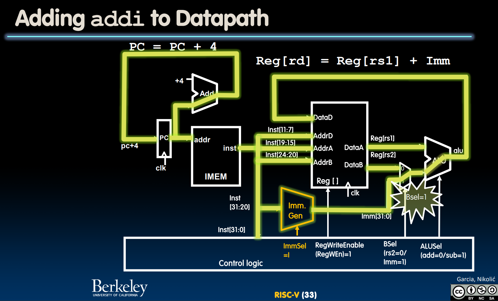
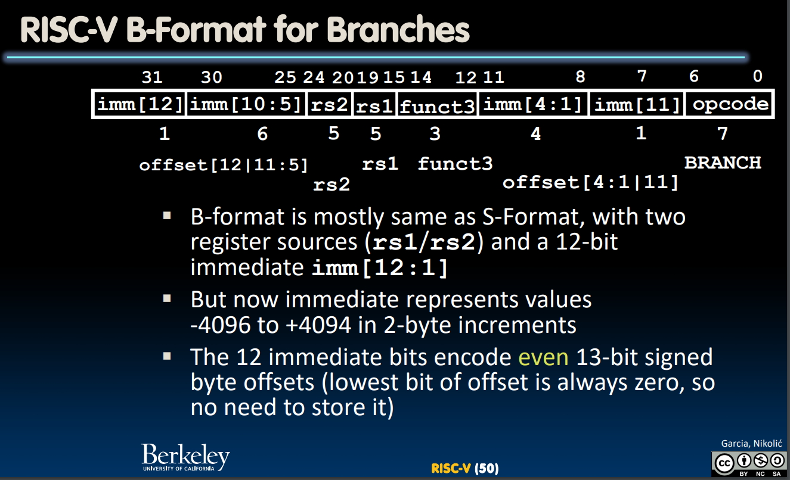
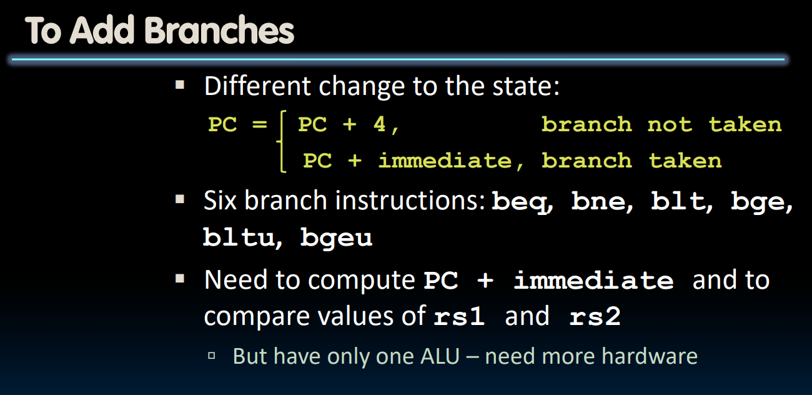
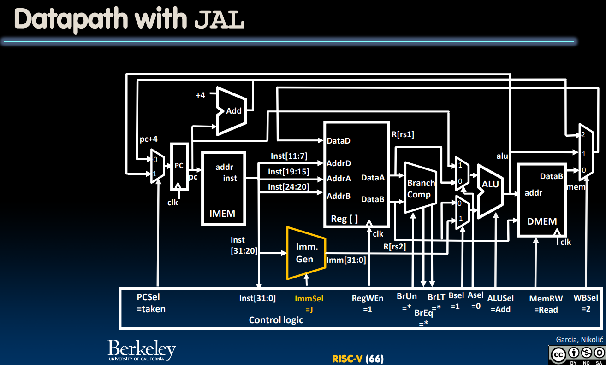

# R-Format Instructions
## add instruction
> 

## sub instruction
> 

## ALUSel
> 

# I-Format Instructions
## addi instruction
> 

## ImmSel
> 

# Load&Store Instructions
## load instruction
> 

## store instruction
> 

# Branch Instructions
## Add Branches
> 

## Branch Comparators
> 

## Immediates Encoding
> 

# Jump Instructions
## Jalr Instructions
> 

## J Instructions
> 

# U-Type Instructions
> 

## Lui
> 

## Auipc
> 

# Complete Datapath
## Graph
> 

## Control Signal Exercises
> 
> **总结一下不同**`**Control Bits**`**对应的意义:**
> 1. 首先`ASel`选择的是`rs1/PC`, `BSel`选择的是`rs2/imm`。`0`表示选择`register`, `1`表示`PC/imm`。
> 2. ** **`PCSel`表示我们是要将`PC`在指令执行完毕后更新为`PC+4`还是`PC+jump`。`1`表示`PC+jump`, `0`表示`PC+4`。
> 3. `ImmSel`表示我们要如何来解读`instruction`中表示`imm`的字段，可选的`Signal`有`R/I/S/SB/UJ`
> 4. `ALUSel`表示我们要进行何种代数运算，常见的有`add/or/sub`
> 5. `MemRW`表示我们是否要对内存进行读写，`0`代表`read`, `1`代表`write`
> 6. `RegWEn`表示我们是否要对`rd`进行写回操作，`1`代表指令中存在`rd`即需要写回，`0`代表指令中不存在`rd`不需要写回。
> 7. `WBSel`表示选择写回的数据类型是什么，上表中，`0`表示数据是`PC+imm`, `1`表示数据是`ALU`计算的结果，`2`表示数据是`PC+4`(一般是`jal`需要的)。

# Clocking Methodology
## Concept
> 

## Exercises
> 

