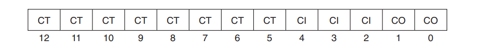
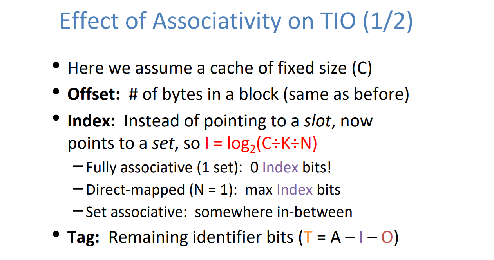

# Basic Concepts
## Memory Hierarchy
> 


## Principle of Locality
> 


## Cache Concepts
> 


## Cache Hierarchy
> 


## TIO Breakdown
> 


## Cache Parameters
> 


# Cache Read/Writes/LRU
## Cache Read Procedure
> 


## Cache Read
### Read Hits
> 就是根据上面的流程读取到了数据。


### Read Misses - Three Types
> 


### Example -  P6.12 ~ P6.15 
> 


#### P6.12 - TIO Breakdown
> 


#### P6.13 - Cache Read 
> 


#### P6.14 - Cache Read
> 


#### P6.15 - Cache Read
> 


## Cache Writes
### Write Hits
> 就是根据上面的流程读取到了数据。


#### Write-Through
> 


#### Write-Back Policy
> 


### Write Misses
> 


#### (No)Write Allocate
> 


### Replacement Policy
> 
> 一般而言我们可以将`LRU Bits`简单的理解为一个`Priority`, 最近访问的(`Read/Write`)的数值小，越不常访问的数值越大。

 


## AWAT Analysis
> 


# Cache (Re)placement Policy
> [!important]
> Cache Organizations and Where to Place Data:
> 1. **Direct-Mapped Cache**: In a direct-mapped cache, each block of memory can only be cached in one specific place. The cache is divided into slots, and each memory block maps to exactly one slot based on some bits of its address (often the middle bits following the block offset). In the case of a compulsory miss, you simply place the data into the slot to which it maps, potentially evicting whatever was there if the slot was already filled.
> 2. **Fully Associative Cache**: A fully associative cache allows a block of memory to be stored in any cache line. This flexibility means that when a compulsory miss occurs, the cache controller can choose any available line for the new data. If the cache is full, it will use a replacement policy (such as Least Recently Used (LRU), Random, or FIFO) to decide which existing entry to replace.
> 3. **Set-Associative Cache**: This is a compromise between direct-mapped and fully associative caches. The cache is divided into sets, and each set contains multiple lines (like a small fully associative cache). A block of memory can be placed in any line within a specific set, which is determined based on the memory block's address. Upon a compulsory miss, if there is an empty line within the set, the data is placed there. If the set is full, a replacement policy within the set determines which line's data is evicted.


# Three Types of Cache
## Type 1: Fully-Associative Cache
### Memory Address Breakdown
> 


### Structure
> 


### Bits to Construct
> 


## Type 2: Direct-Mapped Cache
### Memory Address Breakdown
> **为什么要用**`Middle Bits`**作为**`Index Bits`**呢?**
> 


### Structure
> 


### Bits to Construct
> 


## Type 3: Set Associative Cache
### Memory Address Breakdown
> 


### Structure
> 


### Bits to Construct
> 


## How to Understand - HashTable
> 


## Associativity Analysis
> 


## Cache Miss Analysis - Disc09 Su20
> 


## Concept Check
> 


# Multi-Level Caches
## Multilevel Cache Diagram
> [!important]
> 


## Multi-Level AWAT Analysis
> 


## Local vs Global Miss Rate
> 
> `Global Miss Rate`就是将括号打开的过程，将所有`Level`的`Miss Rate`相乘得到。
> 


## Multi-Level Hit Rate
> [!important]
> L1/L2/L3/...之间的`Hit Rate`互不影响。
> 增加`L1`的`Hit Rate`不会影响`L2`的`Hit Rate`。
> 


## Rewriting Performance
> 


# Writing Cache-Friendly Codes
## Repeated Reference/Stride-k
> [!def]
> 
> 假设我们的`Cache`参数如下:
> 1. Fully Associative Cache
> 2. Cache Size: 16 bytes
> 3. Block Size: 16 bytes
> 
> 则当我们访问`v[0]`时, `v[0],v[1],v[2],v[3]`会被加载到缓存中。如果我们的`Stride`是`1`的话，则第一个`miss`过后，后三次访问都是`Hit`，最终我们会达到如下所示的状态:
> 
> 总的来说，`Stride`越小，`Block Size`越大，`Hit Rate`就会越高。
> 
> 


## Matrix Access Order
### Row Major Order
> [!important]
> 


### Column Major Order
> 


## Matrix Transpose
### P6.17 - 2 x 2 - 16 bytes cache
> [!important]
> 
> 本题根据内存地址和缓存的结构可以判断出，`src`和`dst`的相同行会映射到相同的`Cache Set`中。


### P6.34 - 4 x 4 - 32 bytes cache
> [!important]
> 
> 本题根据内存地址和缓存的结构可以判断出，`src`和`dst`的相同行会映射到相同的`Cache Set`中。
> 
> 

```c

初始状态
0:
1:

i = 0, j = 0
读取src[0][0](m)
0: src[0][0], src[0][1], src[0][2], src[0][3]
1:

赋值dst[0][0](m)
0: dst[0][0], dst[0][1], dst[0][2], dst[0][3]
1:

i = 0, j = 1
读取src[0][1](m)
0: src[0][0], src[0][1], src[0][2], src[0][3]
1:

赋值dst[1][0](m)
0: src[0][0], src[0][1], src[0][2], src[0][3]
1: dst[1][0], dst[1][1], dst[1][2], dst[1][3]

i = 0, j = 2
读取src[0][2](h)
0: src[0][0], src[0][1], src[0][2], src[0][3]
1: dst[1][0], dst[1][1], dst[1][2], dst[1][3]

赋值dst[2][0](m)
0: dst[2][0], dst[2][1], dst[2][2], dst[2][3]
1: dst[1][0], dst[1][1], dst[1][2], dst[1][3]

i = 0, j = 3
读取src[0][3](m)
0: src[0][0], src[0][1], src[0][2], src[0][3]
1: dst[2][0], dst[2][1], dst[2][2], dst[2][3]

赋值dst[3][0](m)
0: src[0][0], src[0][1], src[0][2], src[0][3]
1: dst[3][0], dst[3][1], dst[3][2], dst[3][3]
```
```c
初始状态
0: src[0][0], src[0][1], src[0][2], src[0][3]
1: dst[3][0], dst[3][1], dst[3][2], dst[3][3]

i = 1, j = 0
读取src[1][0](m)
0: src[0][0], src[0][1], src[0][2], src[0][3]
1: src[1][0], src[1][1], src[1][2], src[1][3]

赋值dst[0][1](m)
0: dst[0][0], dst[0][1], dst[0][2], dst[0][3]
1: src[1][0], src[1][1], src[1][2], src[1][3]

i = 1, j = 1
读取src[1][1](h)
0: dst[0][0], dst[0][1], dst[0][2], dst[0][3]
1: src[1][0], src[1][1], src[1][2], src[1][3]

赋值dst[1][1](m)
0: dst[0][0], dst[0][1], dst[0][2], dst[0][3]
1: dst[1][0], dst[1][1], dst[1][2], dst[1][3]

i = 1, j = 2
读取src[1][2](m)
0: dst[0][0], dst[0][1], dst[0][2], dst[0][3]
1: src[1][0], src[1][1], src[1][2], src[1][3]

赋值dst[2][1](m)
0: dst[2][0], dst[2][1], dst[2][2], dst[2][3]
1: src[1][0], src[1][1], src[1][2], src[1][3]

i = 1, j = 3
读取src[1][3](h)
0: dst[2][0], dst[2][1], dst[2][2], dst[2][3]
1: src[1][0], src[1][1], src[1][2], src[1][3]

赋值dst[3][1](m)
0: dst[2][0], dst[2][1], dst[2][2], dst[2][3]
1: dst[3][0], dst[3][1], dst[3][2], dst[3][3]
```


### P6.35 - 4 x 4 - 128 bytes cache
> 


## Matrix Multiplication
### MM Spatial Locality
> 


#### ijk Implementation
> [!important]
> 
> Since each cache block can hold 4 doubles, and A is accessing in the row-major order, so after every cache miss, there are three cache hits.
> So the miss rate for A is 0.25.
> 
> However for B, since we are accessing in a column major way, each access will cause a cache miss, so the cache miss rate is 1.


#### jik Implementation
> [!important]
> 
> As said above, only the inner loop affect the cache performance.


#### kij Implementation
> [!important]
> 目标矩阵按行运算结果。
> 
> 这种方式由于有两个矩阵都是row major order access, 所以cache performance很高。


#### ikj Implementation
> [!important]
> 
> 同上


#### jki Implementation
> [!important]
> 


#### kji Implementation
> [!important]
> 


#### Summary
> [!summary]
> 


### MM Temporal Locality
#### Without Blocking
> [!important]
> 
> 这里我们将矩阵使用`1-dimensional array`来表示。
> 


#### With Blocking
> [!important]
> 
> 


### Summary
> [!summary]
> 


# Cache Performance
## Cache Parameter Analysis
### Associativity Tradeoffs
> [!important]
> 


### Cache Size Tradeoffs
> [!important]
> 

### Block Size Tradeoffs
> [!important]
> 


### Example 1: High-Order DMC - P6.11
> 


## Hit/Miss Rate Analysis
### Ex1: Dot Product - P 6.10
> 
> 下面是解析:
> 首先对于`x[0]`和`y[0]`, 因为此时`Cache`还是空的，所以一定会造成`Compulsory Miss`。然后对于`x[5]`和`y[5]`来说，此时会发生`Conflict Miss`, 其余的都是`Cache Hit`, 所以总共`16`次读取操作，其中`12`次`Hit`, 所以`Hit Rate`是$\frac{12}{16}=\frac{3}{4}$。
> 


### Ex2: Loop Analysis - Disc09 Su20
> 


### Ex3: Cache Parameters on Performance
> 


### Ex4: Complicated - P6.37
> 


#### N = 64(Medium)
> 
> `sumC`中的改变在于，`a[i][j]`和`a[i][j+1]`，`a[i+1][j]`和`a[i+1][j+1]`读取的是同一个`Block`中的数据，所以一定是一个`Miss`和一个`Hit`。也就是四个`Miss`里面有两次`Hit`。


#### *N = 60(Hard)
##### sumA
> 


##### sumB
> 


##### sumC
> 


### *Ex5: Loop+ MultiLevel MT2 Su20
> 
> 我们可以画出下面的流程图:
> 
> 所以我们可以很容易得到$\frac{62}{63\times 3}=\frac{62}{189}$。
> 
> 其实我们发现，当`Set-Associativity`大于等于`2`的时候，至少在每次循环内我们都能顺利的读取`A`和`B`的数据进入`Cache`。但是如果`Set-Associativity = 1`，则每次循环中:
> 1. `A[i+16]`永远是`Compulsory Miss`
> 2. `B[i]`就会变成`Conflict Miss`
> 3. `A[i]`也会变成`Conflict Miss`
> 
这直接导致了`Hit Rate = 0`。
> 


### Ex6: Struct - P6.38 ~ P6.40
> 


#### Row Major Access
> 


#### Column Major Access
> 


#### Splitwise Access
> B.
> 对于第一个循环，每一次写入都会发生miss的情况，最后cache中保存的是square[0][0] ~ square[3][15]，而第二个循环又从头开始写入，所以每三次写入的第一次都会发生miss。总的miss次数就是16 * 16 * 2 = 512。
> C.
> (1024 - 512) / 1024 = 50%

