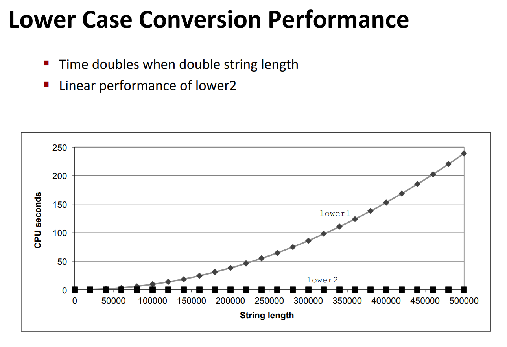
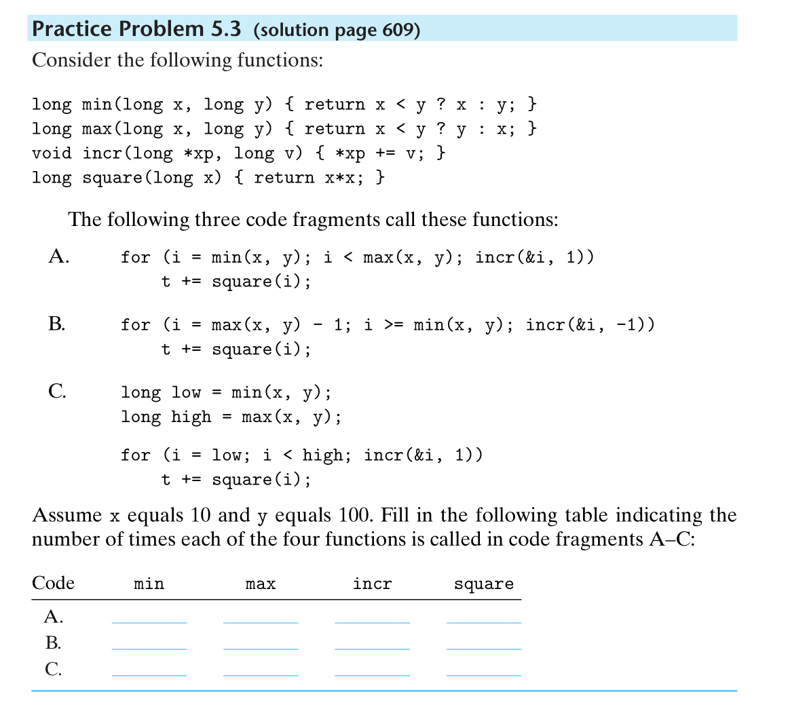
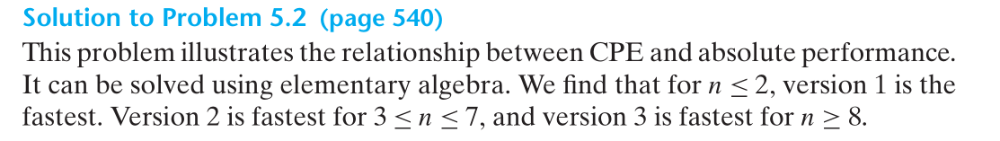
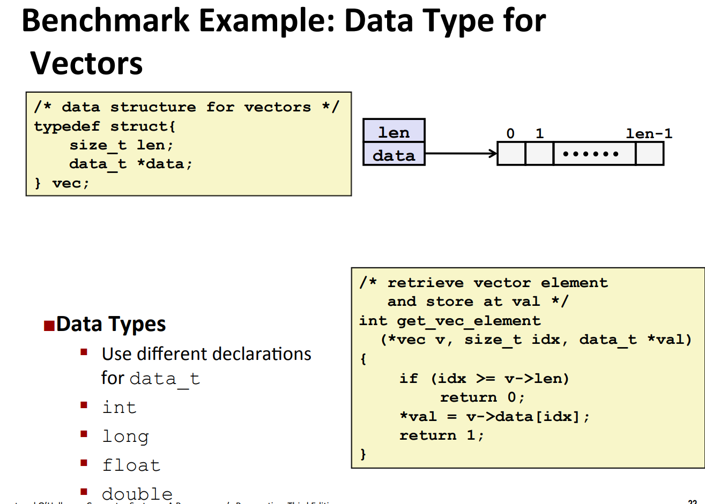
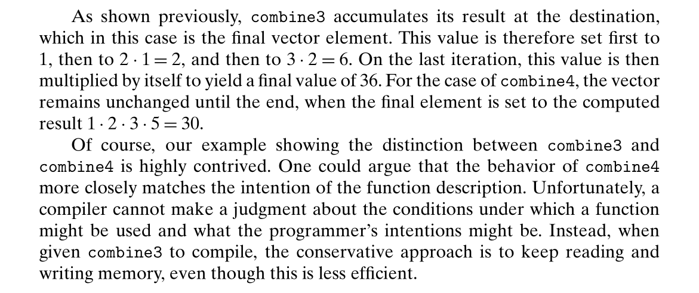
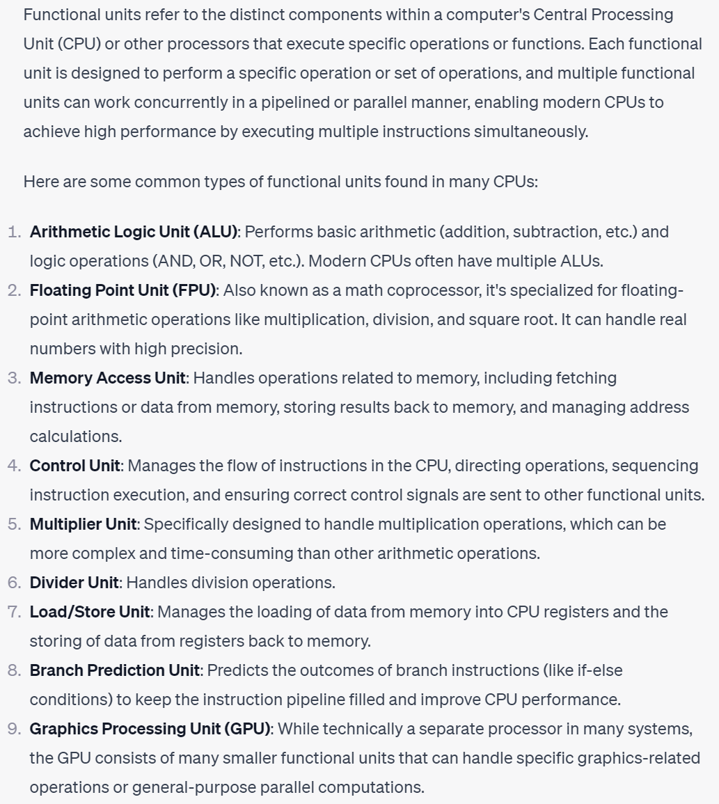
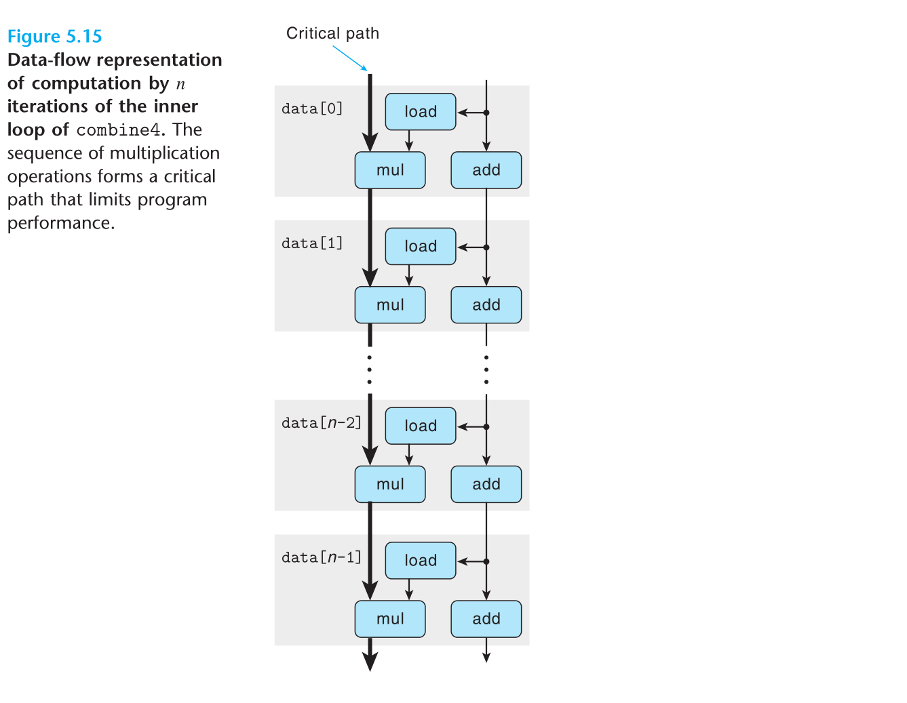
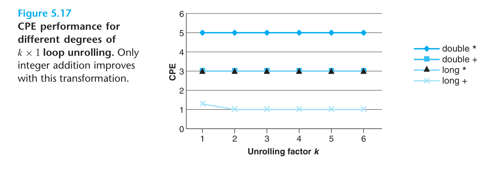

# Optimization Level by GCC
> 


# Common Types of GCC Optimization
## Constant Folding
> [!concept]
> 


## Code Motion
> [!concept]
> 
> `Code Motion`是一种预先计算循环体中的变量的代码优化方式，可以减少循环体中不必要的重复代数运算。
> 下面的代码使用`gcc -O1`达到，它将循环体转换成指针风格，相比之前的优化，下面的代码将数组访问转换成了指针风格。
> 
> 


## Reduction in Strength
> [!concept]
> 


## Share Common Subexpressions
> [!concept]
> 
> 这种优化方式非常重要，在图像处理中，我们经常需要访问相邻的至少四个像素点，上面的优化可以大幅减少不必要的计算。


## Dead Code
> [!concept]
> 


## Tail Recursion
> [!concept]
> 


# Optimization Blocker - 阻止优化的情况
## Procedure Calls
> 
> 由于`for(i = 0; i < strlen(s); i++)`中，每次循环判断都会执行一个算法复杂度为`O(n)`的`strlen(s)`(`**Procedure Call**`)操作，所以总体算法复杂度是`O(n^2)`。
> 
> 提升其算法复杂度也很简单，只要把重复计算的部分提取到外面即可。
> 
> 我们会发现算法复杂度下降到了`O(n)`。
> 
> **但是实际上，编译器并不会自动做出我们想要的优化操作(只有我们人为将**`strlen`**移出循环才可以)，有以下几个原因:**
> 1. 由于循环在执行的过程中我们的字符串`s`也在不断地被修改，所以编译器会非常小心，生怕计算`strlen(s)`的时候出错，故每次循环都会计算一次。
> 2. 编译器需要决定使用哪个`strlen`函数，因为我们可能自己写了一个`strlen`, 然后在`Linking`期间将这个用户自定义的(而不是`C++`标准库的)`strlen`编译成`object file`，此时`strlen`的行为其实就更不可控了，尤其是如果用户定义的`strlen`会造成`buffer overflow`时，所以编译器会把`procedure call`（比如`strlen`）当成一个黑盒子。
> 3. 对于编译器，它要考虑的是如何保证优化后程序的行为一致。因为一些问题的存在，编译器无法确定是否可以优化。最典型的问题是`memory aliasing`，出现的场景是两个指针指向同一块内存地址。函数可能有`side effect`，所以函数调用不会被轻易的优化，除非是`inline`。
> 


## More Procedure Call Examples
> 


## Memory Matters - Aliasing
> 
> 上面的代码中，我们由前面的学习知道，我们可以将`n*i`的运算提到外层循环中，并使用一个新的变量`ni=n*i`来做优化，那么除此之外我们还能进一步优化吗?
> 注意到上面的汇编码中，内层循环中的`b[i]+=a[i*n+j]`操作被翻译成了三行指令，分别对应了从内存中读取`b[i]`的值，计算`b[i]+a[i*n+j]`的值，将计算结果写回到`b[i]`内存中的步骤。但是为什么我们不能在循环体中省略`FP load`的过程呢？毕竟我们可以在内层循环之前`FP load`一次，然后在内层循环中只调用`addsd`获取最终的结果，然后再内层循环结束后再将结果`FP store`回去。
> 考虑下面的这种情况:
> 
> 因为编译器必须假设`A`和`B`指向的内存区域有可能重叠，所以为了避免一些错误的程序行为，我们需要小心地不厌其烦地从内存中读取和存储。如果我们没有立即将`b[i] += a[i*n+j]`的结果存放到`b[i]`中的话，那么后续`a[i*n+j]`读取到的就会是错误的结果。比如当`i=1`的时候:
> `j=0`时, `b[i] += a[1][0]`, 其中`a[1][0]=3`, 所以`b[1]=3`，而如果我们不立即更新`b[i]`的值，而是等到`j=3`循环结束后再更新，那么当`j=1`时，`a[1][1]`本应该是`3`(`b[1]`的值), 但是因为没有更新导致运算的时候`a[1][1]=4`了，所以结果会有问题。
> 优化方法也很简单，就是使用一个临时变量。如下所示:
> 
> 总之，编译器并不知道程序员需要函数表现出`sum_rows2`的行为还是`sum_rows1`的行为，所以`sum_rows_1`并不会像`sum_rows2`那样做优化，将结果存放在一个临时寄存器内。


# Data-Level Optimization - Vector
## Program Performance - CPE
> 
> 本质上上面两段代码的目的是求出一个`vector`的`Cumulative Sum`, 只是实现方式不同。
> 
> **在介绍CPE之前，我们需要先理解两个基本概念：周期数（Cycles）和元素（Element）。**
> 1. 周期数：处理器执行一个指令所需的时钟周期数。时钟周期是计算机系统中的基本时间单位，它的频率由处理器的主频决定。
> 2. 元素：指的是在计算任务中需要处理的数据单元，可以是数组、矩阵、图像等。元素的数量决定了计算任务的规模。
> 
CPE即每个元素的周期数，它描述了处理器在执行特定计算任务时，每个元素所需的平均时钟周期数。CPE值越小，表示处理器执行相同计算任务时的效率越高。
> 
> **下面我们做一道练习:**
> 
> 本题的直觉有两个，一个是当`n`很小的时候，我们的程序性能主要受`Overhead Constant`的影响，而当`n`较大的时候，才开始受`n`的影响。解决本题很简单只需要找到三条直线两两交点即可。
> 


## Benchmark Code - combine1
> 假设我们有一个`vec`，里面存放了`data_t`类型的数据，定义如下:
> 
> 现在假设我们想要计算`vector element product/sum`则我们可以定义下面的函数，这个函数中我们将结果储存在`dest`指向的地址处。然后通过`get_vec_element`获取向量的每一个元素并将结果迭代地积累更新到`dest`中。
> 
> 我们发现整数操作比浮点操作更费时间，但是如果使用`O1`级别的优化后，可以使得整数运算的时间缩减至少一半。
> 
> 这样的提升已经足够明显，但是我们能否更进一步，通过减少一些程序中的冗余来达到更明显的性能提升。
> 首先注意到，每次循环我们都会调用`vec_element(v)`，所以整个循环是`O(n^2)`，一种优化方法就是将`vec_length(v)`移出循环判断条件中，使得算法复杂度下降到`O(n)`。


## Reducing Procedure Calls
### Move vec_length out - combine2
> 


### Move get_vec_start out - combine3
> 
> 原因是`Memory Access forms a bottleneck for our perfomance`


### More Optimization - combine4
> 
> 可以看到，在代码层面做优化能够使得程序性能获得极大地提升。
> 


### Memory-Aliasing
> 


## Memory Aliasing -O1/-O2 Example
> 
> **Answers:**
> 


# Processor-Level Optimization - Vector
> 前文中的优化方法更多聚焦在编译器层面的优化，比如:
> 1. 因为`Procedure Calls`的`Caller/Callee Convention`导致的`Overhead`。
> 2. 因为`Memory Aliasing`导致的编译器指令的增长。
> 
为了使得代码的运行速度进一步提升，我们需要借助处理器的微观构造来充分利用执行单元的性能。


## Functional Units
> `**Haswell CPU**`**是**`**2015**`**年的**`**Intel**`**处理器，它支持:**
> 1. 两个`load units`，可同时进行两个`load`操作。
> 2. 一个`store units`，可同时进行一个`store`操作，不能被`pipelined`，也就是不支持`double pumping`。
> 3. 四个`ALU Units`，
>    1. 其中只有一个能进行`Integer Multiplication`运算
>    2. 这四个`ALU Units`都可以进行`Integer Addition`运算。
> 4. 两个`FP Multiplication Units`，可同时进行两个`FP Multiply`操作。
> 5. 一个`FP Adder Units`，可同时进行一个`FP Add`操作，不能被`pipelined`。
> 6. 一个`FP Division Unit`，可同时进行一个`1 FP Divide`操作，不能被`pipelined`。


## Latency&Throughput&Issue&Capacity
> 为了能够描述一个程序的最优性能，我们有几个常用指标:
> 1. 我们可以给它的执行时间一个下限，也就是执行程序可以达到的最短时间，称为`**Latency Bound**`。The latency bound is encountered when a series of operations must be performed in strict sequence, because the result of one operation is required before the next one can begin. This bound can limit program performance when the data dependencies in the code limit the ability of the processor to exploit instruction-level parallelism. 
> 2. `**Issue Time**`，表示相邻两条指令开始的最短时间差，也可以用来反映某类指令被`Pipeline`的程度有多大，`Issue Time`越短，`Pipeline`的程度就越深。如果`Issue Time=Latency Bound`说明我们必须等待上一条指令执行完之后才能开启下一条指令，换句话说就是这两条指令不能被`Pipelined`。
> 3. `**Capacity**`表示某条指令最多有多少个`Functional Units`参与。比如整型加法运算，因为`Haswell CPU`上有四个加法器，所以`Capacity of Integer Addition`就是`4`。
> 4. `**Throughput** = 1 / Issue Time`。对于一个`Fully Pipelined Functional Unit`来说，`Issue Time = 1 cycle`，即`Throughput = 1 instruction / cycle`。如果我们有多个`Functional Unit`的话，我们可以进一步提升`Throughput`, 即`Througput = Capacity / Issue Time`。所以对于一条`Capacity = C`, `Issue Time = I`的指令来说，他的`Throughput`就是`C/I`operations per cycle clock.
> 
当然我们知道，`Pipelining`的实现依赖于添加`Pipelined Registers between stages`, 这需要更多的硬件支持，但是`CPU`的空间有限，所以`CPU`设计者必须在这些指标中找到平衡。
> 
> **从上面的表中我们可以看到几个现象:**
> 1. 浮点数相比整数来说，`Latency`更长，也就是我们需要更多的时间来执行浮点数操作。
> 2. `Issue time`就是说相邻两条指令被触发的时间之差。对于浮点数加法指令来说，`Haswell CPU`会将其分成三个`Stage`, 每个`Stage`是一个`Cycle`。在上一条浮点加法指令完成第一个`Stage`之后(过了一个`Cycle Time`)第二条加法指令就会开始执行，所以两条指令的触发时间仅仅相隔`1 Cycle`, 这种情况也被称为`Fullt Pipelined`。
> 3. `Division`的`Issue Time`一般而言不是`1 Cycle`，也就是不能被`Fully Pipeline`，并且`Issue Time=Latency`, 换句话说`Division`不仅没有被`Fully Pipeline`, 甚至连`Pipeline`都没有。换句话说必须等上一条`Division`指令执行完全后下一条`Division`指令才能开始执行。


## Latency/Throughput Bound⭐⭐⭐⭐⭐
> 
> 我们也可以给执行程序的运行单元`Functioanal Units`创造一个指标，衡量单位时间内能够执行的指令数量，称为`**Throughput Bound**`。 The throughput bound characterizes the raw computing capacity of the processor's functional units. This bound becomes the ultimate limit on program performance. 
> **这里会有很多读者产生疑问的地方，就是这里的**`**Throughput Bound**`**是如何求出的?**
> 
> 上图给出了处理器上操作的时间， Latency 是操作执行的时间，Issue 是两个操作之间需要的时间，Capacity 表示可以同时执行多少个这样的操作。后面的表中的 Throughput 分析了每个操作对每个元素执行时间 CPE 的理论上界。比如浮点数乘法，Capacity 为 2，Issue 为 1，在流水执行的情况下，平均下来一个浮点数需要 0.5 个 CPE，同理加法浮点数为 1.0 个 CPE。不过这里有个特别的例子，整数加法的 CPE 为什么是 0.5 而不是 0.25 呢？其实因为程序的瓶颈在别处，因为处理器上只有两个 load 单元，每次只能读取两个元素，所以不能同时 4 个元素都在进行。


# Data-Flow Graph
## How to Draw - combine4
> 
> Given that floating-point multiplication has a latency of 5 cycles, while integer addition has a latency of 1 cycle, we can see that the chain on the left will form a critical path, requiring 5n cycles to execute. The chain on the right would require only n cycles to execute, and so it does not limit the program performance.
> Figure 5.15 demonstrates why we achieved a CPE equal to the latency bound of 5 cycles for combine4, when performing floating-point multiplication.
> When executing the function, the floating-point multiplier becomes the limiting resource. The other operations required during the loop—manipulating and testing pointervalue data+i and reading data from memory—proceed in parallel with the multiplication. As each successive value of acc is computed, it is fed back around to compute the next value, but this will not occur until 5 cycles later.


## Evaluating Polynomials
### Iterative Way - P5.5
> 
> **下面是问题的解析:**
> 


### Recursive Way - P5.6
> 


### Comparison 
> 直观来看，5.6 执行的运算数量少，应该有更快一点才对。不过画个数据流图，分析一下就知道 5.6 存在依赖关系，不能指令级别并行，而 5.5 不存在这种依赖关系，所以可以指令级别并行，速度比 5.5 要快！
> 对于 5.5 的数据流图分析，需要知道“流水线执行”。在计算 result 的 add 节点的时候，需要 3 个 CPE，但是因为不存在依赖关系，下一个 xpwr 可以并行执行，所以这个 add 节点的运算开销会被 xpwr 节点的乘法运行给掩盖。决定整个程序性能瓶颈的是 xpwr 的乘法计算。
> 对于 5.6 的数据流图，我们可以看到整个计算过程的 critical path 需要经过一个乘法，一个加法。因为存在依赖关系，所以乘法和加法不能并行，所以这注定了 5.6 比 5.5 慢。


# k x 1 Loop Unrolling - Can't break Latency
## Serial Computation
> 上面的优化方法中，在每次运算时，我们都需要上次运算的结果，也就是说我们需要等待上次循环将结果更新之后才能继续当前循环的计算而不出错，下面的图展示了`combine4`中的运算流程，称为`Sequential Dependence`，这种代码执行方式其实并不高效，如果我们用`Latency`来衡量的话(`Latency`定义为`Number of Cycles Per Instruction Execution and Overheads`)。因为即使我们的`CPU`支持`Pipelining`, 也会因为我们的代码结构导致`Pipeline`并不能被完全利用，即便我们可以通过`Forwarding`机制加快程序执行效率，但是提升也不是很大。
> 
> 但是我们可以使用一个叫做`Loop Unrolling`的方法让代码执行效率获得极大的提升。


## Loop Unrolling - 指令级的并行
### 2 x 1 unrolling
> 一种方法是，我们在每次循环中同时计算两次乘积，这样我们可以减少一半的循环数量，达到接近`2x`的性能提升。
> 
> 但是结果是，整数加法的速度提升了，但是整数乘法并没有提升。这是因为我们已经到达了`Multiplication`的`Latency Lower Bound`不能再提升速度了（`Loop indexing and increment`拖慢了整体速度）。而且我们发现这个程序本质上还是一个`Serial Computation`, 为了进行`(x OP d[i]) OP d[i+1]`我们必须先进行`(x OP d[i])`操作获得结果后才能继续。
> 


### k x 1 unrolling
> 


## Exercise P5.7 - 5 x 1 Unrolling 
> **下面是解析:**
> 


# k x ka Loop Unrolling - Break Latency
## Reassociation
> 
> 注意到我们有`4`个加法运算器，但是只有两个`load`负责加载整型，所以整数加法性能受制于加载单元。
> 
> `d[i] * d[i+1]`在循环之间是没有`Data Dependency`的，所以可以提早开始。
> 
> 好处是因为我们知道对于整数来说，整数加法和乘法满足交换律和结合律，所以这样的优化不会造成计算结果错误。
> 坏处就是对于浮点数来说，其加法和乘法**不满足结合律**，所以可能会导致运算结果出错。


## Multiple Accumulators
> 


## Exercise P5.8 - 3 x 1a
> 
> **下面是解析:**
> 


# SIMD Optimization
> 


# Summary on Optimization Techniques
> 1. **Eliminating Loop Inefficiencies**，减少循环时低效调用，比如 for 循环当中检查边界，如果每次都调用一个方法获取长度，这将大大增加时间消耗，更坏的情况是导致了算法复杂度的改变。
> 2. **Reducing Procedure Calls**，减少函数调用。
> 3. **Eliminating Unneeded Memory References**，减少不必要的内存引用。使用一个寄存器变量做临时读写，将最后的结果写入到内存中。如果每次都写入内存，那么会很低效。
> 4. **Loop Unrolling**，循环展开。for 循环每次步进 2 或者更多，提供指令级别并行。
> 5. **Multiple Accumulators**，使用多个累积变量。从数据流图的角度去分析，使用多个累积变量可以获得更好的指令并行。
> 6. **Reassociation Transformation**。算术运算的时候，可以先计算某些部分来获得更好的指令并行。
> 7. **SIMD**，从指令级别的角度看，使用单条指令多条数据去加速并行。
> 8. **Register Spilling**。如果使用了太多累积变量，超过了寄存器的数量，那么会开始使用放在内存中的栈变量，这样将会导致访存，使性能下降。
> 9. 现代处理器采用了乱序执行的策略，对于分支执行，它会选择一个分支直接执行，如果分支预测错误了，那么将会清理环境，重新取指令，重新执行。为了减少这种分支预测错误带来的代价，可以使用 Conditional Moves 类别的指令来减少分支预测错误的代价。
> 10. **Do Not Be Overly Concerned about Predictable Branches**。不用过多担心分支预测。因为很多情况下，分支预测的结果往往是正确的，只有最后一个元素预测错误，比如判断 index 是否已经在数组的边界等操作。不过对于一些比较随机的判断，分支预测的性能却不会很好，所以这些随机的分支判断可以使用 Conditional Moves 进行优化。


# Homework Problems
## P5.13 - Vector Product
> 

**Solution - A**
**Solution - B**

**Solution - C**由整数加法的延迟，CPE的下界应该是`1`.
**Solution - D**由A中的数据流图，虽然浮点数乘法需要`5`个周期，但是它没有“数据依赖”，也就是说，每次循环时的乘法不需要依赖上一次乘法的结果，可以各自独立进行。但是加法是依赖于上一次的结果的（sum = sum + 乘法结果），所以该循环的“关键路径”是加法这条链。而浮点数加法的延迟为`3`个周期，所以CPE为`3.00`。

## P5.14 6 x 1 Unrolling
> 

```c
/*
 * 5.14.c
 */
#include <stdio.h>
#include <stdlib.h>
#include <string.h>
#include <assert.h>
#include "./lib/vec.h"

#define LEN 24

/* inner product. accumulate in temporary */
void inner4(vec_ptr u, vec_ptr v, data_t *dest) {
  long i;
  long length = vec_length(u);
  data_t *udata = get_vec_start(u);
  data_t *vdata = get_vec_start(v);
  data_t sum = (data_t) 0;

  for (i = 0; i < length-6; i+=6) {
    sum = sum + udata[i] * vdata[i] +
      udata[i+1] * vdata[i+1] +
      udata[i+2] * vdata[i+2] +
      udata[i+3] * vdata[i+3] +
      udata[i+4] * vdata[i+4] +
      udata[i+5] * vdata[i+5];
  }
  for(; i < length; i++) {
    sum = sum + udata[i] * vdata[i];
  }
  *dest = sum;
}

int main(int argc, char* argv[]) {
  vec_ptr u = new_vec(LEN);
  vec_ptr v = new_vec(LEN);

  data_t *arr = (data_t*) malloc(sizeof(data_t) * LEN);
  memset(arr, 0, sizeof(data_t) * LEN);
  arr[0] = 0;
  arr[1] = 1;
  arr[2] = 2;
  arr[3] = 3;

  set_vec_start(u, arr);
  set_vec_start(v, arr);

  data_t res;
  inner4(u, v, &res);

  assert(res == 1+4+9);
  return 0;
}
```
**Explanation A**Every element has 6 long/float add
Element count is n/6
So n/6 * 6 = n
CPE bound == 1.0
**Explanation B**Same like A


## P5.15 6 x 6 Unrolling
> 

```c
/*
 * 5.15.c
 */
#include <stdio.h>
#include <stdlib.h>
#include <string.h>
#include <assert.h>
#include "./lib/vec.h"

#define LEN 24

/* inner product. accumulate in temporary */
void inner4(vec_ptr u, vec_ptr v, data_t *dest) {
  long i;
  long length = vec_length(u);
  data_t *udata = get_vec_start(u);
  data_t *vdata = get_vec_start(v);
  data_t sum = (data_t) 0;
  data_t sum1 = (data_t) 0;
  data_t sum2 = (data_t) 0;
  data_t sum3 = (data_t) 0;
  data_t sum4 = (data_t) 0;
  data_t sum5 = (data_t) 0;

  for (i = 0; i < length-6; i+=6) {
    sum = sum + udata[i] * vdata[i];
    sum1 = sum1 + udata[i+1] * vdata[i+1];
    sum2 = sum2 + udata[i+2] * vdata[i+2];
    sum3 = sum3 + udata[i+3] * vdata[i+3];
    sum4 = sum4 + udata[i+4] * vdata[i+4];
    sum5 = sum5 + udata[i+5] * vdata[i+5];
  }
  for(; i < length; i++) {
    sum = sum + udata[i] * vdata[i];
  }
  *dest = sum + sum1 + sum2 + sum3 + sum4 + sum5;
}

int main(int argc, char* argv[]) {
  vec_ptr u = new_vec(LEN);
  vec_ptr v = new_vec(LEN);

  data_t *arr = (data_t*) malloc(sizeof(data_t) * LEN);
  memset(arr, 0, sizeof(data_t) * LEN);
  arr[0] = 0;
  arr[11] = 1;
  arr[2] = 2;
  arr[23] = 3;

  set_vec_start(u, arr);
  set_vec_start(v, arr);

  data_t res;
  inner4(u, v, &res);

  assert(res == 1+4+9);
  return 0;
}
```
> **Explanation:**
> 1. Floating-point multiplication is not on the critical path, and its throughput bound is 0.5, requiring 10×10 loop unrolling to reach the limit (k=C·L=5·2=10)
> 2. **For floating point data: **Because the multiplication is not on the critical path, the time it consumes is its throughput bound (I think so). At this time, the addition has reached the throughput limit of 1 when the 6×6 loop is unrolled. So the lower bound of CPE is 1.
> 3. **For integer data: **Both addition and multiplication have reached the throughput limit, so the maximum throughput limit becomes the limiting factor, which is the throughput limit of multiplication with a value of 1. So the lower bound of CPE is 1 instead of 0.5.


## P5.16 6 x 1a Unrolling
> 

```c
/*
 * 5.16.c
 */
#include <stdio.h>
#include <stdlib.h>
#include <string.h>
#include <assert.h>
#include "./lib/vec.h"

#define LEN 24

/* inner product. accumulate in temporary */
void inner4(vec_ptr u, vec_ptr v, data_t *dest) {
  long i;
  long length = vec_length(u);
  data_t *udata = get_vec_start(u);
  data_t *vdata = get_vec_start(v);
  data_t sum = (data_t) 0;

  for (i = 0; i < length-6; i+=6) {
    sum = sum +
      (
        udata[i] * vdata[i] +
        udata[i+1] * vdata[i+1] +
        udata[i+2] * vdata[i+2] +
        udata[i+3] * vdata[i+3] +
        udata[i+4] * vdata[i+4] +
        udata[i+5] * vdata[i+5]
      );
  }
  for(; i < length; i++) {
    sum = sum + udata[i] * vdata[i];
  }
  *dest = sum;
}

int main(int argc, char* argv[]) {
  vec_ptr u = new_vec(LEN);
  vec_ptr v = new_vec(LEN);

  data_t *arr = (data_t*) malloc(sizeof(data_t) * LEN);
  memset(arr, 0, sizeof(data_t) * LEN);
  arr[0] = 0;
  arr[11] = 1;
  arr[2] = 2;
  arr[23] = 3;

  set_vec_start(u, arr);
  set_vec_start(v, arr);

  data_t res;
  inner4(u, v, &res);

  assert(res == 1+4+9);
  return 0;
}


```

