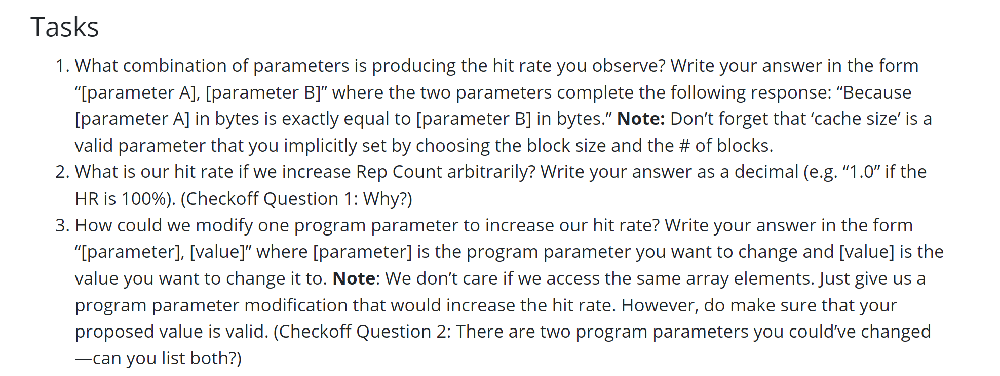

# Hit and Miss Policies
## Cache Hit Policy
> [!important]
> 


## Cache Miss Policy
> [!important]
> 


## Cache Replacement Policy
> [!important]
> 


## Common Questions
> [!question]
> 


# Exercise 1 - Memory Access Scenarios
## Direct Mapped Cache
> [!example]
> 
> 首先计算一下`TIO Breakdown`:
> 1. Block Size = 8 => O = $log_28=3$
> 2. Number of Blocks = 4 + Directed Mapping Cache => I = $log_24=2$
> 3. T = $32-2-3=27$.
> 
> 然后分析`Array`加载情况:
> 1. Array Size = 128 bytes => 4 ints
> 2. Step Size 8 ints => 32 bytes
> 3. Array 起始地址 `a0=0x00000000`, 说明第一次加载时映射到`00`, 第二次加载时也映射到`00`, 两次都是`Write Miss`。
> 
> 
> Task Answers:
> 1. Because the step size in bytes (which is 32) is exactly equal to the cache size		
> 2. No. because the address we access is always mapped to the first block of our cache, and since we choose the direct-mapped cache, there is only one slot in the set, so the cache has to evict its first block constantly which leads to the zero hit rate.
> 3. Change step size to 1 will increase hit rate to 50%


## Set-Associative Cache
> [!example]
> 
> Task Answers:
> 1. There are 2 memory access per iteration of the inner loop
> 2. The pattern is Read Miss(Compulsory), Write Hit, Read Hit, Write Hit
> 3. The hit rate is 75%, which is obvious due to the pattern described in 2.
> 	
> 4. The hit rate keeps going up until nearly 100%, because all the data which will be accessed have been cached, so after the first iteration, all the access will hit.
> 5. We should split the array in equal part whose size is just equal to our  cache size, and then try to access each part of the array at a time and apply all of the function to that part so we can be completely done with it before moving on, thereby keeping that part hot in the cache and not having to circle back to it later on! 


## Multi-level Cache
> [!example]
> 
> **Task Answers:**
> 1. L1_HR = 50%, L2_HR = 0%, Overall_HR = 0.5 + (1 - 0.5) * 0 = 0.5 = 50%
> 2. We have 32 accesses to L1 cache in total. 16 of them are missed.
> 3. We have 16 accesses to L2 cache in total. They are the missed accesses to L1 cache.
> 4. The block size of L2 cache. Increasing the block size of L2 will increase L2_HR.
> 5. (1) it has no effect on the L1_HR and L2_HR when we increase the number of blocks in L1. (2) the L1_HR will increase when we increase the block size of L1 cache, but the L2_HR will not be affected.


# Exercise 2 - Loop Ordering and Matrix Multiplication
> [!important]
> 

> [!example] Code Experiments
> 

> [!problem] Tasks
> 
> 1. jki performs best 
> 2. ikj performs worst
> 3. More stride in the innermost loop, the worse it is.


# Exercise 3 - Cache Blocking and Matrix Transposition
## Matrix Transposition
> [!note] Example
> 


## Cache Blocking
> [!important]
> 


## Task
> [!note] Task
> 

> [!hint]
> 

## Code Solution
### Naive Implementations
> [!example] Codes
> 
```c
/* The naive transpose function as a reference. */

void transpose_naive(int n, int blocksize, int *dst, int *src) {

for (int x = 0; x < n; x++) {

for (int y = 0; y < n; y++) {

dst[y + x * n] = src[x + y * n];

}

}

}
```

### Cache Blocking Optimization
> [!example] Codes
```c
/* The helper function for checking boundaries */
int checkWithinBound(int n, int x, int y) {
    if (x >= n || y >= n || x < 0 || y < 0) {
        return 0;
    }
    return 1;
}


/* Implement cache blocking below. You should NOT assume that n is a
 * multiple of the block size. */
void transpose_blocking(int n, int blocksize, int *dst, int *src) {
    // YOUR CODE HERE
    int exact_group_num = n / blocksize;
    int* dst_;
    int* src_;
    for (int i = 0; i < exact_group_num + 1; i++) {
        for (int j = 0; j < exact_group_num + 1; j++) {
            // Offset Within A Block
            for (int x = 0; x < blocksize; x++) {
                for (int y = 0; y < blocksize; y++) {
                    dst_ = dst + (i * blocksize + x) * n + j * blocksize + y; 
                    src_ = src + (j * blocksize + y) * n + i * blocksize + x;
                    if (checkWithinBound(n, (i * blocksize + x), j * blocksize + y) == 1
                    && checkWithinBound(n, (j * blocksize + y), i * blocksize + x) == 1) {
                        *src_ = *dst_;
                    }
                }
            }         
        }
    }
}
```


### Experiments
#### Matrix Size
| Blocksize | Matrixsize | Naive Algorithm(ms) | Cache Blocking(ms) |     |
| --------- | ---------- | ------------------- | ------------------ | --- |
| 20        | 100        | 0.005               | 0.015              |     |
| 20        | 1000       | 0.663               | 0.752              |     |
| 20        | 2000       | 12.305              | 2.678              |     |
|   20        |5000            |        136.961             |28.294                    |     |
|     20      |  10000          |  700.047                   | 88.891                   |     |
> We see that from n = 2000, the Cache Blocking starts to take effect.

### Block Size
| Blocksize | Matrixsize | Naive Algorithm(ms) | Cache Blocking(ms) |     |
| --------- | ---------- | ------------------- | ------------------ | --- |
| 50        | 10000      | 708.665             | 75.354             |     |
| 100       | 10000      | 674.14              | 132.48             |     |
| 500       | 10000      | 683.872             | 97.499             |     |
| 1000      | 10000      | 704.229             | 132.323            |     |
| 5000      | 10000      | 682.296             | 496.285            |     |
> We see that as the block size increases, the performance of our cache blocking algorithm becomes worse while the performance of our naive algorithm doesn't change, since its implementation doesn't vary with blocksize.
> The performace is maximized when the blocksize parameter match up with the actual block size of the cache.


