# Operating System Concepts
## Supervisor Mode
> 

## Syscalls
> 

## Interrupts&Exception
> 

## Forking
> 

**Solution**

## Concept Check
> 

# Physical Memory and Storage
## CPU I/O Gap
> 

## Volatile Memory - RAM
> 
> **Two Types:**
> 1. **Static RAM(SRAM): **Used for cache, faster than DRAM
> 2. **Dynamic RAM(DRAM):** Used for main memory/ frame buffers.
> 

### SRAM(Bistable)
> 
> **SRAM:**
> 1. Store bits as bi-state.
> 2. Stable against disturbance of voltage or power.

### DRAM(Volatile)
> 
> **DRAM:**
> 1. Store bits as charges on the capacitor.
> 2. Vulnerable to disturbance of voltage.

## Non-volatile Memories
> 

### Hard Disk
> 

#### Disk Structure
> 

#### Disk Capacity
> 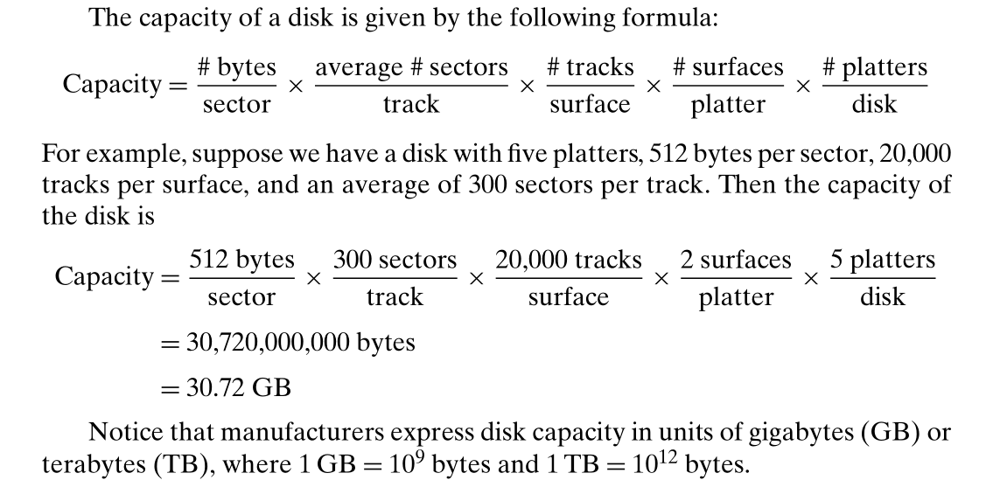

#### Seek Time
> 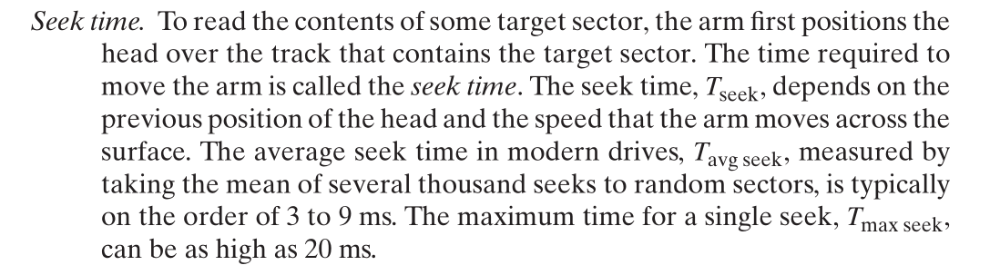
> 就是`Disk Arm Head`移动到目标`Track`的时间，由`Arm`移动速度和硬盘转速决定。

#### Rotational Latency
> 

#### Transfer Time
> 
> 也就是一个划过某个特定的`Track`上的`Sector`需要多少秒。

 
#### Average Time to Access
> 

#### Logical Disk Block
> 

### 

### SSD
#### Definition
> 

#### Performance Metric
> 

#### Practices - P6.5
> 

### Flash Memory
> 

# Virtual Memory Basics
## Virtual&Physical Memory
> 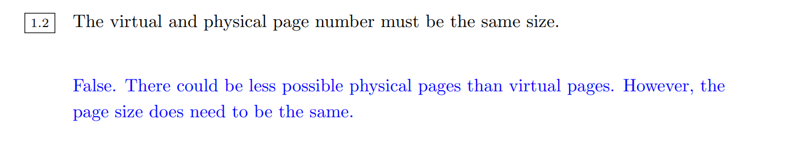

## Address Sapces
> 

## Memory Manager
> 

## Paged Memory
> 
> `offset bits`由`page size`决定，上文中`page size`是$4KiB=2^2\times 2^{10}=2^{12}B$, 所以需要`12 bit`来表示。
> 

## Example Computer
> 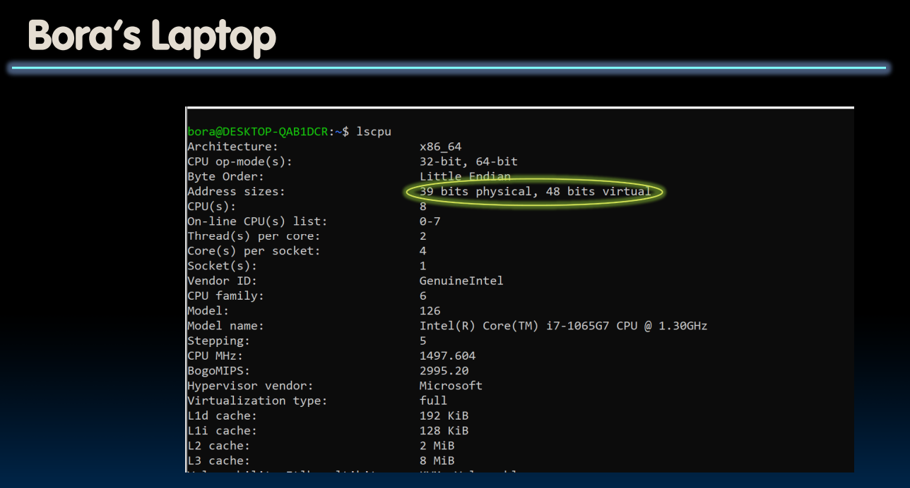

## Summary
> [!concept]
> 

# VM as Caching - Page Table
## Page Table Structure
> 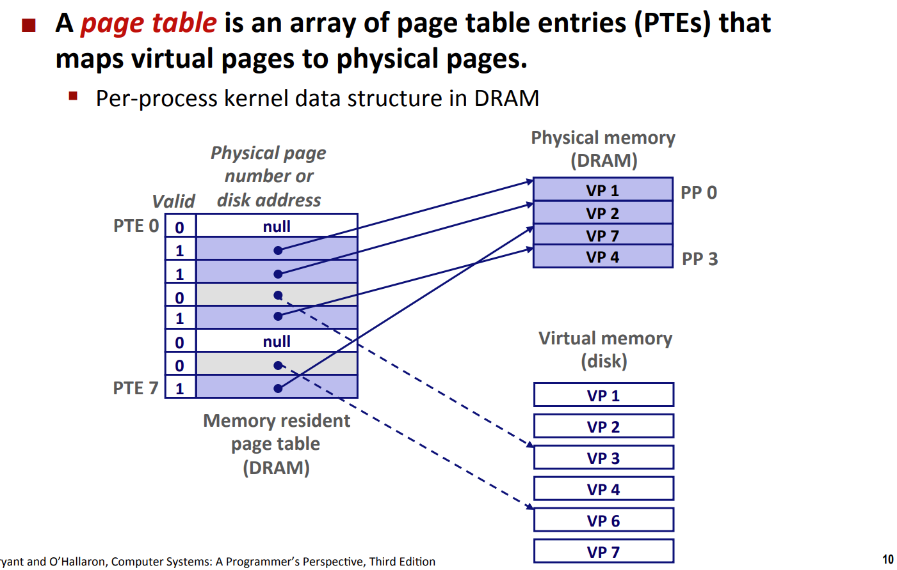
> `Page Table`的每一项储存的是`Physical Memory Address`, 比如`0x02033244`(`32 bit memory`)
> 

## Accessing Pages
### Page Hit
> 

### Page Fault
> 

### Protection Fault
> 

### Handling Page Fault
> 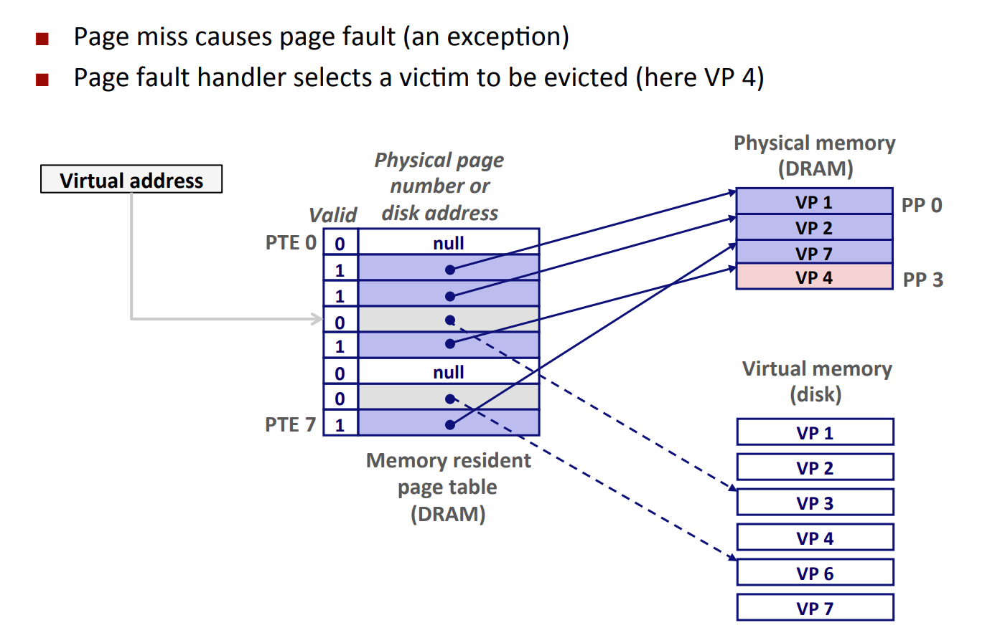

## Allocating Pages
> 

## Page Table Size
> 
> $4\times 2^{20}$**的由来:**
> 1. 首先前文介绍过我们使用`12 bits as offset bits`, `20 bits as VPN bits`。
> 2. 所以`Page Table`会有$2^{20}$个`Entries`，每个`Entry`中储存的是`32 bit Physical address`, 对应的大小是$\frac{32}{8}=4$bytes per entry.
> 3. 所以`Page Table Size`$=4\times 2^{20}B=4-MiB$。
> 
因为每一个进程都享有自己的`Page Table`, 进程数量一多，我们需要在内存中储存的页表数量就越多，所以我们需要有一种设计能够减轻因为进程数量增多导致的页表空间占用过大的问题。
> 

## Hierarchical Page Tables
> 
> 总的来说, `Level i-1 Page Table`points to `Start address of Level i Page Table`, `Level n Page Table`points to the physical memory address.
> 

# VM as Memory Management
## Process Isolation
> 

## Simplifying Linking and Loading
> 

# VM for Memory Protection
## Extended Page Table
> 

# VM Address Translation Procedure
> 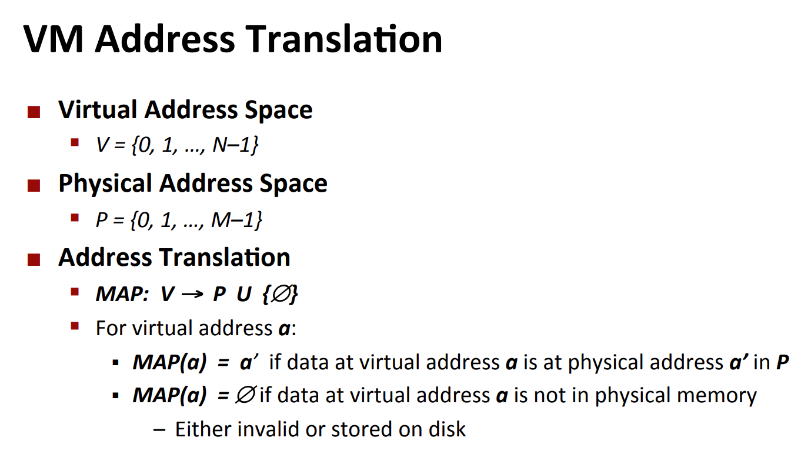

## Address Translation with Page Table
> 

### Page Hit
> 

### Page Fault
> 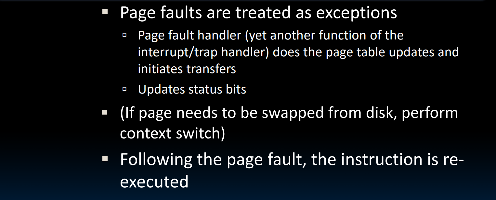

## Translation Lookaside Buffers(TLB)
> 

### TLB Structure
> 

### Accessing TLB
> 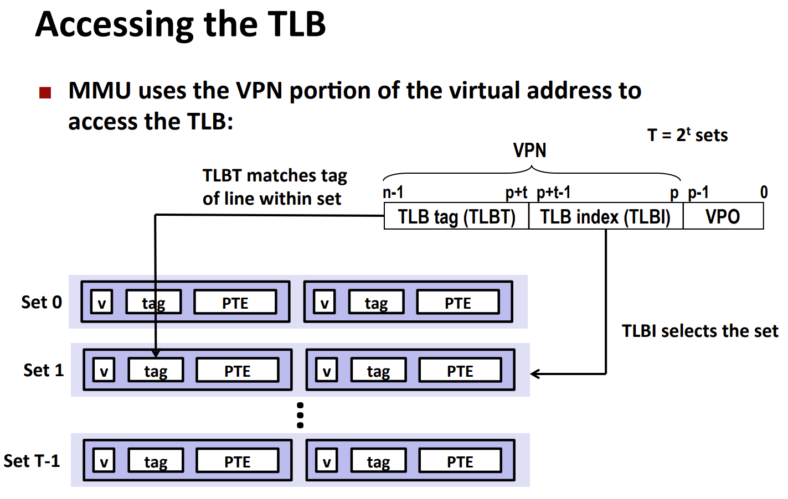

### TLB Hit
> 

### TLB Miss
> 

**Possible Reasons - Locality!**

### TLB in RISC-V DataPath
> 

### TLB Initialization
> 

## Full Address Translation Procedure
> 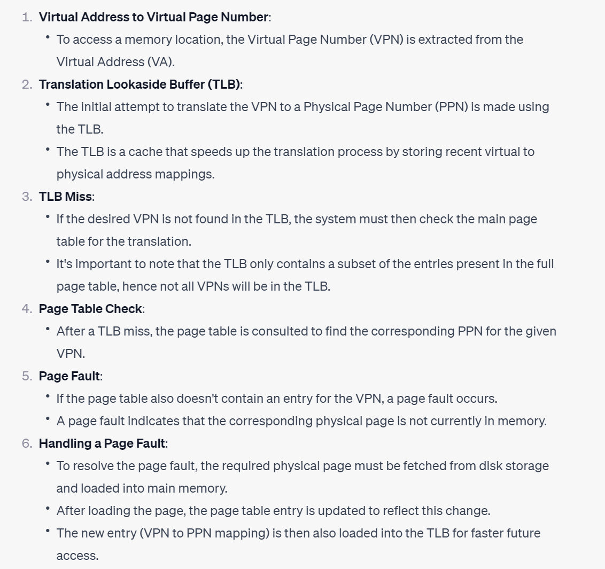

# VM Performance Analysis
## Concept Reviews
> 

## AWAT Analysis
> 

# VM Concept Check
## Benefits of Using Virtual Memory
> 

## TLB Access Pattern
> 
> **总结:**
> 1. 首先计算`Page offset`和`VPN bits`。
> 

> 2. 每次`Read/Write`完之后都需要更新所有的`LRU Bits + 1`
> 3. `Write`操作一般都需要设置`Dirty Bit`为`1`, 因为`TLB`没有和`PTE`同步。

**First Access**
**Second Access - Kick and Create Entry**
**Third Access**
写入`0x20`这一行，需要设置`Dirty bit`为`1`。
**Fourth Access**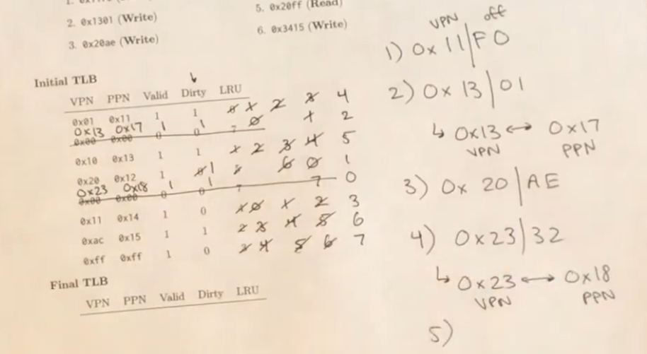
**Fifth Access**
**Sixth Access**
**Final TLB and Review**

# I/O Devices
## I/O Polling(轮询)
### Definition
> 
> 使用一个`bit`来标记`I/O`设备是否允许进行`I/O`操作，处理器不断循环查看这个`bit`的值，如果在某个循环内`bit`**被**`**I/O**`**设备设置**为了`1`, 则表明处理器可以对`I/O`设备进行读写操作。
> **一个形象的类比就是: **我在餐厅点餐，我在拿好号之后一直不断的询问服务员好了没，直到得到肯定的回答。

### Cost of Polling
> 

#### Polling Mouse
> 
> 可以看到在一秒钟的时间内，`Polling Mouse`占用的时钟数不是很多。
> 由于鼠标的点击事件实际上在一秒的尺度内不会发生超过`30`次（除非你使用机械臂），我们的轮询次数不需要太多，一秒钟内$30$次就可以。

#### Polling Hard Disk
> 
> 由于硬盘在读取的过程中会不断的产生数据，所以我们需要经常轮询看看有没有新的数据可供读取。
> 假设一秒钟就有$16MB$的新鲜数据产出。此时如果我们一次轮询接收$16B$的数据，则一秒内需要$1\times 10^6$次轮询，这会导致处理器处理其他任务的时间被严重侵占。

## I/O Interrupts(中断)
> 
> 对于那些不经常发送信号数据的设备(比如鼠标和键盘)来说，操作系统一般使用`Interrupts`而不是`Polling`。

## Concept Check
> 

## RISC-V Code Implementations
> 
> 这里`Control Register`的地址是`0x7ffff`, 然后我们使用`lw`获取这个`register`的值，和`1`作比较，如果`register`的值是`0`则结果为`0`此时不能进行`I/O`读写，再次循环。

**Solution**

# Direct Memory Access(DMA)
## Improvements
> 
> `DMA`使得`I/O`设备和内存设备的交互过程不需要中央处理器的直接接入。处理器只需要在一开始把任务交代给`I/O`设备和内存设备，告诉他们处理器最终需要什么样的数据就行。处理器只需要把任务布置下去即可。完成后由`DMA Controller`打断处理器。总的来说，处理器只需要在任务开始和结束两次询问(下图中的`1`和`5`)数据即可，省下不少时间。
> 

## Procedure Logic
> 

## Where to put DMA?
> 
> `Coherency`: 就是数据不一致的问题。因为`Cache`由`Write-Back`和`Write-Through Policy`所以我们不需要担心`Data Coherency`的问题。

# Bus Structure
## Overview
> 

## Main Memory Read
> 

## Main Memory Write
> 

## I/O Bus
> 

## Disk Read
> 

