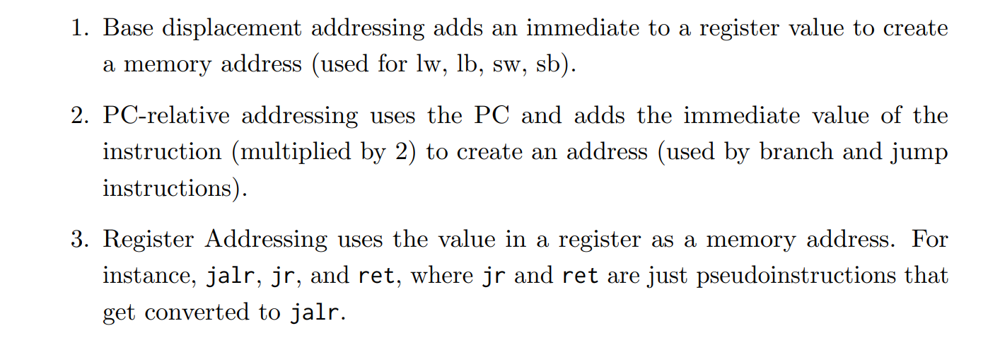

# Overview
> 

# Compiler
> 

# Assembler
## Overview
> 

## Object File Format
> 

## Directives(Split up Files)
> 

## Two-Pass(Translation)
### Procedures
> 

## Solving Relative References
### Symbol Table
> 
> 告诉别的`files`我有什么。

### Relocation Table
> 
> 告知`Linker`我需要什么的地址。

# Linker
## Overview
> 

## Important File Concepts
### Three Kinds of Object Files
> 

### Three Kinds of Symbols
> 

### Three Types of Addressing
> 
> `**1.4**`**的意思是: 在**`**Linker**`**进行**`**Link**`**操作之后：**
> 1. `Absolute Adressing`比如`jal ra func`的`func`就直接是一个地址了，也就是我们直接知道了要跳转到哪里， 运行时就是这个地址。
> 2. `Relative Addressing`比如`bne x0, x1, -24`(这就是`Assembler`给的结果)，但是`Linker`不管这个。换句话说，运行时，上述指令被分配了一个地址，但仅仅凭借这个`instruction`和地址我们是不知道要跳转到哪里的，必须在运行时通过计算`PC-24`得到跳转地址。
> 

### ELF Format
> 

## What Linkers Do?
> 

### Step 1: Symbol Resolution
> 

#### Linker's Symbol Rules
> 

#### Linker's Puzzle
> 

#### Golden Rules on Global Symbols
> 

### Step 2: Relocation
> 

## Solving Absolute References
> 

# Loader
> 

# Integrated Example
## Example 1 - Lecture Slides
> 

## Example 2 - Two Tables
> 

### First Pass
> 
> `0x00061C28`表示就是我们的`Relative Addressing`/`j loop`。
> 

###   Second Pass
> 
> 剩下的`????`就需要交由`Linker`来完成`relocation table`的填充。
> 

## Example 3 - RISC-V Addressing
> 

