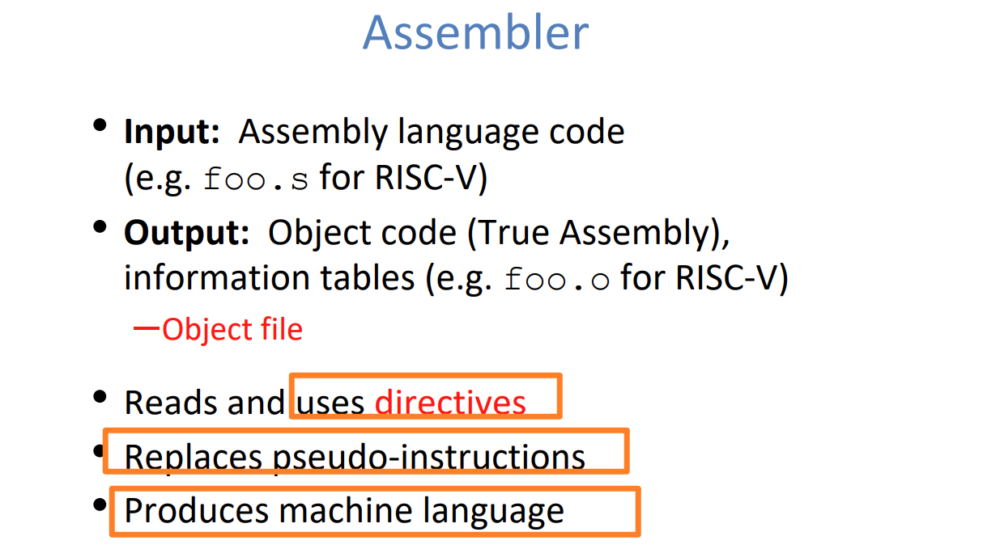

# Overview
> 

# Compiler
> 

# Assembler
## Overview
> 

## Object File Format
> 

## Directives(Split up Files)
> 

## Two-Pass(Translation)
### Procedures
> 

## Solving Relative References
### Symbol Table
> 
> 告诉别的`files`我有什么。

### Relocation Table
> 
> 告知`Linker`我需要什么的地址。

# Linker
## Overview
> 

## Important File Concepts
### Three Kinds of Object Files
> 

### Three Kinds of Symbols
> [!info]
> 

> [!tip]+
> 总的来说，对于一个程序而言，变量可以这样记忆:
>  定义在`Scope`里面的(函数或者循环体)都是`Local Variables`，这些变量都不是`Linker Symbols`。`Local Variables`分为两类:
>  - `non-static local variable`, 定义在`scope`中，程序运行时将其分配在栈内存或者寄存器上。函数调用完毕后释放，生命周期仅限其`defining scope`。
> -  `static local variable`, 定义在`scope`中，但是前面有`static`关键字，程序编译时将其分配在`.data/.bss`中。生命周期是整个程序，但是修改权限仅限`defining scope`。
>  
>  
>  
>  定义在全局的(不在函数或者循环体内的)，这些变量都是`Linker Symbols`, 分为三类:
> -  `Global Symbols`: `non-static global variables`, 类似于`Java`中的`public`, 所有`Modules`都能访问到，遵循`Linker Reference Rules`。
> -  `External Symbols`: 就是不在本文件中，但是在其他文件中定义的`Global Symbols`, 可以被本文件访问到。
> - `Local Linker Symbols`: `static global variables`, 类似于`Java`中的`default`关键字，只有同包的能访问。
> 

### Three Types of Addressing
> [!info]
> 
> 
> `1.4`**的意思是: 在**`Linker`**进行**`Link`**操作之后：**
> 1. `Absolute Adressing`比如`jal ra func`的`func`就直接是一个地址了，也就是我们直接知道了要跳转到哪里， 运行时就是这个地址。
> 2. `Relative Addressing`比如`bne x0, x1, -24`(这就是`Assembler`给的结果)，但是`Linker`不管这个。换句话说，运行时，上述指令被分配了一个地址，但仅仅凭借这个`instruction`和地址我们是不知道要跳转到哪里的，必须在运行时通过计算`PC-24`得到跳转地址。
>

### ELF Format
> [!info]
> 
> 
> 

## What Linkers Do?
> [!info]
> 

### Step 1: Symbol Resolution
> [!info]
> 

#### Linker's Symbol Rules
> [!info]
> 
> **总结一下：**
> 1. 在多个文件中定义相同名称的函数，会导致`Linker Error`。
> 2. 有强则强。
> 3. 无强则选一个弱。

****

#### Example 1
> [!note]
> 
> **总结一下:**
> 1. 第一个例子中，有两个`Strong Symbols`, 所以触发`Linker Error`
> 2. 第二个例子中，`x` 有两个`Weak Symbols`, 所以`Linker` 会任意选择一个。
> 3. 第三个例子中，`x` 有两个`Weak Symbols`, 所以`Linker`会任意选择一个。但是如果`Linker`选择了`double x`作为`Reference Symbol`, 那么如果`p2()`中有修改`x`的代码的话，修改的实际上是`8 bytes`的内存区域，也就是说会覆盖`int y`所在的位置。
> 4. 第四个例子中，`Linker`会选择`int x=7`, 所以不会有问题。上面写错了
> 5. 最后一个例子中，`Linker`会选择`int x= 7`导致`p2`函数的逻辑被改变，因为`p2`认为`x`应该是未初始化的。

#### Example 2
> [!question]
> 

> [!answer]-
> 

#### Golden Rules on Global Symbols
> [!info]
> 
> 

### Step 2: Relocation
> [!Note]
> 
>
>
> 

#### Relocation Entries
> [!info]
> 

#### Solving Absolute References
> 

## Why Linking?
### Packaging
> 

### Static Libraries
> 

### Shared Libraies
#### Definition
> 

#### Dynamic Linking at Load-Time
> 

#### Dynamic Linking at Run-time
> 通过`dlopen()`函数实现在程序执行期间进行`Linking`操作。
> 

# Loader
## Overview
> 
> 下图展示了程序加载到内存的过程。
> 

# Library Interpositioning
## Overview
> 

## Compile-Time Interpositioning
> 
> Compile-Time Interpositioning requires knowing program's source file.

## Link-Time Interpositioning
> Link-time interpositioning requires knowing program's object file.

## Run-Time Interpositioning
> 
> 这种方法仅要求我们知道Program File's ELF(Executable File Format)

# Integrated Example
## Example 1 - Lecture Slides
> 

## Example 2 - Two Tables
> 

### First Pass
> 
> `0x00061C28`表示就是我们的`Relative Addressing`/`j loop`。
> 

###   Second Pass
> 
> 剩下的`????`就需要交由`Linker`来完成`relocation table`的填充。
> 

## Example 3 - RISC-V Addressing
> 

## Example 4 - Library Interpositioning
> 

