# Exceptions
## Definition
> [!Definition]
> An exception is an `abrupt change in the control flow in response to some change in the processor’s state`.
> 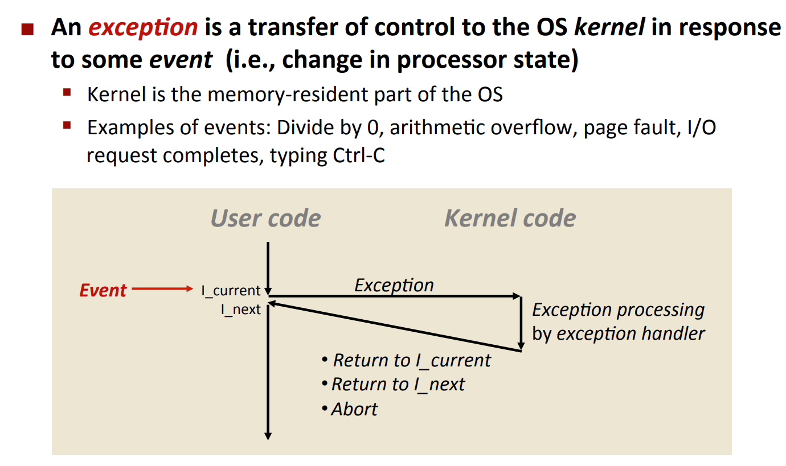
> 

## Exception Table
> [!info]
> **Each type of possible exception** in a system is assigned a *unique nonnegative integer exception number*. Some of these numbers are assigned by the designers of the processor. Other numbers are assigned by the designers of the operating system kernel (the memory-resident part of the operating system). 
> Examples of the former includes:
> - Divide by zero, 
> - Page faults, 
> - Memory access violations, 
> - Break- points,
> - Arithmetic overflows. 
> 
> Examples of the latter include:
> - System calls.
> - Signals from external I/O devices.
> 
> 下面的`Exception Table`在电脑开机时由操作系统设置并初始化，表中的每一项都是`Exception Handler`的地址。
>
> 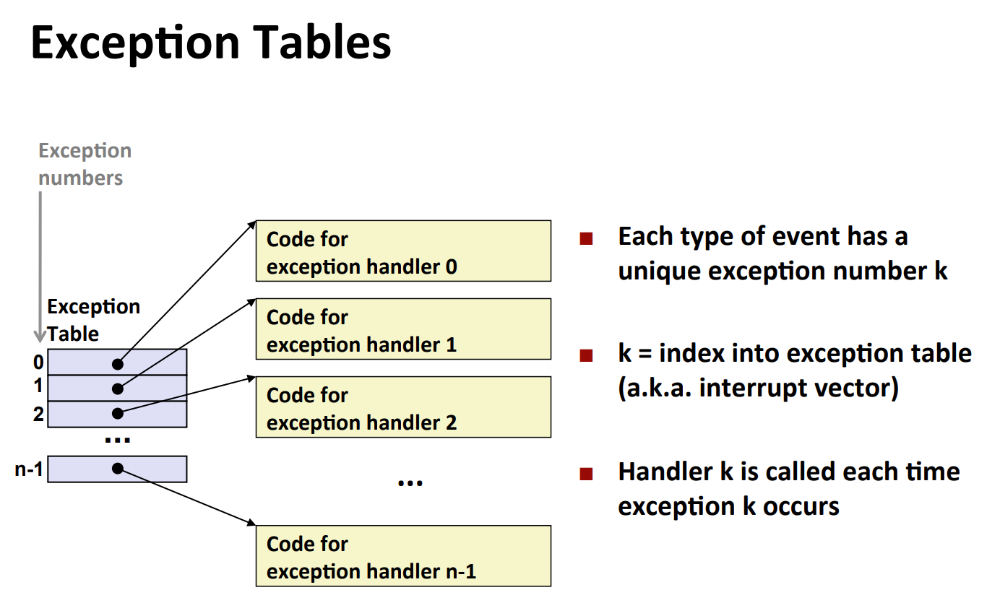
> 在程序运行时，如果`Processor`检测到其`Processor State`发生改变了，即某些事件发生了，则他会先决定这个`Exception Number k`, 然后结合`Exception Table`的`Base Register`(表格的起始地址)求出我们具体要调用的那一个`Exception Handler`的地址，然后跳转进入内核态。


# Classes of Exceptions
> [!info]
> 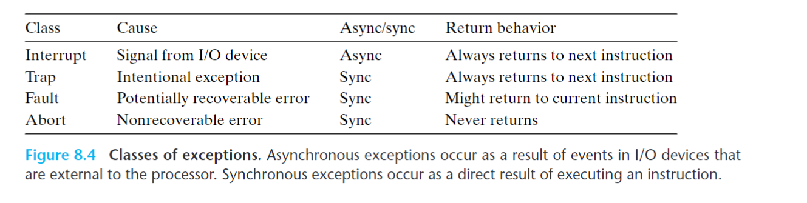
> Exception 和 Procedure Call 的逻辑很类似，都是调用一个例程，但是有一些重要的区别:
> - 在调用异常之前的准备工作，比如将返回地址压入栈内存中，是一致的。只是取决于异常的类别，在异常程序执行完毕后，我们有可能返回到当前指令（比如`Fault`）, 也有可能返回到下一条指令，比如`Traps, I/O Interrupts`等。也有可能永远不返回而直接停止程序。但是`Procedure Call`永远会返回到下一条指令。
> - 处理器会往栈上放入一些额外的数据以保证我们从`Exception Handler`返回到用户程序时候顺利地从之前中断的地方开始继续执行指令。
> - `Exception Handler`全程运行在内核态。


## Asychronous Exceptions
> [!Definition]
> `Asychronous` 意味着`Exception`的触发不是由处理器显式地执行某条指令导致的。换句话说，是`I/O`设备读取数据完毕并告知`CPU`的时候改变`Processor State(Interrupt Pin)`而触发。最常见的`Asychronous Exception`就是`Interrupts`。下图中展示了`Interrupt`的全过程:
> - 在当前指令$I_{curr}$ 执行的过程中，`Interrupt Pin`被某个`I/O` 设备设置成了`1` (高电压)。
> - 当前指令执行完毕之后，处理器注意到自己的`Processor State`被修改了，于是知道有事件被触发了，于是从`System Bus`上读取到`Exception Number`并查表调用对应的`Exception Handler`进入内核态。
> - 执行完后返回到$I_{next}$ 继续执行剩下的指令，就好像`Interrupt`从外发生过一样。
>
> 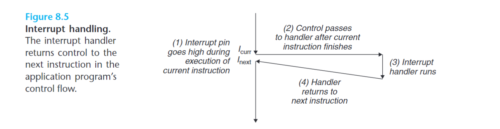
> 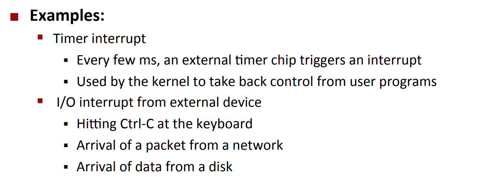


## Synchronous Exceptions
> [!Definition]
> 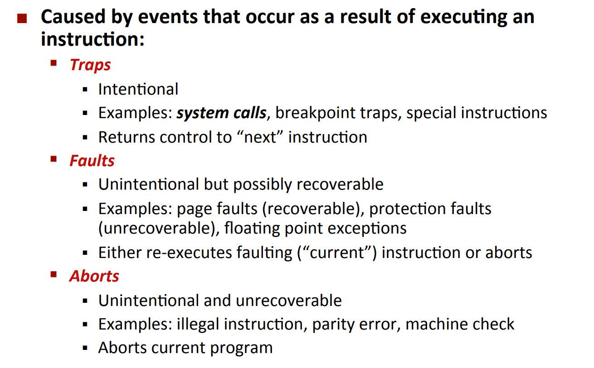


### Traps
> [!info]
> User programs often need to `request services from the kernel` such as:
> 1. Reading a file (**fread**)
> 2. Creating a new process (**fork**)
> 3. Loading a new program (**execve**) 
> 4. Terminating the current process (**exit**). 
> 
> To allow controlled access to such kernel services, processors provide a special `syscall n` instruction that user programs can execute when they want to request service n. Executing the syscall instruction causes a trap to an exception handler that decodes the argument and calls the appropriate kernel routine. 
> 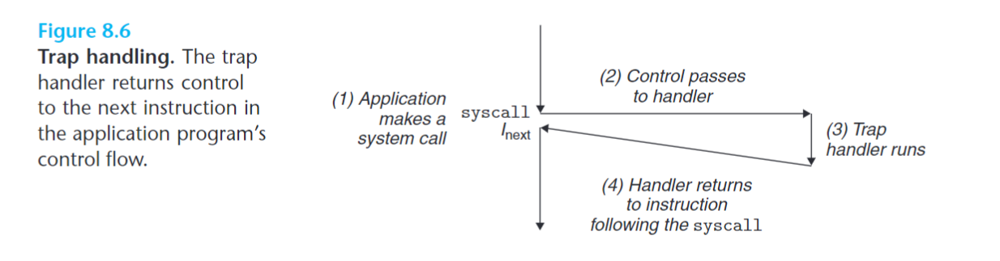

> [!Attention]
> From a programmer’s perspective, a system call is identical to a regular function call. However, their implementations are quite different. 
> - Regular functions run in `user mode`, which restricts the types of instructions they can execute, and they access the same stack as the calling function. 
> - A system [call](CALL.md) runs in `kernel mode`, which allows it to execute privileged instructions and access a stack defined in the kernel. 


### Faults
> [!info]
> Faults result from `error conditions that a handler might be able to correct`. When a fault occurs, the processor transfers control to the fault handler. 
> - If the handler can correct the error condition, it returns control to the faulting instruction, `re-executing` it. 
> - Otherwise, the handler returns to an abort routine in the kernel that `terminates the application program` that caused the fault. 
> 
> 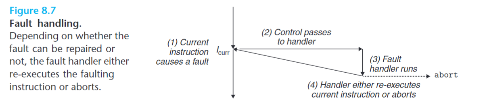


### Aborts
> [!info]
> Aborts result from `unrecoverable fatal errors`, typically hardware errors such as parity errors that occur when DRAM or SRAM bits are corrupted. 
> Abort handlers `never return control to the application program`.


# Exceptions in Linux X86-64 
## Linux Faults/Aborts
> 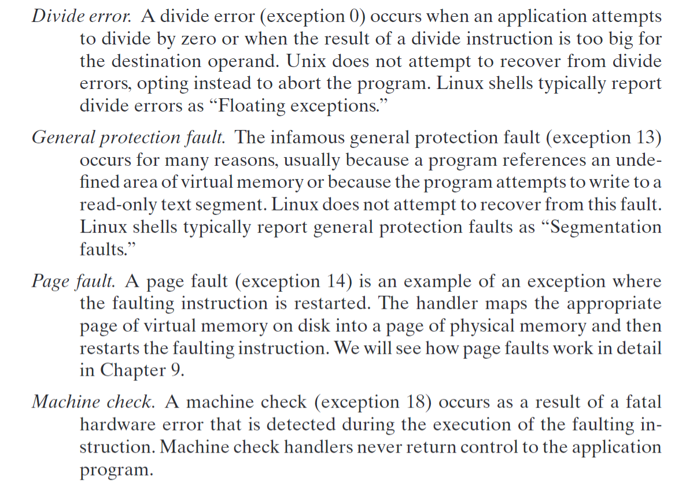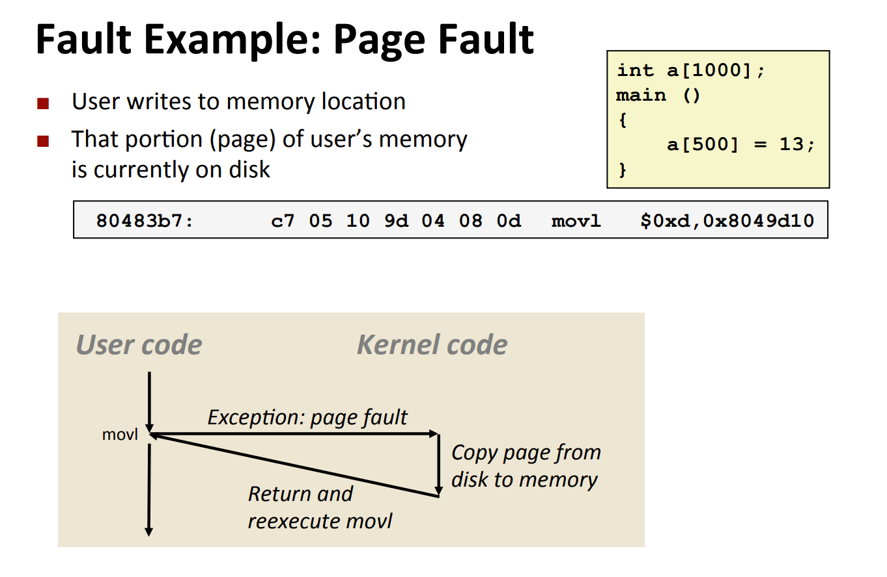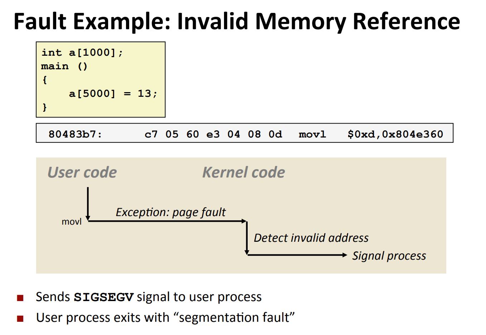


## Linux System Calls
> 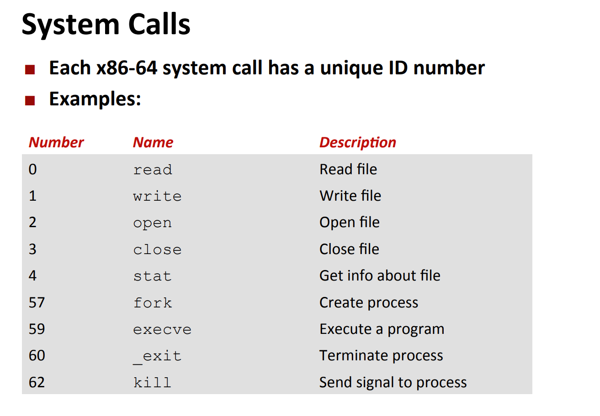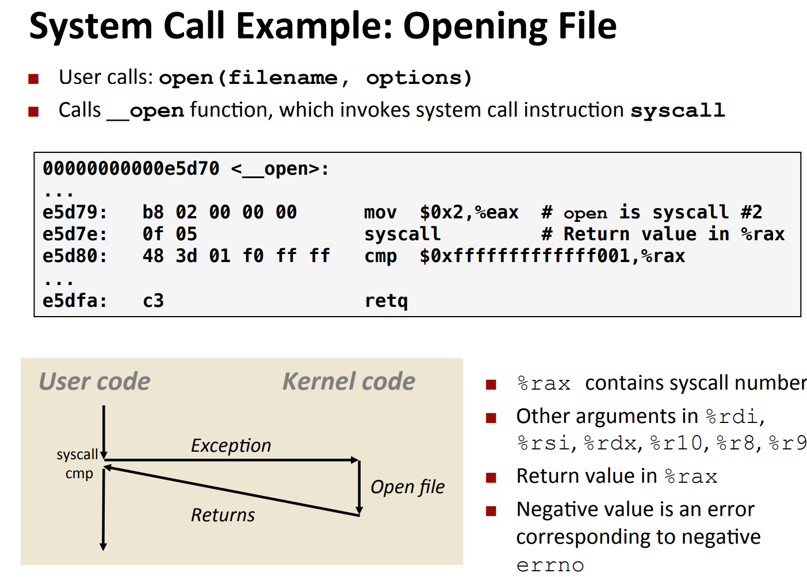


# Process
## Overview
> [!Definition]
> 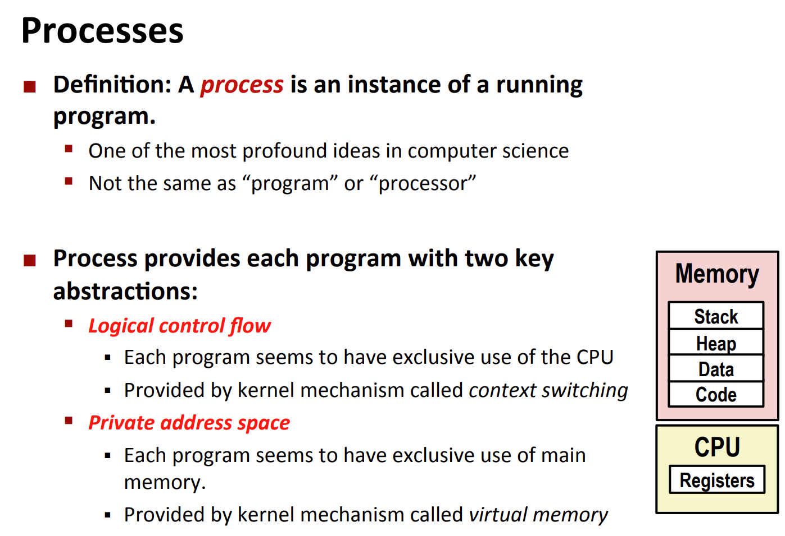


## Physical Control Flow
> [!info]
> - `Physical Control Flow` refers to the actual sequence in which instructions are executed by the hardware, especially in modern processors. 这些指令集可能来自多个`Processes`，互相交错。
> - Due to optimizations like **pipelining, out-of-order execution, and branch prediction**, the physical order in which instructions are executed can differ significantly from the logical order. 
> - These optimizations are done to improve the **throughput and performance** of the processor. For instance, while waiting for data from memory (which can be relatively slow), a modern CPU might execute other independent instructions that come later in the logical sequence.
> - <span style="background:#fff88f">The CPU ensures that, despite the changes in the order of execution, the final outcomes (values in memory and registers) are as if the instructions were executed in the logical order.</span>


## Logic Control Flow
> [!def]
> `Logic Flow`是针对某个`Process`而言的，可以理解成逻辑上畅通的一段代码翻译成的指令集。
> 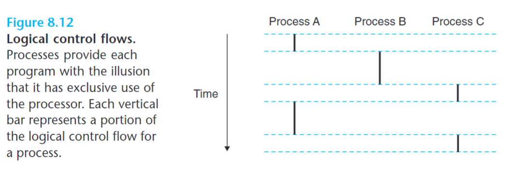
> 上图中的`Logic Control Flow`就是每个`Process`各自的指令集按照时间轴方向排列的结果。将这些短小的黑线平移到一起后就组成了`Physical Control Flow`，也就是`CPU` 实际上的指令执行顺序。
> 上图中还反映出了一个现象，就是`CPU`总是会在不同的`Process`之间来回快速切换，一会儿执行`Process A`的`Logic Flow`, 一会执行`Process B`的`Logic Flow`， 但是`CPU`会保证最终多个`Process`的运行结果和`CPU`只顺序执行一个`Process`的结果完全一致。


## Concurrent/Parallel Flow
> [!def]
> 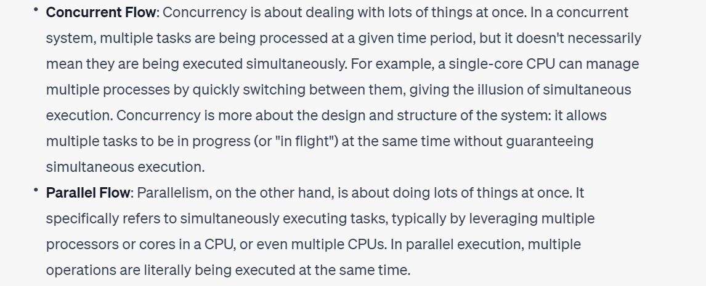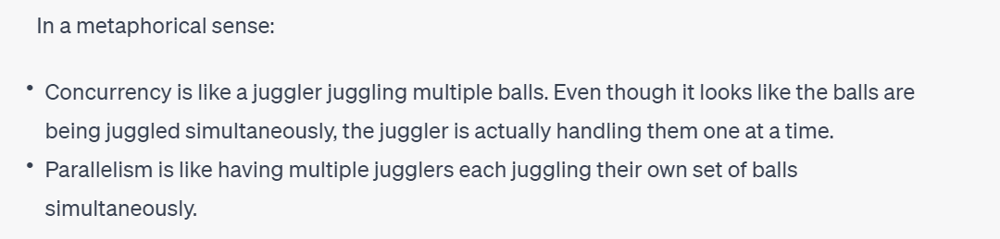
> - `Concurrency`是并发的意思，表示处理器来回切换任务，宏观上看好像是在同时进行很多任务一样。也成为`Multitasking`。
> - `Parallelism`是并行的意思，表示有多个处理器在同时进行任务，是真正的多任务处理。

> [!example]
> 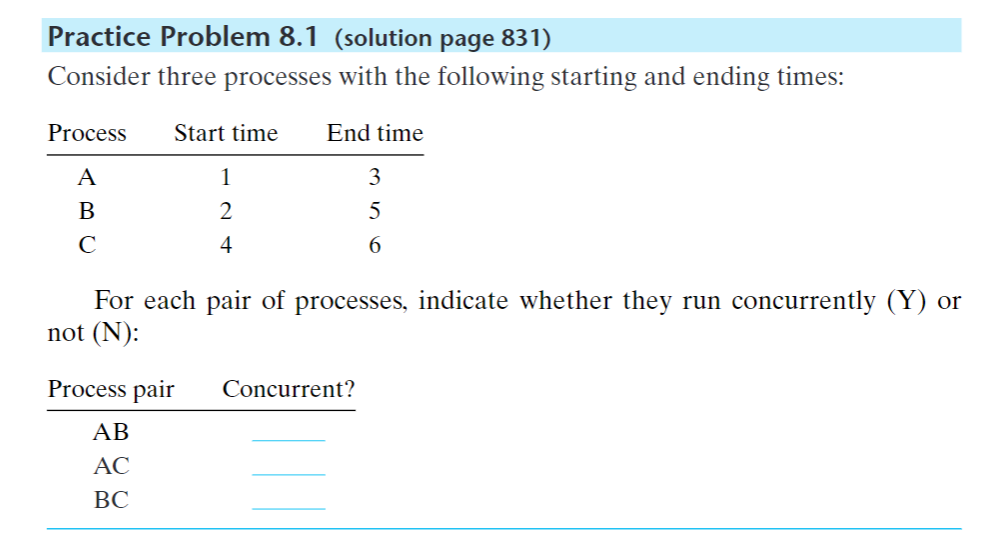
> 判断两个进程是否并发运行，只需要观察他们的`Logic Control Flow`是否有重叠，上图中:
> 1. A和B有重叠，并发运行
> 2. B和C有重叠，并发运行
> 3. A和C无重叠，顺序执行


## User and Kernel Mode
> [!def]
> Processors typically provide this capability with a `mode bit` in some `control register` that characterizes the privileges that the process currently enjoys. 
> - **When the mode bit is set**, the process is running in kernel mode (sometimes called supervisor mode). A process running in kernel mode can execute any instruction in the instruction set and access any memory location in the system.
> - **When the mode bit is not set**, the process is running in user mode. A process in user mode is not allowed to execute privileged instructions that do things such as halt the processor, change the mode bit, or initiate an I/O operation. Nor is it allowed to directly reference code or data in the kernel area of the address space. Any such attempt results in a fatal protection fault. User programs must instead access kernel code and data indirectly via the system call interface. 
> - **A process running application code is initially in user mode**. The only way for the process to change from user mode to kernel mode is via an exception such as an interrupt, a fault, or a trapping system call. 
> - **When the exception occurs**, and control passes to the exception handler, the processor changes the mode from user mode to kernel mode. `The handler runs in kernel mode`. When it returns to the application code, the processor changes the mode from kernel mode back to user mode.

> [!example]
> - Linux provides a clever mechanism, called the /proc filesystem, that allows user mode processes to access the contents of kernel data structures. 
> - The /proc filesystem exports the contents of many kernel data structures as a hierarchy of text files that can be read by user programs. 
> - For example, you can use the /proc filesys- tem to find out general system attributes such as CPU type (/proc/cpuinfo), or the memory segments used by a particular process (/proc/process-id/maps). The 2.6 version of the Linux kernel introduced a /sys filesystem, which exports addi- tional low-level information about system buses and devices.


## Private Address Space
> [!def]
> 对于每一个进程来说，他们都有自己的私有地址范围`0x00000000~0xffffffff`, 有自己的栈内存，堆内存，`Code`区，`Data`区，以及各种寄存器。但是注意，这些私有地址和寄存器看起来是`Exclusive Access`, 实际上是由操作系统调度完成，为每个进程分配内存和寄存器。让进程感觉自己坐拥着所有程序执行所需的内存和处理器资源。
> 下图展示了这一点。
> 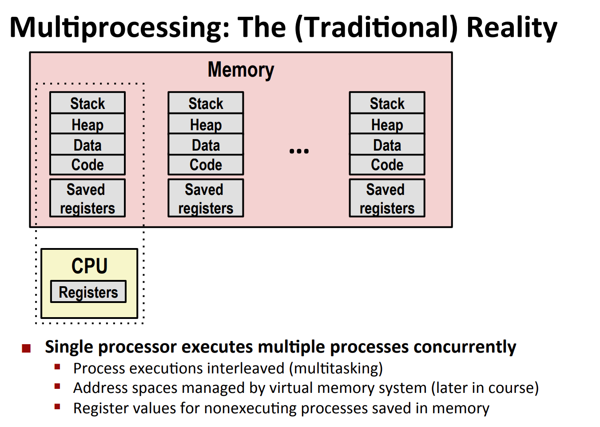


## Context Switches
> [!def]
> 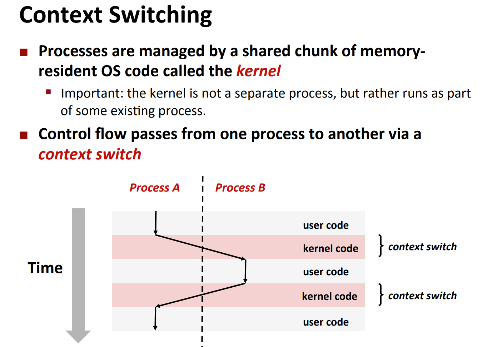
> 在`Context Switching` 的过程中，`Process A`的所有用于确定程序运行状态(确保程序能从中断的位置继续执行)的资源都会被保存起来，包括内存资源，寄存器上的值。然后`Processor`进入`Kernel Mode`进行`Context Switching from Process A to Process B`，切换好之后`Processor`进入用户模式执行`Process B`。


# Process Control
> 本章节非常重要，涉及到进程控制的诸多概念。

## Obtaining Process ID
```ad-code
在操作系统中，每个进程都有自己的独一无二的`ID`, 称为`Processor ID`(PID)，我们可以通过`getpid()`获取调用这个函数的进程，通过`getppid()`获取调用这个进程的进程，也就是父进程。
```
```c 
#include <sys/types.h> 
#include <unistd.h> 
pid_t getpid(void); 
pid_t getppid(void);
```


## Creating and Terminating Process
### Process State(Simplified)
> [!def]
> 简单来说，进程有三种状态：
> 1. `Running`: 表示进程正在占用`CPU`资源，或者以已经被操作系统调度放入执行队列中等待被执行。
> 2. `Stopped`: 表示某个进程收到了一些信号，比如`SIGSTOP`, `SIGTSTP`,`SIGTTIN`,`SIGTTOU` 等信号导致这些进程暂时不会被加入任务队列，不会被操作系统调度，知道收到`SIGCONT`才会被调度。
> 	1. `SIGSTOP`: 用于将一个进程暂停，暂时不被调度。可由用户或者操作系统发送。
> 	2. `SIGTSTP`: 用于将一个进程暂停，暂时不被调度。可由用户或者操作系统发送。不同于`SIGSTOP`, 后者可以通过用户的键盘事件诸如`CRTL+Z`触发。
> 	3. `SIGNTTIN`: 用于将一个试图从`Terminal`读取数据的`Background Process`暂停，一般只由操作系统设置, 目的是保证只有`Foreground Process`能和`Terminal`交互。
> 	4. `SIGNTTOU`: 用于将一个试图写入`Terminal`的`Background Process`暂停，一般只由操作系统设置，目的是保证只有`Foreground Process`能和`Terminal`交互。
> 3. `Terminated`: 用于将一个进程永久停止，以后也不会被调度。一般出于三种原因。(1) 收到了一个信号，这个信号的默认行为是将进程永久停止。(2) 主程序将所有代码执行完毕了。（3) 程序显式地调用了`exit()`函数。


### Creating Process - Fork
> [!code]
> 创建一个进程很简单，我们只要调用`fork()`函数即可。这个函数往往在父进程中被调用，但是却有两个返回值，且在父进程和子进程中返回的值是不同的，分为几种情况。
> 1. 在父进程中返回值小于零，表明`CPU`开启子进程失败，不会创建新的进程。
> 2. 如果开启成功，则在父进程中返回子进程的`pid`，是一个大于零的值。在子进程中返回`0`。这种特性使得我们可以在不同的进程中执行不同的逻辑。
> 下面是我们开启新进程的方法，这里我们处理了子进程无法开启的潜在的异常。
```c
pid_t Fork(void) {
	pid_t pid;
	if ((pid = fork()) < 0) 
		unix_error("Fork error"); 
	return pid;
}
```
> [!important]
> 子进程一旦开启，就和父进程并发执行。同时：
> 1. 子进程会复制父进程的`address space`，具体表现为父进程中定义的变量子进程中有自己的一份拷贝。但注意是拷贝而不是引用。这表明父子进程在修改相同名称的变量时只会修改各自地址空间中的值，也就是说代码里面我们写的是`int x = 10`, 那么父子进程就各自拷贝了一个`int x = 10`, 父子进程对`x`的任意修改都不会影响彼此的地址空间。即`Any modifications made by one process do not affect the value seen by the other process.`。
> 2. 子进程和和父进程共享所有的文件描述符。比如在父进程中使用`printf`打开了`stdout`, 那么在子进程中也可以将数据流输出到这个文件描述符中。
```c
#include <stdio.h>
#include <unistd.h>

int main() {
    int sharedVariable = 10;
    int pid = fork();

    if (pid == 0) {
        // Child process
        sharedVariable += 5; // Child修改对Parent不可见
        printf("Child Process - Shared Variable: %d\n", sharedVariable);
    } else if (pid > 0) {
        // Parent process
        sharedVariable -= 5; // Parent修改对Child不可见
        printf("Parent Process - Shared Variable: %d\n", sharedVariable);
    } else {
        // Fork failed
        fprintf(stderr, "Fork failed\n");
        return 1;
    }

    return 0;
}
```


### Terminating Process - exit
> [!code]
> 结束一个进程很简单，我们只需要显式地调用`exit()`函数即可。The argument passed to `exit()` determines the exit status of the program.
> - `exit(0)`: This indicates a **successful termination** of the program. It is conventionally used to indicate that the program executed without any errors or issues.
> - `exit(1)`: This indicates an **unsuccessful termination** of the program. It is conventionally used to indicate that the program encountered some kind of **error** or issue during execution.
> - `exit(2)`: This indicates a termination of the program due to a command line syntax error. It is conventionally used to indicate that the program was **nivoked with incorrect command line arguments.**
> 
> The exit status values **can be used by other programs or scripts that invoke the program to determine the outcome of its execution.**
```c
#include <stdlib.h>

int main() {
    // Code before termination

    exit(0);  // Terminate the process with exit code 0

    // Code after termination (will not be executed)
}
```


## Process Graph
> [!def]
> - When you are first learning about the fork function, it is often helpful to sketch the process graph, which is a simple kind of precedence graph that captures the partial ordering of program statements.
> - Each vertex a corresponds to the execution of a program statement. A directed edge a → b denotes that statement a “happens before” statement b. 
> - Edges can be labeled with information such as the current value of a variable. Vertices corresponding to printf statements can be labeled with the output of the printf. 
> - Each graph begins with a vertex that corresponds to the parent process calling main. This vertex has no inedges and exactly one outedge. The sequence of vertices for each process ends with a vertex corresponding to a call to exit. This vertex has one inedge and no outedges.

> [!example] Example 1
> 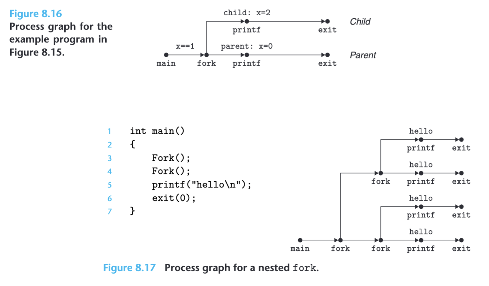

> [!example] Example 2
> 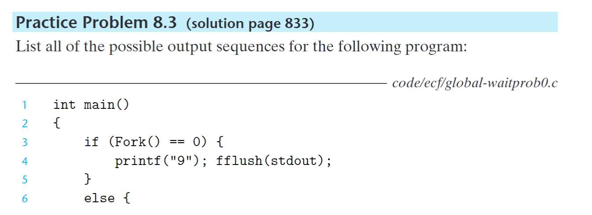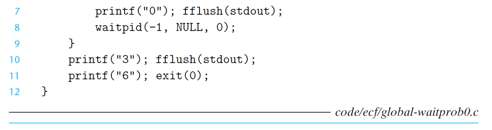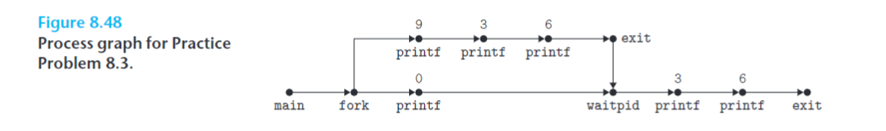
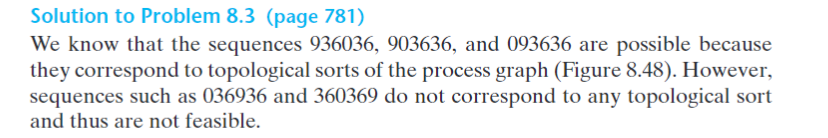


> [!example] Example 3
> 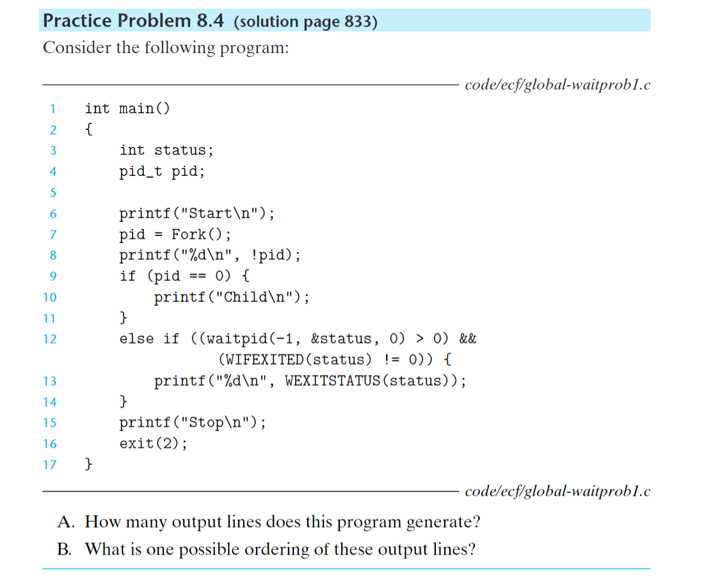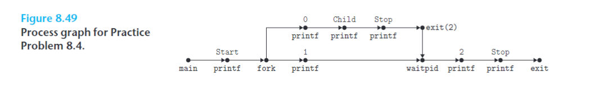
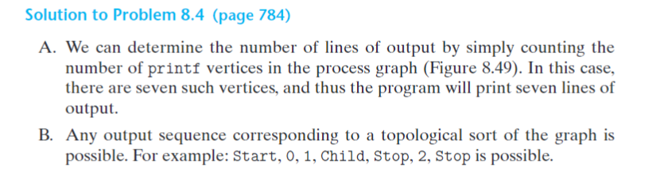


## Reaping Child Processes
### Reaping Definition
> [!def]
> The process of reaping child processes is a mechanism in UNIX-like operating systems that allows a parent process to collect the exit status of its terminated child processes, ensuring proper system resource cleanup. When a child process terminates, it doesn't disappear entirely. Instead, it becomes a "zombie" process until its parent collects its exit status. 
> **The act of collecting this exit status is called "reaping."** 
> When we say "collecting its exit status," we're referring to the process by which a parent process retrieves the final exit information from a terminated child process. This exit information typically includes an exit code (an integer value) indicating how the child process finished using macro functions like `WIFEXITED()`

### Zombie Process
> [!important] 
> 当一个进程因为某些原因进入了`Terminated`状态，操作系统并不会马上将其占用的所有资源都释放掉，此时这些进程不能被调度，但又占用着内存空间，称为`Zombie Process`。操作系统会先等待创建这些进程的父进程的`Reaping`行为，也就是先等着看看父进程会不会着手释放掉这些僵尸进程。
> 如果直到父进程被`Terminated`了都没有`Reaping`子进程，则操作系统中的`init`进程(`pid=1`, 在操作系统启动伊始就一直运行直到关机)就会着手将这些僵尸进程释放掉(通过主动成为这些僵尸进程的`Parent`进程的方式)。
> 我们一般通过`waitpid()`函数来实现`Reaping`操作。


### Use waitpid() to reap
#### Property of waitpid()
> [!info]
> The `waitpid()` function is used to **wait for a specific child process to change its state**. It provides various options to control the behavior of the wait operation. 
> - `pid`设置为大于零的数, 则父进程只会等待`pid`所指的子进程的状态发生变化。
> - `pid`设置为-1，则会等待所有子进程直到其中有一个子进程的状态发生变化。
> 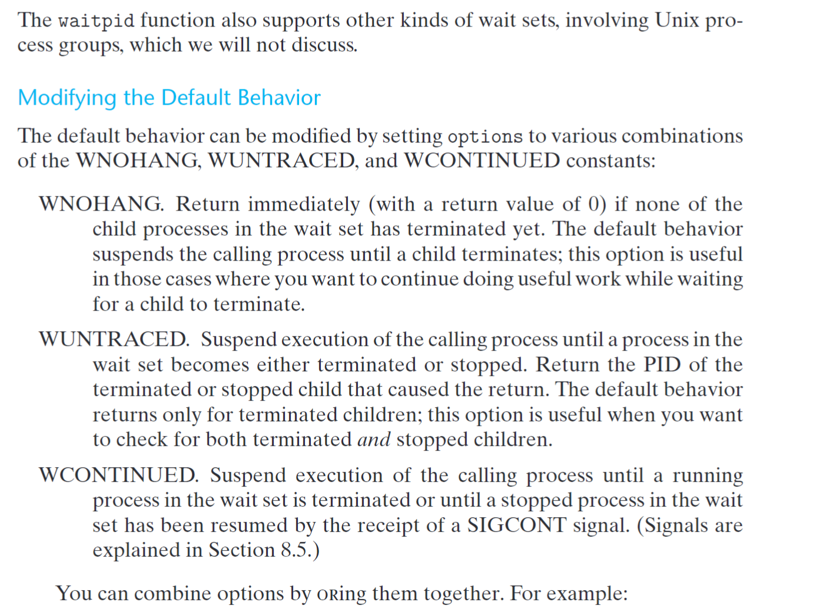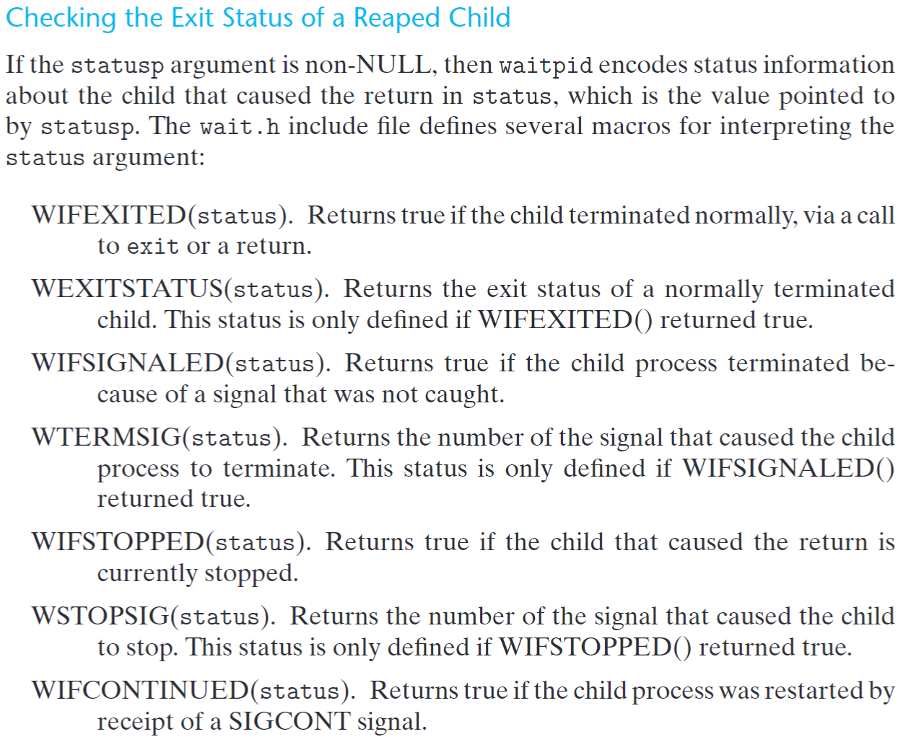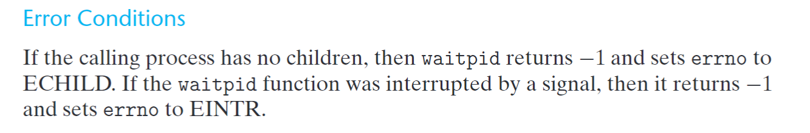
> Here are some concrete examples showing each use case:


#### Wait for any child state change
> [!code]
> 如果`pid`设置为`-1`，则父进程会等待任意一个子进程的状态发生变化。下面的例子中: 
> - The parent process creates a child process using `fork()`. 
> - The parent then waits for any child process to change state using `waitpid()` with the first argument as `-1`. 
> - The `status` variable is used to store the exit status of the terminated child process. 
> - Return `-1` if there is no child processes unterminated.
> - The `waitpid()` will not return until any one of the child processes of the calling process terminates.
> - The `WIFEXITED()` macro checks if the child process exited normally, and `WEXITSTATUS()` retrieves the exit status.
```c
#include "csapp.h"
#define N 2
int main()
{
    int status, i; 
    pid_t pid;

	/* Parent creates N children */ 
    for (i = 0; i < N; i++) 
        if ((pid = Fork()) == 0) 
            /* Child */ 
            exit(100+i);
            
    /* Parent reaps N children in no particular order */ 
    while ((pid = waitpid(-1, &status, 0)) > 0) {
        if (WIFEXITED(status)) 
            printf("child %d terminated normally with exit status=%d\n", 
                   pid, WEXITSTATUS(status)); 
        else 
            printf("child %d terminated abnormally\n", pid); 
    }

    /* The only normal termination is if there are no more children, waitpid() interrupted by a signal */
    if (errno != ECHILD) 
        unix_error("waitpid error");  
    exit(0);
}
```


#### Waiting for a specific child state change
> [!code]
> 
```c
#include <sys/types.h>
#include <sys/wait.h>
#include <unistd.h>
#include <stdio.h>

int main() {
    pid_t child_pid = fork();
    
    if (child_pid == 0) {
        // Child process
        sleep(2);
        printf("Child process exiting\n");
        return 0;
    }
    else {
        // Parent process
        int status;
        pid_t terminated_pid = waitpid(child_pid, &status, 0);
        
        if (WIFEXITED(status)) {
            printf("Child process %d exited normally with status %d\n", terminated_pid, WEXITSTATUS(status));
        }
    }
    
    return 0;
}
```


#### Non-blocking Wait - WNOHANG
> [!code]
> 下面的代码中， 我们通过传递`options`参数修改了`waitpid`函数的默认行为。因为在默认状态下，函数`waitpid()`在子进程没有`terminate`的情况下是不会立即返回的，而是会一直等待到子进程`terminate`才返回子进程的`pid`。但是如果将`options`设置为`WNOHANG`，则函数`waitpid()`会立即返回`0`，这样的好处是我们可以在等待子进程`terminate`的过程中干一些其他事情。
```c
// job-list-broken.c
static void reapProcesses(int sig) {
  while (true) {
    pid_t pid = waitpid(-1, NULL, WNOHANG);
    if (pid <= 0) break;
    printf("Job %d removed from job list.\n", pid);
  }
}

char * const kArguments[] = {"date", NULL};
int main(int argc, char *argv[]) {
  signal(SIGCHLD, reapProcesses);
  for (size_t i = 0; i < 3; i++) {
    pid_t pid = fork();
    if (pid == 0) execvp(kArguments[0], kArguments);
    sleep(1); // force parent off CPU
    printf("Job %d added to job list.\n", pid);
  }
  return 0;
}

```


#### Detailed Diagnosis - WUNTRACED
> [!code]
> 下面的代码展示了如何使用`WUNTRACED`。`WUNTRACED`和`WNOHANG`的区别是，`WUNTRACED`会一直等待子进程(`blocking wait`), 同时拦截那些使得子进程`terminated`或者`stopped`的信号（不光光是`WNOHANG`或者默认行为下的`terminated`），换句话说就是服务范围更广，能够检测到的信号种类更多。
```c
#include <stdio.h>
#include <stdlib.h>
#include <sys/types.h>
#include <sys/wait.h>
#include <unistd.h>

int main() {
    pid_t pid, wpid;
    int status;

    pid = fork();

    if (pid == 0) {
        // This block will be executed by the child process
        printf("Child process: I'm the child. Going to sleep for 10 seconds.\n");
        printf("Child process: Use 'kill -TSTP %d' in another terminal to stop me.\n", getpid());
        sleep(10);
        printf("Child process: I'm done sleeping. Exiting!\n");
        exit(0);
    } else if (pid < 0) {
        // Fork failed
        perror("fork");
        exit(EXIT_FAILURE);
    } else {
        // This block will be executed by the parent process
        do {
            wpid = waitpid(pid, &status, WUNTRACED);
            if (wpid == -1) {
                perror("waitpid");
                exit(EXIT_FAILURE);
            }

            if (WIFEXITED(status)) {
                printf("Parent process: child exited with status %d\n", WEXITSTATUS(status));
            } else if (WIFSIGNALED(status)) {
                printf("Parent process: child killed by signal %d\n", WTERMSIG(status));
            } else if (WIFSTOPPED(status)) {
                printf("Parent process: child stopped by signal %d\n", WSTOPSIG(status));
            }

        } while (!WIFEXITED(status) && !WIFSIGNALED(status));
    }

    return 0;
}
```


#### Detect for Resume - WCONTINUED
> [!code]
> 
```c
#include <stdio.h>
#include <stdlib.h>
#include <sys/types.h>
#include <sys/wait.h>
#include <unistd.h>

int main() {
    pid_t pid, wpid;
    int status;

    pid = fork();

    if (pid == 0) {
        // Child process
        printf("Child process: I'm the child. PID: %d\n", getpid());
        printf("Child process: Going to sleep for 15 seconds.\n");
        printf("Child process: You can stop me with 'kill -TSTP %d' and continue with 'kill -CONT %d'\n", getpid(), getpid());
        sleep(15);
        printf("Child process: I'm done sleeping. Exiting!\n");
        exit(0);
    } else if (pid < 0) {
        // Fork failed
        perror("fork");
        exit(EXIT_FAILURE);
    } else {
        // Parent process
        do {
            wpid = waitpid(pid, &status, WUNTRACED | WCONTINUED);
            if (wpid == -1) {
                perror("waitpid");
                exit(EXIT_FAILURE);
            }

            if (WIFEXITED(status)) {
                printf("Parent process: child exited with status %d\n", WEXITSTATUS(status));
            } else if (WIFSIGNALED(status)) {
                printf("Parent process: child killed by signal %d\n", WTERMSIG(status));
            } else if (WIFSTOPPED(status)) {
                printf("Parent process: child stopped by signal %d\n", WSTOPSIG(status));
            } else if (WIFCONTINUED(status)) {
                printf("Parent process: child continued\n");
            }

        } while (!WIFEXITED(status) && !WIFSIGNALED(status));
    }

    return 0;
}
```


### Use wait()
> [!code]
> 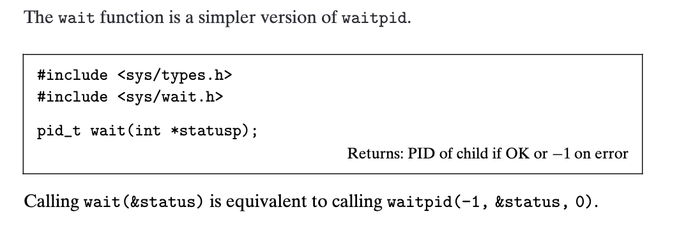
> `wait()`的默认行为就是等待任何一个子进程`terminated`, 会一直`Blocking the calling process until any one of the child processes terminate, and return the pid of this child process`。


## Putting Processes to Sleep
> [!code]
> 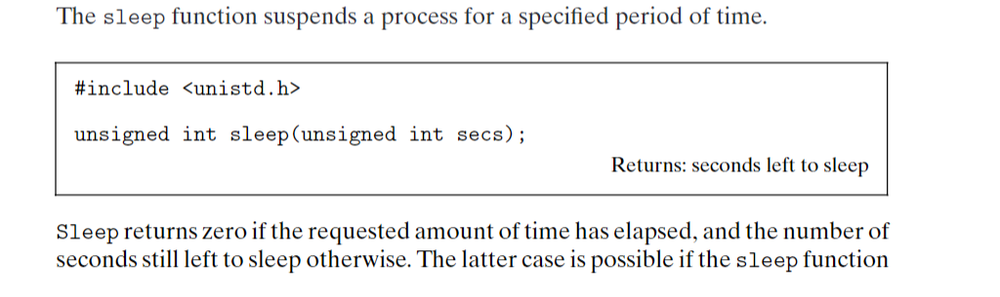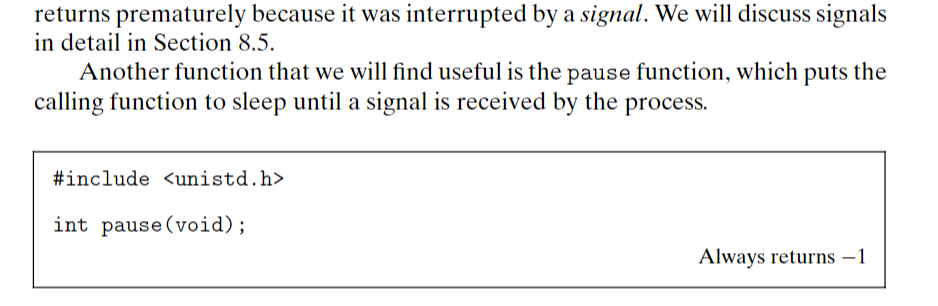

> [!example]
> 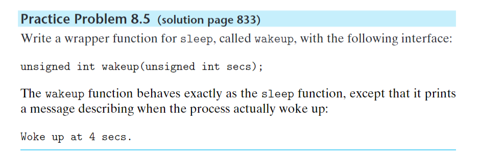


## Running and Loading Programs
> [!code] Execve
> 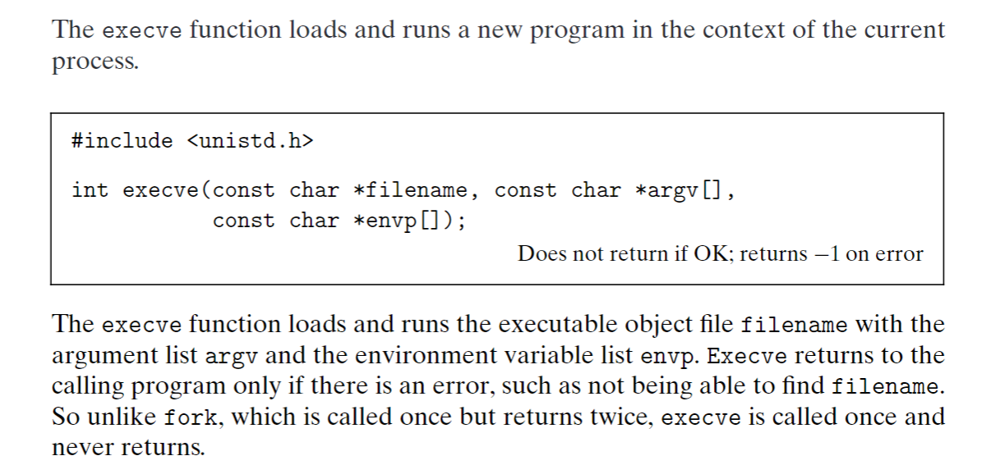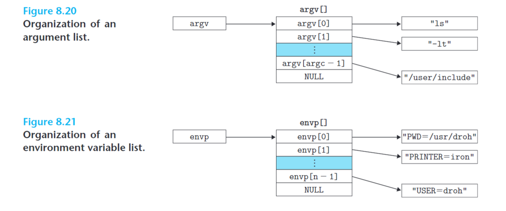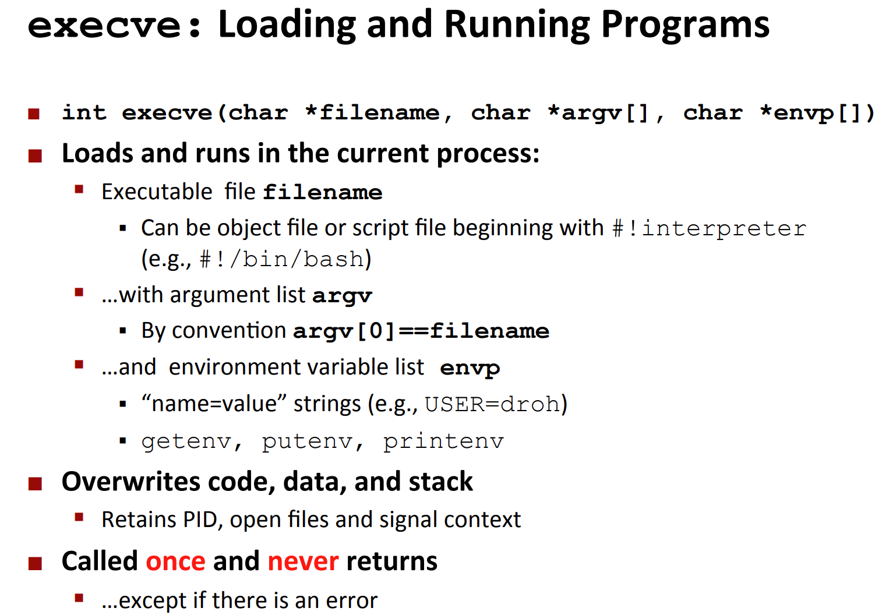

>[!example]
>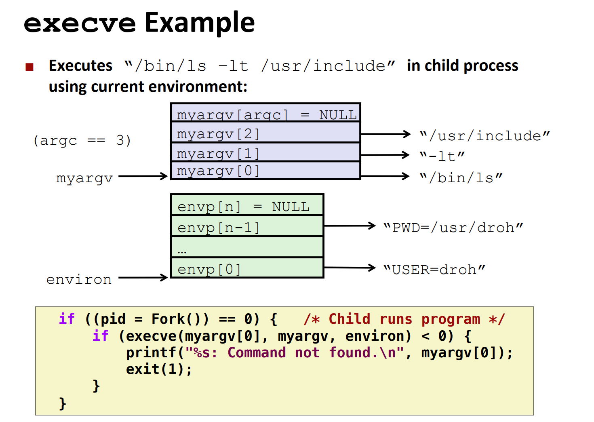

 
### Structure of the Stack of the Program
> [!important] 
> 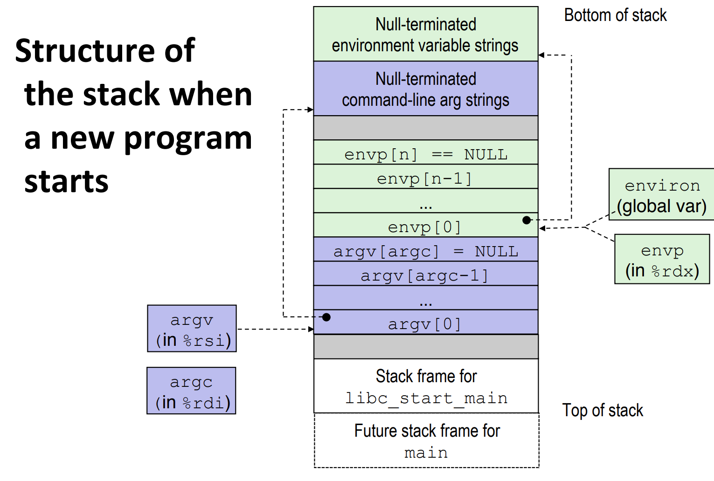


### Manipulate the environment
> [!code]
> 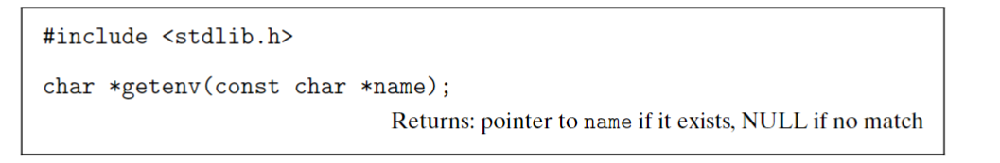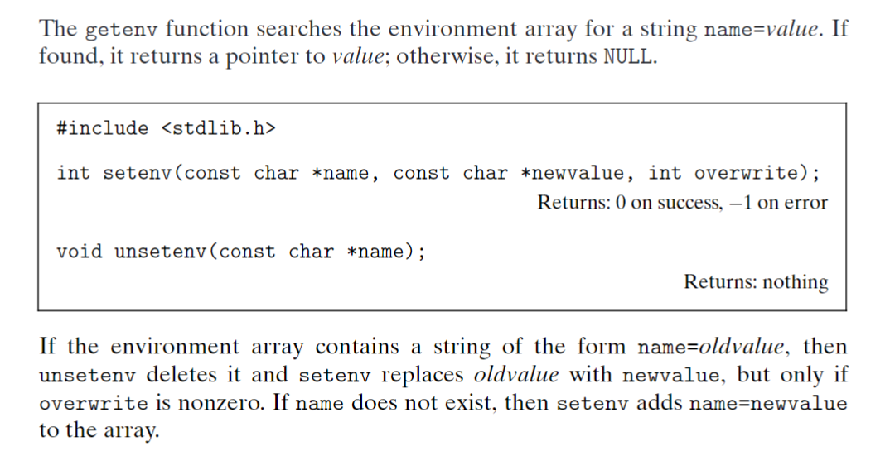

> [!example]
> 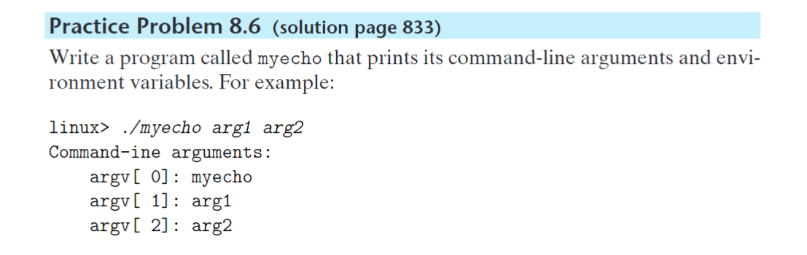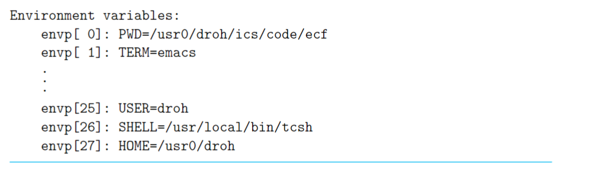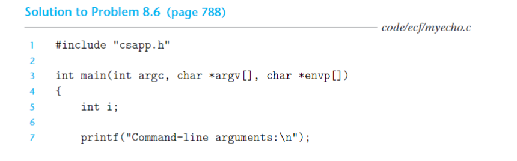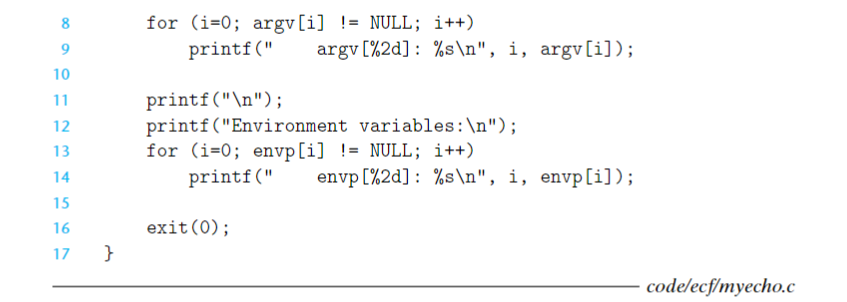


