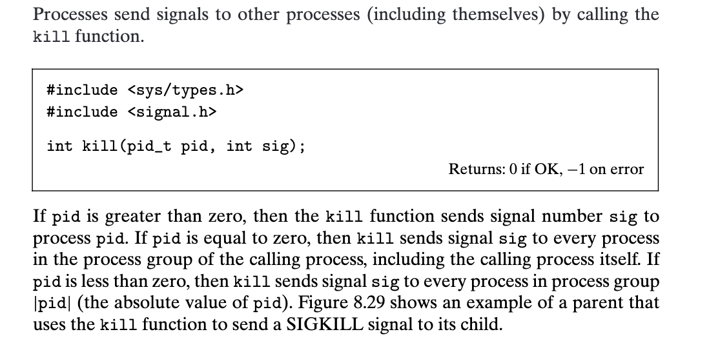
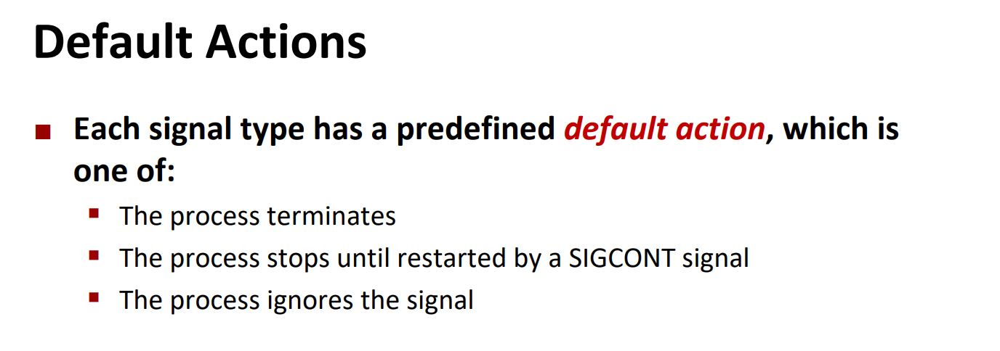
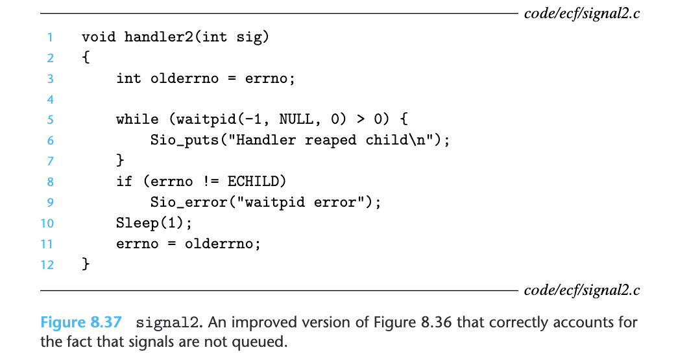
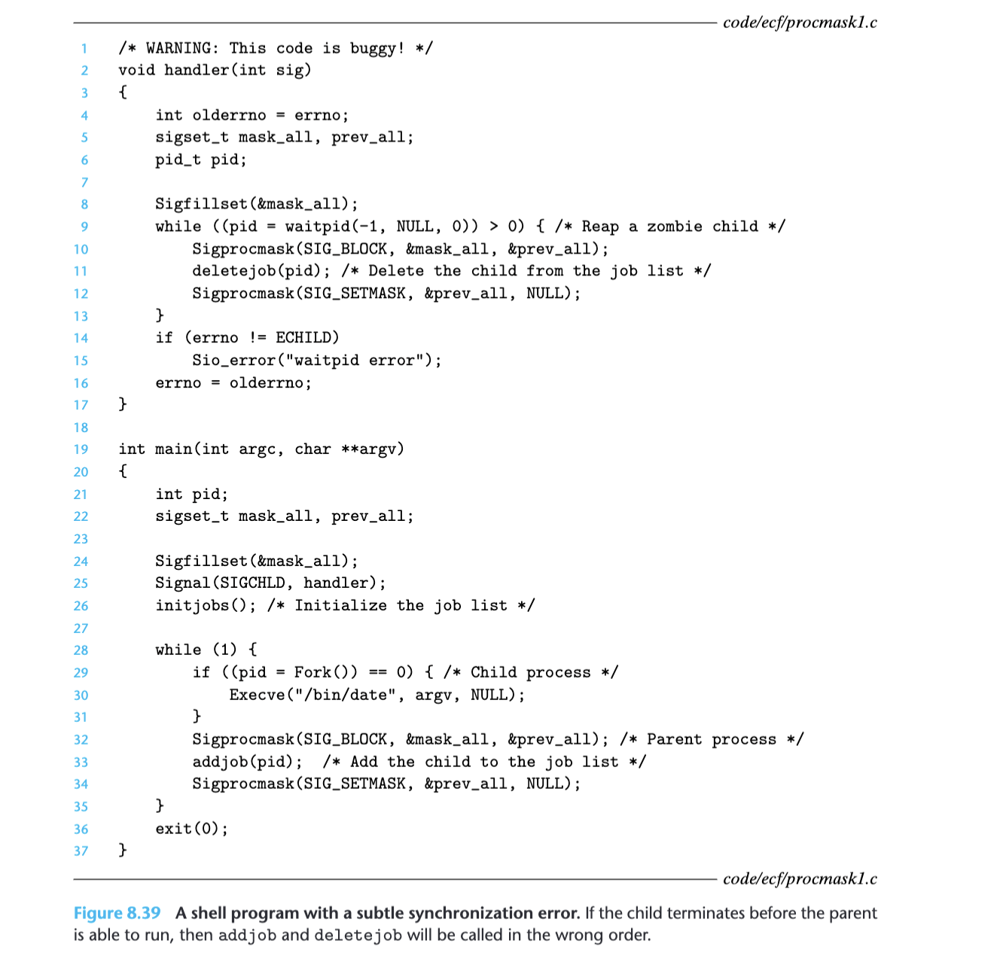

# Signals
## Overview
>[!def]
>

> [!example]
> 

> [!quiz] Trigger SIGINT and SIGQUIT
> Normally, using keyboard interrupt, to trigger `SIGINT`, we can type `CTRL + C`. To trigger `SIGQUIT`, we can type `CTRL + \`
> 


## Process Lifecycle
> [!def]
> 


## Process Group
> [!def]
> 
> 一个重要的性质是，`Every Process`最多只能属于一个`Process Group`。

> [!code] Getting Process Group
> 

> [!code] Setting Process Group
> 
> 总的来说，如果参数为`0`，则代表我们要对当前的`Calling Process`进行操作。
> 如果我们要以当前的`Calling Process`作为进程组长，则我们可以调用`setpgid(0,0)`进行设置。


## Sending Signals between Processes
### Concept
> [!def]
> 


### Sending Signals with Kill
> [!code] Sending Signals with /bin/kill Program
>  
> 注意这里写出`kill`的`full path`, 原因是系统中可能有很多`kill`程序，而我们需要的是系统自带的`bin/kill`, 其实是为了防止错误。


> [!code] Sending Signals with kill() function
> 


### Sending Signals with Keyboard Interrupt
> [!code] Sending Signals from Keyboard
> 

> [!important] 
> 1. **SIGINT (Signal Interrupt)**
> 	- **Number**: 2
> 	- **Purpose**: Its primary purpose is to interrupt a process. This signal is commonly initiated by the user pressing `Ctrl+C` in the terminal. It allows the process to perform cleanup operations before it terminates.
> 	- **Handling**: By default, the process will terminate when it receives this signal. However, a process can catch the SIGINT signal, which means it can determine what action to take upon receiving it (e.g., clean up resources, save data, etc.) or even ignore it.
> 2. **SIGKILL (Signal Kill)**
> 	- **Number**: 9
> 	- **Purpose**: Its primary purpose is to force the termination of a process. It's a surefire way to kill a process when other methods are ineffective.
> 	- **Handling**: `Unlike SIGINT, the SIGKILL signal cannot be caught, blocked, or ignored by the process.` When a process receives a SIGKILL, the operating system terminates it immediately without giving it a chance to perform cleanup operations, which means it becomes a valid zombie process waiting to be reaped by other processes.


### Sending Signals with alarm
> [!code] Sending with alarm() function
> 


## Receiving Signals
### Procedures
> [!def]
> 
> 总的来说，`pending bits`是用于标记那些已经被发送/送达目标`process`但是因为`blocking bits`仍然生效从而导致信号无法被接收的情况。
> 
> 
> `pending bits`和`blocking bits`是通过一个`bit mask`来实现的。假设用户按下了`CTRL+C`, 且内核向进程A发送了`SIGNINT`信号，但是进程A此前block了这个信号(bit mask 为0x2), 则这个信号不得不被挂起进入`pending`的状态，`waiting to be received`, 此时`pending bits`也会被设置成0x2。而当进程A后续将这个信号unblock了以后，`pending bits set`和`blocking bits set`都会被设置成0x0, 此时进程A成功接收这个信号。
> 注意到`bit mask set`中每个信号只有一个bit来表示，所以如果有多个同类信号到达进程A且被blocked了，那这个bit只会表示有没有信号在`pending`的状态，而不会记录有多少个同类信号在`pending`的状态。
> 
> 
> 


### Examples
> [!example] Signal is not queued
> 


# Signal Handler
## Definition
> [!def]
> 

> [!info]
> - 所有的进程在`receive signal`的情况下，取决于信号的类型，会有默认的行为。比如所有收到且没有`block SIGKILL`的进程会被操作系统直接结束称为僵尸进程。所有收到`SIGCHLD`的进程不会有任何行为，这个信号仅仅是通知父进程，有子进程被`terminated/stopped`了。
> - 我们可以通过`signal()`函数来改变`calling process`收到信号的进程的默认行为，但是要注意，`SIGKILL`和`SIGSTOP`的默认行为无法更改。
> - 在`signal handler`处理他负责的信号时，会将所有同类信号阻隔。因为我们知道多个`pending`的同类信号并不会排队等待处理，而是直接被丢弃，所以如果在`signal handler`处理信号期间，有同类信号到达，那么这些同类信号中的第一个会被加入`pending bits`中，后续的都会被丢弃。但是当`signal handler`处理完当前信号之后，这个类型的信号就会被`unblock`, 进而被`signal handler`处理。
> 
> 


## Default Actions
> [!def]
> 


## Overriding Signal Handlers
> [!code] 
> 下面的函数用于修改某个信号的默认行为：
> 
> , 其中：
> 
> 

> [!example]
> 


## Installing Signal Handler
> [!info]
> 
> When a process calls `fork()`, the child process inherits copies of the parent's set of signal handlers. At the time of the `fork()`, any signal handlers that the parent has installed are also established for the child process. This means that if the parent has installed a specific handler for certain signals (other than the default handlers provided by the system), the child process will inherit these handlers.


## Blocking Signals
> [!info]
> 

> [!example] Temporarily Blocking Signals
> 


## Waitpid and signals
> [!property]
> Blocking signals in a parent process does not prevent `waitpid` from being able to catch terminated child processes. The `waitpid` system call is used to wait for state changes in a child of the calling process, such as termination. **The functionality of `waitpid` is not directly influenced by the signal mask of the parent process because it deals with the state of child processes at the system level rather than through signal delivery.**
> 
> Signals are typically used for asynchronous event notifications between processes or between the kernel and a process. For example, the `SIGCHLD` signal is sent to a parent process when a child process terminates. However, the delivery of this signal to the parent process can be blocked or the signal can be ignored. Even if you block `SIGCHLD` or other signals in the parent process, `waitpid` can still be used to wait for child processes to change state (e.g., to terminate).
> 
> **When a child process terminates, the kernel retains some information about the process (such as its exit status) so that the parent can retrieve this information using `waitpid` or similar functions.** This mechanism ensures that a parent process has the opportunity to collect the termination status of its children, which also helps the system to release all resources associated with the child process.

> [!important]
> 1. **When a child process is stopped:** The child process sends a `SIGSTOP` signal (or another signal that stops the process, such as `SIGTSTP`, `SIGTTIN`, or `SIGTTOU`) to the parent process. This signal indicates that the child process has been stopped, usually because it has received a stop signal itself. However, it's important to note that the stopped state is not typically communicated directly to the parent process as an explicit message. Instead, the parent process can become aware of the stop event through the `waitpid` system call with options set to return if a child has stopped (e.g., `WUNTRACED`).
> 2. **When a child process is terminated:** The child process sends a `SIGCHLD` signal to the parent process. This signal indicates that a child process has stopped or exited. The termination of a child process can occur due to various reasons, such as normal exit after completing its execution, being killed by a signal, or exiting due to an error.


## Signals are not queued
### Counting with Signals Example
> [!example]
> 
> The parent process create 10 child processes. If all the child processes terminate at the same time, kernel will send 10 `SIGCHLD` to parent process, but since signals are not queued, we will in the worst case only execute `counter++` once, and the while loop in the parent process will never end.


### SIGCHLD Example - Reaping Child Processes
> [!code]
> - Whenever a child process **changes state**—that is, it exits, crashes, stops, or resumes from a stopped state, the kernel sends a `SIGCHLD` signal to the process's parent.
> 	- By default, the signal is ignored. In fact, we've ignored it until right now and gotten away with it.
> 	- This particular signal type is instrumental to allowing forked child processes to run in the background while the parent process moves on to do its own work without blocking on a `waitpid` call, which is synchronous reaping.
> 	- The parent process, however, is still required to reap child processes, so the parent will typically register a custom `SIGCHLD` handler to be asynchronously invoked whenever a child process changes state.
> 	- These custom `SIGCHLD` handlers almost always include calls to `waitpid`, which can be used to surface the pids of child processes that've changed state. If the child process of interest actually terminated, either normally or abnormally, the `waitpid` also culls the zombie the relevant child process has become.
> 	- `WNOHANG` is super useful when we implement the signal handler since it makes it non-blocking and simple. 
> - In Unix-like operating systems, when a signal is caught by a handler, the default behavior is to block further occurrences of that signal until the signal handler returns. This means that, yes, while a signal handler is executing, all other signals of the same type are typically blocked from being delivered to the process. This behavior prevents a signal from interrupting its own handler, potentially causing a recursive loop that could lead to stack overflow and process crash.
> 
> 


#### Attempt 1: Waitpid(-1, NULL, 0) w.o. Loop
> [!bug] Multiple Signals At Once
> 
```c
static const size_t kNumChildren = 5;
static size_t numDone = 0;

int main(int argc, char *argv[]) {
  printf("Let my five children play while I take a nap.\n");
  signal(SIGCHLD, reapChild);
  for (size_t kid = 1; kid <= 5; kid++) {
    if (fork() == 0) {
      sleep(3 * kid); // sleep emulates "play" time
      printf("Child #%zu tired... returns to dad.\n", kid);
      return 0;
    }
  }
    // code below is a continuation of that presented on the previous slide
  while (numDone < kNumChildren) {
    printf("At least one child still playing, so dad nods off.\n");
    snooze(5); // our implementation -- does not wake up upon signal
    printf("Dad wakes up! ");
  }
  printf("All children accounted for.  Good job, dad!\n");
  return 0;
}

// Signal Handler
static void reapChild(int unused) {
  waitpid(-1, NULL, 0);
  numDone++;
}
```
> [!bug] Caveats
> 


#### Attempt 2: WNOHANG
> [!success] 
> 
```c
// job-list-broken.c
static void reapProcesses(int sig) {
  while (true) {
    pid_t pid = waitpid(-1, NULL, WNOHANG);
    if (pid <= 0) break;
    printf("Job %d removed from job list.\n", pid);
  }
}

char * const kArguments[] = {"date", NULL};
int main(int argc, char *argv[]) {
  signal(SIGCHLD, reapProcesses);
  for (size_t i = 0; i < 3; i++) {
    pid_t pid = fork();
    if (pid == 0) execvp(kArguments[0], kArguments);
    sleep(1); // force parent off CPU
    printf("Job %d added to job list.\n", pid);
  }
  return 0;
}

```
> [!code] Output
> 


## Signal Handler as Logic Flow
> [!info]
> 


## Nested Signal Handlers
> [!important] 
> 
> 
> 


# Proper Signal Handling
## Async-Signal-Safe Functions
> [!info]
> 
 


## Guidelines
> [!summary] Golden Rules
> 

> [!info] Guideline 0
> 

> [!info] Guideline 1
> 
> 我们可以使用`sio`库中的函数在我们的`Signal Handler`代码逻辑中，这些函数都是`async-signal-safe`的。
> 
> 

> [!info] Guideline 2
> 
> 

> [!info] Guideline 3
> 

> [!info] Guideline 4
> 

> [!info] Guideline 5
> 


## Correct Signal Handling Examples
> [!bug] Buggy Example 
> 

> [!success] Successful Example
> 


## Portable Signal Handling
> [!warning] 
> 

> [!success]
> 


# Synchronize the Flows
## Race Error
> [!bug] Buggy Example - Race
> 


## Fix 1 - Block Signals
> [!success] Fix
> 


## Fix 2 - Explicitly Waiting for Signals
> [!success] Fix
> 


## Job List Management Example
> [!important]
> 

> [!bug] Job List Broken Example
> 
```c
// job-list-broken.c
static void reapProcesses(int sig) {
  while (true) {
    pid_t pid = waitpid(-1, NULL, WNOHANG);
    if (pid <= 0) break;
    printf("Job %d removed from job list.\n", pid);
  }
}

char * const kArguments[] = {"date", NULL};
int main(int argc, char *argv[]) {
  signal(SIGCHLD, reapProcesses);
  for (size_t i = 0; i < 3; i++) {
    pid_t pid = fork();
    if (pid == 0) execvp(kArguments[0], kArguments);
    sleep(1); // force parent off CPU
    printf("Job %d added to job list.\n", pid);
  }
  return 0;
}

```

> [!success] Job List Fixed Example
> - The implementation of `reapProcesses` is the same as before, so I didn't reproduce it.
> - The updated parent programmatically defers its obligation to handle signals until it returns from its `printf`—that is, it's added the pid to the job list.
> - As it turns out, a **`fork`ed process inherits blocked signal sets**, so it needs to lift the block via its own call to `sigprocmask(SIG_UNBLOCK, ...)`.
> - An interesting question is that: Whether the _child's_ signal handler could get called if the program that the child launched with **`execvp`** had a child of its own, and that child ended. Once the original child starts another program with **`execvp`** all of the original code is gone. Therefore, the signal handler cannot be called, because it doesn't exist any longer. 
> - So even if the child process inherits the signal handler from its parent process, this exact signal handler will never get called since `execvp` will replace all the memory execution stack, making the reference to the original signal handler invalid.
> - In general, you want the stretch of time that signals are blocked to be as narrow as possible, since you're overriding default signal handling behavior and want to do that as infrequently as possible.
```c
#include <unistd.h>
#include <stdio.h>
#include <signal.h>
#include <errno.h>
#include <sys/wait.h>
#include "exit-utils.h"
#include "sleep-utils.h"

static const int kForkFailed = 1;
static const int kExecFailed = 2;
static const int kWaitFailed = 4;
static const int kSignalFailed = 8;

static void reapChild(int sig) {
  pid_t pid;
  while (true) {
    pid = waitpid(-1, NULL, WNOHANG);
    if (pid <= 0) break;
    printf("Job %d removed from job list.\n", pid);
  }
  exitUnless(pid == 0 || errno == ECHILD, kWaitFailed,
	     stderr, "waitpid failed within reapChild sighandler.\n");
}

int main(int argc, char *argv[]) {
  exitIf(signal(SIGCHLD, reapChild) == SIG_ERR, kSignalFailed,
	 stderr, "signal function failed.\n");
  sigset_t mask;
  sigemptyset(&mask);
  sigaddset(&mask, SIGCHLD);
  for (size_t i = 0; i < 3; i++) {
	// Parent block SIGCHILD
    sigprocmask(SIG_BLOCK, &mask, NULL);
    pid_t pid = fork();
    exitIf(pid == -1, kForkFailed,
	   stderr, "fork function failed.\n");
    if (pid == 0) {
      sigprocmask(SIG_UNBLOCK, &mask, NULL);
      char *listArguments[] = {"date", NULL};
      exitIf(execvp(listArguments[0], listArguments) == -1, 
	     kExecFailed, stderr, "execvp function failed.\n");
    }
    
    sleep(1); // Force parent off CPU
    printf("Job %d added to job list.\n", pid);
    sigprocmask(SIG_UNBLOCK, &mask, NULL);
  }
  
  return 0;
}

```


# Homework Problems


