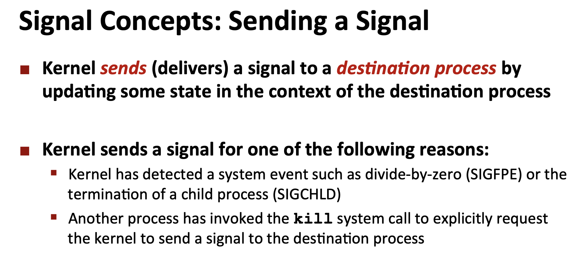
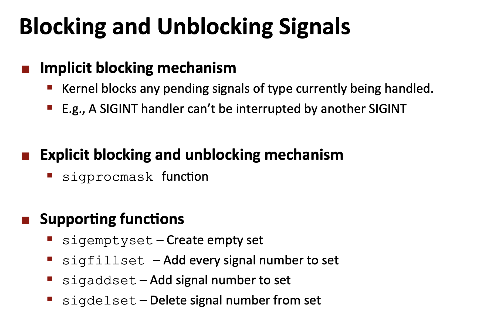

# Signals
## Overview
>[!def]
>

> [!example]
> 

> [!quiz] Trigger SIGINT and SIGQUIT
> Normally, using keyboard interrupt, to trigger `SIGINT`, we can type `CTRL + C`. To trigger `SIGQUIT`, we can type `CTRL + \`
> 


## Process Lifecycle
> [!def]
> 


## Process Group
> [!def]
> 
> 一个重要的性质是，`Every Process`最多只能属于一个`Process Group`。

> [!code] Getting Process Group
> 

> [!code] Setting Process Group
> 
> 总的来说，如果参数为`0`，则代表我们要对当前的`Calling Process`进行操作。
> 如果我们要以当前的`Calling Process`作为进程组长，则我们可以调用`setpgid(0,0)`进行设置。


## Sending Signals
> [!def]
> 

> [!code] Sending Signals with /bin/kill Program
>  
> 注意这里写出`kill`的`full path`, 原因是系统中可能有很多`kill`程序，而我们需要的是系统自带的`bin/kill`, 其实是为了防止错误。


> [!code] Sending Signals from Keyboard
> 


> [!code] Sending Signals with kill() function
> 

> [!important] 
> 1. **SIGINT (Signal Interrupt)**
> 	- **Number**: 2
> 	- **Purpose**: Its primary purpose is to interrupt a process. This signal is commonly initiated by the user pressing `Ctrl+C` in the terminal. It allows the process to perform cleanup operations before it terminates.
> 	- **Handling**: By default, the process will terminate when it receives this signal. However, a process can catch the SIGINT signal, which means it can determine what action to take upon receiving it (e.g., clean up resources, save data, etc.) or even ignore it.
> 2. **SIGKILL (Signal Kill)**
> 	- **Number**: 9
> 	- **Purpose**: Its primary purpose is to force the termination of a process. It's a surefire way to kill a process when other methods are ineffective.
> 	- **Handling**: `Unlike SIGINT, the SIGKILL signal cannot be caught, blocked, or ignored by the process.` When a process receives a SIGKILL, the operating system terminates it immediately without giving it a chance to perform cleanup operations, which means it becomes a valid zombie process waiting to be reaped by other processes.

> [!code] Sending with alarm() function
> 


## Receiving Signals
> [!def]
> 
> 总的来说，`pending bits`是用于标记那些已经被发送/送达目标`process`但是因为`blocking bits`仍然生效从而导致信号无法被接收的情况。
> 
> 
> `pending bits`和`blocking bits`是通过一个`bit mask`来实现的。假设用户按下了`CTRL+C`, 且内核向进程A发送了`SIGNINT`信号，但是进程A此前block了这个信号(bit mask 为0x2), 则这个信号不得不被挂起进入`pending`的状态，`waiting to be received`, 此时`pending bits`也会被设置成0x2。而当进程A后续将这个信号unblock了以后，`pending bits set`和`blocking bits set`都会被设置成0x0, 此时进程A成功接收这个信号。
> 注意到`bit mask set`中每个信号只有一个bit来表示，所以如果有多个同类信号到达进程A且被blocked了，那这个bit只会表示有没有信号在`pending`的状态，而不会记录有多少个同类信号在`pending`的状态。
> 
> 
> 
> 


# Signal Handler
## Definition
> [!def]
> 

> [!info]
> - 所有的进程在`receive signal`的情况下，取决于信号的类型，会有默认的行为。比如所有收到且没有`block SIGKILL`的进程会被操作系统直接结束称为僵尸进程。所有收到`SIGCHLD`的进程不会有任何行为，这个信号仅仅是通知父进程，有子进程被`terminated/stopped`了。
> - 我们可以通过`signal()`函数来改变`calling process`收到信号的进程的默认行为，但是要注意，`SIGKILL`和`SIGSTOP`的默认行为无法更改。
> - 在`signal handler`处理他负责的信号时，会将所有同类信号阻隔。因为我们知道多个`pending`的同类信号并不会排队等待处理，而是直接被丢弃，所以如果在`signal handler`处理信号期间，有同类信号到达，那么这些同类信号中的第一个会被加入`pending bits`中，后续的都会被丢弃。但是当`signal handler`处理完当前信号之后，这个类型的信号就会被`unblock`, 进而被`signal handler`处理。
> 
> 


## Overriding Signal Handlers
> [!code] 
> 下面的函数用于修改某个信号的默认行为：
> 
> , 其中：
> 
> 

> [!example]
> 


## Installing Signal Handler
### Installing Procedures
> [!info]
> 


### SIGCHLD Example - Reaping Child Processes
> [!code]
> - Whenever a child process **changes state**—that is, it exits, crashes, stops, or resumes from a stopped state, the kernel sends a `SIGCHLD` signal to the process's parent.
> 	- By default, the signal is ignored. In fact, we've ignored it until right now and gotten away with it.
> 	- This particular signal type is instrumental to allowing forked child processes to run in the background while the parent process moves on to do its own work without blocking on a `waitpid` call, which is synchronous reaping.
> 	- The parent process, however, is still required to reap child processes, so the parent will typically register a custom `SIGCHLD` handler to be asynchronously invoked whenever a child process changes state.
> 	- These custom `SIGCHLD` handlers almost always include calls to `waitpid`, which can be used to surface the pids of child processes that've changed state. If the child process of interest actually terminated, either normally or abnormally, the `waitpid` also culls the zombie the relevant child process has become.
> 	- `WNOHANG` is super useful when we implement the signal handler since it makes it non-blocking and simple. 
> - In Unix-like operating systems, when a signal is caught by a handler, the default behavior is to block further occurrences of that signal until the signal handler returns. This means that, yes, while a signal handler is executing, all other signals of the same type are typically blocked from being delivered to the process. This behavior prevents a signal from interrupting its own handler, potentially causing a recursive loop that could lead to stack overflow and process crash.
> 
> 
```c

```


## Signal Handler as Logic Flow
> [!info]
> 


## Nested Signal Handlers
> [!important] 
> 
> 
> 


## Blocking Signals
> [!info]
> 

> [!example] Temporarily Blocking Signals
> 

> [!summary] Detailed Explanations
> 


# Writing Signal Handlers
## Async-Signal-Safe Functions
> [!info]
> 
 


## Guidelines
> [!summary] Golden Rules
> 

> [!info] Guideline 0
> 

> [!info] Guideline 1
> 
> 我们可以使用`sio`库中的函数在我们的`Signal Handler`代码逻辑中，这些函数都是`async-signal-safe`的。
> 
> 

> [!info] Guideline 2
> 
> 

> [!info] Guideline 3
> 

> [!info] Guideline 4
> 

> [!info] Guideline 5
> 


## Correct Signal Handling Examples
> [!bug] Buggy Example 
> 

> [!success] Successful Example
> 


# Portable Signal Handling
> [!warning] 
> 

> [!success]
> 


# Synchronize the Flows
## Race Error
> [!bug] Buggy Example - Race
> 


## Fix 1 - Block Signals
> [!success] Fix
> 


## Fix 2 - Explicitly Waiting for Signals
> [!success] Fix
> 


# Homework Problems


