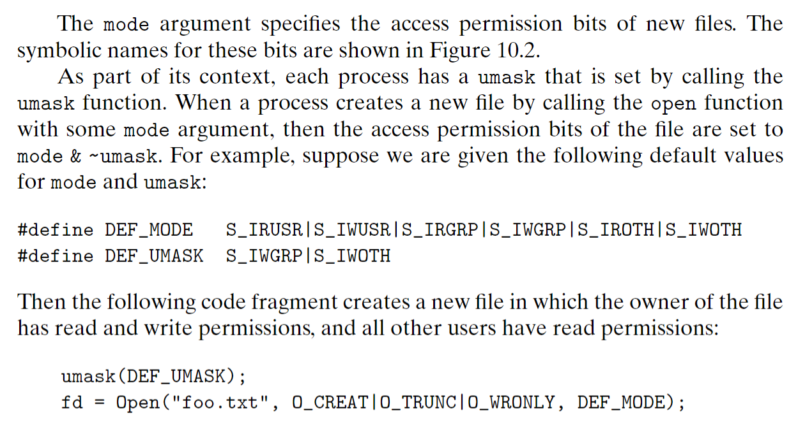
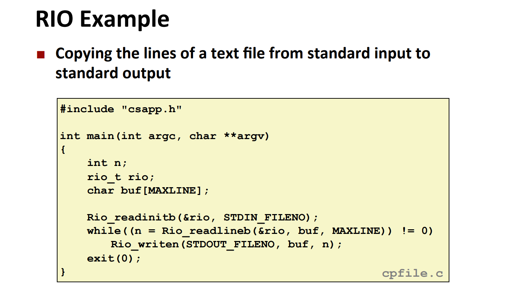

# Unix I/O
## Overview
> [!overview]
> 


# Files
## Overview
> [!important]
> 


## Regular Files
> [!def] Definition
> 


## Directories
> [!def] Definition
> 


## Directory Hierarchy
> [!def] Definition
> 


## Pathnames
> [!def]
> 


# File Operations
## Opening Files
### Overview
> [!code]
> 


### flags argument
> [!important]
> 


### mode argument
> [!important]
> 


## Closing Files
> [!code]
> 


## Reading/Writing Files
### Reading Files
> [!code]
> 


### Writing Files
> [!code]
> 


### Short Counts
> [!important]
> 
> 


### Practice
> [!example]
> 


## Echoing
> [!important]
> 下面这段代码展现了`echo`程序的一种实现方式，但是是一种非常糟糕的实现方式。因为每次调用`read/write`都会导致操作系统进行一次`Context Switch`, 而这个过程通常需要花费`20000~40000`个时钟周期，虽然时钟周期看起来没多长，都是微秒纳秒级别，但是如果我们要读取长文件，那么这样的时间消耗是不堪入目的。
> 


# RIO Package - Robust Reading/Writing
## Overview
> [!overview]
> 

## Unbuffered RIO
### Overview
> [!overview]
> 


### rio_readn
> [!code]
> `rio_readn`旨在处理`short count`的发生，使得如果用户要求读入`n bytes`, 那么最终除非是读取到文件的结尾`EOF`导致的`Short Count`, 其他情况下都会按照要求读取`n bytes`, 并返回`n`。
```c
ssize_t rio_readn(int fd, void *usrbuf, size_t n) 
{
    size_t nleft = n;
    ssize_t nread;
    char *bufp = usrbuf;

    while (nleft > 0) {
        if ((nread = read(fd, bufp, nleft)) < 0) {
            if (errno == EINTR) /* Interrupted by sig handler return */
                nread = 0;     /* and call read() again */
            else
                return -1;     /* errno set by read() */
        } 
        else if (nread == 0)
            break;            /* EOF */
        nleft -= nread;
        bufp += nread;        /* Change the pointer in the user buf, so that reading process can be resumed from single handling. */
    }
    return (n - nleft);
}
```


### rio_writen
> [!code]
> `rio_writen`永远都不会发生`short count`现象。
```c
ssize_t rio_writen(int fd, void *usrbuf, size_t n)
{
    size_t nleft = n;
    ssize_t nwritten;
    char *bufp = usrbuf;

    while (nleft > 0) {
        if ((nwritten = write(fd, bufp, nleft)) <= 0) {
            if (errno == EINTR) /* Interrupted by sig handler return */
                nwritten = 0;   /* and call write() again */
            else
                return -1;      /* errno set by write() */
        }
        nleft -= nwritten;
        bufp += nwritten;
    }
    return n;
}
```


## Buffered RIO
### Overview
> [!overview]
> 


### Buffered RIO Implementations
#### rio_readinitb
> [!code]
> 


#### rio_read
> [!important]
> 
> To an application program, the rio_read function has the same semantics as the Linux read function. 
> - On error, it returns −1 and sets errno appropriately. 
> - On EOF, it returns 0. It returns a short count if the number of requested bytes exceeds the number of unread bytes in the read buffer. 
> 
> The similarity of the two functions makes it easy to build different kinds of buffered read functions by substituting rio_read for read.
```c
static ssize_t rio_read(rio_t *rp, char *usrbuf, size_t n)
{
    int cnt;

	/* Check if there is unread bytes in the internal buffer */
    while (rp->rio_cnt <= 0) { /* Refill if buf is empty */
	    /* 1. The internal buf is empty, so we read from the file descriptor */
        rp->rio_cnt = read(rp->rio_fd, rp->rio_buf, sizeof(rp->rio_buf)); // Notice here it reads sizeof(rp->rio_buf) at once, reducing the number of times of calling read() system call.

        if (rp->rio_cnt < 0) {
            if (errno != EINTR) /* Interrupted by sig handler return */
                return -1;
        } else if (rp->rio_cnt == 0) { /* EOF */
            return 0;
        } else {
            rp->rio_bufptr = rp->rio_buf; /* Reset buffer ptr */
        }
    }


	/* 2. The buf is not empty, meaning that there are still unread bytes */
    /* Copy min(n, rp->rio_cnt) bytes from internal buf to user buf */
	/* Compute the min */ 
    cnt = n;
    if (rp->rio_cnt < n)
        cnt = rp->rio_cnt;

	/* Copy the unread bytes to the userbuffer */
    memcpy(usrbuf, rp->rio_bufptr, cnt);
    /* Update the inter buffer pointer, partitioning the internal buffer into (first half: read bytes, second half: unread bytes)*/
    rp->rio_bufptr += cnt;
    rp->rio_cnt -= cnt;

    return cnt;
}
```

#### rio_readlineb
> [!code]
> 
```c
ssize_t rio_readlineb(rio_t *rp, void *usrbuf, size_t maxlen)
{
    int n, rc;
    char c, *bufp = usrbuf;

    for (n = 1; n < maxlen; n++) {
        if ((rc = rio_read(rp, &c, 1)) == 1) {
            *bufp++ = c;
            if (c == '\n') {
                n++;
                break;
            }
        } else if (rc == 0) {
            if (n == 1)
                return 0; /* EOF, no data read */
            else
                break; /* EOF, some data was read */
        } else {
            return -1; /* Error */
        }
    }

    *bufp = 0;
    return n-1;
}
```


#### rio_readnb
> [!code]
> 
```c
ssize_t rio_readnb(rio_t *rp, void *usrbuf, size_t n)
{
    size_t nleft = n;
    ssize_t nread;
    char *bufp = usrbuf;

    while (nleft > 0) {
        if ((nread = rio_read(rp, bufp, nleft)) < 0)
            return -1;  /* errno set by read() */
        else if (nread == 0)
            break;      /* EOF */
        nleft -= nread;
        bufp += nread;
    }

    return (n - nleft);  /* Return >= 0 */
}
```


### Code Example
> [!example]
> 


# Metadata, Sharing and Redirection
## File Metadata
> [!overview]
> 


> [!code]
> 
```c
#include "csapp.h"

int main(int argc, char **argv)
{
    struct stat stat;
    char *type, *readok;

    Stat(argv[1], &stat);
    if (S_ISREG(stat.st_mode))           /* Determine file type */
        type = "regular";
    else if (S_ISDIR(stat.st_mode))
        type = "directory";
    else
        type = "other";
    if (stat.st_mode & S_IRUSR)          /* Check read access */
        readok = "yes";
    else
        readok = "no";

    printf("type: %s, read: %s\n", type, readok);
    exit(0);
}
```


## Reading Directory Contents
> [!overview]
> 
```c
#include "csapp.h"

int main(int argc, char **argv)
{
    DIR *streamp;
    struct dirent *dep;

    streamp = Opendir(argv[1]);

    errno = 0;
    while ((dep = readdir(streamp)) != NULL) {
        printf("Found file: %s\n", dep->d_name);
    }
    if (errno != 0)
        unix_error("readdir error");

    Closedir(streamp);
    exit(0);
}
```


## File Sharing 
### Data Structure of Opened Files
> [!important]
> 
> - **Descriptor table**. Each process has its own separate descriptor table whose entries are indexed by the process’s open file descriptors. Each open descriptor entry points to an entry in the file table. 
> - **File table**. The set of open files is represented by a file table that is shared by all processes. Each file table entry consists of (for our purposes) the current file position, a reference count of the number of descriptor entries that currently point to it, and a pointer to an entry in the v-node table. Closing a descriptor decrements the reference count in the associated file table entry. `The kernel will not delete the file table entry until its reference count is zero`. 
> - **v-node table**. Like the file table, the v-node table is shared by all processes. Each entry contains most of the information in the stat structure, including the st_mode and st_size members.


### File Sharing Across Descriptors
> [!important] 
> 
> **Multiple descriptors can also reference the same file through different file table entries, as shown in Figure 10.13.** This might happen, for example, if you were to call the open function twice with the same filename. The key idea is that each descriptor has its own distinct file position, so different reads on different descriptors can fetch data from different locations in the file.


### File Sharing Across Processes
> [!important]
> 
> 
> We can also understand how parent and child processes share files. Suppose that before a call to `fork()`, the parent process has the open files shown in Figure 10.12. Then Figure 10.14 shows the situation after the call to fork. 
> - The child gets its own duplicate copy of the parent’s descriptor table. Parent and child share the same set of open file tables and thus share the same file position. 
> - **An important consequence is that the parent and child must both close their descriptors before the kernel will delete the corresponding file table entry.**


### Practice Examples
#### Practice Problem 10.2
> [!example]
> 


#### Practice Problem 10.3
> [!example]
> 


## I/O Redirection
### Overview
> [!important]
> 


### Concrete Example
> [!example]
> 


### Practice Example
#### Practice Problem 10.4
> [!example]
> 


#### Practice Problem 10.5
> [!example]
> 


# Standard I/O Functions
## Overview
> [!overview]
> 


## Buffering in Standard I/O
> [!motiv] Motivation
> 


## Which I/O Functions to use?
>[!overview]
>


## Choosing I/O Functions
> [!important]
> 


