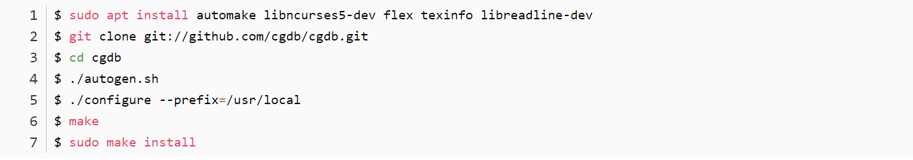

# Course Resources
> **Course Website:** 
> **UCB_CS61C:**
> - [https://cs61c.org/fa23/](https://cs61c.org/fa23/)
> - [https://inst.eecs.berkeley.edu/~cs61c/fa20/](https://inst.eecs.berkeley.edu/~cs61c/fa20/) (新的Project 1，总体上体验更好的`Lecture Videos`)
> - [https://inst.eecs.berkeley.edu/~cs61c/su20/](https://inst.eecs.berkeley.edu/~cs61c/su20/) (Discussion Videos)
> 
**CSAPP(Fa15):**
> - [https://www.cs.cmu.edu/afs/cs/academic/class/15213-f15/www/schedule.html](https://www.cs.cmu.edu/afs/cs/academic/class/15213-f15/www/schedule.html)(CSAPP神课)
> - [http://csapp.cs.cmu.edu/3e/labs.html](http://csapp.cs.cmu.edu/3e/labs.html)(CSAPP Labs)
> - [https://dreamanddead.github.io/CSAPP-3e-Solutions/](https://dreamanddead.github.io/CSAPP-3e-Solutions/)(Homework Solutions)
> - [https://www.youtube.com/watch?v=ScMxnXq6fbI&list=PLcQU3vbfgCc9sVAiHf5761UUApjZ3ZD3x](https://www.youtube.com/watch?v=ScMxnXq6fbI&list=PLcQU3vbfgCc9sVAiHf5761UUApjZ3ZD3x)
> 
**Prereq: CS61A, CS61B，and** [Self-Paced Center](https://selfpaced.bitbucket.io/#/)**, and X86 Assembly**
> **Java Resources:** [https://adoptium.net/zh-CN/temurin/releases/](https://adoptium.net/zh-CN/temurin/releases/)

# Linux Subsystem Environment
## WSL Setup
> [**https://blog.csdn.net/qq_40856284/article/details/122164149**](https://blog.csdn.net/qq_40856284/article/details/122164149)
> **Window上:**
> 1. **(Optional)**下载`WSL(Windows Subsystem Linux)`更新为`WSL2 Linux`内核: [https://learn.microsoft.com/zh-cn/windows/wsl/install-manual](https://learn.microsoft.com/zh-cn/windows/wsl/install-manual)
> 2. 在`Windows`终端(管理员模式)运行`wsl --install -d Ubuntu`
> 3. 在`Windows`终端(管理员模式)运行`wsl --set-version Ubuntu 1`, 设置为`wsl1`版本，否则连不了网络
> 
**Linux配置:**
> 1. `sudo apt update`, `sudo install upgrade`
> 2. **安装**`**gdb**`**:**
> 
`sudo apt install build-essential gcc-multilib gdb`
> 3. **安装cgdb:**
> 

> 4. `code .`开始在`Linux Subsystem`上安装`vscode`开发环境

## Sending Files between WSL and Windows
> `cp -r /mnt/filepath_on_windows ~/home/filepath on WSL`
> `cp -r /mnt/f/Study_Notes/A-Computer-Science/UCB_CS61C/csapp_labs/lab_name  ~/home/lab_name/`

## Starting VSCode
> `code /home/filepath_to_the_codes`

