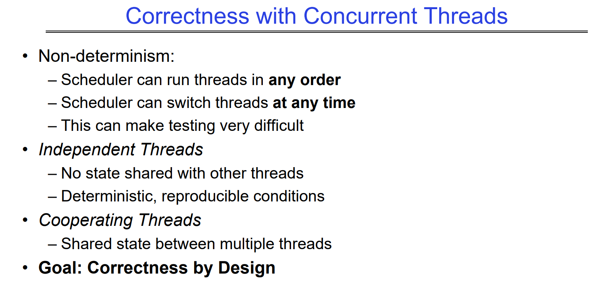

# Terminologies
## Multiprocessing vs Multiprogramming
> [!def]
> - **Multiprocessing**: Multiple CPUs(cores)
> - **Multiprogramming**: Multiple jobs/processes
> - **Multithreading**: Multiple threads/processes


## Concurrency vs Parallelism
> [!def]
> - **Concurrency** is about handling multiple things at once (MTAO)
> 	- Two threads on a single-core system. Imagine each threads as a task, then the core is multiplexing the threads by switching back and forth to complete these two tasks.
> 	- They are not in parallel.
> 	- Each thread handles or manages a separate thing or task.
> 	- But those tasks are not necessarily executing simultaneously!
> - **Parallelism** is about doing multiple things **simultaneously**


# Threads
## Reasons to use Threads
> [!def]
> 


## POSIX Thread APIs
> [!def]
> 
> https://pubs.opengroup.org/onlinepubs/7908799/xsh/pthread.h.html


## Fork-Join Pattern
> [!def]
> 
> Philosophy of `void*` see [Generics_Function_Pointers](../../Machine_Structures/1_C_Language/Generics_Function_Pointers.md)


## Thread State
> [!def]
> 
> More details see


## Thread Control Block
> [!def]
> Components that are shared between threads in the same process (e.g. heap, global variables) do not need to be persisted by each individual thread. 
> 
> However, each thread still needs to persist its registers and stack in the thread control block (TCB).
> 


## Thread Execution Stack
> [!def]
> 
> More details see 


## Thread Scheluding
> [!def]
> 


## Thread Race Conditions
> [!def]
> 


## Synchronizations
> [!def]
> 
> **More details of :**
> 1. Synchonization: 
> 2. Critical Section:
> 3. Lock: 


# System Call
## Overview
> [!def]
> 
> System call vector table are not the same across different operating systems. POSIX system call interface shares across some operating systems.
> 
> More details see


## Issue Syscalls
> [!def]
> 


## Interrupt Control
> [!def]
> 
> More details see 


## Exception Stack
> [!def]
> 


# Processes
## Process Management APIs
> [!def]
> 


### exit
> [!def]
> 


### fork
> [!def]
> 
> But parent and child have different address spaces.
> 
> 
> The calls to sleep() only affects the behavior of each process, making them slower in execution. In may change the interleaving a little bit, but the outcome is not affected.
> 
> Since processes have independent address spaces, so even if `int i` is defined globally, parent and child have different i, whose values are independent across processes. So the program will print as follows:
```c
#include <unistd.h>
#include <string.h>
#include <stdio.h>

int i;
pid_t cpid = fork();
if (cpid > 0) {
    for (i = 0; i < 10; i++) {
        printf("Parent: %d\n", i);
        // sleep(1);
    }
} else if (cpid == 0) {
    for (i = 0; i > ‐10; i‐‐) {
            printf("Child: %d\n", i);
            // sleep(1);
    }
}
```
> [!code] Output
> 


### fork-exec 


