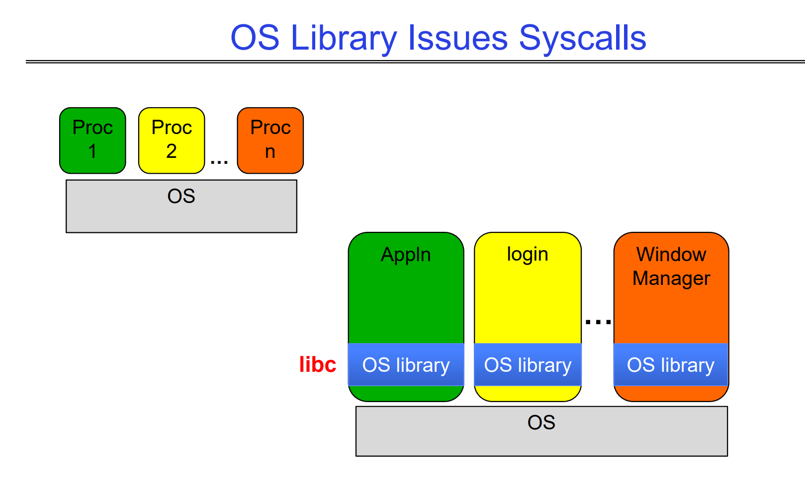
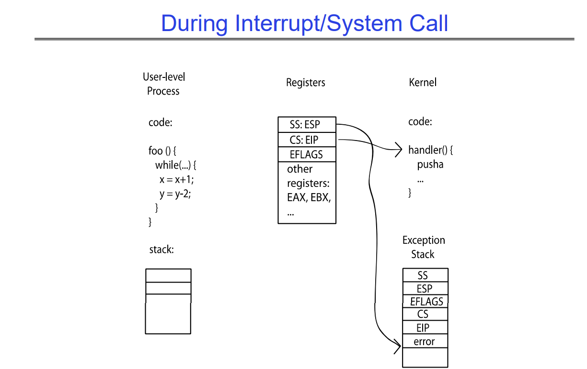

# Terminologies
## Multiprocessing vs Multiprogramming
> [!def]
> - **Multiprocessing**: Multiple CPUs(cores)
> - **Multiprogramming**: Multiple jobs/processes
> - **Multithreading**: Multiple threads/processes


## Concurrency vs Parallelism
> [!def]
> - **Concurrency** is about handling multiple things at once (MTAO)
> 	- Two threads on a single-core system. Imagine each threads as a task, then the core is multiplexing the threads by switching back and forth to complete these two tasks.
> 	- They are not in parallel.
> 	- Each thread handles or manages a separate thing or task.
> 	- But those tasks are not necessarily executing simultaneously!
> - **Parallelism** is about doing multiple things **simultaneously**


# Threads
## Reasons to use Threads
> [!def]
> 


## POSIX Thread APIs
> [!def]
> 
> https://pubs.opengroup.org/onlinepubs/7908799/xsh/pthread.h.html


## Fork-Join Pattern
> [!def]
> 
> Philosophy of `void*` see [Generics_Function_Pointers](../../Machine_Structures/1_C_Language/Generics_Function_Pointers.md)


## Thread State
> [!def]
> 
> More details see


## Thread Control Block
> [!def]
> Components that are shared between threads in the same process (e.g. heap, global variables) do not need to be persisted by each individual thread. 
> 
> However, each thread still needs to persist its registers and stack in the thread control block (TCB).
> 


## Thread Execution Stack
> [!def]
> 
> More details see 


## Thread Scheluding
> [!def]
> 


## Thread Race Conditions
> [!def]
> 


## Synchronizations
> [!def]
> 
> **More details of :**
> 1. Synchonization: Chapter 3 of notes
> 2. Critical Section: Chapter 3 of notes
> 3. Lock: Chapter 3 of notes


# System Call
## Overview
> [!def]
> 
> System call vector table are not the same across different operating systems. POSIX system call interface shares across some operating systems.
> 
> More details see


## Issue Syscalls
> [!def]
> 


## Interrupt Control
> [!def]
> 
> More details see 


## Exception Stack
> [!def]
> 


# Processes
Also in [Exceptions&Processes](../../Machine_Structures/8_Linking_OS_Processes/Exceptions&Processes.md)
## Process Management APIs
> [!def]
> 


### exit
> [!def]
> 


### fork
> [!def]
> 
> We say copying, we mean copy everything except PID, for example:
> 1. Copy the **address space(virtual memory)**, so that when we print the address of the same variable on teh address space, we get the same virtual address. But thanks to address translation techniques, parent and child have different physical address spaces so that process-level protection/isolation is guaranteed.
> 2. Copy the register(`%ESP, %EIP, %EAX`).
> 3. Copy the memory segment(Stack, Heap, Static, Code).
> 4. In short, it copies the caller's memory, registers and open files.
> 
> 
> The calls to sleep() only affects the behavior of each process, making them slower in execution. In may change the interleaving a little bit, but the outcome is not affected.
> 
> Since processes have independent address spaces, so even if `int i` is defined globally, parent and child have different i, whose values are independent across processes. So the program will print as follows:
```c
#include <unistd.h>
#include <string.h>
#include <stdio.h>

int i;
pid_t cpid = fork();
if (cpid > 0) {
    for (i = 0; i < 10; i++) {
        printf("Parent: %d\n", i);
        // sleep(1);
    }
} else if (cpid == 0) {
    for (i = 0; i > ‐10; i‐‐) {
            printf("Child: %d\n", i);
            // sleep(1);
    }
}
```
> [!code] Output
> 


### fork-exec 


### waitpid


### wait
> [!def]
> 


## Process Control Block
> [!def]
> An OS needs to run many programs, meaning there will be many processes. As a result, basic mechanisms such as switching between user processes and the kernel, switching among user processes through the kernel, and protecting the OS from user processes and among themselves need to be present in an operating system. 
> 
> To accomplish this, the kernel represents each process with a **process control block (PCB)**, a data structure that keeps track of the various properties of a process including (but not limited to) status, register state, process id (pid). 
> 
> The kernel scheduler allocates the CPU to different processes by maintaining a data structure containing the aforementioned PCBs. Other resources, such as memory and I/O, need to be managed and allocated as well, though not necessarily by the kernel scheduler.


## Concept Checks
> [!quiz] Sp24 Disc01 P2.1
> 
> Here since the copied address space is virtual, so print gives the same result.
> 
> The file descriptor of the two processes are pointing to the same `vnode` of the openfile table in the system so they will be reading the same file possibly with different offset within file.

> [!quiz] Sp24 Disc01 P2.2
> 


# Kernel Structure
> [!important]
> 


