# Overview
> [!overview]
> 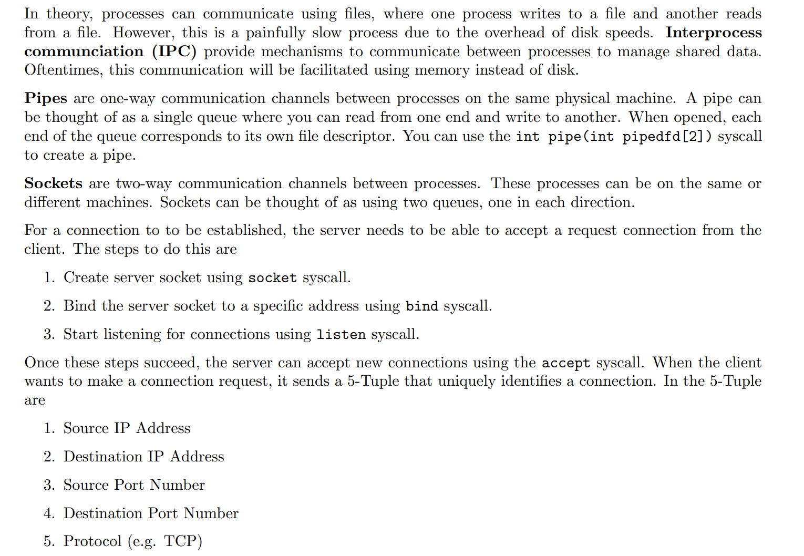


# Pipes - Producer-Consumer Model
## What are pipes
> [!def]
> _Pipe_ is a one-way condulet that carries _byte stream_, from a file to another. The two ends of the condulent, i.e. the sending file and the receiving file, are represented by their file descriptors.
> 
> Note that pipe is unidirectional, which means that at the same time, data can only flow from one end to the other.
```
 ____          out       p   i   p    e       in         ____  
|    |╲        ─────────────────────────────────        |    |╲  
| R  └─| file  <───    0 1 0 1 1 0 1 0 1    <───  file  | W  └─|  
└──────┘(recv) ───────────────────────────────── (send) └──────┘
```
> [!def]
>  In POSIX's C extension, `dprintf()` can be used to write formatted strings to a file designated by a file descriptor (its usage is like `fprintf()`). Unfortunately, the designers seemed to have forgotten to write "dscanf( )".
>  
>  There is also a system call named `pipe()`. It takes in a integer array of length two, and fills the array with two newly created file descriptors, **the second file being able to send byte stream to the first**. It returns `0` on seccess. On error, `-1` is returned, and `errno` is properly set.
```
                 ┌───────┬───────┐ pipe() ┌────────┬────────┐  
    int fds[2]   │       │       │   ==>  │read(R) │write(W)│  
                 └[0]────┴[1]────┘        └[0]─────┴[1]─────┘            
```
> [!note]
> Now that the system call `fork()` faithfully duplicate everything, including file descriptors, we can use `pipe()` to set up a communication channel between the parent and child process.
> 
> Corresponding file descriptors in the parent and the child process **point to the same file** via a shared entry in the system-wide file entry table. So if the parent or the child writes to a sending file, both the parent and child can receive the data from the receiving file. So by `fork()`, there are 4 channel established. However, note that once data is read from an receiving end, that part of data is gone - it cannot be read again from another receiving end (hence the name _stream_). So effectively, the parent and child could **race for the data** if they are both reading - which is usually not a good thing. Normally, if you want a bidirectional communication mechanism between the parent and child, you would need to set up two pipes - one for downlink, one for uplink.
```
    .PID 101.. ..   .PID 102.. ..       ┌───┬───┐   ┌───┬───┐ file  
    :   ┌───┬───────────┐       :       │ R │ W │   │ R │ W │ desriptor  
        │   │   :   :   │               └─┬─┴─┬─┘   └─┬─┴─┬─┘ tables  
    : ┌─▼─┬─┴─┐       ┌─▼─┬───┐ :         │   └──┬────│───┘    
      │ R │ W │ :   : │ R │ W │           └─┬────│────┘        
    : └─▲─┴───┘       └─▲─┴─┬─┘ :           │    │                      
        │       :   :   │   │          ..─┬─▽──┬─▽──┬─.. file entry      
    :   └───────────────┴───┘   :         │ <=pipe= │    table     
    .. parent ...   ... child ...      ..─┴out─┴──in┴─.. (system-wide)    
​  
      two separate FD tables      child shares file entries with parent
```


## Producer-Consumer Model
> [!important] A&D Ch3 pp115
> 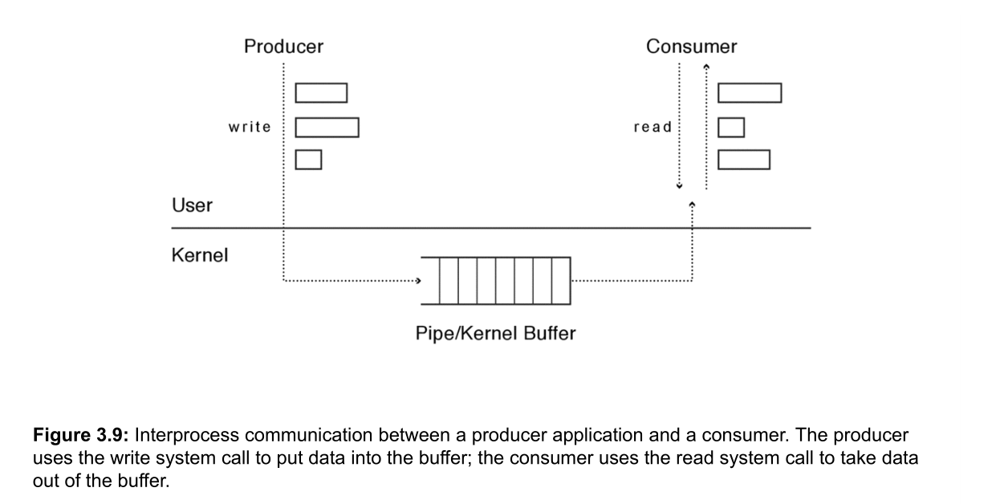
> The kernel buffer allows each process to run at its own pace. There is no requirement that each process have equivalent amounts of work to do.
> - **If the producer is faster than the consumer**, the kernel buffer fills up, and when the producer tries to write to a full buffer, the kernel stalls the process until there is room to store the data.
> - **If the consumer is faster than the producer**, the buffer will empty and the next read request will stall until the producer creates more data.
> - In UNIX, when the producer finishes, it closes its side of the pipe, but there may still be data queued in the kernel for the consumer. Eventually, the consumer reads the last of the data, and the read system call will return an “end of file” marker. Thus, to the consumer, there is no difference between reading from a pipe and reading from a file.
> - Using kernel buffers to decouple the execution of the producer and consumer reduces the number and cost of context switches.
> 
> We can use [Semaphores](../3_Synchronizations/Thread_Synchonization.md#Semaphores%20to%20Coorindate%20Access) to address this problem in a synchronized way.


## I/O Redirection
Also see [I/O Redirection](../../Machine_Structures/8_Linking_OS_Processes/System_Level_IO.md#I/O%20Redirection)

### dup
> [!important]
> `dup(fd)` will copy `fd` to the smallest available file descriptor of a process.
> 
> We can use `dup(fd)` to make implementations such as `echo hello | wc` possible. 
> 1. `echo` prints the result to the stdout(its fixed implementation), which means it will write results to `fd1` by `write(1, buf, size)`. 
> 2. `wc` takes the stdin as input, which means it will read from stdin like `read(0, buf, size)`. 
> 3. In this case(left command -> stdout, right command <- stdin), we can use `dup` to redirect the file descriptors in the file descriptor table for the processes that run the left command and right command.
> 4. In the left command `echo hello`, we can use `close(1);dup(p[1])` to make `echo` write to the write end of the pipe.
> 5. In the right command `wc`, we can use `close(0);dup(p[0])` to make `wc` read from the read end of the pipe.
> 
> Below is the change before and after the call to `dup`:
> 
> Before `dup`, both child processes copies the file descriptor table from the parnet, so they all refer to the same pipe at the open file table, as shown below:
> 
> 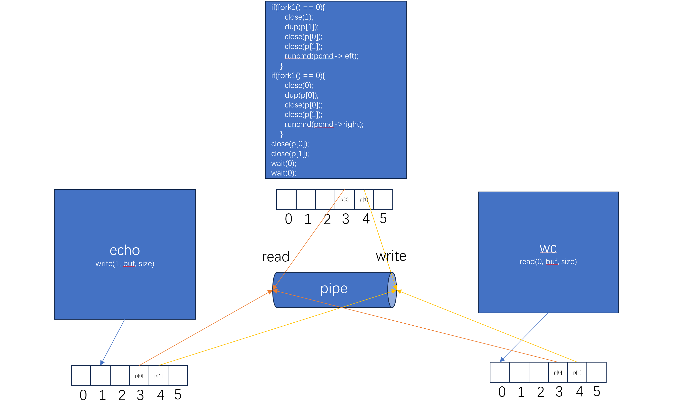
> After we call `dup` in both subprocesses, we see `echo`'s stdout has been redirected to the write and of the pipe and `wc`'s stdin has been redirected to the read end of the pipe.
> 
> 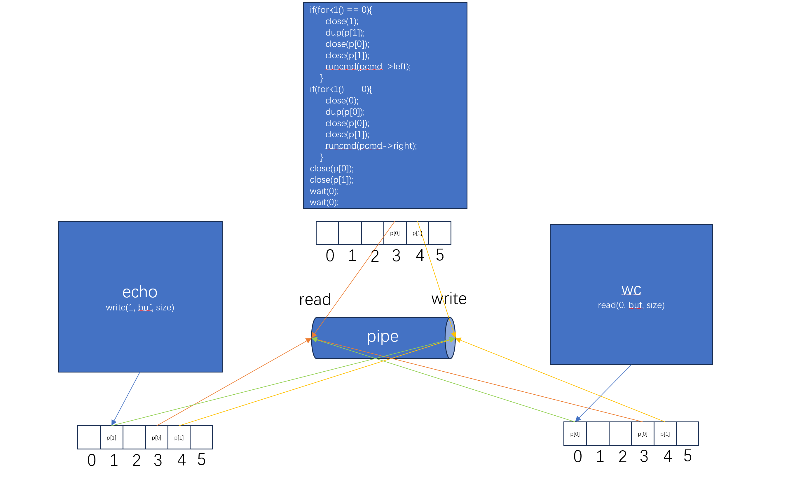


### dup2
> [!def]
> System call `dup2()` takes two file descriptors as arguments. It **de-associate**s the second FD and its corresponding file, and **redirect** the second FD to the file pointed to by the first FD.

> [!important]
> `dup2(old_fd, new_fd)` is similar to the `dup(fd)`, except that `dup2` can specify which file descriptor to be redirected. 
> 
> Memorize it as `old_fd` copies to `new_fd`.
> 
> `dup2(fd, 0)` is like `close(0);dup(fd);`.
> 
> **SIDE NOTE:** If the second file descriptor does not exist before, then `dup2()` will create it, and associate it to the file which the first file descriptor points to. Related system calls: `dup()`(takes only one FD as argument, returns a new FD that points to the same file) and `dup3()`(similar to `dup2()` but takes an option flag as the 3rd argument).
> - On success, these system calls return the second FD (which was passed in as the second argument). On error, `-1` is returned, and `errno` is properly set.
> - A `dup2()` can be used to redirect the standard input/output stream. For example, if we want a process to stop reading from the console stream, but from a given file stream, represented by a file descriptor `fdIn`, the code is this: `dup2(fdIn, STDIN_FILENO); /* STDIN_FILENO=the stdin stream FD */`     
> - Thereafter, any read request against the file descriptor STDIN_FILENO (typically `0`) will still succeed, but by pulling data from the given file, no longer from the console input stream as it did before.
```
    
    ┌────────────┬────────────┬────────────┐  
    │STDIN_FILENO│    ...     │   fdIn     │ file decriptor table  
    └──────┬─┬───┴────────────┴─────┬──────┘  (for a process)  
           │ └────────────────────┐ │   
           |        △             │ │         
           X  ─ ─ ─ ┘redirect     │ │  
           |                      │ │                  
       ┌───▼─────┬────────────┬───▼─▼──┐       
       │ console │    ...     │  given │     file entry table  
       │  input  │            │  file  │       (system wide)  
       └───┬─────┴────────────┴────┬───┘   
       ┌───▼─────┬────────────┬────▼───┐       
       │ console │    ...     │  given │     vnode table  
       │  input  │            │  file  │      (system wide)  
       └─────────┴────────────┴────────┘     
```
> [!tips]
> Then, we can close the original file descriptor `fdIn` by using `close(fdIn)`, so the process can only access the given file through file descriptor `STDIN_FILENO`.
> 
> Note that the each process's file descriptor table is maintained by the kernel and resides in the kernel space (not in the process's memory space), and identified by the corresponding process's PID. If this process is overwritten by calling `execvp()`, its file descriptor table remains intact, and the newly-initiated program, which continues to use the old PID, continues to use that table.
> 
> That means, if a process redirect its `stdin` stream (FD = `0`, which normally should read from console) to another file, and this process is transformed into another program's process by calling `execvp()`, then the new program's FD `0` continues to point to the this file, not to the console input as it normally should.
> 
> Pause and think for a while: `fork()`, `waitpid()`, `execvp()`, `pipe()`, `dup2()` - for each of them: a) what does it do (in one sentence)? b) does it affect the calling process's memory space? If so, how? c) does it affect the calling process's FD table? If so, how.
> 
> In shell, you can use `<` and `>` to redirect standard input/output of a program that is called from a cammand line. For example: `$ /bin/sh < Command.txt` `$ echo This repo is for CS110 > Readme.txt`

### An example: implementing `subprocess()`
> [!task]
> Suppose we have an executive named `sort`, which reads in character strings (separated by newlines and ends by Ctrl+D) from its `stdin` and sorts those strings in an alphabetic order, and prints them to its `stdout`.
> 
> Now, we want `sort` to read hard-coded strings from a program `driver`, instead of from the console, and outputs the result to the console.
> 
> SIDE NOTE: "subprocess" is just another term for "child process".

#### Analysis
> [!exp]
> - The program `driver` has two functions: `main()` and `subprocess()`, implemented in two C files.
> - We let the `driver` process fork itself, creating an identical child process, and establish a pipe between the parent and the child. The child redirects its `stdin` stream from the console to the pipe's reading end and uses `execvp()` to call our program `sort`.
> - The parent writes data to the pipe and the child (now it is `sort`'s process) receives it from its `stdin` file stream, which is connected to the pipe, and outputs the result through `stdout` stream to the console.
> - We need to _seal_ unused ends of the pip by close the corresponding FD using `close()`. It prevents accidental reading/writing which may interrupt the byte stream. But if the pipe end is associated with multiple FDs, then the pipe end remains open until all FDs are closed. More importantly, closing a pipe's writing-to end **sends an EOF signal** to the receiver, otherwise the receiver would keep waiting for more input (in console input, EOF is sent by a Ctrl+D).
> - A key observation is that, after `execvp()`, the process's PID remains the same and its **file descriptor table continues to be effective**, though this process is completely taken by another program.
> - Another note is that, though the `main()` function calls the `subprocess()` function, the two functions are still in one process! Functions are just for human - after compilation and linking, they become fused in one routine of instructions and is loaded into the text segment of a process's memory space.
> 
> An illustration of the pipe - it has four ends after `fork()`!
```
 parent      fds[1] (W) ─────────────────────▶ fds[0] (R)                   
                        ──────────┐    ┌─────▶  <sealed>        
                                  │    │                                 
                                  │    │                                 
                             ┌────│────┘                                
                             │    │          ┌─▷ STDIN_FILENO  
                             │    │          │           
 child        fds[1] (W) ────┘    └──────────▶ fds[0] (R)      
              <sealed>   ────────────────────▶ <closed>
```
> [!exp]
> An illustration of the processes:
```
          execvp()   "/bin/sh -c /usr/bin/sort"           reaped  
subprocess  ┌──●~~~~~~~~~~~~~~~~~~~~~~~~~~~~~~~~~~~~~~~●─ ─ ○   
            │  /bin/sh △ △ △     △ STDIN_FILENO(stdin)    
            │          : : : via :   ||                   
driver      │          : : : pipe: fds[1]                   
────────────┴──────────●─●─●─...─●───────(w a i t)────────────▶  
          fork()       words[i]  EOF(Ctrl+D)

```
> [!exp]
> The full picture in the shell.
> Entry in file entry table: process (FD value), ...  
> console input:   shell(0), driver(0),   
> console output:  shell(0), driver(1), /bin/sh(1), /usr/bin/sort(1)  
> pipe's in file:  driver(fds[1])  
> pipe's out file: /bin/sh(0), /usr/bin/sort(0)
```
┴ fork ● event ○ reap                             △ stdout (to console)  
                                                  :  
/usr/bin/sort process   ┌++●**********************●*●- ○  
                        │   △ △ △     △ stdin          
                        │   : : :     :  ||            
/bin/sh process ┌~~~●+++┴+++:+:+:+++++:++||++(wait)+++++●─ ○  
                │   /bin/sh : : :     : stdin     
                │           : : : via :  ||                
                │           : : : pipe: fds[1]             
driver   ┌──●~~~┴~~~~~~~~~~~●~●~●~...~●~~~~~~~(w a i t)~~~~~●─ ○   
         │  driver          words[i]  EOF                      
         │                                  
shell ───┴─────────────────────────(w a i t)────────────────────────▶

```


#### The code
> [!code] Main Function
```c
/* main.c */  
typedef struct {  
    pid_t pid;    /* the subprocess's pid */  
    int supplyfd; /* this FD is the writing-to end of the subprocess */  
} subprocess_t;  
​  
subprocess_t subprocess(const char *command);  
​  
int main() {  
    /* create a subprocess (i.e. child),   
     * get the subprocess's pid and writing-to end */  
    subprocess_t sp = subprocess("/usr/bin/sort");   
​  
    const char *words[] = { /* hard-coded words */  
      "felicity", "umbrage", "susurration", "halcyon",  
      "pulchritude", "ablution", "somnolent", "indefatigable"  
    };  
​  
    /* write the words to the subprocess through the writing-to end */  
    for (int i = 0; i < sizeof(words); i++) {  
        /* note that "%s" format of a char* is the content of the string,  
         * not the value of the pointer itself.  
         */  
        dprintf(sp.supplypid, "%s\n", words[i]);  
    }  
​  
    /* close the writing-to end,   
     * effectively sending a Ctrl+D (EOF) to the receiver */  
    close(sp.supplypid);  
​  
    /* wait on the child and reap it - don't make the child an orphan! */  
    int status;  
    pid_t pid = waitpid(sp.pid, &status, 0);  
    return pid == sp.pid && WIFEXITED(status) ? WEXITSTATUS(status) : -1;  
}
```

> [!code] 
> Another function. Note that a new function does NOT correspond to a new process.
> 
> Note that if `execvp()` succeeds, then the rest of the code is NOT executed, as the calling process is completely overwritten and rebooted by another program.
```c
/* subprocess.c */  
typedef struct {  
    pid_t pid;    /* the subprocess's pid */  
    int supplyfd; /* this FD is the writing-to end of the subprocess */  
} subprocess_t;  
​  
subprocess_t subprocess(const char *command) {  
    int fds[2];  
    pipe(fds); /* setting up a pipe */  
       
    /* create a subprocess, i.e. child process,  
     * and construct a subprocess_t instance to return */  
    subprocess_t sp = {fork(); fds[1]};   
​  
    if (sp.pid == 0) { /* for the child process */  
      /* prevent the child from writing to the pipe */  
      close(fds[1]);  
​  
      /* redirect the child's stdin FD to the pipe's reading end,  
         and de-associate fd[0] from the reading end */  
      dup(fds[0], STDIN_FILENO);   
      close(fds[0]);  
​  
      /* now, execute the intended program (/bin/sh) by execvp() */  
      /* since the called program inherits the caller process's FD table,  
       * its stdin stream is connect to the pipe's reading end */  
      char *argv[] = {"/bin/sh", "-c", (char *) command, NULL};  
      execvp(argv[0], argv);  
​  
      /* if execvp() succeeds, then /bin/sh reads from the pipe,   
       * getting the words published by the parent */  
      /* if execvp() succeeds, the child process won't reach this line */  
    }  
​  
    /* if execvp() succeeds, the child process won't reach this line */  
      
    close(fds[0]); /* prevent the parent from reading from the pipe */  
    return sp;  
}
```


## Important Notes
> [!important]
> **Several things to note:**
> 1. Parent can let the child know that it has finished writing content to the write end of the pipe by closing the write end of the pipe(close(pipr[1])), where it essentially sends an EOF (End-Of-File) to the reading end of the pipe. Then when child process attempts to read(pipe[0],...), it returns 0. 
> 2. In other words, If no data is available, a `read` on a pipe waits for either data to be written or for all file descriptors referring to the write end to be closed; in the latter case, read will return 0, just as if the end of a data file had been reached.
> 3. **If the parent writes to a pipe with no readers (all read ends closed),** the parent process will receive a `SIGPIPE` signal. By default, this signal terminates the process. This behavior serves as a notification mechanism indicating that the data being sent is not being read by any process.
> 4. If a parent forgets to close the write end of the pipe and call the `wait` and one of its child hold the read end of pipe, then the child will also wait for the parent to send more data since it has not reached the end of the file. But in this case, we cause a deadlock situation where both parent and child are waiting for each other. **So as a reminder, if parent have finished writing to the pipe, it should close it as a signal between processes.**


# Sockets - Client-Server Model
More see [Sockets](../../Machine_Structures/11_Network_Programming/Sockets.md)

## What are Sockets
> [!def]
> 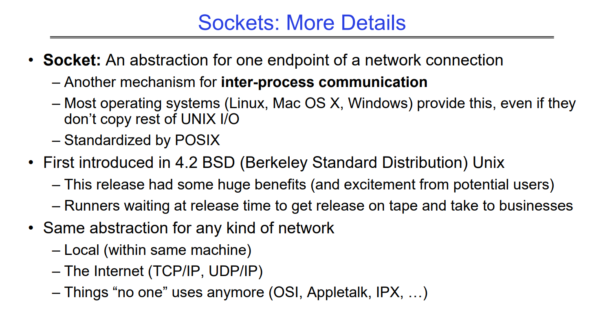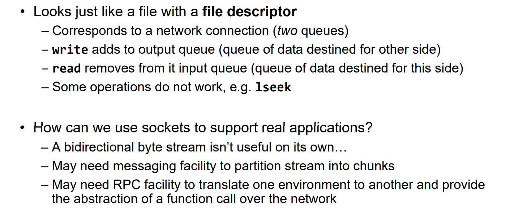


## Socket Creation
> [!important]
> 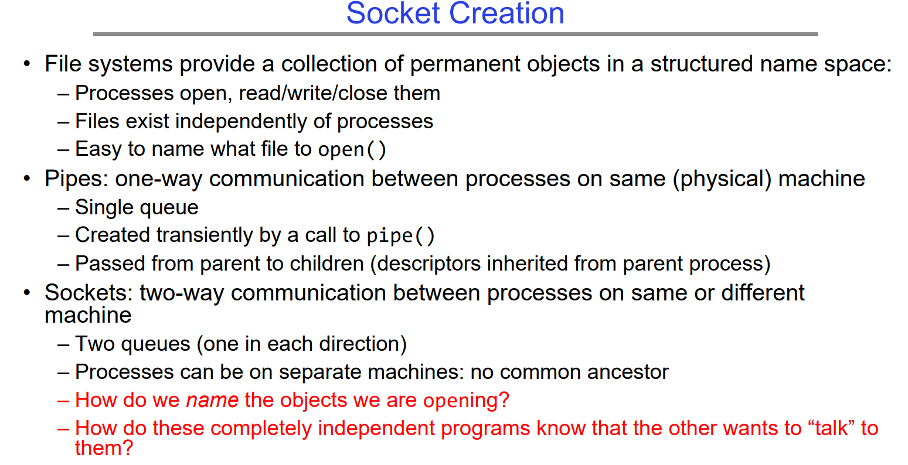


## Conneection Setup Over TCP/IP
> [!def]
> 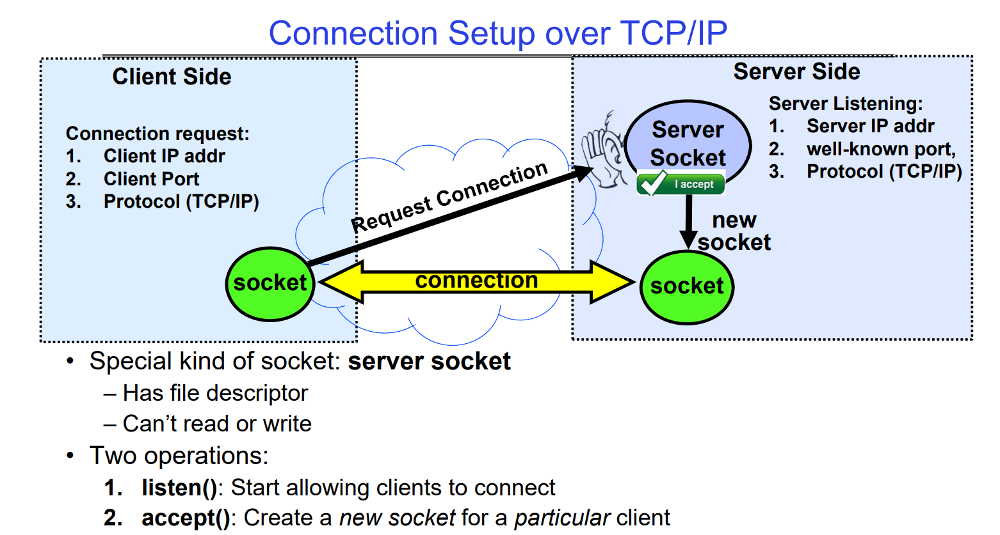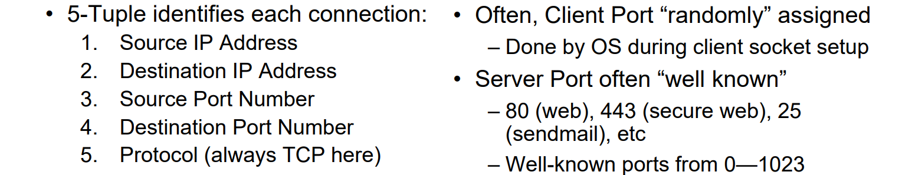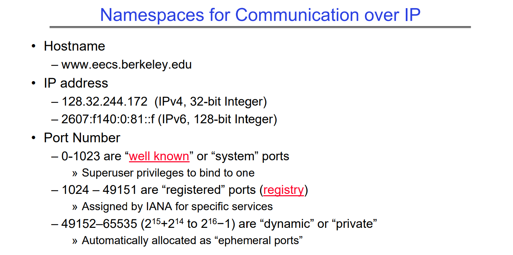


## Client-Server Model
> [!important]
> 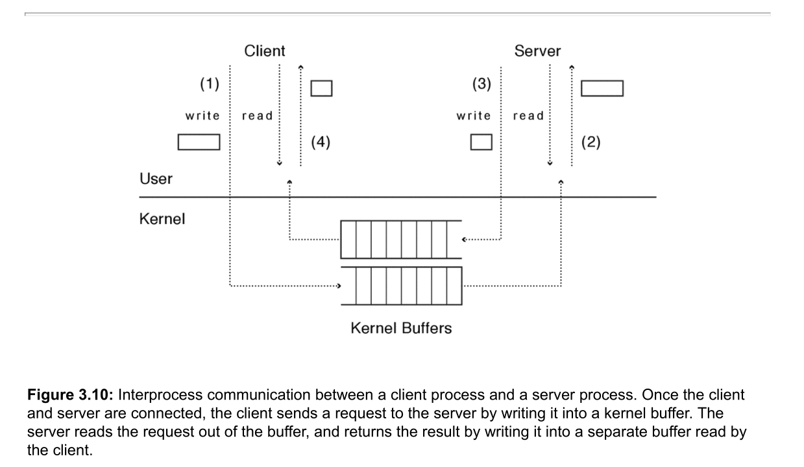
> Instead of a single pipe, we create two, one for each direction. To make a request:
> - The client writes the data into one pipe, and reads the response from the other.
> - The server does the opposite: it reads requests from the first pipe, performs whatever is requested (provided the client has permission to make the request), and writes the response onto the second pipe.


### Echo Server
> [!example] Echo Server
> 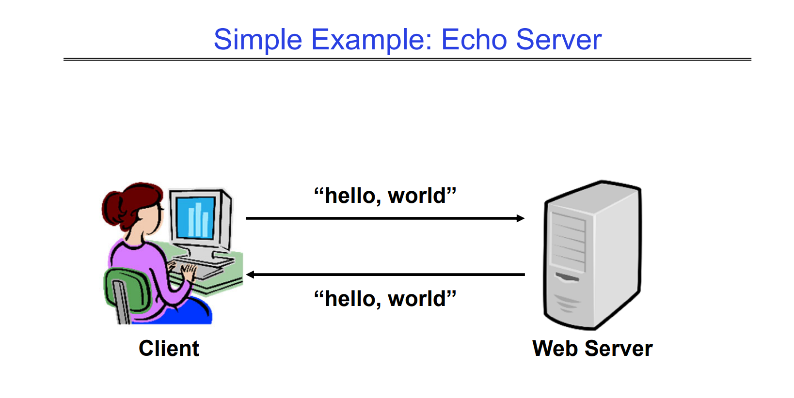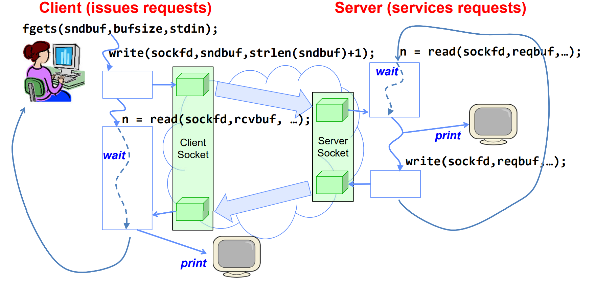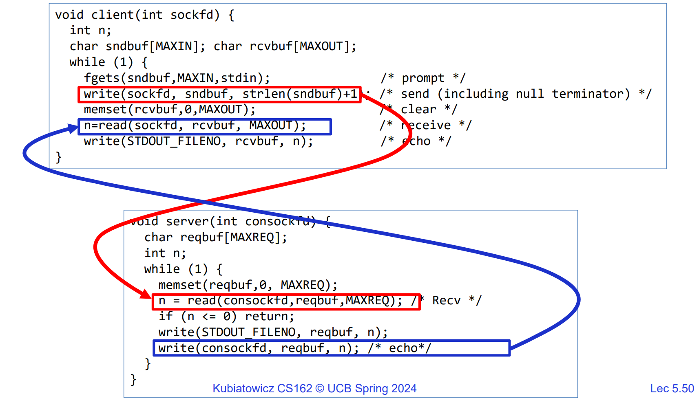


### Web Server
> [!example] Web Server
> 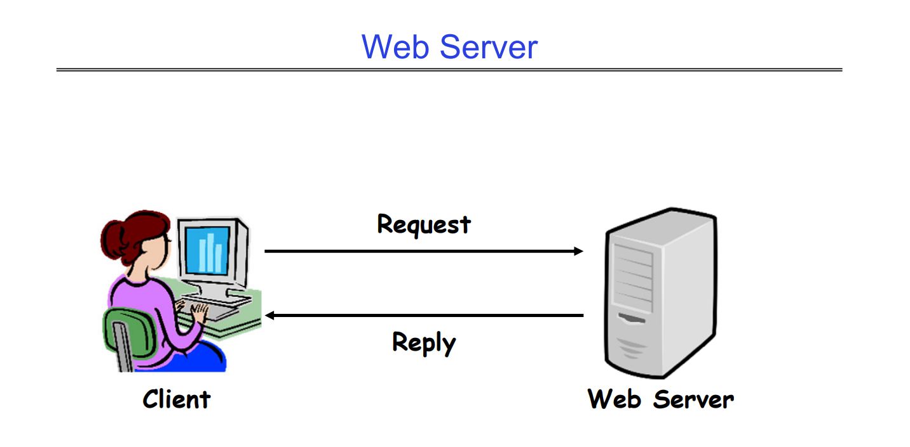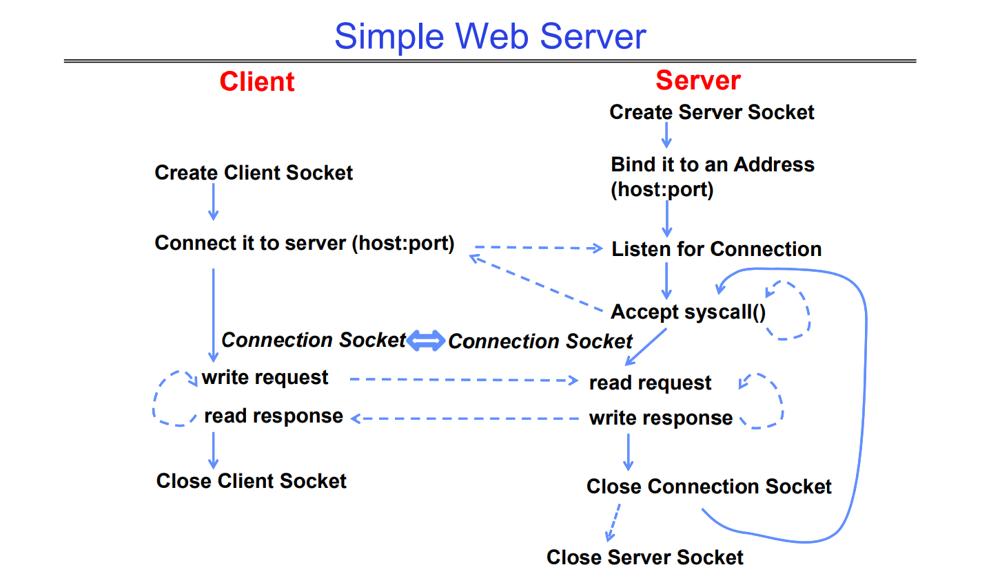


## Client-Server Implementations
### Client Implementation
> [!important]
> 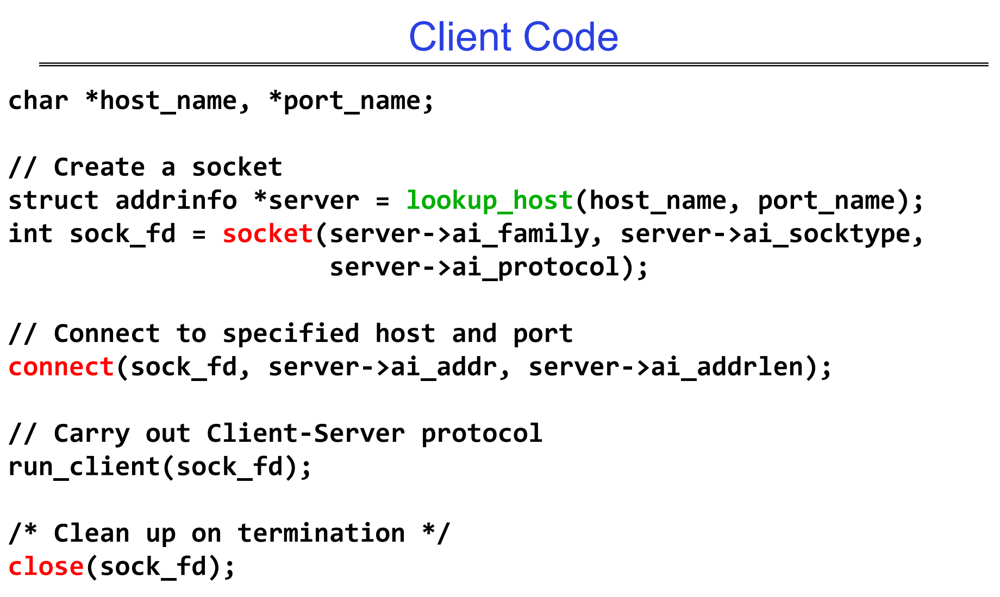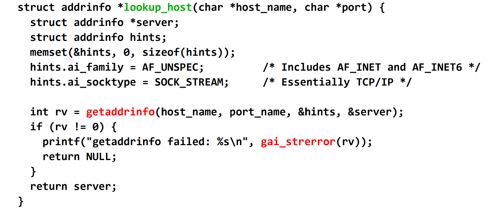


### Server Implementations
#### Single-Threaded Server
> [!code]
> 


#### Concurrent Server
> [!code]


# Signals
See [Signals](../../Machine_Structures/8_Linking_OS_Processes/Signals.md)


