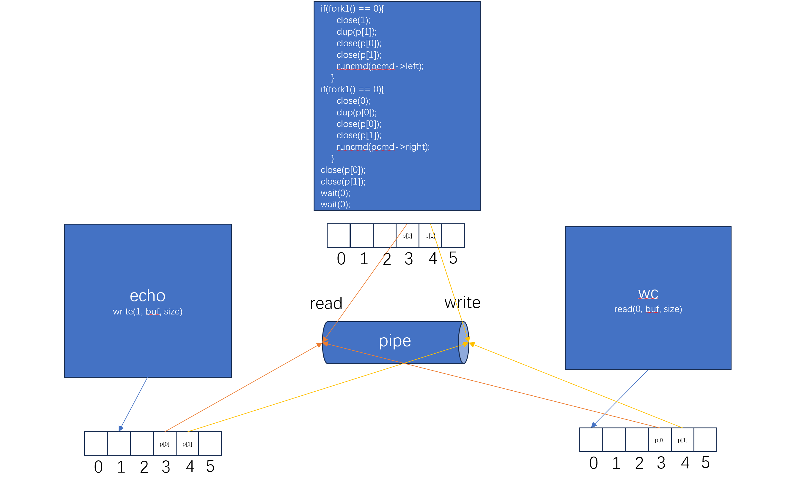
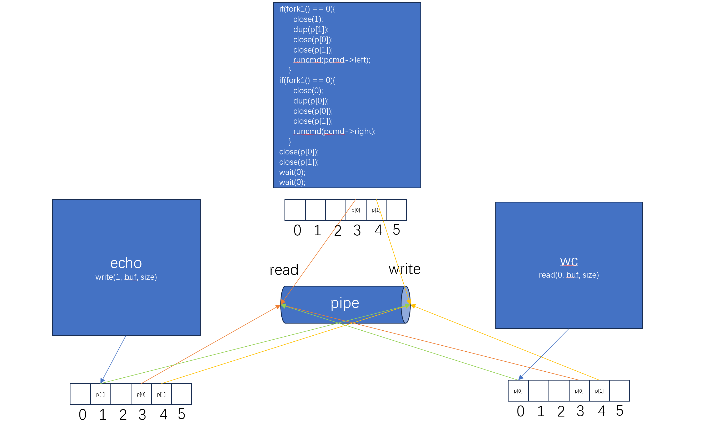

# Sockets
## Server-Client Model

## Subprocess

# Signals
See [Signals](../../Machine_Structures/8_Linking_OS_Processes/Signals.md)

# Pipes
## Important Notes
> [!important]
> **Several things to note:**
> 1. Parent can let the child know that it has finished writing content to the write end of the pipe by closing the write end of the pipe(close(pipr[1])), where it essentially sends an EOF (End-Of-File) to the reading end of the pipe. Then when child process attempts to read(pipe[0],...), it returns 0. 
> 2. In other words, If no data is available, a `read` on a pipe waits for either data to be written or for all file descriptors referring to the write end to be closed; in the latter case, read will return 0, just as if the end of a data file had been reached.
> 3. **If the parent writes to a pipe with no readers (all read ends closed),** the parent process will receive a `SIGPIPE` signal. By default, this signal terminates the process. This behavior serves as a notification mechanism indicating that the data being sent is not being read by any process.
> 4. If a parent forgets to close the write end of the pipe and call the `wait` and one of its child hold the read end of pipe, then the child will also wait for the parent to send more data since it has not reached the end of the file. But in this case, we cause a deadlock situation where both parent and child are waiting for each other. **So as a reminder, if parent have finished writing to the pipe, it should close it as a signal between processes.**

## I/O Redirection
Also see [I/O Redirection](../../Machine_Structures/8_Linking_OS_Processes/System_Level_IO.md#I/O%20Redirection)

### dup
> [!important]
> `dup(fd)` will copy `fd` to the smallest available file descriptor of a process.
> 
> We can use `dup(fd)` to make implementations such as `echo hello | wc` possible. 
> 1. `echo` prints the result to the stdout(its fixed implementation), which means it will write results to `fd1` by `write(1, buf, size)`. 
> 2. `wc` takes the stdin as input, which means it will read from stdin like `read(0, buf, size)`. 
> 3. In this case(left command -> stdout, right command <- stdin), we can use `dup` to redirect the file descriptors in the file descriptor table for the processes that run the left command and right command.
> 4. In the left command `echo hello`, we can use `close(1);dup(p[1])` to make `echo` write to the write end of the pipe.
> 5. In the right command `wc`, we can use `close(0);dup(p[0])` to make `wc` read from the read end of the pipe.
> 
> Below is the change before and after the call to `dup`:
> 
> Before `dup`, both child processes copies the file descriptor table from the parnet, so they all refer to the same pipe at the open file table, as shown below:
> 
> 
> After we call `dup` in both subprocesses, we see `echo`'s stdout has been redirected to the write and of the pipe and `wc`'s stdin has been redirected to the read end of the pipe.
> 
> 

### dup2
> [!important]
> `dup2(old_fd, new_fd)` is similar to the `dup(fd)`, except that `dup2` can specify which file descriptor to be redirected. 
> 
> Memorize it as `old_fd` copies to `new_fd`.
> 
> `dup2(fd, 0)` is like `close(0);dup(fd);`.

