# System Calls
> [!concept]
> 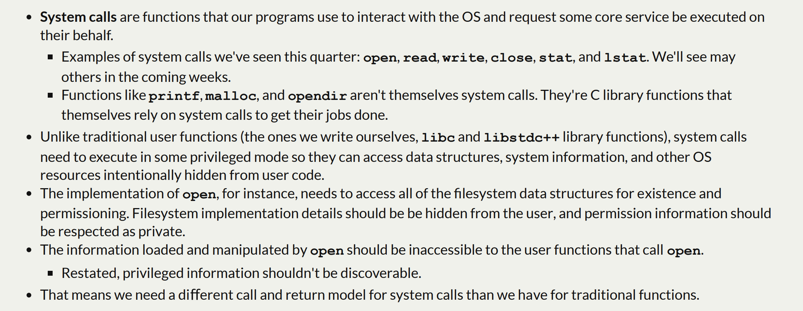

# System Calling Conventions
> [!concept]
> 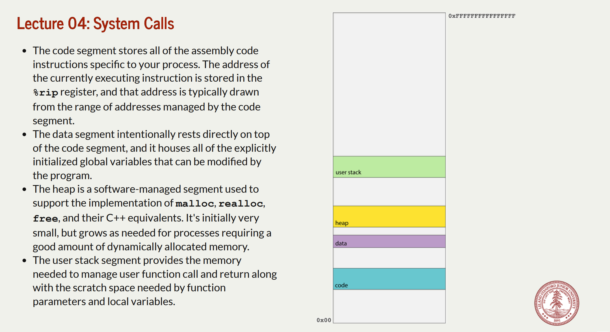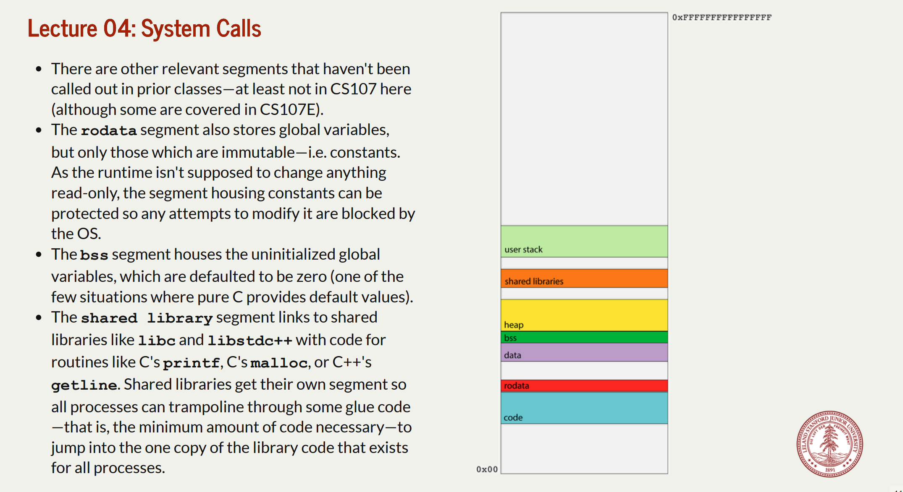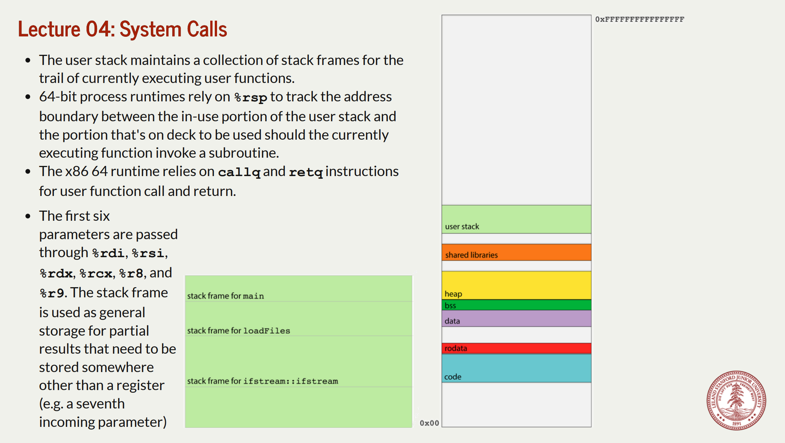
> - The user function call and return protocol, however, does little to encapsulate and privatize the memory used by a function. 
> - Consider, for instance, the execution of **loadFiles** as per the diagram below. Because **loadFiles**'s stack frame is directly below that of its caller, it can use pointer arithmetic to advance beyond its frame and examine—or even update— the stack frame above it. 
> - After **loadFiles** returns, **main** could use pointer arithmetic to descend into the ghost of **loadFiles**'s stack frame and access data **loadFiles** never intended to expose. Because incrementing stack pointer doesn't wipe out the data in the frame.
> - Functions are supposed to be modular, but the function call and return protocol's support for modularity and privacy is pretty soft.
> 
> 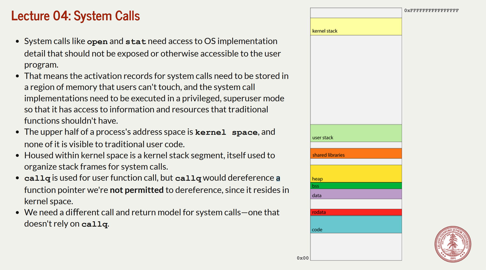
> - The relevant opcode is placed in **%rax**. Each system call has its own opcode (e.g. 0 for **read**, 1 for **write**, 2 for **open**, 3 for **close**, 4 for **stat**, and so forth). 
> - The system call arguments—there are at most 6—are evaluated and placed in **%rdi, %rsi, %rdx, %r10, %r8,** and **%r9**. ==Note the fourth parameter is %r10, not %rcx==. **Note that by design, there are no system calls with more than six input parameters.**
> - The system issues a software interrupt (otherwise known as a trap) by executing **syscall,** which prompts an interrupt **handler** to execute in superuser mode. 
> - The interrupt handler builds a frame in the kernel stack, executes the relevant code, places any return value in %rax, and then executes iretq to return from the interrupt handler, revert from superuser mode, and execute the instruction following the syscall.
> - If **%rax** is negative, **errno** is set to abs(**%rax**) and **%rax** is updated to contain a ­**-1**. If **%rax** is nonnegative, it's left as is. The value in is **%rax** then extracted by the caller as any return value would be.

## Two Stacks Per Process
> [!important]
> 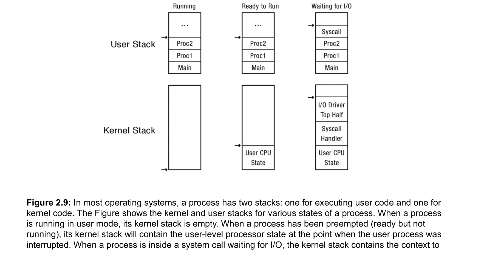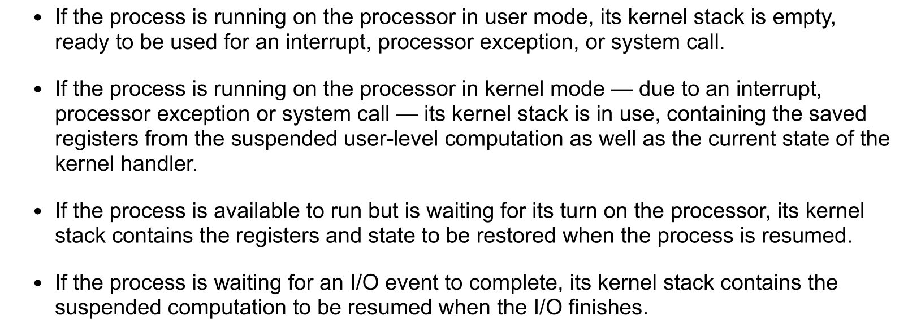

## Mode Transfer
> [!important]
> First, we provide some background on the x86 architecture. The x86 is segmented, so 
> 1. Pointers come in two parts:
> 	1. A **segment**, a region of memory such as code, data, or stack.
> 	2. An **offset within that segment**. The current user-level instruction is a combination of the code segment (cs register) plus the instruction pointer (eip register). Likewise, the current stack position is the combination of the stack segment (ss) and the stack pointer within the stack segment (esp). 
> 	3. For example, to represent a pointer(address), we write `SS:ESP` for stack pointer, and `CS:EIP` for instruction pointer.
> 2. The **current privilege level** is stored as the **low-order bits of the cs register** rather than in the processor status word (eflags register). 
> 3. The **eflags register** has condition codes that are modified as a by-product of executing instructions; the eflags register also has other flags that control the processor’s behavior, such as whether interrupts are masked or not.

### Before System Call
> [!concept]
> 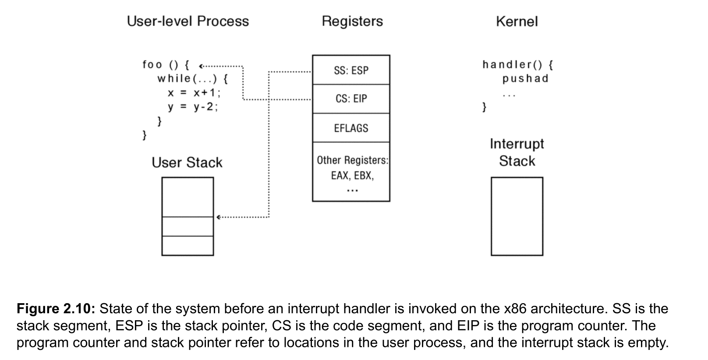

### Prologue of Syscall Handler
> [!concept]
> When a processor exception or system call trap occurs, the hardware carefully saves a small amount of the interrupted thread state:
> 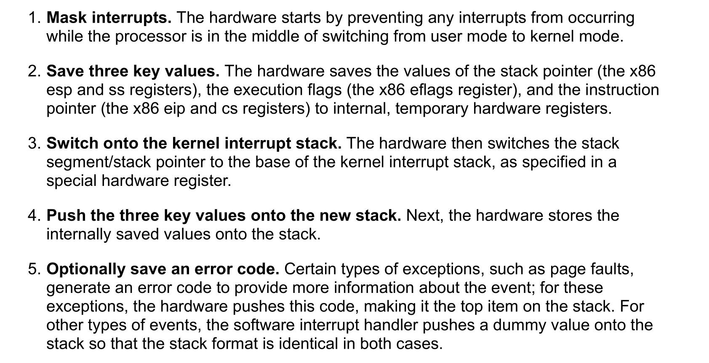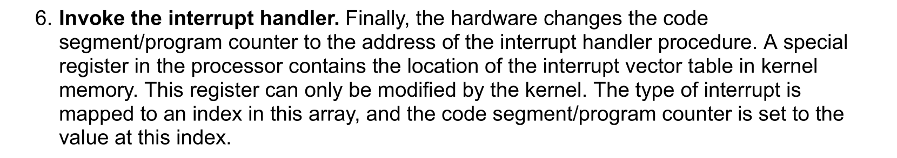
> 
> The handler must first save the rest of the interrupted process’s state — it needs to save the other registers before it changes them! The handler pushes the rest of the registers, including the current stack pointer, onto the stack using the x86 pushad instruction.
> 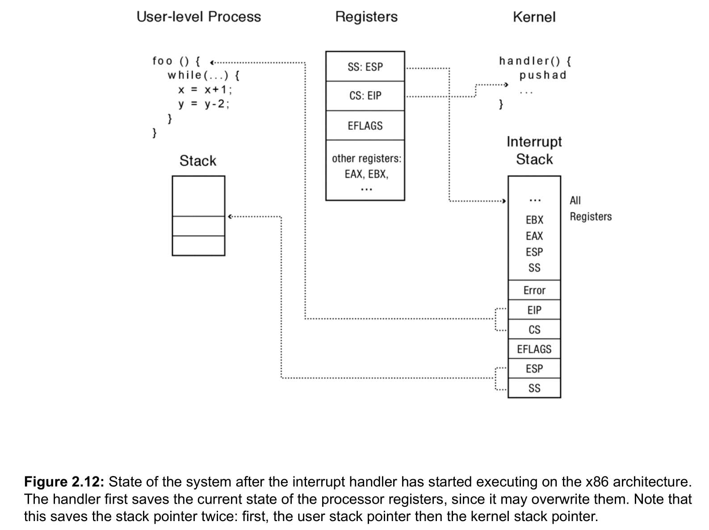
> The handler must then save the rest of the interrupted process’s state — it needs to save the other registers before it changes them! The handler pushes the rest of the registers, including the current stack pointer, onto the stack using the x86 pushad instruction.
> 
> Once the handler has saved the interrupted thread’s state to the stack, it can use the registers as it pleases, and it can push additional items onto the stack. So, the handler can now do whatever work it needs to do.

### After System Call
> [!concept]
> 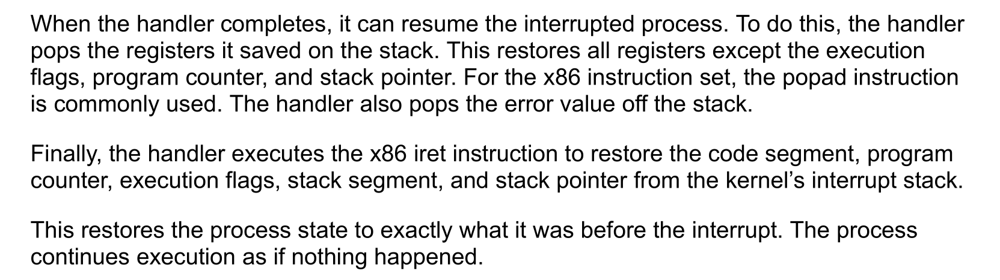

## Syscall Handler
> [!def]
>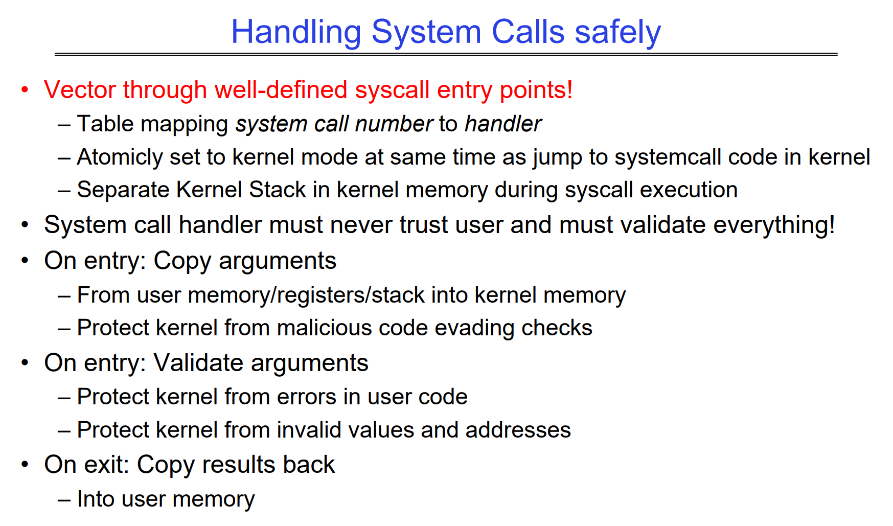 
> **How does the syscall handler protect the kernel from corrupt or malicious user code?**
> 
> When executing a syscall, the user program specifies an index instead of the direct address of the handler, meaning the user program cannot directly execute in kernel mode. 
> 
> The **arguments will be validated** by the handler to make sure the user is not intending a malicious attack. Moreover, the handler will **copy over the arguments instead of using them** from the user stack directly. 
> 
> This is necessary because the user program could change the arguments after the handler performs initial checks for malicious purposes (i.e. https://en.wikipedia.org/wiki/Time-of-check_to_time-of-use ). 
> 
> After the syscall finishes, the results are **copied back** in to user memory. The user process is not allowed to access the results stored in kernel memory for security reasons.

# Traps and System Call(Xv6)
## 基本概念
> [!def]
> 三种导致CPU中断当前指令的执行，转而去处理当前事件的情况，以下三种情况统称为`trap`:
> - <u>system call</u>: (系统调用) 当用户程序执行到`ecall`指令时，会触发中断让`kernel`处理
> - <u>exception</u>: (异常处理) 用户或者内核态执行到一些非法指令，比如除零错误或者地址无效
> - <u>device interrupt</u>: (设备中断) 当一个外部设备发送`signal`的时候，比如磁盘将数据完全写入内存中时

## Trap的特点
> [!important]
> 无感的，透明的.
> - Typically whatever code was executing at the time of the trap will later need to resume, and shouldn't ne aware that anything special happened.

## Trap的一般步骤
> [!important]
> 1. A trap forces a transfer of control into the kernel.
> 2. 内核代码执行前，The kernel **saves registers** and other state so that execution could be resumed
> 3. 内核代码执行， The kernel executes appropriate handler code (e.g. a system call implementation or device driver)
> 4. 内核代码执行完毕，The kernel **restores the saved state** and returns from the trap.
> 5. The original code resumes where it left off.

## xv6的Trap
### 在Kernel中处理所有traps
> [!def]
> **xv6在kernel中处理所有traps, 原因如下:**
> 1. Handling traps in the kernel is natural for **system calls**.
> 2. It makes sense for **interrupts** since **isolation** demands that only the kernel be allowed to use devices, and because <u>the kernel is a convenient mechanism with which to share devices among multiple processes.</u>
> 3. It also makes sense for **exceptions** since <u>xv6 responds to all exceptions from user space by killing the offending program.</u>

### 处理trap的四个阶段
> [!important]
> 1. Hardware actions taken by the RISC-V CPU
> 2. Some assembly instructions that prepare the way for kernel C code;(包括`uservec`和`kernelvec`, 都是汇编代码)
> 3. A C function that decides what to do with the trap. (包括`usertrap()`和`kerneltrap()`)
> 4. System call or device-driver service routine.
> 

# xv6源码分析-write syscall(Lec06)
## 调试疑难杂症
> [!important]
> 1. 首先安装`sudo apt install gcc-riscv64-unknown-elf`, 因为直接使用`gdb`指令会出现`Undefined term: riscv:rv64`
> 2. 然后创建`~/.config/gdb/gdbinit`文件，并在文件中加入以下两行:
> 	1. add-auto-load-safe-path /home/alexman/xv6-labs-2021/.gdbinit
> 	2. set auto-load safe-path .
> 3. 在`xvg-2021-labs`文件夹下执行`make qemu-gdb`
> 4. 最后新开一个**terminal**并在`xvg-2021-labs`文件夹下调用`gdb-multiarch`即可, 出现以下状态说明配置完成:
> 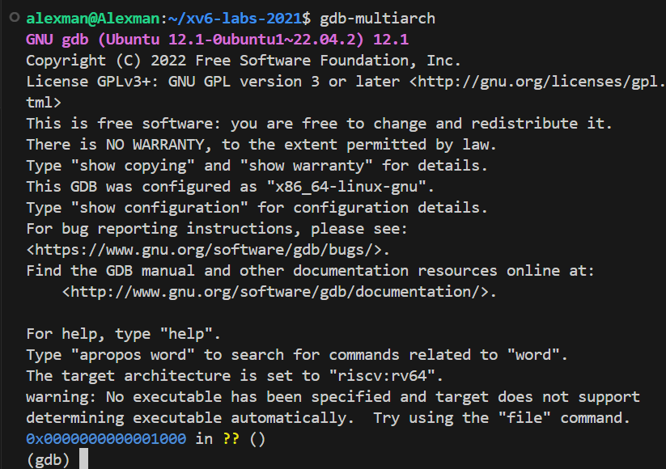

## Phase 1: 从用户态到ecall - trapoline
> [!important]
> `sh.asm`
> `CTRL^A + C`在断点状态下呼出内存监控功能

## Phase 2: uservec保存用户执行数据

## Phase 3: usertrap

## Phase 4: syscall

## Phase 5: usertrapret

## Phase 6: userret

## Phase 7: 重返用户态
