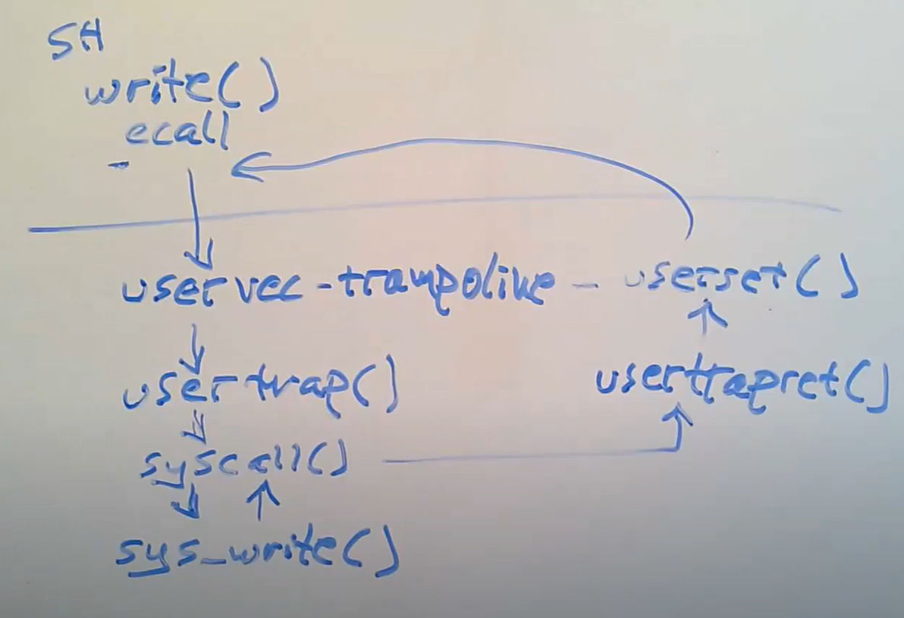
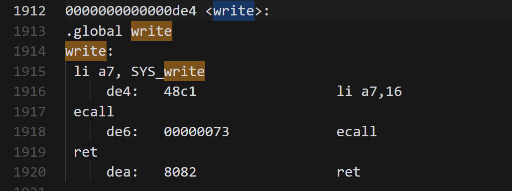
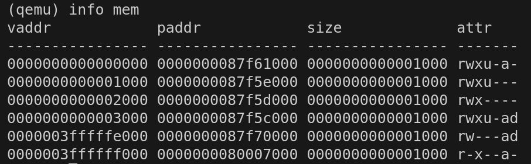
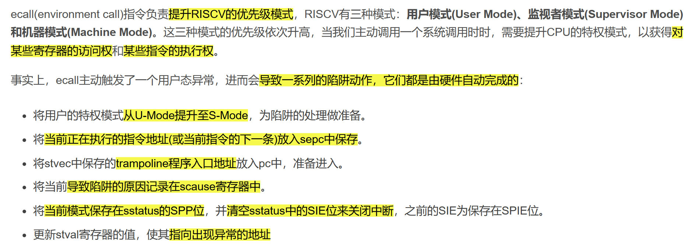
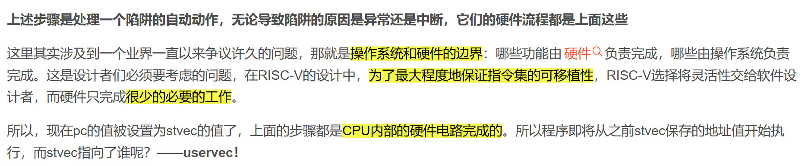
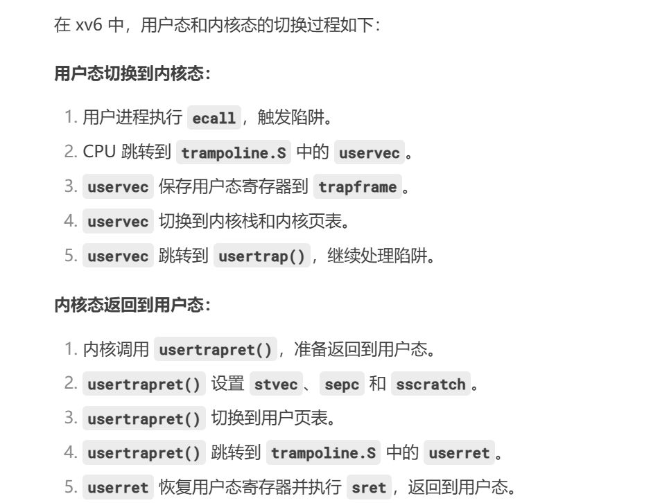
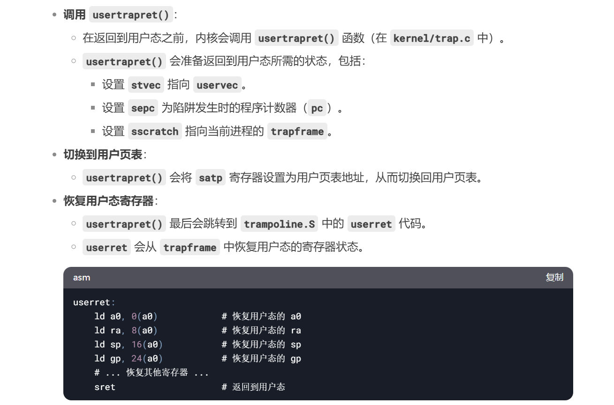

# Traps and System Call(Xv6)
## 基本概念
> [!def]
> 三种导致CPU中断当前指令的执行，转而去处理当前事件的情况，以下三种情况统称为`trap`:
> - <u>system call</u>: (系统调用) 当用户程序执行到`ecall`指令时，会触发中断让`kernel`处理
> - <u>exception</u>: (异常处理) 用户或者内核态执行到一些非法指令，比如除零错误或者地址无效
> - <u>device interrupt</u>: (设备中断) 当一个外部设备发送`signal`的时候，比如磁盘将数据完全写入内存中时

## Trap的特点
> [!important]
> 无感的，透明的.
> - Typically whatever code was executing at the time of the trap will later need to resume, and shouldn't ne aware that anything special happened.

## Trap的一般步骤
> [!important]
> 1. A trap forces a transfer of control into the kernel.
> 2. 内核代码执行前，The kernel **saves registers** and other state so that execution could be resumed
> 3. 内核代码执行， The kernel executes appropriate handler code (e.g. a system call implementation or device driver)
> 4. 内核代码执行完毕，The kernel **restores the saved state** and returns from the trap.
> 5. The original code resumes where it left off.

## xv6的Trap
### 在Kernel中处理所有traps
> [!def]
> **xv6在kernel中处理所有traps, 原因如下:**
> 1. Handling traps in the kernel is natural for **system calls**.
> 2. It makes sense for **interrupts** since **isolation** demands that only the kernel be allowed to use devices, and because <u>the kernel is a convenient mechanism with which to share devices among multiple processes.</u>
> 3. It also makes sense for **exceptions** since <u>xv6 responds to all exceptions from user space by killing the offending program.</u>

### 处理trap的四个阶段
> [!important]
> 1. Hardware actions taken by the RISC-V CPU
> 2. Some assembly instructions that prepare the way for kernel C code;(包括`uservec`和`kernelvec`, 都是汇编代码)
> 3. A C function that decides what to do with the trap. (包括`usertrap()`和`kerneltrap()`)
> 4. System call or device-driver service routine.
> 

# xv6源码分析-write syscall(Lec06)
## 总体流程一览
> [!important]
> 

## 调试疑难杂症 - Ubuntus
> [!important]
> 1. 首先安装`sudo apt install gcc-riscv64-unknown-elf`, 因为直接使用`gdb`指令会出现`Undefined term: riscv:rv64`
> 2. 然后创建`~/.config/gdb/gdbinit`文件，并在文件中加入以下两行:
> 	1. add-auto-load-safe-path /home/alexman/xv6-labs-2021/.gdbinit
> 	2. set auto-load safe-path .
> 3. 在`xvg-2021-labs`文件夹下执行`make qemu-gdb`
> 4. 最后新开一个**terminal**并在`xvg-2021-labs`文件夹下调用`gdb-multiarch`即可, 出现以下状态说明配置完成:
> 

## Phase 1: 从用户态到ecall - trapoline
> [!important]
> `/user/sh.asm`查看系统调用`write()`函数的地址
> 
> 然后我们在`0xdea`（不同虚拟机可能不同）的地方，也就是`ecall`将要但还没有被执行的地方打上一个断点，通过以下两个指令:
> - `b *0xdea`
> - `c`
> 
> 在执行`make qemu-gdb`的终端在断点状态下执行`CTRL^A + C`可以呼出内存监控功能，然后通过`info mem`可以查看当前`page table`的状态
> 

## Phase 2: uservec保存用户执行数据
> [!important]
> 

> [!code]
>

## Phase 3: usertrap

## Phase 4: syscall

## Phase 5: usertrapret

## Phase 6: userret

## Phase 7: 重返用户态
