# Common Atomic Instructions
> [!example]
> 

## Atomic Add in Queues
> [!example]
> 

# Blocking Lock
> [!def]
> **Blocking Locks (Mutexes)**: If the lock is a standard blocking lock (or mutex), the thread that attempts to acquire the lock will be put into a waiting state until the lock becomes available. When the thread holding the lock releases it, the operating system's scheduler will wake up one of the waiting threads (or all, depending on the policy) and allow it to acquire the lock.
> 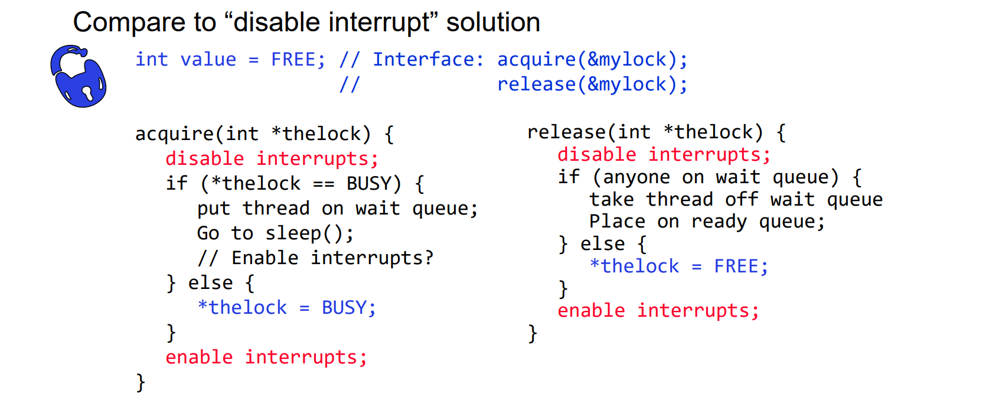

> [!bug] Caveats
> This works perfectly on uniprocessor, but for multiprocessors, when we call `disable interrupts`, we are onlying disabling the interrupt on that particular processor.
> 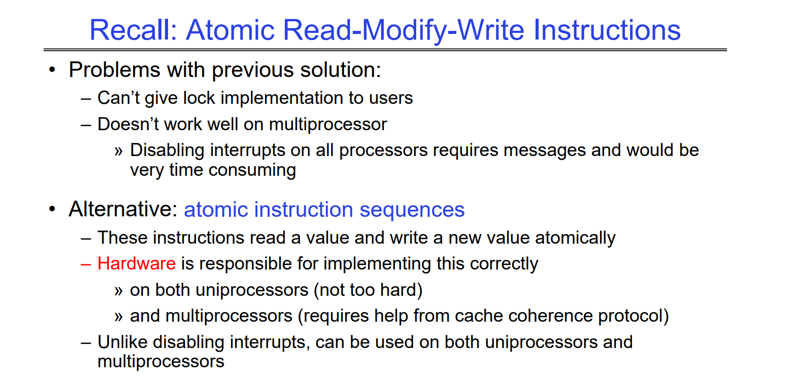

# Spinning Lock
## Naive Implementation
> [!def]
> 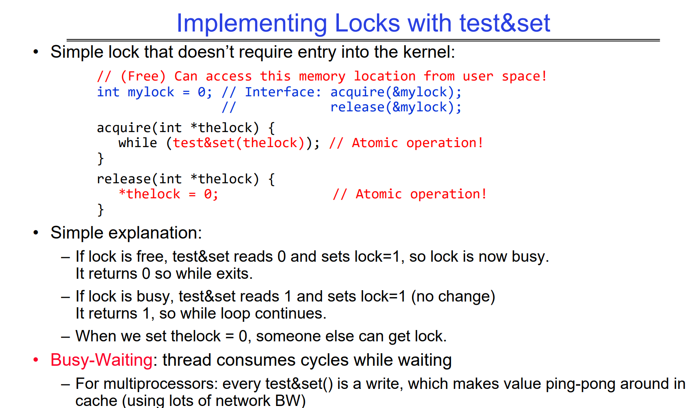
> No system call here(`sleep()` is a syscall), so the code is entirely at user level.

> [!bug] Caveats: Priority Inversion
> 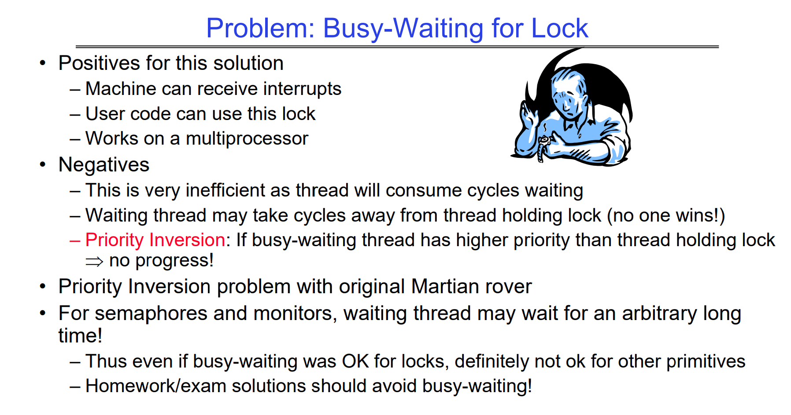

> [!example] CS162 Sp24 Disc03 P1.2 
> We can use test-set a spinning lock implementation:
> 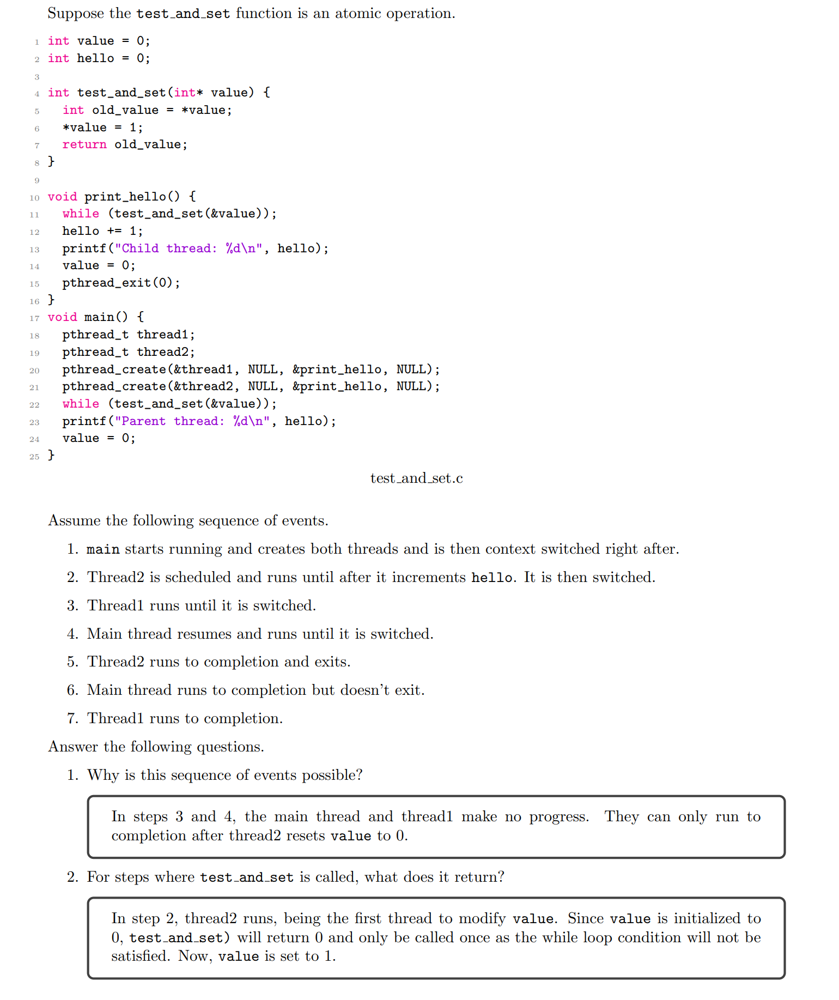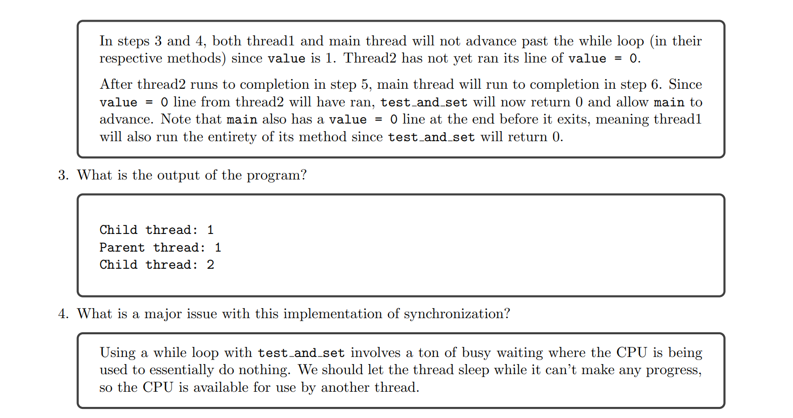

## Better Implementation
> [!def]
> 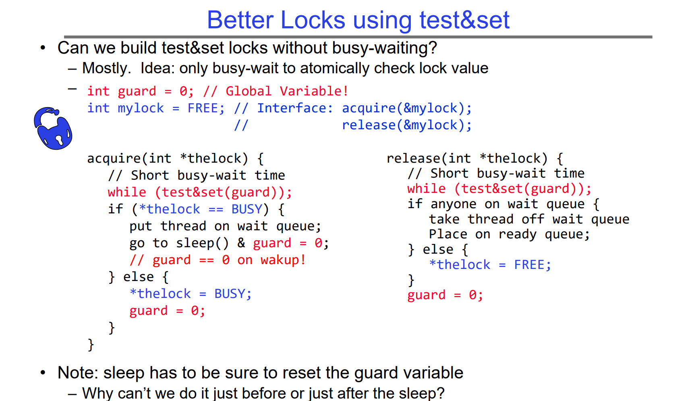
> The improvement is that we want the waiting time of our critical section to be as short as possible so that we can handle the busy-waiting problem.
> 
> Even if there is a system call(compared with naive implementation), the waiting time is minimized.
> 
> Even if the `test&set` is busy waiting, the busy waiting time is greatly reduced. Since to enter the critical section, the thread has to execute `test&set(guard)` and spin until other thread has finished executing the acquire or release so that the guard is reset to 0. And since in the critical section we only have few lines of codes and that `sleep()` and `guard = 0`are executed at once, so there is basically no waiting for the enter to critical section.
> 
> The critical section here is from `if(*thelock == 1)` to `guard = 0`. 

## Futex Implementation
### Linux Futex
> [!important]
> 
>  To deal with the `sleep()` system call and set `guard = 0`, we could introduce the `futex` API, which can accomplish `sleep() & guard = 0` at the same time.
>  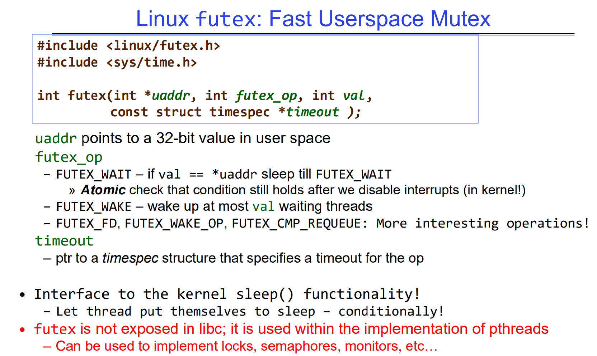

### Impl 1
> [!example]
> 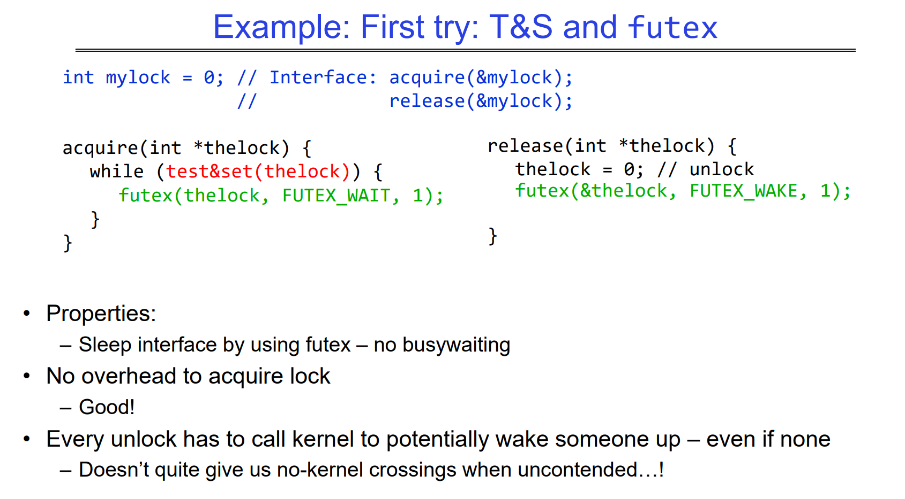

### Impl 2
> [!example]
> 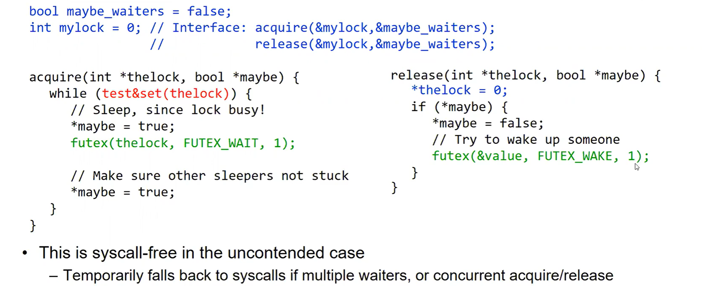

### Impl 3
> [!example]
> 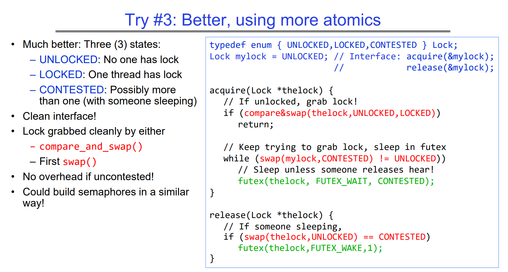

# Reentrant Lock
> [!def]

