# Basic Concepts
## Threads and Processes
> [!concept]
> A _thread_ of execution is the smallest sequence of instructions that can be managed by a scheduler. 
> 
> **A thread is a component of a process**, a recipe of independent execution. 
> 
> Multiple threads can exist within one process, being **executed concurrently** and **sharing the process's resources** such as memory space, executable code, variables, etc. while different processes do not share them. 
> 
> There are a lot of ideas in multiprocessing which lend themselves to _multithreading_, another form of _concurrency programming_, where multiple logical control flow overlap or interleave in time.
> 
> A program does not have to rely on multiprocessing to run multiple functions at the same time. As an alternative, it can create multiple threads with one process.
> 
> **Examples:**
> - An online music application may choose to download multiple songs simultaneously
> - A web browser may choose to load multiple web pages simultaneously using multiple threads.


## Dispatch Loop
> [!concept]
> 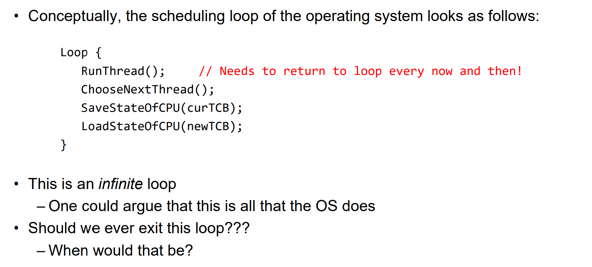


### Starting a Thread
> [!concept]
> 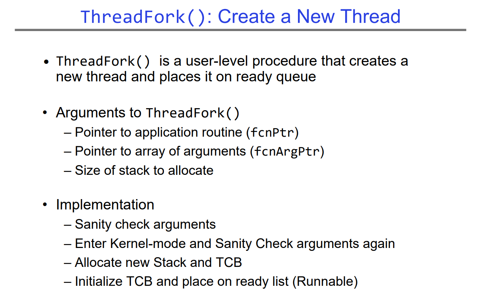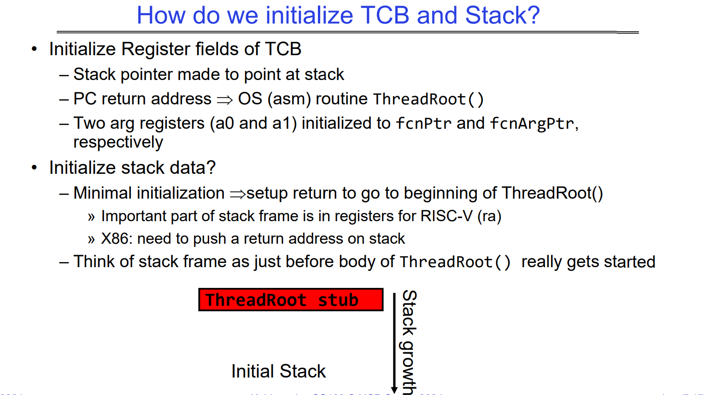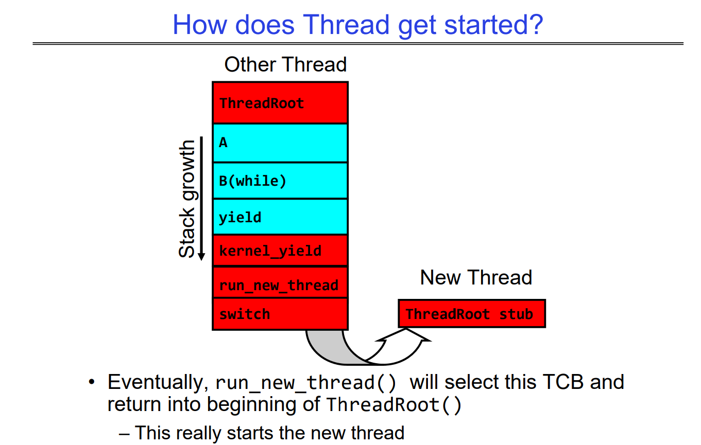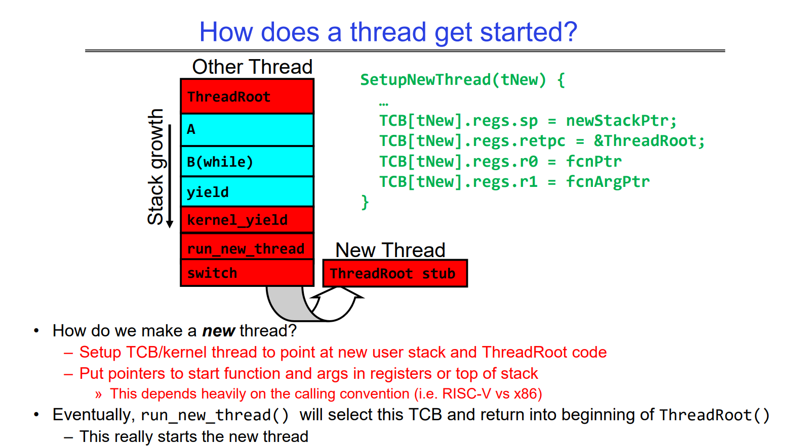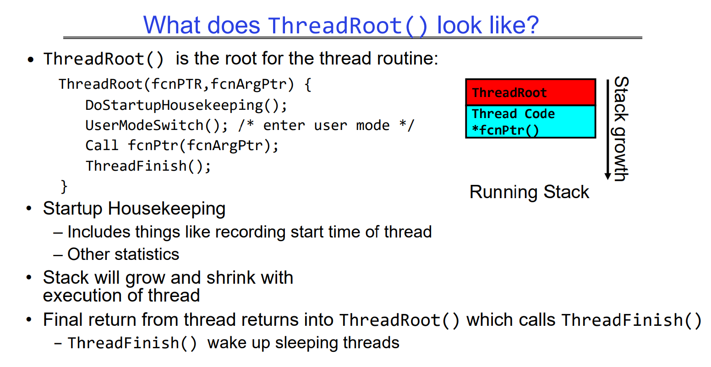


### Running a Thread
> [!important]
> 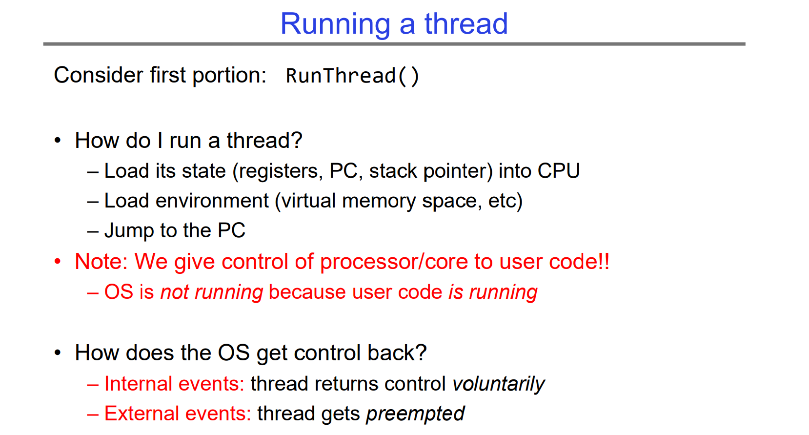


### Switching between Threads
#### Internal Events: yield()
> [!def]
> 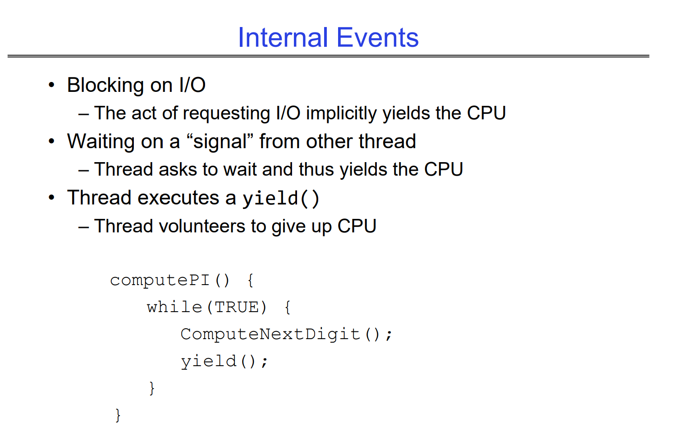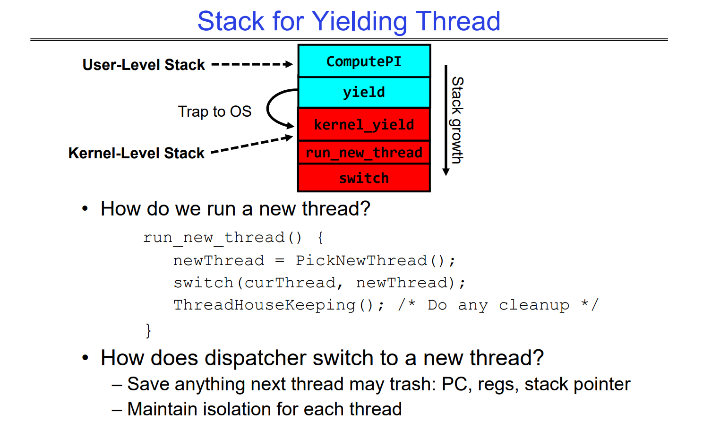
> Each thread has its own kernel stack, each process has its own kernel stack. Threads' kernel stacks are well contained in the same portion of memory of its containing process's kernel stack.
> 
> **Q: What's the relationship between user stack and kernel stack?**
> For each thread or process, there can only be one active stack at the same time. Either the user stack is in use or the kernel stack is in use.
> 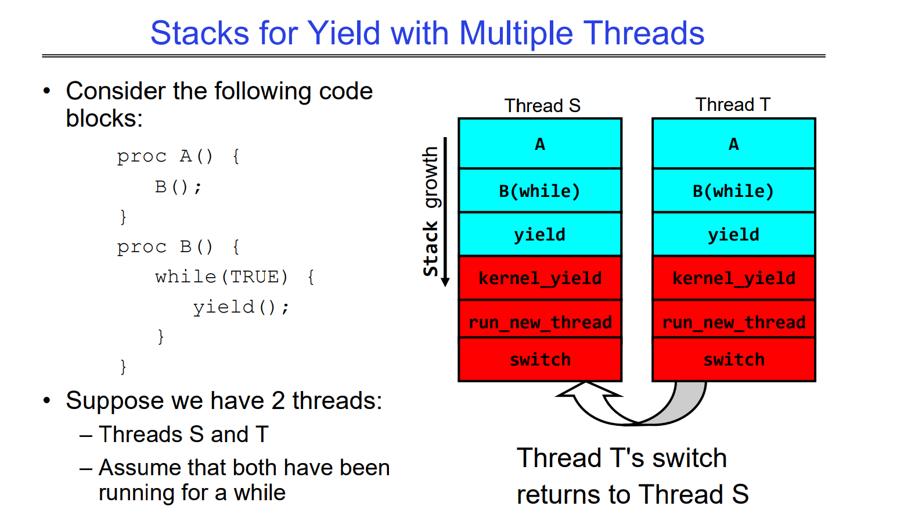


#### External Events: Interrupts
> [!def]
> 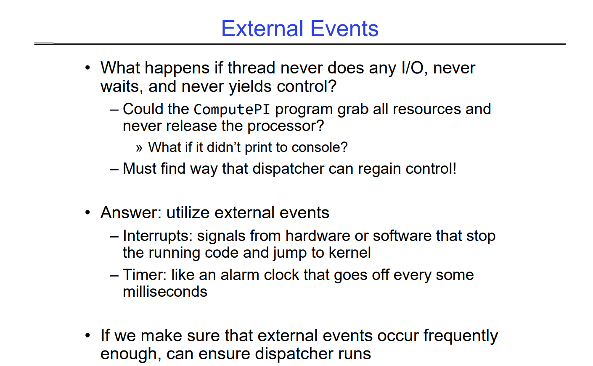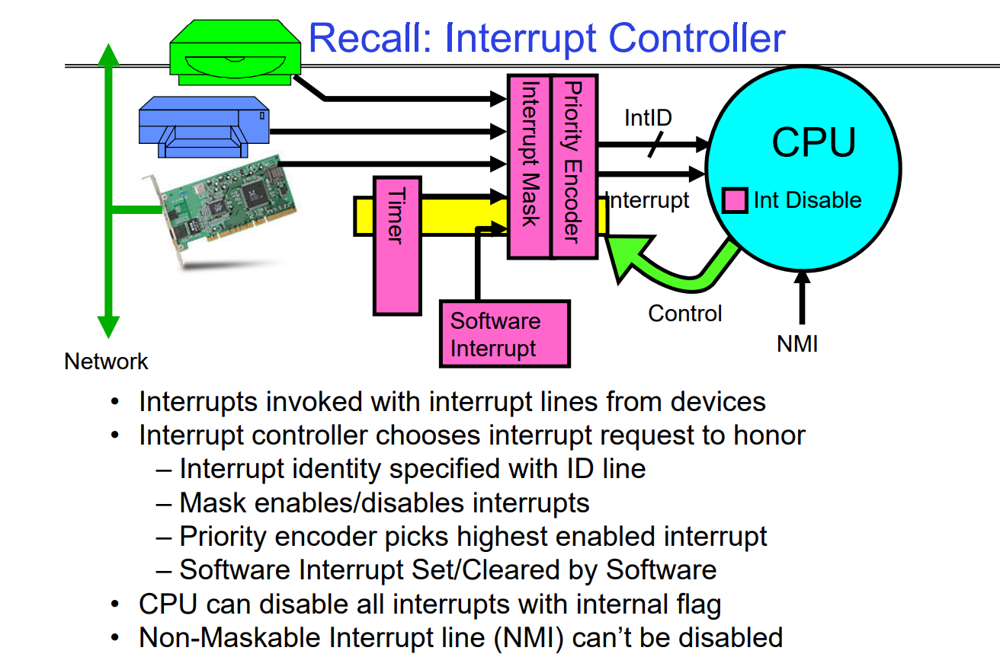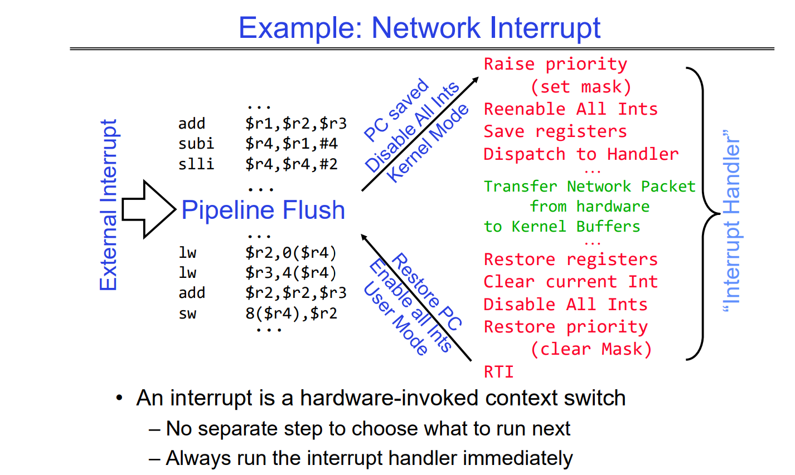


#### External Events: Timer
> [!def]
> 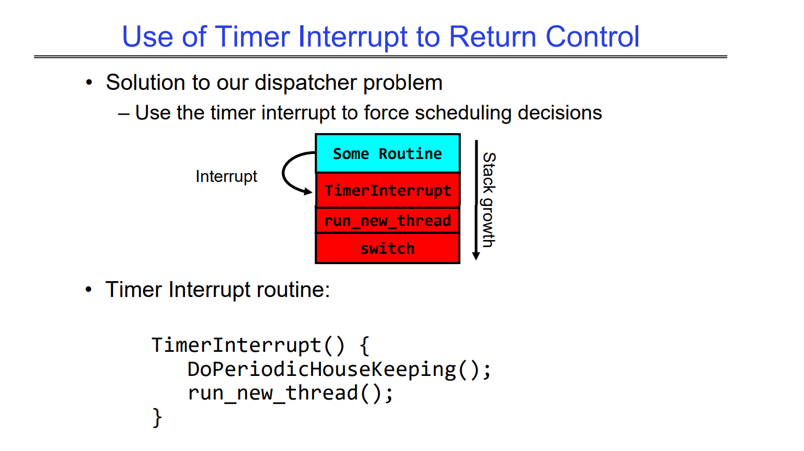


## Context Switching
### Switching Procedures
> [!important]
> 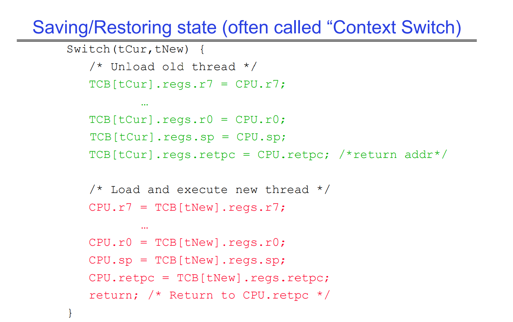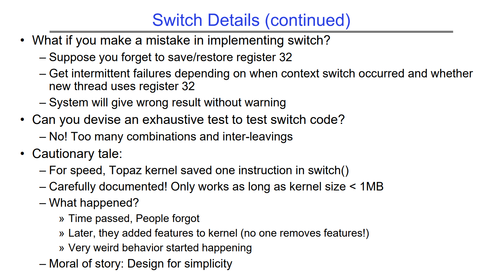


### Efficiency
> [!def]
> 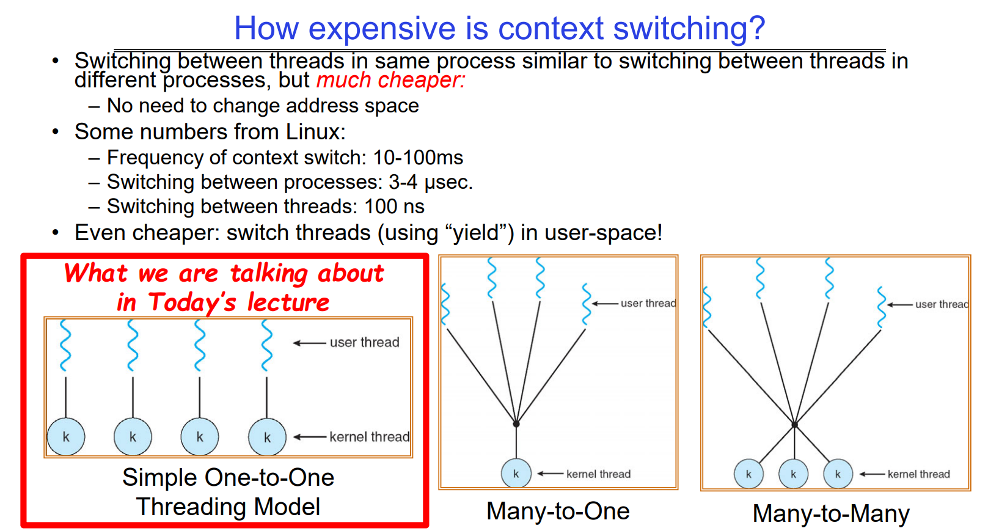


## A naïve example
> [!code]
> In psychology, [introversion](https://en.wikipedia.org/wiki/Extraversion_and_introversion) is the state of being predominantly interested in one's own mental self. Introverts are typically perceived as more reserved or reflective, but mistaking introversion for shyness is a common error. They can recharge themselves by spending time alone.
> 
> Introverts prefer solitary to social activities, but do not necessarily fear social encounters.
```c
#include <stdio.h>  
#include <pthread.h>  
​  
/* thread routine: notice the return type and arugument type */  
void *recharge(void *unused) {  
    printf("I recharge by spending time alone.\n");  
    sleep(1);  
    return NULL; /* to statisfy the prototype */  
}  
​  
int main() {  
  pthread_t introverts[6];  
  for (size_t i = 0; i < 6; i++)  
    /* create 6 independent threads */  
    /* All args are pointers */  
    pthread_create(&introverts[i], NULL, recharge, NULL);  
  for (size_t i = 0; i < 6; i++)  
    /* block and wait for the child thread's termination */  
    /* The first arg is a TID, the second is a pointer to pointer */  
    pthread_join(introverts[i], NULL);  
    
  printf("Everyone's recharged!\n");  
  return 0;  
}  
/* takes ~1 sec to run due to multithreading, as opposed to ~6 sec */

```

### pthread_create()
> [!important]
> - `pthread_t` is essentially an integer - the thread's ID (TID). Similar to `pid_t`.
> - The thread routine is a function that **takes in a** `void *` **and returns a** `void *`. In fact, you can pass in a pointer to structure or return a pointer to structure, utilizing pointer's type casting.
> - `pthread_create()`'s takes in 4 arguments, all of which are pointers.
```c
int pthread_create(  
          pthread_t *pTID, /* TID ptr. */  
          const pthread_attr_t *pAttr, /* thread attribute ptr. */  
          void *(*pRoutine) (void *), /* thread routine function ptr. */  
          void *pArg /* argument ptr. */  
        );
```
> [!important]
> - The first argument `pTID` points to the variable to store the TID,
> - The second argument `pAttr` points to the structure whose contents are used at to determine attributes for the new thread, such as priority. It can be `NULL`.
> - The third argument `pRoutine` points to the start function of the thread routine, and that function can call other functions.
> - The fourth argument `pArg` points to the argument that is to be passed to the thread routine. It can be a structure if there are more than one actual arguments to be passed, or a `NULL` if none.
> - It returns `0` on success; on error, it returns an error number, and the content of `pTID` is undefined.


### pthread_join()
> [!important]
> - If the master thread ("the mommy thread"), i.e. the thread of the process itself, exists, the entire virtual memory space of the process will be de-allocated, killing every child threads it gave birth to. So we need to wait for the child threads to terminate before letting the master thread terminates: `int pthread_join(pthread_t TID, void **ppRetval);`
> - The first argument `TID` is the ID of the intended thread. Note that it is not a pointer.
> - The second argument `ppRetval` is a pointer to the pointer to the return value of the thread.
> - If the intended thread has already terminated, then `pthread_join()` returns immediately. Otherwise it **blocks and waits**.
> - The thread specified by `TID` must be **joinable**, i.e. not detached. When a detached thread terminates, its resources are automatically de-allocated without the need for another thread to join with it. `int pthread_detach(pthread_t TID);` can detach a thread. A detached thread cannot be killed nor reaped by another thread, but a joinable thread can.
> - On success, it returns `0`; on error, it returns an error number, among which are:
> 	- `EINVAL`: another thread is already waiting to join with this thread, or the intended child thread is not joinable.
> 	- `ESRCH`: no thread with that TID thread could be found.
> 	- `EDEADLK`: a deadlock was detected (e.g., two threads tried to join with each other), or the first argument `TID` specifies the calling thread itself.
> - Child threads are not obligated to start or finish together or in a predictable order - it is up to the kernel's scheduler (yes, the scheduler can manipulate threads). Once a child thread finishes, `pthread_join()` joins the child thread with the calling thread (in this example, the master thread).
> - Failure to join with a thread that is joinable (i.e. undetached), produces a _zombie thread_. Avoid doing this, since zombie threads consume some system resources.
> 
> An illustration of creating and joining 2 child threads:
```
    ┌ ─ ─ ─ ─ ─ ─ ─ ─ ─ ─ ─ ─ ─ ─ ─ ─ ─ ─ ─ ─ ─ ─ ─ ─ ─ ─ ─ ┐  
                     start             finish       a single process  
                   ▲──●──────────────────●─ ─ ┐   
     master thrd.  │   cr   child thrd. 1     │   jn     
    ───────────────┴───┬──────────────────────▼───▲─────────▶   
                  cr   │      child thrd. 2   jn  │       
                       ▼──────●────────●─ ─ ─ ─ ─ ┘   
                            start     finish  
    └ ─ ─ ─ ─ ─ ─ ─ ─ ─ ─ ─ ─ ─ ─ ─ ─ ─ ─ ─ ─ ─ ─ ─ ─ ─ ─ ─ ┘  
    cr: pthread_create()     jn: pthread_join()
```
> [!bug] Caveats
> SIDE NOTE: ANSI C doesn't provide native support for threads. But POSIX threads (aka pthread) comes with all standard UNIX and Linux installations of gcc, as concurrency programming requires the cooperation of the kernel.


### The CPU and memory, thread context switch
> [!concept]
> - Each process has a thread manager responsible for interleaving the execution time window within the process's execution time.
> - Note that the threads created in the example above all belong to **the same process**, hence they reside in the **same virtual memory space**.
> - What we are interested in is what happens in the stack and text segments in the virtual memory space.
> 	- **The stack segment:** each thread takes a subsegment in the stack, forming their own call stacks. Inside each thread's call stack, there is a stack space reserved to store the CPU register info when that thread is swapped off from the CPU. There is no overlapping in the stack, so automatic variables cannot be inherited by child threads (unlike multiprocessing). It serves as the "switchframe" of the corresponding thread, the difference from a process's switchframe being that a thread's is stored within the stack segment of the process's virtual memory space, while a process's is stored in the kernel space.
> 	- **The text segment:** the instruction pointer `rip` points to different instructions, jumping among the master's and child threads' routines.
> - All threads share the heap, data, text, .. segments in the virtual memory space. Because of this, **threads within one process can communicate with each other more easily than processes**, who has to turn to pipes and signals.
> - In the same process, a thread's access to another thread's **objects in stack** is provided by pointers/references.
> - _Preemptive multitasking_: the scheduler can switch the task (process/thread) out from CPU and switch another in, at any time it feels like.
> - _Cooperative multitasking_: the task (process/thread) can only be switched out from CPU when it allows - say, a stage completes - and other tasks have to wait. Cooperative multitasking was the primary scheduling scheme for 16-bit applications employed by Microsoft Windows before Windows 95, and by the classic Mac OS. In computer network protocols, similar mechanisms is applied.


# C++ Multithreading
> [!concept]
> The C++ thread interfaces are type-safe and cleaner.

### The old-school C form
```c
#include <stdio.h>  
#include <pthread.h>  
​  
/* thread routine */  
/* Note the return and arg types are all "void *" */  
void *recharge(void *unused) {  
    printf("I recharge by spending time alone.\n");  
    return NULL;  
}  
​  
int main() {  
    pthread_t introverts[6];  
    for (size_t i = 0; i < 6; i++) {  
        pthread_create(&introverts[i], NULL, recharge, NULL);  
    }  
    for (size_t i = 0; i < 6; i++) {  
        pthread_join(introverts[i], NULL);  
    }  
​  
    return 0;  
}
```


## The C++ form
> [!code]
> `using namespace std;` is omitted in C++ code afterwards.
```c++
/* C++11 */  
#include <iostream>  
#include <thread>  
/* CS110 iomanipulators (oslock, osunlock) used to lock down streams */  
#include "ostreamlock.h"  
using namespace std;  
​  
/* Note the return type is "void" */  
void recharge() {  
    cout << oslock   
         << "I recharge by spending time alone." << endl  
         << osunlock;  
    return;  
}  
​  
int main() {  
    /* declare 6 thread objects (handles) */  
    thread introverts[6];  
      
    /* install thread routine to these threads */  
    for (thread &t : introverts) {  
        t = thread(recharge);  
    }  
    /* join: block, wait, reap zombie threads */  
    /* note you need the "&" below, since thread class's  
     * assignment operator is deleted */  
    for (thread &t : introverts) {  
        t.join();  
    }  
​  
    return 0;  
}

```
> [!exp]
> C++ prototypes explained:
> - `oslock` and `osunlock` are implemented by CS110 course and meant to exclusively lock/unlock the output file stream, since `cout` is not thread-safe (unlike `printf()`). Without them, `ostream::operator<<()`'s output by multiple threads may get garbled.
> - In C++, the thread routine can **take in any number of arguments** of any type.
> - In C++, the thread routine **returns nothing**. If it does return something, the return value will be ignored.
> - `thread` is a C++11-provided class, defined in the `std` namespace. These methods are used in the code above:
```c++
 /* default constructor */  
thread();  
/* initialization (the exact prototype is not our focus):  
   takes in a function pointer, followed by arguments (if any)  
   the thread routine's return is ignored */  
thread (pRoutine, args...);  
​  
/* assign operator */  
thread& operator= (thread&& rhs); // rvalue reference  
/* join */  
void join();
```
> [!exp]
> Some other methods that may be frequently use:
```c++
/* check is joinable */  
bool joinable();  
/* detach */  
void detach();  
/* get thread ID */  
thread::id get_id();
```
> [!important]
> The method `thread &operator=(thread &&t)` takes in an rvalue reference. A effect of this design is that, after the `thread` object `t` on right hand side is assigned to the left hand side, **the original** `t` **is gutted**: as if it were a zero-argument constructed, empty, **detached** thread object. Such mechanism is suitable if the right hand size object takes considerable effort to construct or clone. It is unlike normal `a = b` assignment, after which `b` is intact and `a` is a copy of `b`.


## Another C++ example: using variadic arguments
> [!code] 
```c++
/* C++11 */  
#include ...  
​  
/* Note the return type is "void" and we pass in an arg to it*/  
void greet(size_t id) {  
  for (size_t i = 0; i < id; i++) {  
    cout << oslock << "Greeter #" << id << " says 'Hello!'" << endl << osunlock;  
  }      
  cout << oslock   
       << "Greeter #" << id << " has issued all of his hellos, "  
       << "so he goes home!" << endl   
       << osunlock;  
}  
​  
int main(int argc, char *argv[]) {  
  thread greeters[6];  
  for (size_t i = 0; i < 6; i++) {  
      /* Note that the variadic arg is passed in (one arg here):  
         thread (pRoutine, args...); */  
      greeters[i] = thread(greet, i + 1);  
      /* Pay attention to avoid the race condition  
         as discussed before */  
  }  
  for (thread& greeter: greeters) {  
      greeter.join();  
  }  
​  
  return 0;  
}
```


# Java Multithreading
## Starting a Thread
> [!important]
> Why the following line is executed, the following events happen in order:
> 1. A `Runnable` object is created.
> 2. A `Thread` object is created.
> 3. `start()` is called. This function will trap into the kernel of OS and start and schedule a thread.
> 4. `run()` is called, the job associated to the newly started thread is runned.
> 5. `run()` returns.
```java
new Thread(new Runnable() {
	// Job
    public void run() {
        System.out.println("Hello from a thread!");
    }
}).start();


// Equivalent Lambda Expression Form
new Thread(() -> System.out.println("Hello from a thread!")).start();
```
> [!concept]
> **When you run a Java program (for example, using the Run button in Eclipse), how many processors, processes, and threads are created at first?**
> 
> Processors are physical components in the machine. For our purposes, the number of processors is fixed. A better way to say this is we multiplex/schedule a processor for the current program, instead of creating a processor.
> 
> When a program starts, it automatically gets one process to run in, and it gets one thread for its execution.


## start() and run()
> [!bug] Caveat
> The following code is a typical misuse of `start()` and `run()`, in this example, no new threads will be scheduled by CPU. 
> 1. `run()` will call the job that is assigned to the thread object, but is executed by the main thread.
> 2. `start()` will actually trap into the OS and fork new threads for job execution.
```java
public class Parcae {
    public static void main(String[] args) {
        Thread nona = new Thread(new Runnable() {
            public void run() { System.out.println("spinning"); }
        });
        nona.run();
        Runnable decima = new Runnable() {
            public void run() { System.out.println("measuring"); }
        };
        decima.run();
        // ...
    }
}
```
> [!tips]
> **Never** call `run()` on a `Thread`, or on a `Runnable` that you created for a thread. Instead, always make a `new Thread()` with an instance of your `Runnable`, and call `start()` on the thread to start it. `Thread` will take care of calling `run()` on your `Runnable` from the new thread.


## Thread and JUnit
> [!bug] Caveats
> 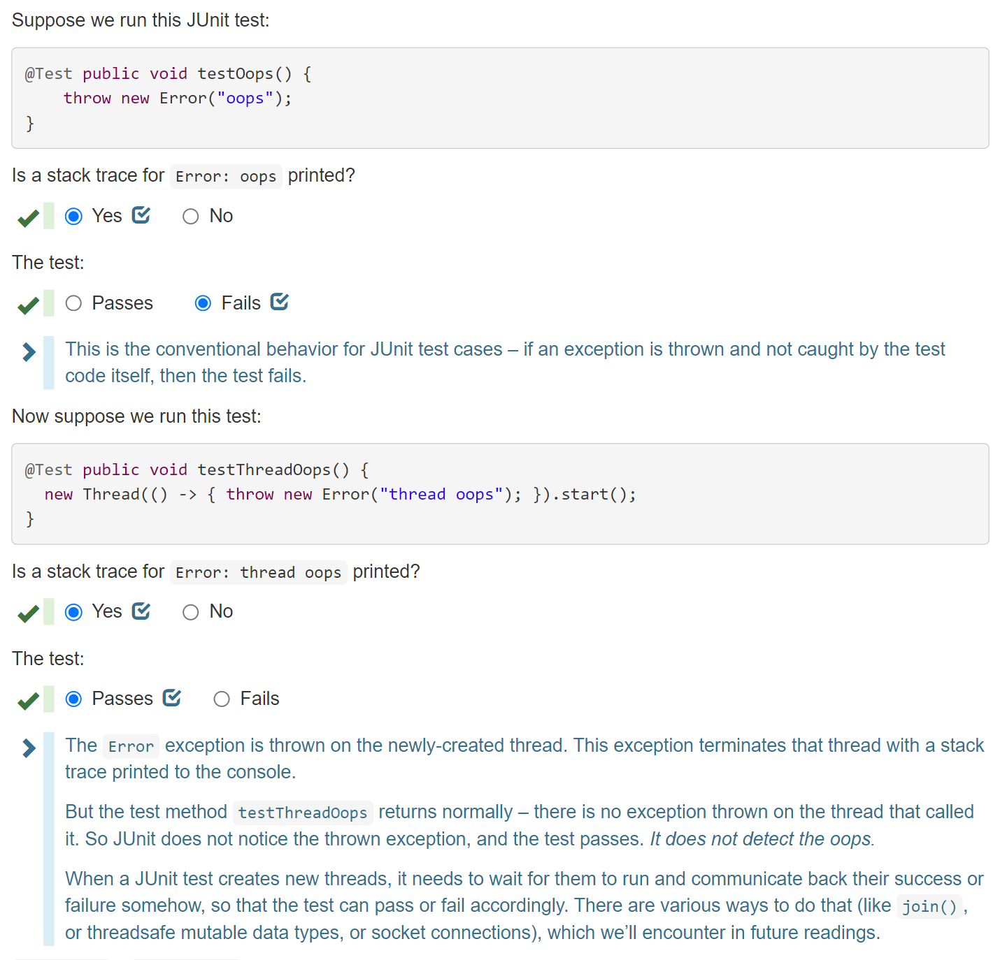


## Thread and Process
> [!code]
> Suppose we run `main` in this program, which contains bugs:
```java
public class Moirai {
    public static void main(String[] args) {
        Thread clotho = new Thread(new Runnable() {
            public void run() { System.out.println("spinning"); }
        });
        clotho.start();
        new Thread(new Runnable() {
            public void run() { System.out.println("measuring"); }
        }).start();
        new Thread(new Runnable() {
            public void run() { System.out.println("cutting"); }
        });
    }
}
```
> [!quiz] 
> 1. **How many new `Thread` objects are created during the execution of `main`?**
> 	3, One is assigned to variable `clotho`. The other two are not assigned to a variable.
> 1. **How many new threads are run?**
> 	2, The code calls `start` on the first two threads. But the third thread is never `start`ed, so it will not run.
> 1. **What is the maximum number of threads that might be running at the same time?**
> 	The **initial thread** running `main` plus the two new threads that were started. The reason we have to say “might” here is because different interleavings may mean that we don’t always reach this maximum; for example, the first new thread might finish running before the second one even starts.


# Concurrency Pattern


