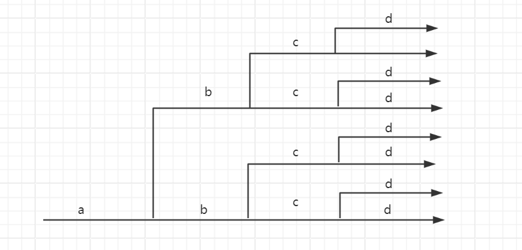
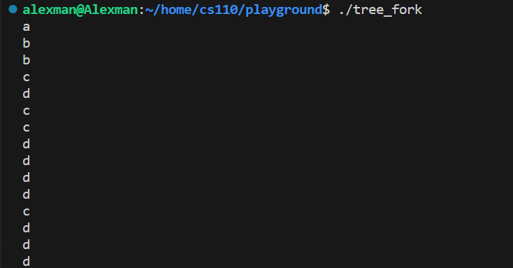

# Use of fork() and waitpid()
## Libraries to import
> [!code]
> To enable fork() functionality, we have to import the following STLs.
```c
#include <unistd.h> // for fork(), getpid(), getppid()
#include <stdbool.h> // for bool
#include <stdio.h> // for standard input/output
```


## Tree Fork
> [!code]
```c
#include <unistd.h>
#include <stdio.h>
#include <string.h>
#include <stdbool.h>


int main(int argc, char* argv[]) {

    int tree_level = 4;

    char* letters = "abcd\0";
	// Fork 4 times
    for (int i = 0; i < tree_level; i++) {
        printf("%c\n", letters[i]);
        pid_t pid = fork();
    }

}
```
> [!output]
> 
> The order is random.


## Reap the Children w. Sync


# Shell Implementation
## Simple Shell
> [!code]


Shell 


