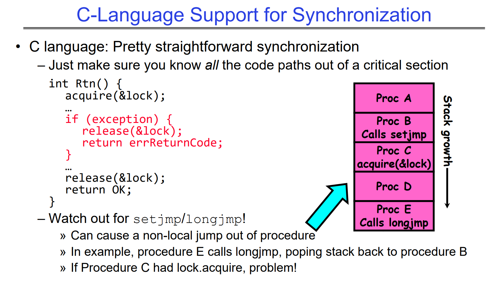
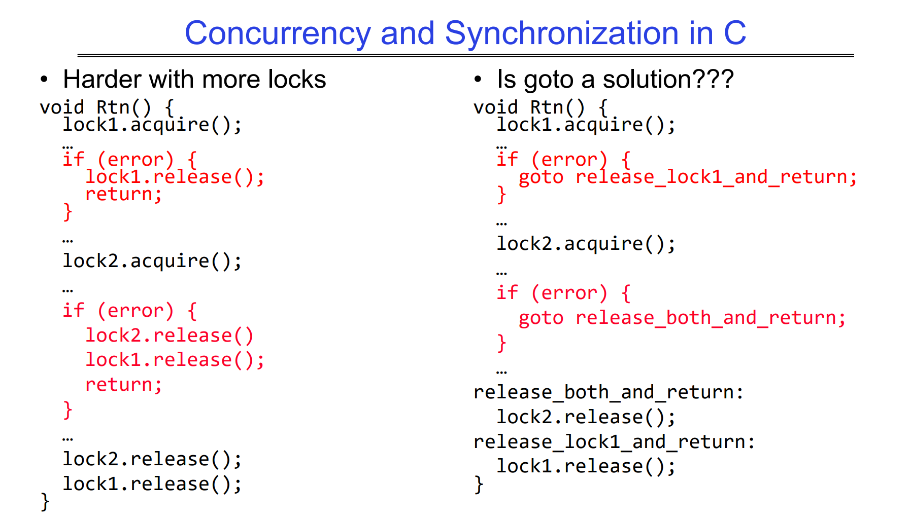
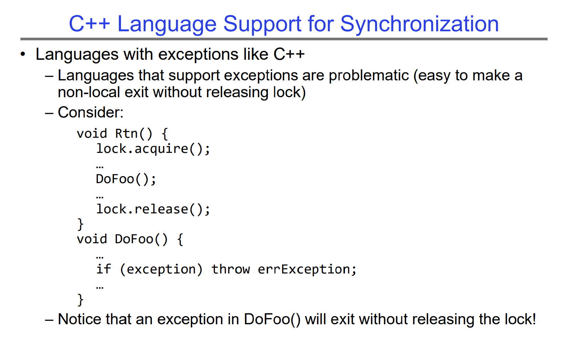
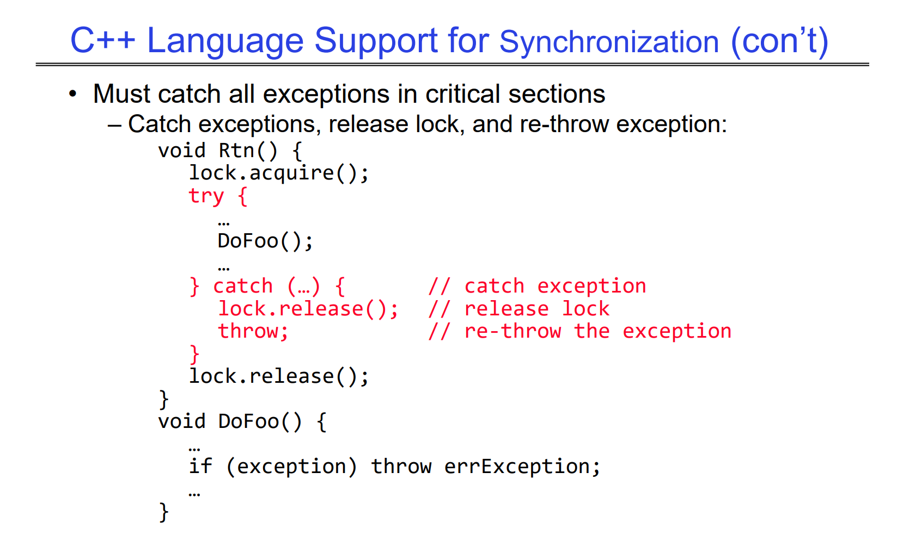
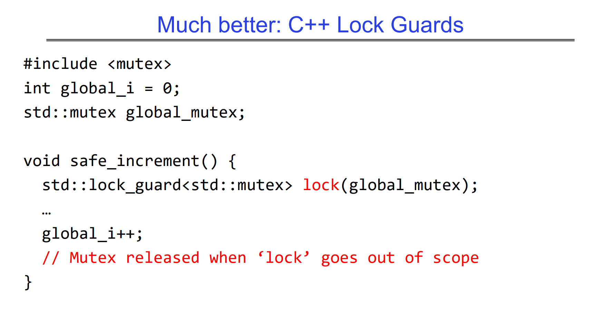
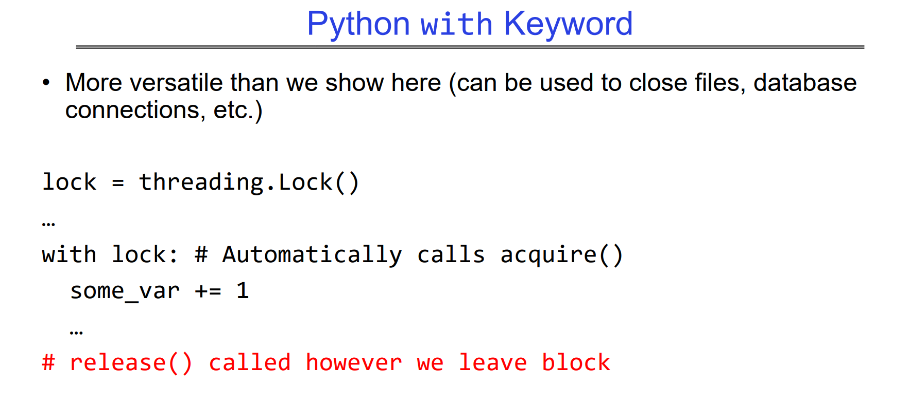
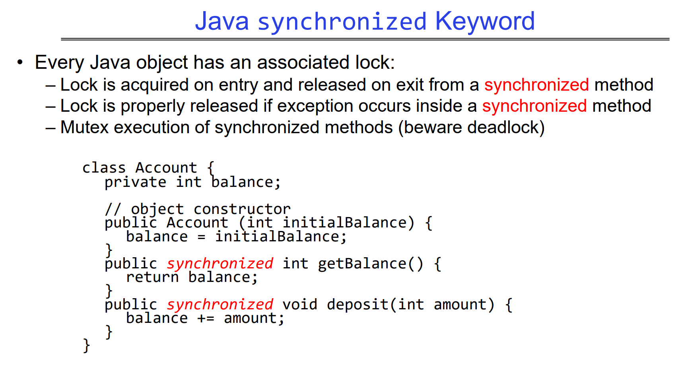
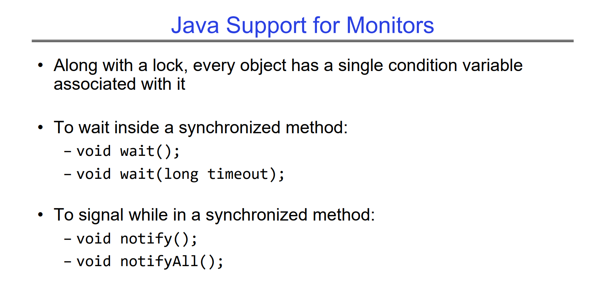

# Synchronization in C
> [!important]
> 

# Synchronization in C++
> [!important]
> 
> `std::lock_guard` more see CS110, encouraged to use! Can handle error automatically.

# Synchronization in Python
> [!important]
> 

# Synchronization in Java
> [!important]
> 
> More on [Synchronization](../../../Java_Language/Java_Concurrecncy/Threads/Synchronization.md)

