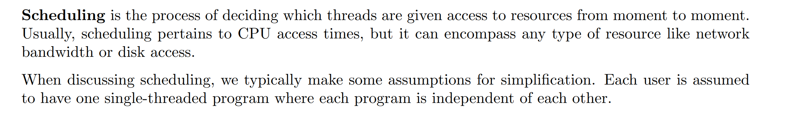
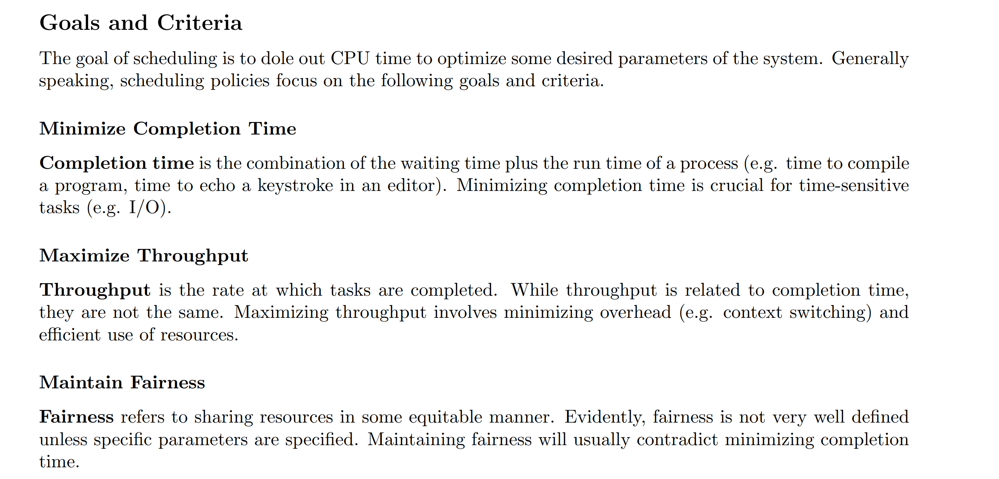
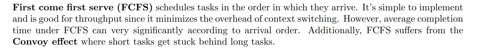

# What is Scheduling
## Definition
> [!def]
> 

## Goals and Metrics
> [!important]
> 

# FCFS Scheduling
## Scheduling Scheme
> [!def]
> 

## Convoy Effect

# Round Robin Scheduling(RR)
## Scheduling Scheme

# Shortest Job First(SJF)

# Shortest Remaining Time First(SRTF)

# Lottery Scheduling

# Multi-Level Feedback Queue