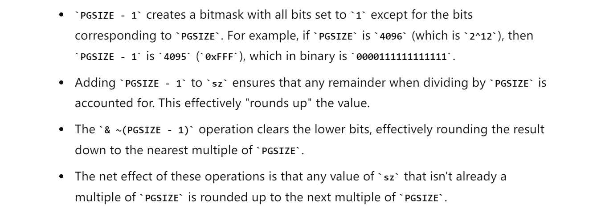
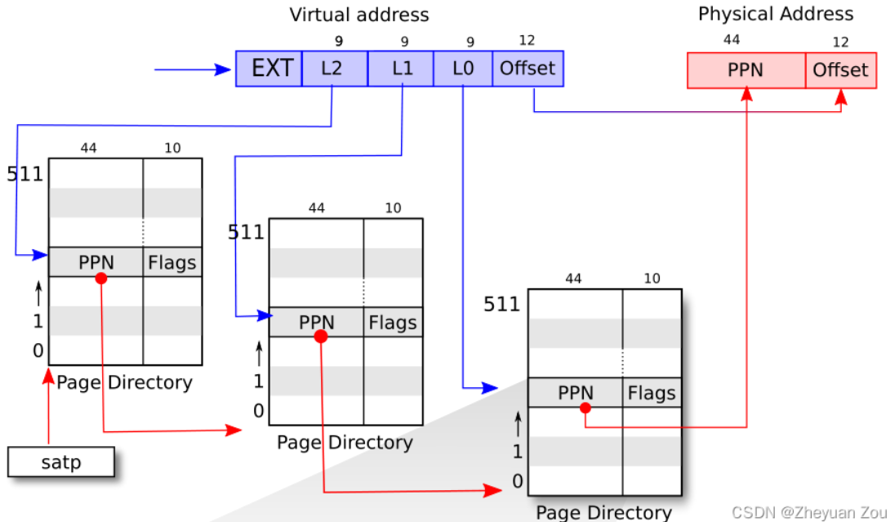

# riscv.h
## Useful Macro
> [!code]
> 
```c
// PGROUNDUP(sz)：sz大小的内存至少使用多少页才可以存下，返回的是下一个未使用页的地址
// PGROUNDDOWN(a)：地址a所在页面是多少号页面，拉回所在页面开始地址
#define PGROUNDUP(sz)  (((sz)+PGSIZE-1) & ~(PGSIZE-1))
#define PGROUNDDOWN(a) (((a)) & ~(PGSIZE-1))

```


# vm.c
## walk()函数
> [!important]
> walk()函数用软件来模拟硬件MMU查找页表的过程，<span style="background:#fff88f">返回以pagetable为根页表，经过多级索引之后va这个虚拟地址所对应的页表项</span>，如果alloc != 0，则在需要时创建新的页表页，反之则不用。
> 
> 注意第一级根页表肯定是存在的，所以这个函数最多会创建两次新的页表页就已经到达了叶级页表(leaf page table)。PTE中的有效位(valid bit)表示的含义是：对应的PTE是否存在。
> 
```c
// Return the address of the PTE in page table pagetable
// that corresponds to virtual address va.  If alloc!=0,
// create any required page-table pages.
//
// The risc-v Sv39 scheme has three levels of page-table
// pages. A page-table page contains 512 64-bit PTEs.
// A 64-bit virtual address is split into five fields:
//   39..63 -- must be zero.
//   30..38 -- 9 bits of level-2 index.
//   21..29 -- 9 bits of level-1 index.
//   12..20 -- 9 bits of level-0 index.
//    0..11 -- 12 bits of byte offset within the page.
pte_t *
walk(pagetable_t pagetable, uint64 va, int alloc)
{
  if(va >= MAXVA)			// 如果虚拟地址超过了最大值，陷入错误
    panic("walk");
  
  // 模拟三级页表的查询过程，三级列表索引两次页表即可，最后一次直接组成物理地址
  for(int level = 2; level > 0; level--) {
  	// 索引到对应的PTE项
    pte_t *pte = &pagetable[PX(level, va)];
    // 确认一下索引到的PTE项是否有效(valid位是否为1)
    if(*pte & PTE_V) {
      // 如果有效接着进行下一层索引
      pagetable = (pagetable_t)PTE2PA(*pte);
    } else {
      // 如果无效(说明对应页表没有分配)
      // 则根据alloc标志位决定是否需要申请新的页表
      // < 注意，当且仅当低两级页表页(中间级、叶子级页表页)不存在且不需要分配时，walk函数会返回0 >
      // 所以我们可以通过返回值来确定walk函数失败的原因
      if(!alloc || (pagetable = (pde_t*)kalloc()) == 0)
        return 0;
      // 将申请的页表填满0
      memset(pagetable, 0, PGSIZE);
      // 将申请来的页表物理地址，转化为PTE并将有效位置1，记录在当前级页表
      // 这样在下一次访问时，就可以直接索引到这个页表项
      *pte = PA2PTE(pagetable) | PTE_V;
    }
  }
  // PX 是根据某一级别的页表(0代表叶子级页表)中根据va计算出来的需要偏移的PTE的下标。
  return &pagetable[PX(0, va)];
}

```


## mappages()函数
> [!important]
```c
// Create PTEs for virtual addresses starting at va that refer to
// physical addresses starting at pa. va and size might not
// be page-aligned. Returns 0 on success, -1 if walk() couldn't
// allocate a needed page-table page.
int
mappages(pagetable_t pagetable, uint64 va, uint64 size, uint64 pa, int perm)
{
  // a存储的是当前虚拟地址对应的页
  // last存放的是最后一个应设置的页
  // 当 a==last时，表示a已经设置完了所有页，完成了所有任务
  uint64 a, last;
  pte_t *pte;
  
  // 当要映射的页面大小为0时，这是一个不合理的请求，陷入panic
  if(size == 0)
    panic("mappages: size");
  
  // a,last向下取整到页面开始位置，设置last相当于提前设置好了终点页
  // PGROUNDDOWN这个宏在后面会详细讲解
  a = PGROUNDDOWN(va);
  last = PGROUNDDOWN(va + size - 1);
  // 开始迭代式地建立映射关系
  for(;;){
    // 调用walk函数，返回当前地址a对应的PTE
    // 如果返回空指针，说明walk没能有效建立新的页表页，这可能是内存耗尽导致的
    if((pte = walk(pagetable, a, 1)) == 0)
      return -1;
    // 如果找到了页表项，但是有效位已经被置位，表示这块物理内存已经被使用
    // 这说明原本的虚拟地址va根本不足以支撑分配size这么多的连续空间，陷入panic
    if(*pte & PTE_V)
      panic("mappages: remap");
    
    // 否则就可以安稳地设置PTE项，指向对应的物理内存页，并设置标志位permission
    *pte = PA2PTE(pa) | perm | PTE_V;
    // 设置完当前页之后看看是否到达设置的最后一页，是则跳出循环
    if(a == last)
      break;
    // 否则设置下一页
    a += PGSIZE;
    pa += PGSIZE;
  }
  return 0;
}

```


## kvmmake()函数
> [!important]

