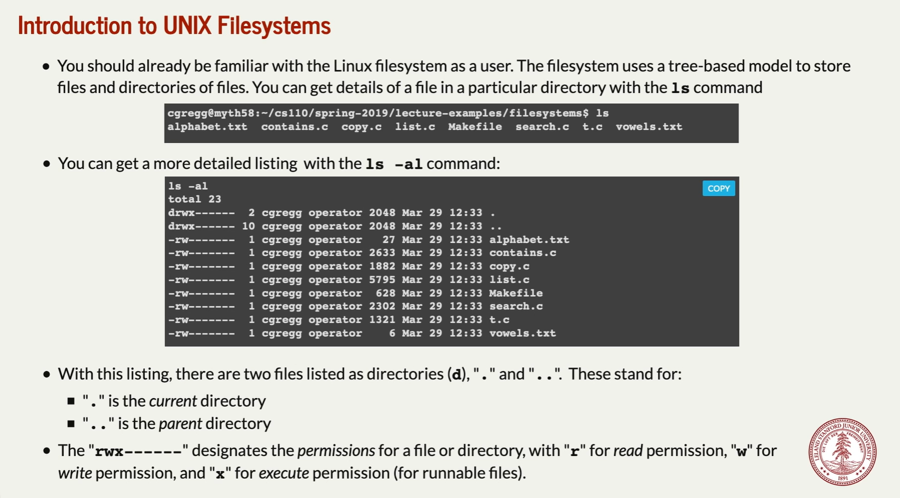
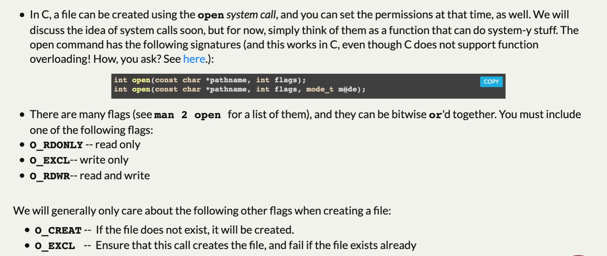

# Introduction to UNIX Filesystems
## ls command
> [!concept]
> 


## file permission - umask
> [!concept]
> 
> Notes on **flags**:
> - The open function converts a filename to a file descriptor and returns the descriptor number. 
> - The descriptor returned is always the smallest descriptor that is not currently open in the process.
> - The flags argument indicates how the process intends to access the file, it is different from setting permission, which is what `mode` does.
> 
> Notes on **umask**:
> - The umask is set for a user in the shell, and when a program is run it inherits the user's umask settings. The user can adjust the default umask with a terminal command:
> 
> 
> - First of all, “mask” does not mean “subtract”, in the arithmetic sense – there is no borrow or carry involved.
> - Secondly, a “mask” should be understood _bitwise_ instead: applying logical operations on each bit column independently. That is, the 4th bit of the permission bit-sequence interacts with only the 4th bit of the mask.
> - Third, the mask turns _off_ permission bits. If they are already off, the `umask` makes no change to the permission,
> - To sum up, the formula for new file permission upon **umask** setting is `result = file permission & (~umask)` as the example below verifies it:
> 
> 


## use umask to set permission
> [!example] Example 1: In function
> 
> **Notes:**
> - Note that in the above code, we set the umask to 0000, which means owner, group and other all have the rights to set the file permission to any bit combinations.
> - If we run `./open_ex` again, it wil trigger an `EEXIST 17 File exists` error.
> - If we want to check all the error number, we could use `errno -l` command.
> - If we want to check all the error number, but on multiple scrollable pages, we could use `errno -l | less` command, with pipe techniques.

> [!example] Example 2: In terminal
> 


## cp command
> [!concept]
> 
> **Notes:**
> 1. In unix, `cp filename1 filename2` will copy the content of file1 to file2.
> 2. In unix, `diff filename1 filename2` will copy the content of file1 to file2.
> 
> 
> **Notes on ==short count==:**
> 1. When we ==read from local file==, unless we get to the end of the file or encounter some internal errors, we will always read the amount of bytes specified by the argument. But when we ==read from network data==, chances are that CPU hang the current file reading process and cause the bytes read to be less than specified.
> 2. If `bytesRead == 0`, it results from eof, meaning that there are no more bytes to read from the file. If `bytesRead < 0`, it results from reading errors.
> 3. Short counts:
> 
> 


## tee command
> [!concept]
> 
> Here we summarize several use of tee command
> - `cat file | ./tee one.txt two.txt`, copy whatever in the file onto the `stdout` and the file specified by the argument `one.txt` and `two.txt`
> - `tee one.txt two.txt` , after you type this in the command line, the shell will prompt you for input. Each time you finish input one line(by pressing ENTER), the command will print the line onto the standard output and also copy what you have just typed in to both `one.txt` and `two.txt`.
> 
> Here is how we implement this command:
> 

```c   t.c
#include <fcntl.h>  // for open
#inclue <unistd.h>  // for read, write, close
#include <stdbool.h> // for bool type

#define DEFAULT_FLAGS (O_WRONLY | O_CREAT | O_TRUNC)
#define DEFAULT_PERMISSIONS 0644  // User can read/write, group and other can only read.

int main(int argc, char *argv[]) {
	// When the program is loaded into the memory and executed, the operating system will automatically open file descriptor 0,1,2 for it. We can use STDOUT_FILE; STDIN_FILE STDERR_FILE to access these file descriptors. 
    int fds[argc];
    fds[0] = STDOUT_FILENO;
    // Traverse across all the files
    for (size_t i = 1; i < argc; i++)
	    // open files
        fds[i] = open(argv[i], O_WRONLY | O_CREAT | O_TRUNC, 0644);
    char buffer[2048];
    // Copy paradigm, better memorize it
    while (true) {
        ssize_t numRead = read(STDIN_FILENO, buffer, sizeof(buffer));
        if (numRead == 0) break;
        for (size_t i = 0; i < argc; i++) writeall(fds[i], buffer, numRead);
    }

	// Don't forget to close the file at the end of the program.
    for (size_t i = 1; i < argc; i++) close(fds[i]);
    return 0;
}

// Helper function, important
static void writeall(int fd, const char buffer[], size_t len) {
    size_t numWritten = 0;
    // This means, sometimes we cannot write all the content to the file from the buffer at one time, so we will need this loop to make sure all the file content are written.
    while (numWritten < len) {
        numWritten += write(fd, buffer + numWritten, len - numWritten);
    }
}
```


## stat and lstat functions
> [!concept]
> 


## find command - with stat and lstat
> [!concept]
> 

> [!code] Implementation - listMatches
> 


> [!code] Implementation - main
> 


```c
#include <stdlib.h> // for exit
#include <stdarg.h> // for va_list, etc.
#include <sys/stat.h> // for stat
#include <string.h> // for strlen, strcpy, strcmp
#include <dirent.h> // for DIR, struct dirent
#include <assert.h> // for assert

static const size_t kMaxPath = 1024;

static void listMatches(char path[], size_t length, const char *name) {
    DIR *dir = opendir(path);
    if (dir == NULL) return; // it's a directory, but permission to open was denied
    strcpy(path + length++, "/");
    while (true) {
        struct dirent *de = readdir(dir);
        if (de == NULL) break; // we've iterated over every directory entry, so stop looping
        if (strcmp(de->d_name, ".") == 0 || strcmp(de->d_name, "..") == 0) continue;
        if (length + strlen(de->d_name) > kMaxPath) continue;
        strcpy(path + length, de->d_name);
        struct stat st;
        lstat(path, &st);
        if (S_ISREG(st.st_mode)) {
            if (strcmp(de->d_name, name) == 0) printf("%s\n", path);
        } else if (S_ISDIR(st.st_mode)) {
            listMatches(path, length + strlen(de->d_name), name);
        }
    }
    closedir(dir);
}

int main(int argc, char *argv[]) {
    assert(argc == 3);
    const char *directory = argv[1];
    struct stat st;
    lstat(directory, &st);
    assert(S_ISDIR(st.st_mode));
    size_t length = strlen(directory);
    if (length > kMaxPath) return 0; // assume kMaxPath is some #define
    const char *pattern = argv[2];
    char path[kMaxPath + 1];
    strcpy(path, directory); // buffer overflow impossible
    listMatches(path, length, pattern);
    return 0;
}
```


## ls command implementation
> [!code]
> 
```c

static inline void updatePermissionsBit(bool flag, char permissions[],
                                        size_t column, char ch) {
    if (flag) permissions[column] = ch;
}
static const size_t kNumPermissionColumns = 10;
static const char kPermissionChars[] = {'r', 'w', 'x'};
static const size_t kNumPermissionChars = sizeof(kPermissionChars);
static const mode_t kPermissionFlags[] = {
    S_IRUSR, S_IWUSR, S_IXUSR, // user flags
    S_IRGRP, S_IWGRP, S_IXGRP, // group flags
    S_IROTH, S_IWOTH, S_IXOTH // everyone (other) flags
};
static const size_t kNumPermissionFlags =
    sizeof(kPermissionFlags)/sizeof(kPermissionFlags[0]);
static void listPermissions(mode_t mode) {
    char permissions[kNumPermissionColumns + 1];
    memset(permissions, '-', sizeof(permissions));
    permissions[kNumPermissionColumns] = '\0';
    updatePermissionsBit(S_ISDIR(mode), permissions, 0, 'd');
    updatePermissionsBit(S_ISLNK(mode), permissions, 0, 'l');
    for (size_t i = 0; i < kNumPermissionFlags; i++) {
        updatePermissionsBit(mode & kPermissionFlags[i], permissions, i + 1,
                             kPermissionChars[i % kNumPermissionChars]);
    }
    printf("%s ", permissions);
}
```


