# Data Storage and Access
> [!concept]
> 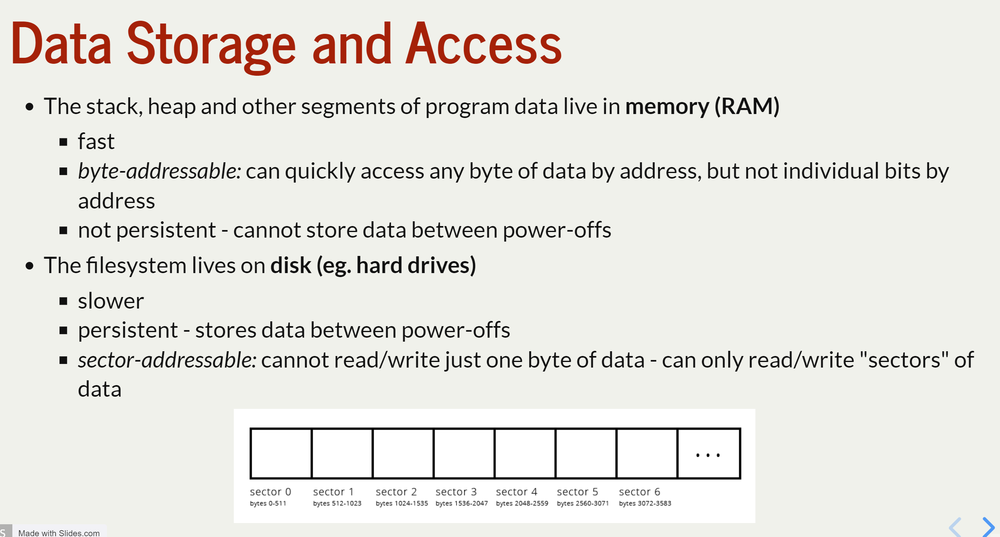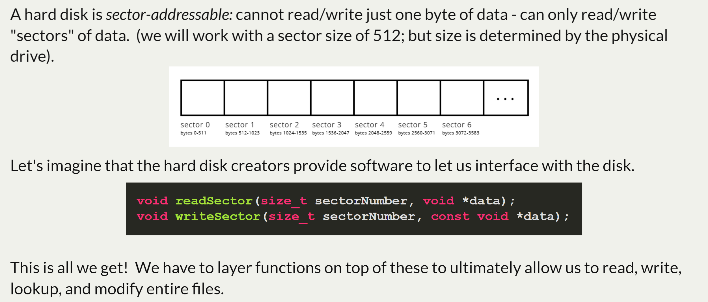

## readSector
> [!code]
> 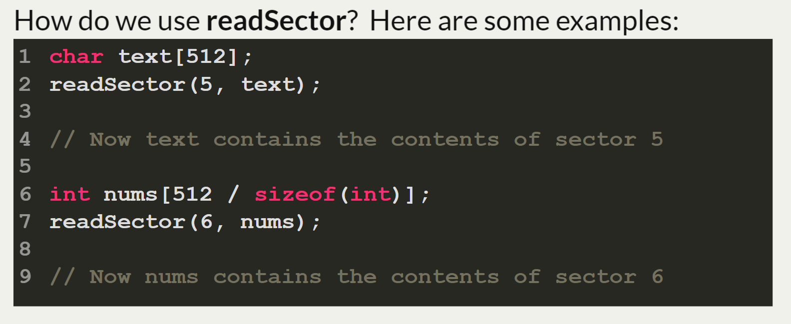

## writeSector
> [!code]
> 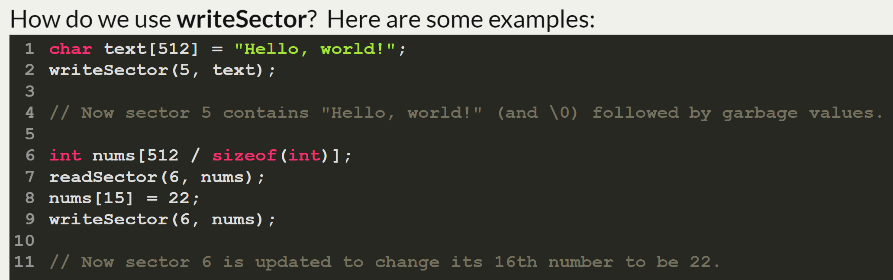

## Sectors and Blocks
> [!concept]
> 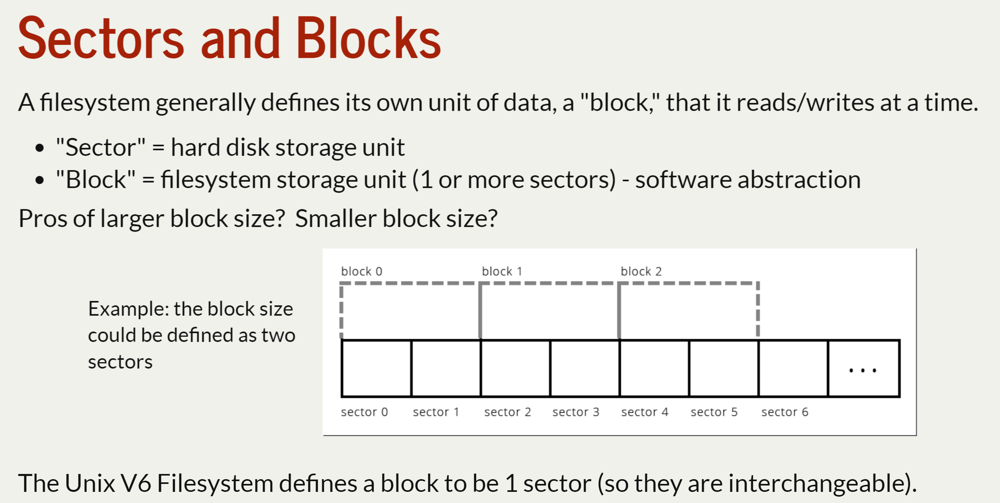

# Unix File V6 System Organization Intro
## Two types of Data
### File Payload Data
> [!concept]
> 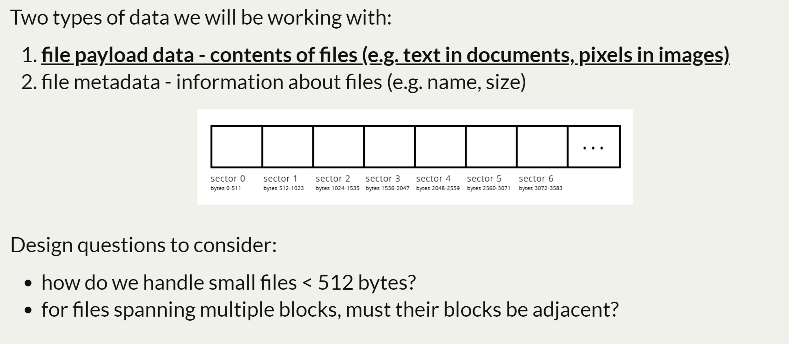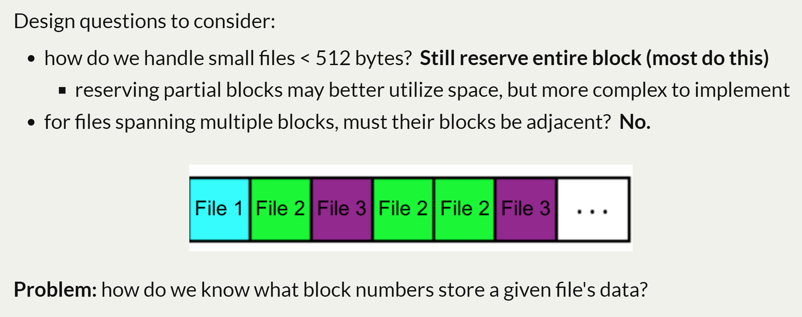

### File Metadata
> [!concept]
> 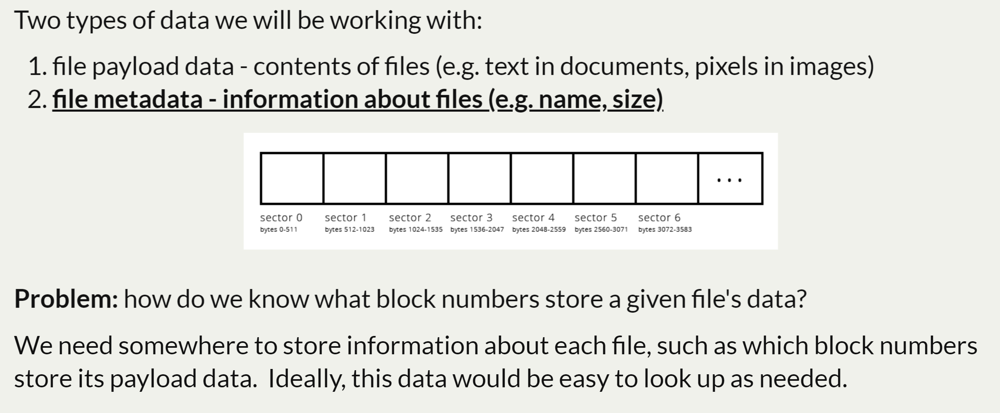

## File Metadata
> [!example]
> 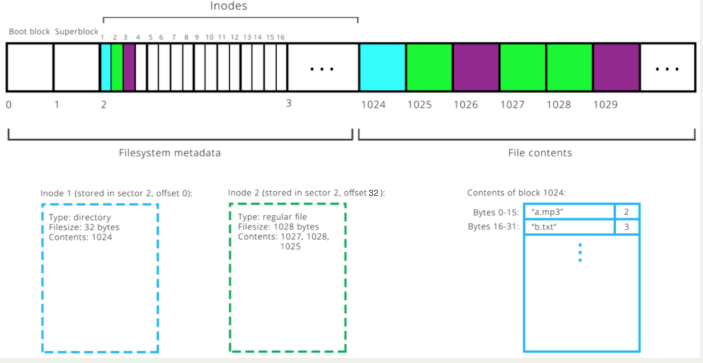
> **Notes:**
> - The first block is the boot block, which typically contains information about the hard drive itself. It's so named because its contents are generally tapped when booting—i.e. restarting—the operating system. This sector is universal and essential for a computer to start or enter into BIOS.
> - The second block is the superblock, which contains information about the filesystem imposing itself onto the hardware. It's just how filesystem interacts with the operating system.
> - ==Metadata region only accounts for up to 10% of the entire drive==. Even if it appears large in the graph.

## File Contents
> [!concept]
> - File payloads are stored in chunks of 512 bytes (or whatever the block size is).
> - **When a file isn't a multiple of 512 bytes, then the final block is a partial.** The portion of that final block that contains meaningful payload is easily determined from the file size.
> - The diagram below includes illustrations for a 32 byte (blue) and a 1028 (or 2 * 512 + 4) (green) byte file (as well as a purple file, which does not have an associated outline below), so each enlists some block to store a partial.
>
> 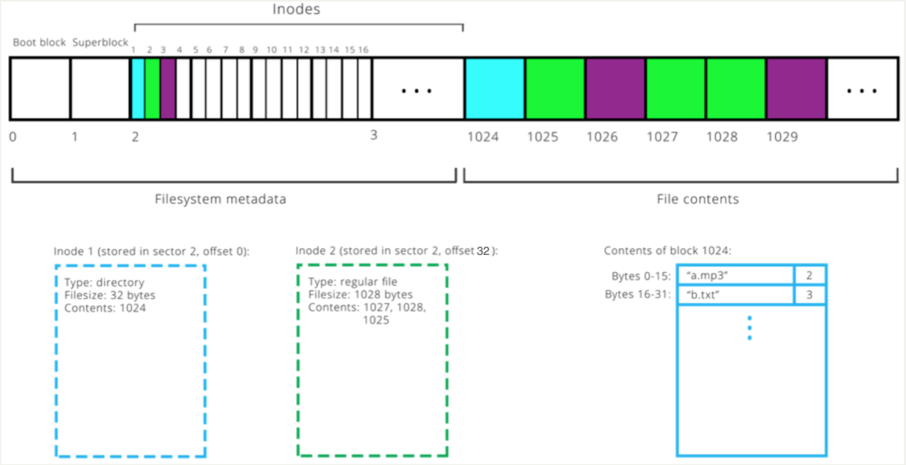

## Inode 
### Concepts
> [!concept]
> 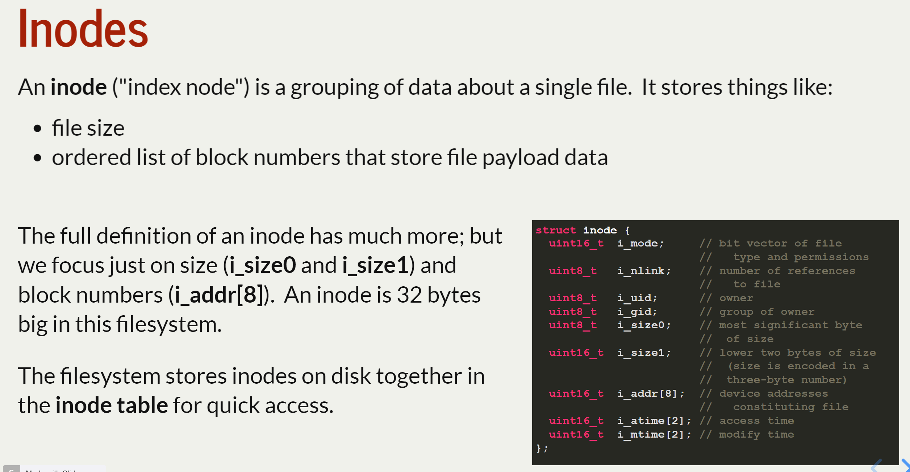

> [!concept]
> 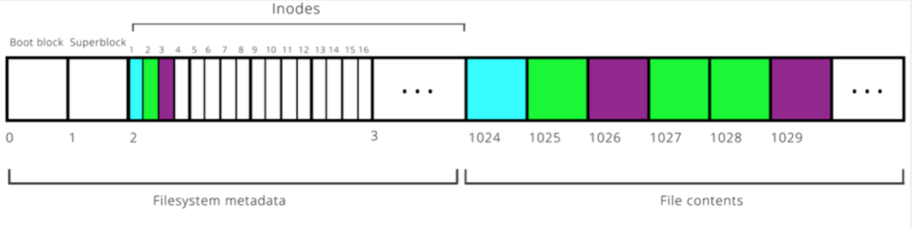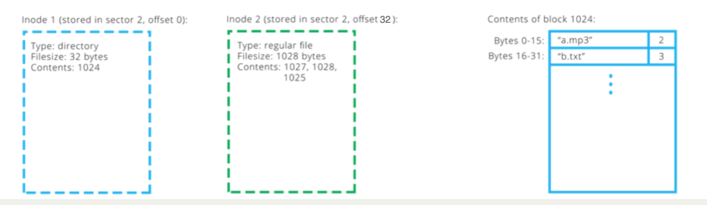We need to track which blocks are used to store the payload of a file.
> - The first inode is the root innode, it is the start of our file search process.
> - Note the `i_addr[8]` field, it stores up to 8 different number, each indicating a block number. **This means each file cannot exceed 512 x 8 = 4096 bytes and we will have to address this.**
> - Blocks 1025, 1027, and 1028 are part of the same file, but you only know visually because they're the same color in the diagram. 
> - Note that in `inode2`, the first three entries of `i_addr` is 1027, 1028, 1025, and they ==need to be ordered==.

> [!example] Partial Block
> 

### Accessing Innode
> [!code]
> 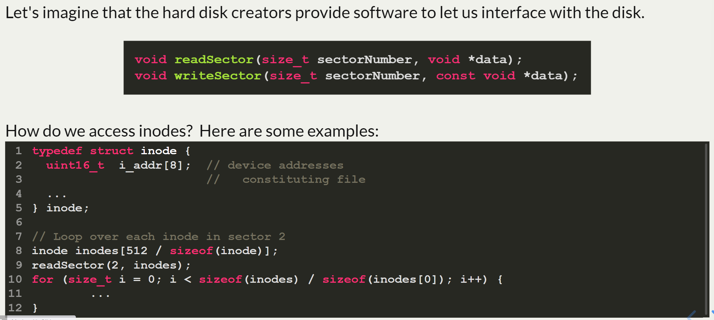

### Large File Storation - Indirect Addressing
> [!motiv] Motivation
> 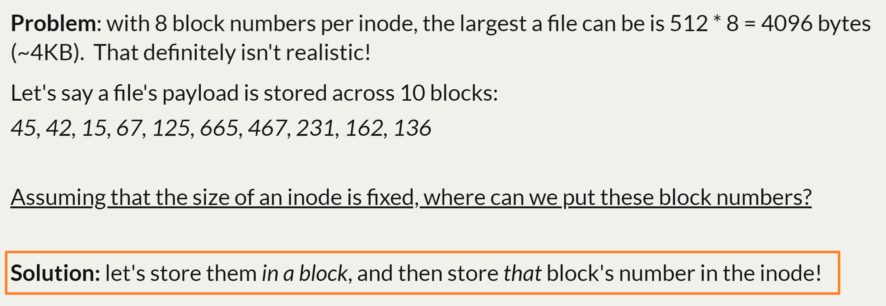

> [!concept] Indirect Addressing
> 
> Even though indirect addressing is useful, but means that it takes more steps to get to the data, and we may use more blocks than we need, so:
> - We should not make all the block numbers in an innode use indirect addressing. Just some of them.
> - We should ==use indirect addressing only for large files==.

## File Size
> [!important]
> The maximum file size that can be represented by innode without further improvements is $8\times512=4096 bytes$.

# Singly-Indirect Addressing
> [!concept]
> To address the issue of storing too few block numbers in the `inode` data structure, uv6 use `Singly-Indirect Addressing`.
> 
> The following is the logic for file storage:
> The Unix V6 filesystem uses _singly-indirect addressing_ (blocks that store payload block numbers) just for large files.
> 
> 

## File Storage Pattern
> [!concept]
> Check flag or size in inode to know whether it is a small file (direct addressing) or large one (indirect addressing)
> - If small(<= 4096 bytes), each block number in the inode stores payload data
> - If large, **all 8 block numbers** in the inode stores block numbers for payload data.

## Maximum File Size
> [!bug] Problem
> **Problem**: even with singly-indirect addressing, the largest a file can be is 8 * 256 * 512 = 1,048,576 bytes (~1MB).  That still isn't realistic!

# Doubly-Indirect Addressing
## File Storage Pattern
> [!concept]
> Check flag or size in inode to know whether it is a small file (direct addressing) or large one (indirect addressing)
> - If small(<= 4096 bytes), each block number in the inode stores payload data
> - If large, **first 7 block numbers** in the inode stores block numbers for payload data.
> - If large, the 8-th block number points to a block that stores at most 256 block numbers for blocks that use singly-indirect addressing.
> 
> **In other words; a file can be represented using at most 256 + 7 = 263 singly-indirect blocks.  The first seven are stored in the inode.  The remaining 256 are stored in a block whose block number is stored in the inode.**
> 
> Not all the block numbers may be used.  E.g.
> - 8th block number may be unused 
> - Or only the first X singly-indirect block numbers may be used
> - Or a singly-indirect block may not be completely filled with block numbers

## Maximum File Size
> [!important]
> 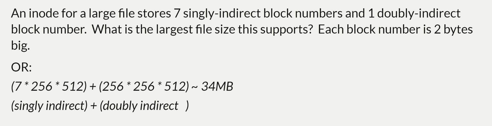

# Uv6 File Access Pattern
## Large File Example 1
> [!example]
> 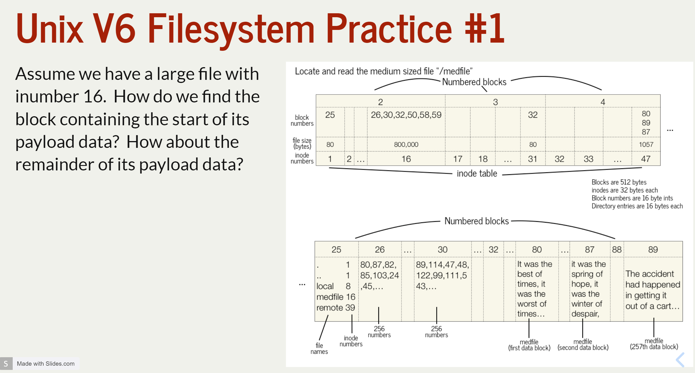
> The procedure goes like the following:
> - Go to block 26, and start reading block numbers. For the first number, 80, go to block 80 and read the beginning of the file (the first 512 bytes). Then go to block 87 for the next 512 bytes, etc.
> - After 256 blocks, go to block 30, and follow the 256 block numbers to 89, 114, etc. to read the 257th-511th blocks of data.
> - Continue with all indirect blocks, 32, 50, 58, 59 to read all 800,000 bytes.

## Large File Example 2
> [!example]
> 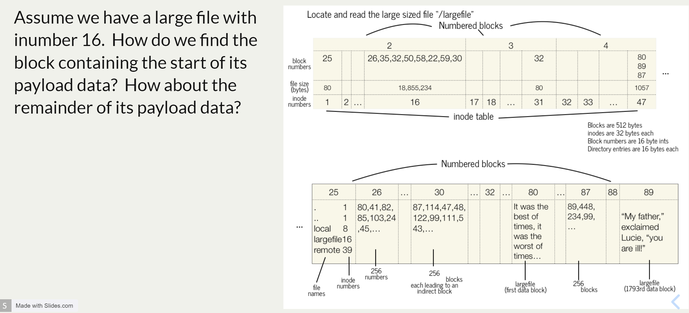
> The procedure goes like the following:
> - Go to block 26, and start reading block numbers. For the first number, 80, go to block 80 and read the beginning of the file (the first 512 bytes). Then go to block 41 for the next 512 bytes, etc.
> - After 256 blocks, go to block 35, repeat the process. Do this a total of 7 times, for blocks 26, 35, 32, 50, 58, 22, and 59, reading 1792 blocks.
> - Go to block 30, which is a doubly-indirect block. From there, go to block 87, which is an indirect block. From there, go to block 89, which is the 1793rd block.

# File Directory
## Basic Concepts
> [!concept]
> 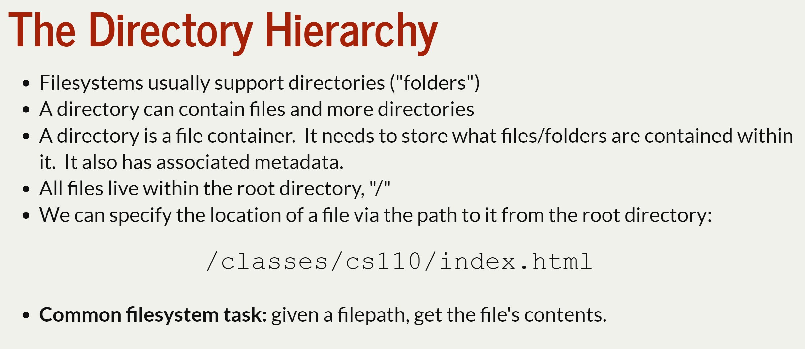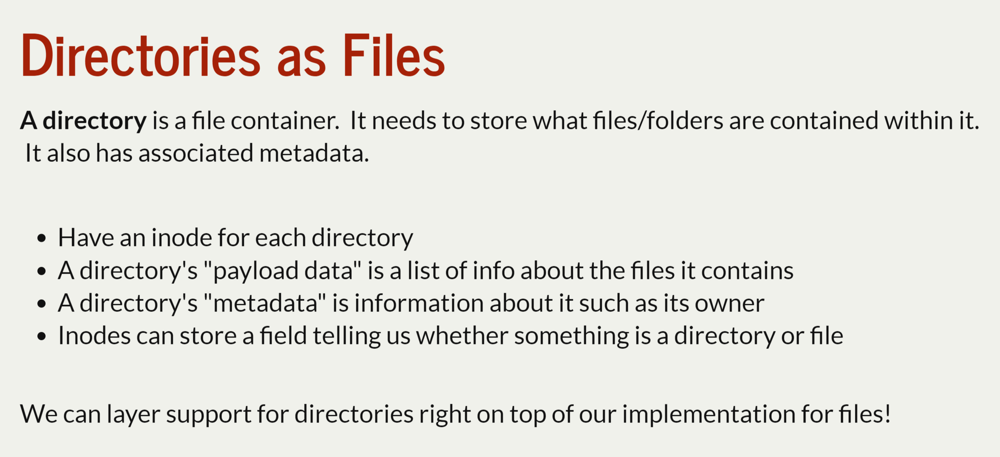

## Representing Directories
> [!important]
> 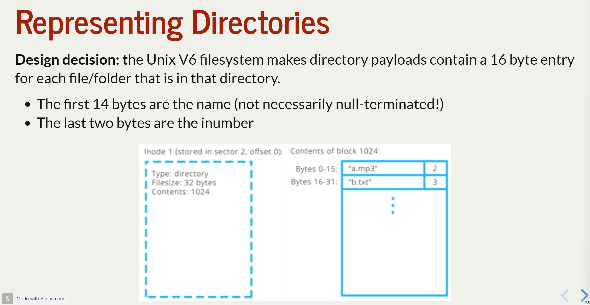

## Directory Lookup Process
> [!important]
> 
> Given the filepath above, the pseudo lookup process goes like the following:
> 1. Start at the root directory `/`
> 2. In the root directory, find the entry named `classes`
> 3. In the `classes` directory, find the entry named `cs110`
> 4. In the `cs110` directory, find the entry named `index.html`. Then read its contents.
> 
> The root directory (`"/"`) is set to have inumber 1. That way we always know where to go to start traversing.  (0 [is reserved](http://stackoverflow.com/questions/2099121/why-do-inode-numbers-start-from-1-and-not-0) to mean "NULL" or "no inode").
> 
> Now the lookup process is:
> 1. Go to inode with inumber 1(root directory)
> 2. In its payload data, look for the entry `classes` and get its inumber. Go to that inode.
> 3. Since `classes` is a file directory, we look into its payload data and find the entry `cs110` and get its inumber. Go to that inode.
> 4. Since `cs110` is a file directory, we look into its payload data and find the entry `index.html` and get its inumber. Go to that inode.
> 5. Since `index.html` is a regular file, we read its payload data.
> 

# Filename Lookup Examples
## Example 1 - Small File
> [!example ]
> 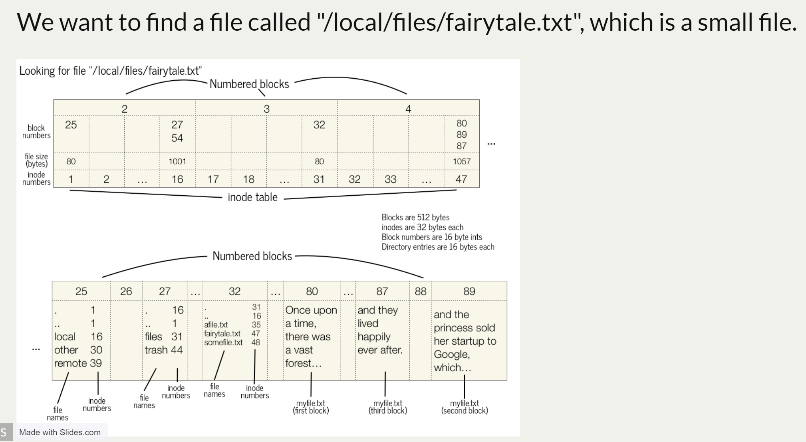
> The lookup process is as follows:
> - Go to inode 1.  It's small.  We need to look in block 25 for the list of its entries.
> - Look in block 25 for "local" -> inode 16.
> - Go to inode 16.  It's small.  We need to look in blocks 27/54 for the list of its entries.  
> - Look in block 27 for "files" (and then 54 if necessary)  -> inode 31.
> - Go to inode 31.  It's small.  We need to look in block 32 for the list of its entries.
> - Look in block 32 for "fairytale.txt" -> inode 47.
> - Go to inode 47.  It's small.  We need to look in blocks 80,89,87 in order for its 1,057 bytes of payload data.

## Example 2 - Large File
> [!example ]
> 
> The lookup process is as follows:
> - go to inode 1.  It's small.  We need to look in block 25 for the list of its entries.
> - Look in block 25 for "medfile" -> inode 16.
> - Go to inode 16.  It's large.  We need to look in block 26 for the first 256 payload block numbers.
> - Read through numbers in block 26.  First, go to block 80 for the first 512 payload bytes.  Then, go to block 87 for the second 512 payload bytes.
> - After doing this 256 times, go to block 30 and repeat.
> - Continue with all remaining singly-indirect blocks in the inode.

## Example 3 - Very Large File
> [!example] 
> 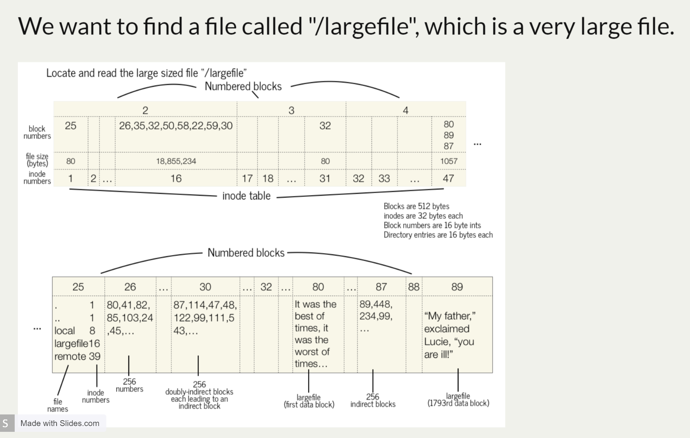
> The lookup process is as follows:
> - Go to inode 1.  It's small.  We need to look in block 25 for the list of its entries.
> - Look in block 25 for "largefile" -> inode 16.
> - Go to inode 16.  It's large.   For the first seven block numbers, go to those blocks and read their 256 block numbers to get payload blocks.
> - For the eighth block, go to block 30.  For each block number, go to that block and read in its block numbers to get payload blocks.

# File Reference
## Hard Links
> [!concept]
> 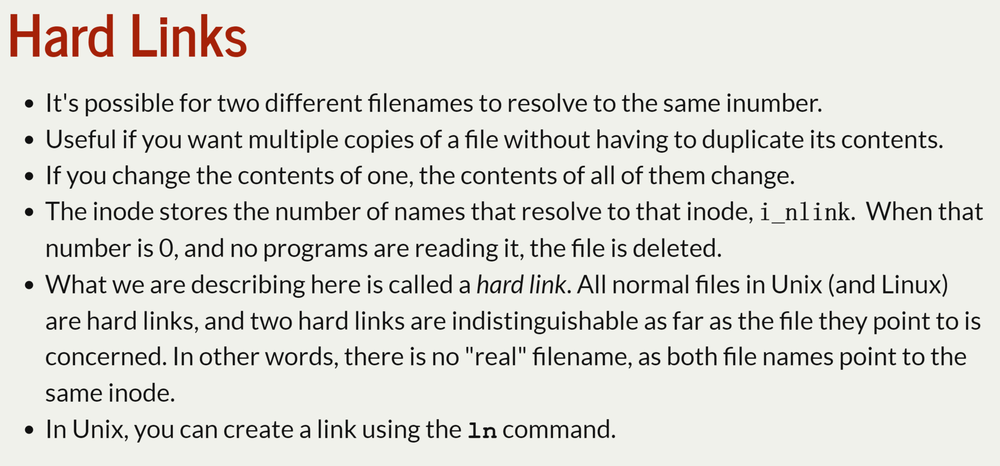

## Soft Links
> [!concept]
> 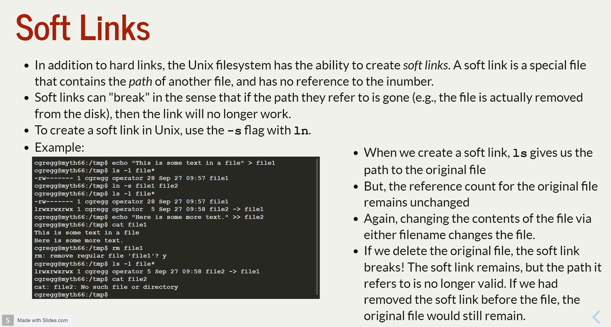

