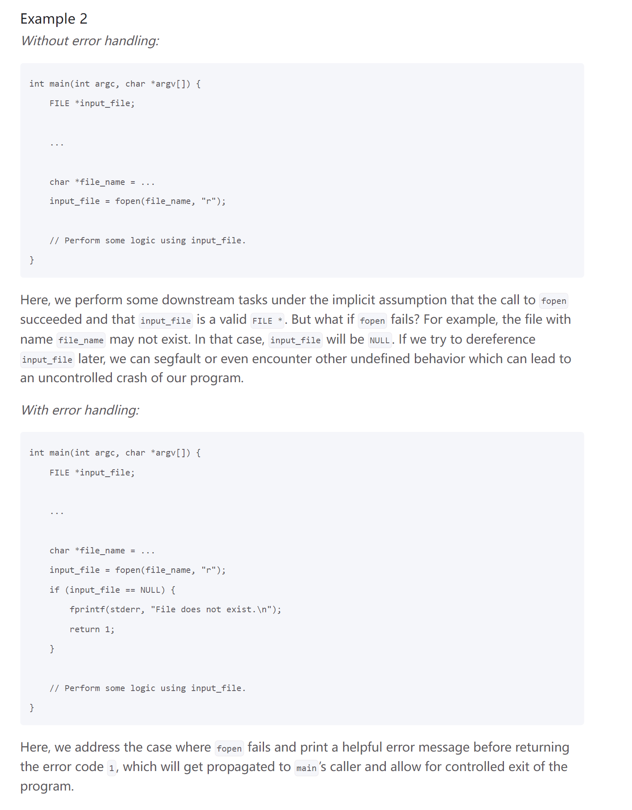

# Task 1: Word Count
> [!code]
> 
```c 
#define INITIAL_BUF_SIZE 8
int num_words(FILE* infile) {
  int num_words = 0;
  char c;
  char* cur_string = (char *)  malloc(INITIAL_BUF_SIZE + 1); // account for \0
  int curr_buf_size = INITIAL_BUF_SIZE;
  if (cur_string == NULL) {
      fprintf(stderr, "Allocation failed!");
      return 1;
  }
  int index = 0;

  bool flag = false;

  while ((c = fgetc(infile)) != EOF) {
    if (isalpha(c)) {
      flag = true;
      cur_string[index] = c;
      index++;
    } else {
      // Have unterminated string
      if (flag == true) {
        num_words++;
        cur_string[index] = '\0';
        // printf("%s\n", cur_string);
        index = 0;
        curr_buf_size = INITIAL_BUF_SIZE;
        free(cur_string);
        cur_string = (char *)  malloc(curr_buf_size + 1);
        flag = false;
      } else {
        // Doesn't have unterminated string
        continue;
      }
    }

    if (index >= curr_buf_size) {
      cur_string = (char *)  realloc(cur_string, curr_buf_size * 2 + 1);
      curr_buf_size = curr_buf_size * 2;
      if (cur_string == NULL) {
      fprintf(stderr, "Allocation failed!");
      return 1;
    }
    }
  }

  // To terminate the last word
  if (flag == true) {
    num_words++;
    cur_string[index] = '\0';
    // printf("%s\n", cur_string);
    index = 0;
    curr_buf_size = INITIAL_BUF_SIZE;
    cur_string = (char *)  malloc(curr_buf_size);
    free(cur_string);
    flag = false;
  }
  return num_words;
}

```


# Task 2: Frequency Counting
## Error Handling
> [!example] malloc
> 

> [!example] fopen
> 


## Main Program
> [!code]
> 
> **Key Functions Used:**
> 1. `fopen(char* path, int mode)`
> 2. `fclose(FILE* fstream)`
> 3. `fgetc(FILE* stream)`
> 	- `(c = fgetc(stream) != EOF)` for termination condition.
> 4. `malloc/realloc` see [Malloc/Calloc/Realloc](../../Machine_Structures/1_C_Language/Memory_Management.md#Malloc/Calloc/Realloc)
> 	- `malloc` returns a `void *` so we need to cast it to the desired type.
```c
/*
 * 3.1.2 Word Frequency Count
 *
 * Given infile, extracts and adds each word in the FILE to `wclist`.
 * Useful functions: fgetc(), isalpha(), tolower(), add_word().
 * 
 * As mentioned in the spec, your code should not panic or
 * segfault on errors. Thus, this function should return
 * 1 in the event of any errors (e.g. wclist or infile is NULL)
 * and 0 otherwise.
 */
int count_words(WordCount **wclist, FILE *infile) {
  char c;
  char* cur_string = (char *)  malloc(INITIAL_BUF_SIZE + 1); // account for \0
  int curr_buf_size = INITIAL_BUF_SIZE;
  if (cur_string == NULL) {
      fprintf(stderr, "Allocation failed!");
      return 1;
  }
  int index = 0;

  bool flag = false;
  while ((c = fgetc(infile)) != EOF) {
    if (isalpha(c)) {
      flag = true;
      cur_string[index] = tolower(c);
      index++;
    } else {
      // Have unterminated string
      if (flag == true) {
        cur_string[index] = '\0';
        add_word(wclist, cur_string);
        index = 0;
        curr_buf_size = INITIAL_BUF_SIZE;
        free(cur_string);
        cur_string = (char *) malloc(curr_buf_size + 1);
        if (cur_string == NULL) {
          fprintf(stderr, "Allocation failed!");
          return 1;
        }
        flag = false;
      } else {
        // Doesn't have unterminated string
        continue;
      }
    }

    if (index >= curr_buf_size) {
      cur_string = (char *)  realloc(cur_string, curr_buf_size * 2 + 1);
      curr_buf_size = curr_buf_size * 2;
      if (cur_string == NULL) {
        fprintf(stderr, "Allocation failed!");
        return 1;
      }
    }
  }

  // To terminate the last word
  if (flag == true) {
    cur_string[index] = '\0';
    add_word(wclist, cur_string);z
    index = 0;
    curr_buf_size = INITIAL_BUF_SIZE;
    cur_string = (char *)  malloc(curr_buf_size);
    free(cur_string);
    flag = false;
  }
  return 0;
}

/*
 * Comparator to sort list by frequency.
 * Useful function: strcmp().
 */
static bool wordcount_less(const WordCount *wc1, const WordCount *wc2) {
  return wc1 -> count - wc2 -> count < 0 || ((wc1 -> count == wc2 -> count) && strcmp(wc1 -> word, wc2 -> word) < 0);
}
```


# Task 3: User Limits
> [!task]
> 

> [!code]
```c
#include <stdio.h>
#include <sys/resource.h>

int main() {
    struct rlimit lim;

    getrlimit(RLIMIT_STACK, &lim);
    printf("stack size: %ld\n", lim.rlim_cur);

    getrlimit(RLIMIT_NPROC, &lim);
    printf("process limit: %ld\n", lim.rlim_cur);

    getrlimit(RLIMIT_NOFILE, &lim);
    printf("max file descriptors: %ld\n", lim.rlim_cur);
    return 0;
}
```
> [!code] Output
> 


