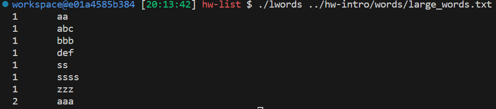

# Premilinaries
## list_entry macro
> [!def]
> The `list_entry` macro is a common idiom used in many kernel and systems programming contexts, especially within the Linux kernel, to get a pointer to a containing structure from a pointer to one of its members.
> 
> More usages see [Pintos List](../Pintos_Projects/Pintos_Doc/List.pdf)
> 


## Function Pointer
> [!important]
> See [Function_Pointers](Function_Pointers.pdf) and [Generics_Function_Pointers](../../../Machine_Structures/1_C_Language/Generics_Function_Pointers.md)
> 
> Key thing to remember, calling function pointer is the same as calling original function.


## Caveats in the pthread_mutex_lock
> [!bug] Important
> When we use lock/unlock paradigm in a function, we have to make sure that `return` statement doesn't appear before unlock. Otherwise, the function returns without having a chance to unlock.
> 
> The following is one such example where it appears that there is a return statement after the unlock, but we have branch instruction at line 4, if `foundStruct != NULL`, then we return without covering line 19.
```c
word_count_t* add_word_with_count(word_count_list_t* wclist, char* word, int count) {
  pthread_mutex_lock(&wclist->lock);
  word_count_t* foundStruct = find_word(wclist, word);
  if (foundStruct != NULL) {
    (foundStruct -> count)++;
    return foundStruct;
  }

  word_count_t* newWord = (word_count_t *) malloc(sizeof(word_count_t));
  newWord -> word = (char*) malloc(strlen(word) + 1);
  if (newWord -> word == NULL) {
    fprintf(stderr, "Malloc Failed!");
    return NULL;
  }
  strcpy(newWord -> word, word);
  newWord->count = 1;
  list_push_front(&wclist->lst, &newWord->elem);
  pthread_mutex_unlock(&wclist->lock);
  return newWord;
}
```


## Compiler Flags
> [!important]
> The `#ifdef` directive in C and C++ is a preprocessor directive used to conditionally include or exclude parts of a program based on whether a specific macro is defined. 
> 
> This is particularly useful for making code portable across different platforms, for including debug code, or for compiling code with different features enabled. Here's a breakdown of its usage:
```c
#ifdef PINTOS_LIST
#include "list.h"
typedef struct word_count {
  char* word;
  int count;
  struct list_elem elem;
} word_count_t;

#ifdef PTHREADS
#include <pthread.h>
typedef struct word_count_list {
  struct list lst;
  pthread_mutex_t lock;
} word_count_list_t;
#else  /* PTHREADS */
typedef struct list word_count_list_t;
#endif /* PTHREADS */

#else  /* PINTOS_LIST */

typedef struct word_count {
  char* word;
  int count;
  struct word_count* next;
} word_count_t;

typedef word_count_t* word_count_list_t;
#endif /* PINTOS_LIST */
```
> [!code] Makefile
> Here we pass in the macro `PINTOS_LIST` and `PTHREADS` to affect the behavior of the compiler, to decice which piece of code should be compiled.
```makefile
word_count_l.o:
	$(CC) $(CFLAGS) -DPINTOS_LIST -c $< -o $@

pwords.o word_count_p.o:
	$(CC) $(CFLAGS) -DPINTOS_LIST -DPTHREADS -c $< -o $@
```


# Task 1: lwords
> [!code]
> 
```c
/* Since in the makefile, we set up a compiler flag -DPINTOS_LIST, so
*  1. word_count_list_t would be struct list defined in list.h
*  2. word_count_t would depend on list_elem defined in list.h 
*/

#ifndef PINTOS_LIST
#error "PINTOS_LIST must be #define'd when compiling word_count_l.c"
#endif

#include "word_count.h"

void init_words(word_count_list_t* wclist) {
/* Calls the list_init in list.c 
 * since word_count_list_t here is just struct list
 */
  list_init(wclist);   
}

size_t len_words(word_count_list_t* wclist) {
  return list_size(wclist);
}

word_count_t* find_word(word_count_list_t* wclist, char* word) {
  struct list_elem* e;

  // List Iterator
  for (e = list_begin(wclist); e != list_end(wclist); e = list_next(e)) {
    // Find the wrapper struct
    word_count_t* wrap = list_entry(e, word_count_t, elem);
    if (strcmp(wrap -> word, word) == 0) {
      return wrap;
    }
  }

  return NULL;
}


word_count_t* add_word(word_count_list_t* wclist, char* word) {

  word_count_t* foundStruct = find_word(wclist, word);
  if (foundStruct != NULL) {
    foundStruct -> count++;
    return foundStruct;
  }

  // If we allocate the new nodes on the stack, it will be freed after the functione exits
  // So we have to allocate the newNode on the heap.(Very important)
  word_count_t* newWord = (word_count_t *) malloc(sizeof(word_count_t));
  newWord -> word = (char *) malloc(strlen(word) + 1);
  if (newWord -> word == NULL) {
    fprintf(stderr, "Malloc Failed!");
    return NULL;
  }
  strcpy(newWord->word, word); // We don't need to terminate assuming that word is '\0' terminated
  newWord->count = 1;
  list_push_front(wclist, &newWord->elem);
  return newWord;
}

void fprint_words(word_count_list_t* wclist, FILE* outfile) {

  struct list_elem* e;

  // List Iterator
  for (e = list_begin(wclist); e != list_end(wclist); e = list_next(e)) {
    // Find the wrapper struct
    word_count_t* wrap = list_entry(e, word_count_t, elem);
    fprintf(outfile, "%i\t%s\n", wrap->count, wrap->word);
  }
}

// less_list is used to compare two list_elem, but in order to compare, we have to
// use less() function, which compares between two word_count_t(which contains list_elem as members)
static bool less_list(const struct list_elem* ewc1, const struct list_elem* ewc2, void* aux) {
  
  // The aux field is just the function pointer passed in by the wordcount_sort()
  // which is defined in word_helper.h

  // Here we cast void* to get the function pointer
  bool (*less) (const word_count_t*, const word_count_t*) = aux;
  word_count_t* wrap1 = list_entry(ewc1, word_count_t, elem);
  word_count_t* wrap2 = list_entry(ewc2, word_count_t, elem);

  // Could also be (*less)(wrap1, wrap2)
  return less(wrap1, wrap2); 
}

void wordcount_sort(word_count_list_t* wclist,
                    bool less(const word_count_t*, const word_count_t*)) {
  list_sort(wclist, less_list, less);
}


```
> [!code] Output
> 


# Task 2: pthread
> [!code] Output
> 

> [!quiz]
> 1. **Is the program’s output the same each time it is run? Why or why not?**
> 	No, it depends on scheduling.
> 2. **Based on the program’s output, do multiple threads share the same stack?**
>      No, each thread has its own stack, isolated from other threads.
> 3. **Based on the program’s output, do multiple threads have separate copies of global variables?**
> 	 No, thread shares heap, code, and static/data section of the memory, so they don't have multiple copies of the global variables locally.
> 4. **Based on the program’s output, what is the value of `void *threadid`? How does this relate to the variable’s type `(void *)`?**
> 	 It is a form of generic programming in C, the reason why we cast long t to `(void *)` is to match the method signature of the `pthread_create()`.
> 5. **Using the first command line argument, create a large number of threads in `pthread`. Do all threads run before the program exits? Why or why not?**
> 	 **YES.** Exiting the initial thread (for example, by calling the pthread_exit subroutine from the main routine) does not terminate the process. It terminates only the initial thread. If the initial thread is terminated, the process will be terminated when the last thread in it terminates. In this case, the process return code is 0. https://www.ibm.com/support/knowledgecenter/en/ssw_aix_71/generalprogramming/term_threads.html


# Task 3: pwords
## Idea
> [!concept] Main Idea
> The shared variable across multiple threads should be `word_counts`, which is the dictionary that we want to construct. 
> 
> The critical section should be the `add_word()` function in `word_count_p.c` where the thread is updating the `word_counts` data structure.
> 
> There can be 2 ways to put our shared resources:
> 1. Put it on the stack of the main thread since the main thread will wait(through `pthread_join()`) until all its child processes terminates. So the `word_counts` on the stack will not be preemptly freed before all child process finishes its updating.
> 2. Put it on the static section of the process. This method treat all threads(including main thread) equally, they all share the `static` section of the memory and update the `word_counts` there. Again, since even if the main thread terminates, the main process won't terminate before all the child threads terminates, thus the memory on the static won't be freed before all threads finishes updating. Here since we use `pthread_join` to wait for child process, we won't even have this problem. 
> 3. The first method works but is prone to unpredictable problems. Stack within a process share the same address space, even though they have different stacks, they can pass in the stack address to each other if needed, which requires synchonization to work perfectly fine to prevent the stack from being corrupted.


## Method 1: Dictionary on the Stack
> [!code] Allocate the shared resources on the stack
> 

```c
#include <stddef.h>
#include <stdio.h>
#include <string.h>
#include <ctype.h>
#include <stdlib.h>
#include <pthread.h>

#include "word_count.h"
#include "word_helpers.h"

typedef struct targs {
  long threadid;
  char* infile;
  word_count_list_t* word_count_list;
} thread_args_t;


void* threadfun(void* args) {
  thread_args_t* t_args = (thread_args_t*) args;
  char* filename = t_args -> infile;
  word_count_list_t* word_count_list = t_args -> word_count_list;
  FILE* infile = fopen(filename, "r");
  
  if (infile == NULL) {
      fprintf(stderr, "Error occurred during file opening!");
      fclose(infile);
      return NULL;
  }

  // printf("Thread %lx", t_args->threadid);
  count_words(word_count_list, infile);
  fclose(infile);
  return NULL;
}


/*
 * main - handle command line, spawning one thread per file.
 */
int main(int argc, char* argv[]) {
  /* Create the empty data structure. */
  // Allocate on the stack
  word_count_list_t word_counts;
  init_words(&word_counts);
  
  int rc; // Detect error when creating threads
  long t;

  char* filename = NULL;

  if (argc <= 1) {
    /* Process stdin in a single thread. */
    count_words(&word_counts, stdin);
  } else {
    pthread_t threads[argc - 1];
    for (t = 1; t < argc; t++ ) {
      filename = argv[t];
      thread_args_t t_args = {t, filename, &word_counts};
      rc = pthread_create(&threads[t - 1], NULL, threadfun, (void *) &t_args);
      if (rc) {
        printf("ERROR; return code from pthread_create() is %d\n", rc);
        exit(-1);
      }

      for (t = 1; t < argc; t++) {
        pthread_join(threads[t - 1], NULL);
      }
    }
  }
  /* Output final result of all threads' work. */
  wordcount_sort(&word_counts, less_count);
  fprint_words(&word_counts, stdout);
  return 0;
}

```

## Method 2: Dictionary on the Static
> [!code] 
> 
```c
#include <stddef.h>
#include <stdio.h>
#include <string.h>
#include <ctype.h>
#include <stdlib.h>
#include <pthread.h>

#include "word_count.h"
#include "word_helpers.h"


// Shared resources on the static memory
word_count_list_t word_counts;


// struct to hold thread arguments
typedef struct targs {
  long threadid;
  char* infile;
} thread_args_t;


void* threadfun(void* args) {
  thread_args_t* t_args = (thread_args_t*) args;
  char* filename = t_args -> infile;
  FILE* infile = fopen(filename, "r");
  
  if (infile == NULL) {
      fprintf(stderr, "Error occurred during file opening!");
      fclose(infile);
      return NULL;
  }

  // printf("Thread %lx", t_args->threadid);
  count_words(&word_counts, infile);
  fclose(infile);
  return NULL;
}


/*
 * main - handle command line, spawning one thread per file.
 */
int main(int argc, char* argv[]) {
  /* Create the empty data structure. */
  init_words(&word_counts);
  
  int rc; // Detect error when creating threads
  long t;

  char* filename = NULL;

  if (argc <= 1) {
    /* Process stdin in a single thread. */
    count_words(&word_counts, stdin);
  } else {
    pthread_t threads[argc - 1];
    for (t = 1; t < argc; t++ ) {
      filename = argv[t];
      thread_args_t t_args = {t, filename};
      rc = pthread_create(&threads[t - 1], NULL, threadfun, (void *) &t_args);
      if (rc) {
        printf("ERROR; return code from pthread_create() is %d\n", rc);
        exit(-1);
      }

      for (t = 1; t < argc; t++) {
        pthread_join(threads[t - 1], NULL);
      }
    }
  }
  /* Output final result of all threads' work. */
  wordcount_sort(&word_counts, less_count);
  fprint_words(&word_counts, stdout);
  return 0;
}
```

