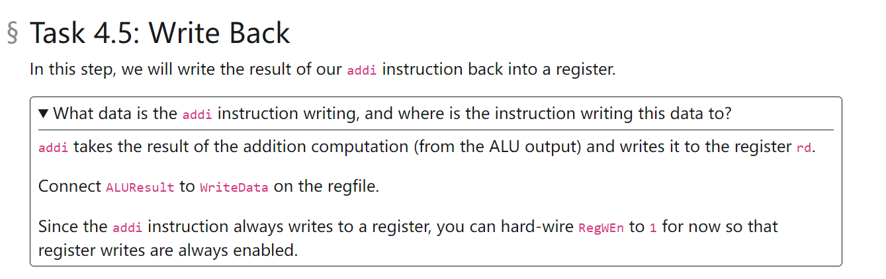

# Task 1: ALU(Easy)
> [!task]
> 

> [!solution]
> **Sample Solution Circuit**

> [!test]
> **Testing Results**

# Task 2: Register File(Medium)
> [!task]
> 
> 

> [!solution]
> **使用到的元器件:**
> 1. `Demux`
> 2. `Mux`
> 3. `Constant`
> 4. `Tunnel`
> 思路就是我们需要使用`Mux`(ReadIndex1/ReadIndex2)来决定哪一个`Register`的数据被读取到并返回给`ReadData1`和`ReadData2`
> 使用`Demux`(WriteIndex)来决定哪一个`Register`需要接收`RegWEn bit`来将`WriteData`通过`D`端口更新到寄存器内。
> 
> **Sample Solution Circuit**
> 

> [!test]
> **Testing Result**

# Task 3: Immediate Generator(Easy)
> [!task]
> 
> 因为`Immediate`总是需要用来进行`ALU`运算的，而`ALU`运算一般都需要`Sign Extension`，所以我们这里使用一个`Sign Extender`元件。

> [!solution]
> **Sample Solution Circuit**

> [!test]
> **Testing Result**

# Task 4: DataPath(Easy)
> [!task]
> 

## Task 4.1 Instruction Fetch
> [!task]
> 

## Task 4.2 Instruction Decode
> [!task]
> 

## Task 4.3 Execute
> [!task]
> 

## Task 4.4 Memory
> [!task]
> 

## Task 4.5 Write Back
> [!task]
> 

## Sample Solution Circuit
### ImmGen
> [!code]
> 
> 因为在`ALU Execution Stage`时，我们做代数运算总是要`Sign Extension`的，所以`ImmGen`也自然要`Sign Extended`。

### DataPath for addi
> [!code]
> 

## Testing Result
> [!test]
> 

# Intro: Control Logic(Medium)
> [!task]
> 这个任务要求我们给定`Instruction`输出其`Control Signals`。
> 
> **Link:** [https://inst.eecs.berkeley.edu/~cs61c/sp23/projects/proj3/control-logic/](https://inst.eecs.berkeley.edu/~cs61c/sp23/projects/proj3/control-logic/)
> 
> Remember when you make a copy, be sure to use the copy option under the file tab instead of just selecting the cells, which only copies the visible cells and all the invisible/hidden ones are not copied, which would cause information loss.
> **SpeadSheet(Blank): **[https://docs.google.com/spreadsheets/d/1ituaCx7hPnPXVZ1WO5lLwuDZKNo4VUHLrBhGaHCVhjg/edit#gid=0](https://docs.google.com/spreadsheets/d/1ituaCx7hPnPXVZ1WO5lLwuDZKNo4VUHLrBhGaHCVhjg/edit#gid=0)
> **SpreadSheet Filled:**  
> [https://docs.google.com/spreadsheets/d/1ituaCx7hPnPXVZ1WO5lLwuDZKNo4VUHLrBhGaHCVhjg/edit#gid=0](https://docs.google.com/spreadsheets/d/1ituaCx7hPnPXVZ1WO5lLwuDZKNo4VUHLrBhGaHCVhjg/edit#gid=0)
> **Some Specifications:**
> 1. `WBSel`**: **
>    1. **00 PC+4**
>    2. **01 ALU**
>    3. **10 Mem**
>    4. **11 Don't care**
> 2. `ALUSel`**:**
> 
> 3. `RegWEn`**:**
>    1 - Write Back to rd Enabled
>    0 - Don't have to write
> 4. `ImmSel`**:**
> 
> `0b000`: I Type(Excluding Loading)
> `0b110`: R Type
> `0b101`: I Type Load
> `0b001`: S Type
> `0b010`: B Type
> `0b011`: U Type
> `0b100`: J Type
> 5. `ASel/BSel`**:**
>    1 - registers
>    0 - imm/PC

# Task 5: I-type Instructions(Medium)
> [!task]
> 
> 这里我们使用了一个新的电子原件`Priority Encoder`, 用法如图所示:
> 
> 
> If the i-th input bit of the priority encoder is on (input wire i is 1)then it output the binary representation of i. For example, if the second input bit is on, then it outputs 0b10。
> 上图中`is_add/is_mul/is_sub`都是`1 bit signal`输入，`add`对应的是`0b00`, `mul`对应的是`0b01`, `sub`对应的是`0b10`。

> [!solution]
> **CPU Circuit**
 **Control Signal Cicruit - Proority Encoder**
 

> [!test]
> **Test Result - Caveats**
注意写测试的时候不要`shift`太多`bits(一次性/多次加总超过32bits)`, 否则`test`会有一些不可预知的问题。

# Task 6: R-type Instructions(Easy)
> [!task]
> 

## Task 6.1: DataPath
> [!task]
> 

> [!solution]
> 

> [!test]
> 

## Task 6.2: Control Logic
> [!task]
> 

> [!solution]
> 
> 只需要将`R-Type`的指令都挂载到Control Logic Circuit即可。
> 注意：一定要按照Google Sheet中的Index来连线。比如Google Sheet 中规定了add是Index 0， 则我们必须将is_add 连接到Priority Encoder的Index 0处。其他指令同理。

# Task 7: B-type Instructions(Medium)
## Task 7.1 Branch Comparator
> [!task]  Branch Comparator
> 

## Task 7.2 Immediate Generator
> [!task] Immediate Generator
> 

## Task 7.3 DataPath
> [!task] DataPath

## Task 7.4 Control Logic
> [!task] Control Logic

# Task 8: Loading and Storing(Medium)
> [!task] 
> 

# Task 9: Jumps and U-type Instructions(Medium)
> 

# Task 10: Pipelining(Hard)
> 

