[sp23-proj1-starter-main.zip](https://www.yuque.com/attachments/yuque/0/2023/zip/12393765/1694486487030-a443d5a7-e841-4b7b-bd22-3b5052d7b6d3.zip)
[proj01_spec.pdf](https://www.yuque.com/attachments/yuque/0/2023/pdf/12393765/1694486765129-47a25a49-2388-4aac-a205-7fd691096aec.pdf)


# Task 1: create_default_state(Easy)
> 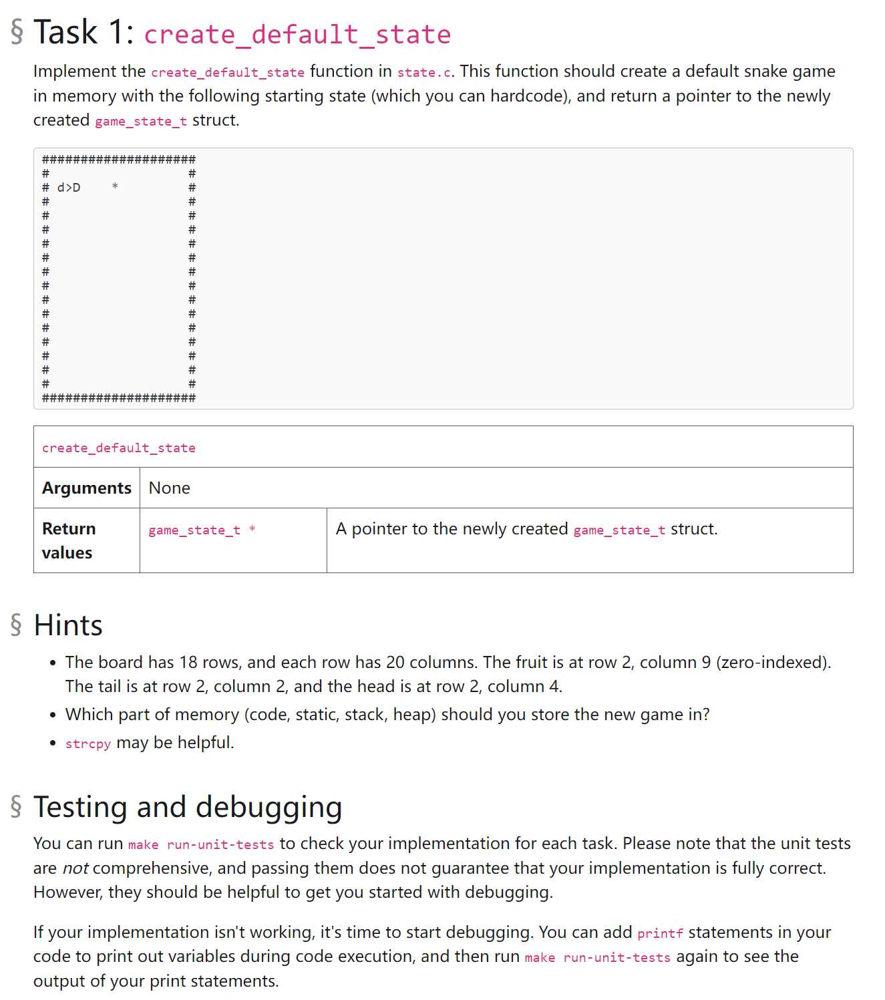
> 注意点是在我们给`char*`分配空间的时候一定要预留一个`byte`给`null terminator`。

```c
/* Task 1 */
game_state_t* create_default_state() {
    // TODO: Implement this function.

    // Initial parameters

    // Initialize the game_state_t in the heap
    game_state_t* game_state = (game_state_t*) malloc(sizeof(game_state_t));
    game_state -> num_rows = 18;
    game_state -> num_snakes = 1;

    // Initialize the snake array
    snake_t* snakes = (snake_t*) malloc(sizeof(snake_t) * game_state -> num_snakes);

    // Initialize the board(2d array)
    char** board = (char**) malloc(sizeof(char*) * game_state->num_rows);
    for (int i = 0; i < game_state -> num_rows; i++) {
        char* row = (char*) malloc(sizeof(char) * 21); // Careful here, don't miss the null terminators
        board[i] = row;
    }

    strcpy(board[0], "####################");
    strcpy(board[game_state -> num_rows - 1], "####################");
    for (int i = 1; i < game_state -> num_rows - 1; i++){
        strcpy(board[i], "#                  #");
        strcpy(board[i], "#                  #");
    }

    // Initialize the snake
    snakes[0].tail_row = 2;
    snakes[0].tail_col = 2;
    snakes[0].head_row = 2;
    snakes[0].head_col = 4;
    snakes[0].live = true;

    board[2][2] = 'd';
    board[2][3] = '>';
    board[2][4] = 'D';


    // Initialize the fruit
    board[2][9] = '*';


    // Assemble the game_state
    game_state -> board = board;
    game_state -> snakes = snakes;

    return game_state;
}
```
> 


# Task 2: free_state(Easy)
> 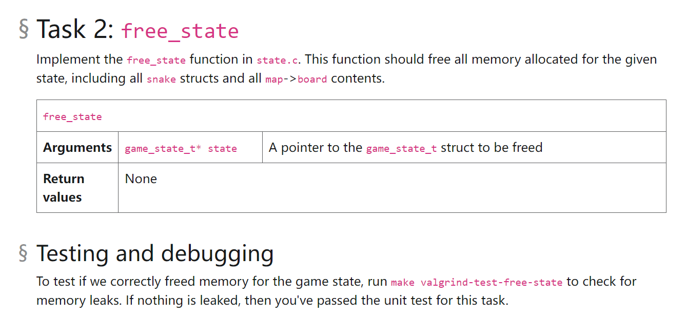注意点就是先从内部的数据结构开始释放内存，逐步向外层释放。

```c
/* Task 2 */
void free_state(game_state_t* state) {
  // TODO: Implement this function.

  // Free board
  char** board = state -> board;
  for (int i = 0; i < state -> num_rows; i++) {
    char* row_pointer = board[i];
    free(row_pointer); 
  }
  free(board);

  // Free snakes
  snake_t* snake_arr = state -> snakes;
  free(snake_arr);

  // Free game_state
  free(state);

  return;
}
```
> 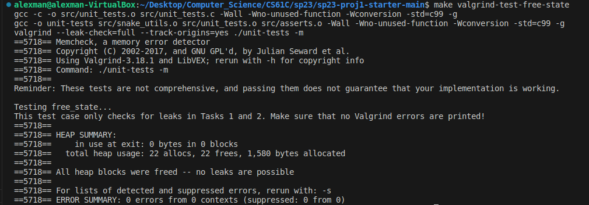


# Task 3: print_board(Medium)
> 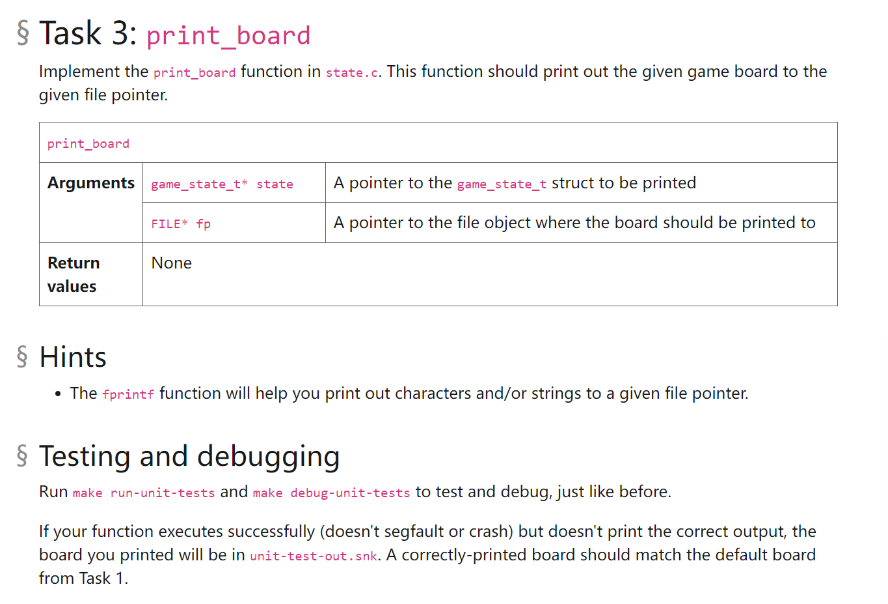
> 要求，将`board`变量逐行输入`fp`。
> `fprintf`的使用方法如下

```c
#include <stdio.h>

int main() {
    FILE *fp; // declare a FILE pointer
    
    // Open the file for writing
    fp = fopen("output.txt", "w");
    if (fp == NULL) {
        perror("Error opening file");
        return 1;
    }
    
    // Write formatted data to the file using fprintf
    int age = 30;
    // 数据流的方向, from "....." to fp, %d表示用int填充。
    fprintf(fp, "John Doe is %d years old.\n", age);
    
    // Close the file after writing
    fclose(fp);

    return 0;
}
```
> **注意，在**`**Linux**`**系统和**`**Windows**`**系统上，**`**\n**`**在以非二进制形式写入文件时，会出现不同的结果。**
> 在`Windows`系统上，系统会自动将`\n`转化为`\r\n`, 导致实际文件尺寸偏大。解决方法有两种:
> 1. 在打开文件时用二进制形式`wb`。
> 2. 在写入文件之前:
>    1. 先导入`#include <io.h>`, `#include <fctl.h>`
>    2. 再执行`_setmode(_fileno(fp), _O_BINARY);`即可，防止转换。
> 
在`Linux`系统上，系统不会将`\n`转化为`\r\n`，所写即所得。

```c
/* Task 3 */
void print_board(game_state_t* state, FILE* fp) {
  // TODO: Implement this function.
  unsigned int nrows = state -> num_rows;
  char** board = state -> board;
  for (int i = 0; i < nrows; i++) {
    char* row_pointer = board[i];
    fprintf(fp, "%s\n", row_pointer);
  }

  return;
}

```
> **Test Result - On Ubuntus, which will not translate \n to \r\n:**
> 

```c
/* Task 3 */
void print_board(game_state_t* state, FILE* fp) {
  // TODO: Implement this function.
  _setmode(_fileno(fp), _O_BINARY); // Setting mode to binary for this file stream
    
  unsigned int nrows = state -> num_rows;
  char** board = state -> board;
  for (int i = 0; i < nrows; i++) {
    char* row_pointer = board[i];
    fprintf(fp, "%s\n", row_pointer);
  }

  return;
}
```
> **Test Result - On Windows, which will translate \n to \r\n, resulting in extra bytes:**
> 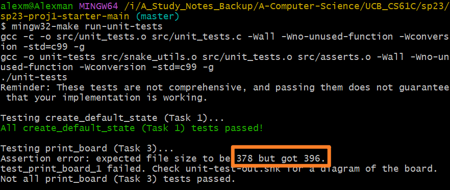
> **执行了上述**`**_setmode(_fileno(fp), _O_BINARY);**`**后，可以得到:**
> 


# Task 4: update_state(Medium)
## Task 4.1 Helpers
> 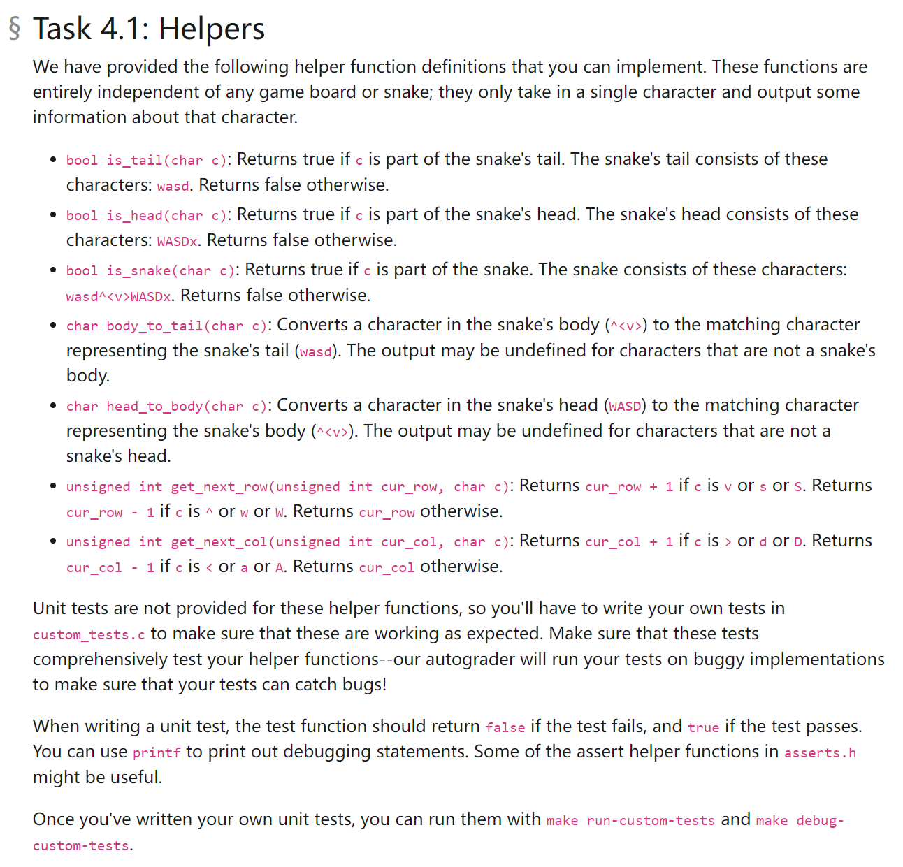

```c
/* Task 4.1 */

/*
  Helper function to get a character from the board
  (already implemented for you).
*/
char get_board_at(game_state_t* state, unsigned int row, unsigned int col) {
  return state->board[row][col];
}

/*
  Helper function to set a character on the board
  (already implemented for you).
*/
static void set_board_at(game_state_t* state, unsigned int row, unsigned int col, char ch) {
  state->board[row][col] = ch;
}

/*
  Returns true if c is part of the snake's tail.
  The snake consists of these characters: "wasd"
  Returns false otherwise.
*/
static bool is_tail(char c) {
  // TODO: Implement this function.
  int i = 0;
  while (i < strlen(TAIL)) {
    if (TAIL[i] == c) {
      return true;
    }
    i++;
  }
  return false;
}

/*
  Returns true if c is part of the snake's head.
  The snake consists of these characters: "WASDx"
  Returns false otherwise.
*/
static bool is_head(char c) {
  // TODO: Implement this function.
  int i = 0;
  while (i < strlen(FRONT)) {
    if (FRONT[i] == c) {
      return true;
    }
    i++;
  }
  return false;
}

/*
  Returns true if c is part of the snake.
  The snake consists of these characters: "wasd^<v>WASDx"
*/
static bool is_snake(char c) {
  // TODO: Implement this function.
  int i = 0;
  while (i < strlen(SNAKE)) {
    if (SNAKE[i] == c) {
      return true;
    }
    i++;
  }
  return false;
}

/*
  Converts a character in the snake's body ("^<v>")
  to the matching character representing the snake's
  tail ("wasd").
*/
static char body_to_tail(char c) {
  // TODO: Implement this function.
  char output = '?';
  switch (c) {
    case '^':
      output = 'w';
      break;
    case '<':
      output = 'a';
      break;
    case 'v':
      output = 's';
      break;
    case '>':
      output = 'd';
      break;
  }
  return output;
}

/*
  Converts a character in the snake's head ("WASD")
  to the matching character representing the snake's
  body ("^<v>").
*/
static char head_to_body(char c) {
  // TODO: Implement this function.
  char output = '?';
  switch (c) {
    case 'W':
      output = '^';
      break;
    case 'A':
      output = '<';
      break;
    case 'S':
      output = 'v';
      break;
    case 'D':
      output = '>';
      break;
  }
  return output;
}

/*
  Returns cur_row + 1 if c is 'v' or 's' or 'S'.
  Returns cur_row - 1 if c is '^' or 'w' or 'W'.
  Returns cur_row otherwise.
*/
static unsigned int get_next_row(unsigned int cur_row, char c) {
  // TODO: Implement this function.
  if (c == 'v' || c == 's' || c == 'S') {
    return cur_row + 1;
  } else if (c == '^' || c == 'w' || c == 'W'){
    return cur_row - 1;
  } else {
    return cur_row;
  }
}


/*
  Returns cur_col + 1 if c is '>' or 'd' or 'D'.
  Returns cur_col - 1 if c is '<' or 'a' or 'A'.
  Returns cur_col otherwise.
*/
static unsigned int get_next_col(unsigned int cur_col, char c) {
  // TODO: Implement this function.
  if (c == '>' || c == 'd' || c == 'D') {
    return cur_col + 1;
  } else if (c == '<' || c == 'a' || c == 'A'){
    return cur_col - 1;
  } else {
    return cur_col;
  }
}
```
```c
/* Task 4.1 */

bool test_is_tail() {
  // TODO: Implement this function.
  // Head should not be tail
  char e1 = 'W';
  bool output = is_tail(e1);
  if(!assert_false("output_test_4.1", output)) {
    return false;
  }

  e1 = 'A';
  output = is_tail(e1);
  if(!assert_false("output_test_4.1", output)) {
    return false;
  }

  e1 = 'S';
  output = is_tail(e1);
  if(!assert_false("output_test_4.1", output)) {
    return false;
  }

  e1 = 'D';
  output = is_tail(e1);
  if(!assert_false("output_test_4.1", output)) {
    return false;
  }


  // Body should not be tail
  e1 = '<';
  output = is_tail(e1);
  if(!assert_false("output_test_4.1", output)) {
    return false;
  }

  e1 = 'v';
  output = is_tail(e1);
  if(!assert_false("output_test_4.1", output)) {
    return false;
  }

  e1 = '>';
  output = is_tail(e1);
  if(!assert_false("output_test_4.1", output)) {
    return false;
  }

  e1 = '^';
  output = is_tail(e1);
  if(!assert_false("output_test_4.1", output)) {
    return false;
  }

  // Tail should be tail
  e1 = 'w';
  output = is_tail(e1);
  if(!assert_true("output_test_4.1", output)) {
    return false;
  }

  e1 = 'a';
  output = is_tail(e1);
  if(!assert_true("output_test_4.1", output)) {
    return false;
  }

  e1 = 's';
  output = is_tail(e1);
  if(!assert_true("output_test_4.1", output)) {
    return false;
  }

  e1 = 'd';
  output = is_tail(e1);
  if(!assert_true("output_test_4.1", output)) {
    return false;
  }

  return true;
}

bool test_is_head() {
  // TODO: Implement this function.
  // Head should be head
  char e1 = 'W';
  bool output = is_head(e1);
  if(!assert_true("output_test_4.1", output)) {
    return false;
  }

  e1 = 'A';
  output = is_head(e1);
  if(!assert_true("output_test_4.1", output)) {
    return false;
  }

  e1 = 'S';
  output = is_head(e1);
  if(!assert_true("output_test_4.1", output)) {
    return false;
  }

  e1 = 'D';
  output = is_head(e1);
  if(!assert_true("output_test_4.1", output)) {
    return false;
  }


  // Body should not be tail
  e1 = '<';
  output = is_head(e1);
  if(!assert_false("output_test_4.1", output)) {
    return false;
  }

  e1 = 'v';
  output = is_head(e1);
  if(!assert_false("output_test_4.1", output)) {
    return false;
  }

  e1 = '>';
  output = is_head(e1);
  if(!assert_false("output_test_4.1", output)) {
    return false;
  }

  e1 = '^';
  output = is_head(e1);
  if(!assert_false("output_test_4.1", output)) {
    return false;
  }

  // Tail should not be head
  e1 = 'w';
  output = is_head(e1);
  if(!assert_false("output_test_4.1", output)) {
    return false;
  }

  e1 = 'a';
  output = is_head(e1);
  if(!assert_false("output_test_4.1", output)) {
    return false;
  }

  e1 = 's';
  output = is_head(e1);
  if(!assert_false("output_test_4.1", output)) {
    return false;
  }

  e1 = 'd';
  output = is_head(e1);
  if(!assert_false("output_test_4.1", output)) {
    return false;
  }

  return true;
}

bool test_is_snake() {
  // TODO: Implement this function.
  char* test_char_arr = SNAKE;
  for (int i = 0; i < strlen(test_char_arr); i++) {
    if (!assert_true("output_test_4.1", is_snake(test_char_arr[i]))) {
      return false;
    }
  }

  
  char* test = "1238zoutuorut";
  for (int i = 0; i < strlen(test); i++) {
    if (!assert_false("output_test_4.1", is_snake(test[i]))) {
      return false;
    }
  }
  return true;
}

bool test_body_to_tail() {
  // TODO: Implement this function.
  char e1 = '<';
  char output = body_to_tail(e1);
  if(!assert_equals_char("output_test_4.1", 'a', output)) {
    return false;
  }

  e1 = 'v';
  output = body_to_tail(e1);
  if(!assert_equals_char("output_test_4.1", 's', output)) {
    return false;
  }

  e1 = '>';
  output = body_to_tail(e1);
  if(!assert_equals_char("output_test_4.1", 'd', output)) {
    return false;
  }

  e1 = '^';
  output = body_to_tail(e1);
  if(!assert_equals_char("output_test_4.1", 'w', output)) {
    return false;
  }
  return true;
}

bool test_head_to_body() {
  // TODO: Implement this function.
  char e1 = 'W';
  char output = head_to_body(e1);
  if(!assert_equals_char("output_test_4.1", '^', output)) {
    return false;
  }

  e1 = 'A';
  output = head_to_body(e1);
  if(!assert_equals_char("output_test_4.1", '<', output)) {
    return false;
  }

  e1 = 'S';
  output = head_to_body(e1);
  if(!assert_equals_char("output_test_4.1", 'v', output)) {
    return false;
  }

  e1 = 'D';
  output = head_to_body(e1);
  if(!assert_equals_char("output_test_4.1", '>', output)) {
    return false;
  }
  return true;
}

bool test_get_next_row() {
  // TODO: Implement this function.
  unsigned int current_row = 1;
  char* test_string_1 = "vsS";
  char* test_string_2 = "^wW";
  char* test_string_3 = "adAD<>x";

  for (int i = 0; i < strlen(test_string_1); i++) {
    unsigned int output = get_next_row(current_row, test_string_1[i]);
    if (!assert_equals_unsigned_int("output_test_4.1", 2, output)) {
      return false;
    }
  }

  for (int i = 0; i < strlen(test_string_2); i++) {
    unsigned int output = get_next_row(current_row, test_string_2[i]);
    if (!assert_equals_unsigned_int("output_test_4.1", 0, output)) {
      return false;
    }
  }

  for (int i = 0; i < strlen(test_string_3); i++) {
    unsigned int output = get_next_row(current_row, test_string_3[i]);
    if (!assert_equals_unsigned_int("output_test_4.1", 1, output)) {
      return false;
    }
  }

  return true;
}

bool test_get_next_col() {
  // TODO: Implement this function.
  unsigned int current_col = 1;
  char* test_string_1 = ">dD";
  char* test_string_2 = "<aA";
  char* test_string_3 = "wsWS^v";

  for (int i = 0; i < strlen(test_string_1); i++) {
    unsigned int output = get_next_col(current_col, test_string_1[i]);
    if (!assert_equals_unsigned_int("output_test_4.1", 2, output)) {
      return false;
    }
  }

  for (int i = 0; i < strlen(test_string_2); i++) {
    unsigned int output = get_next_col(current_col, test_string_2[i]);
    if (!assert_equals_unsigned_int("output_test_4.1", 0, output)) {
      return false;
    }
  }

  for (int i = 0; i < strlen(test_string_3); i++) {
    unsigned int output = get_next_col(current_col, test_string_3[i]);
    if (!assert_equals_unsigned_int("output_test_4.1", 1, output)) {
      return false;
    }
  }

  return true;
}
```
> 


## Task 4.2 next_square
> 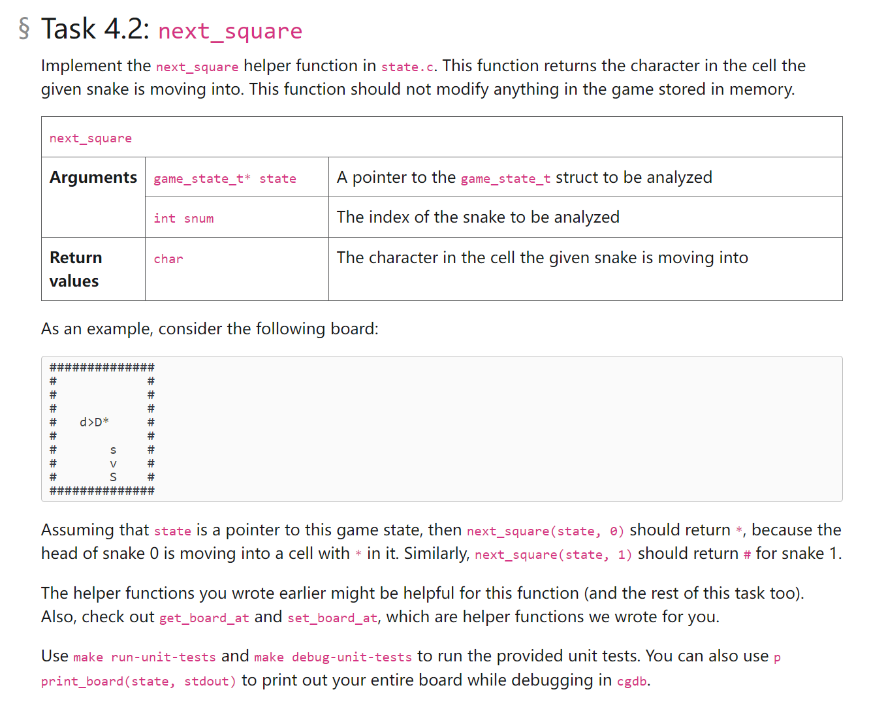

```c
/*
  Task 4.2

  Helper function for update_state. Return the character in the cell the snake is moving into.

  This function should not modify anything.
*/
static char next_square(game_state_t* state, unsigned int snum) {
  // TODO: Implement this function.
  snake_t snake = (state -> snakes)[snum];
  unsigned int snake_head_col = snake.head_col;
  unsigned int snake_head_row = snake.head_row;
  char snake_head = get_board_at(state, snake_head_row, snake_head_col);
  return get_board_at(state, get_next_row(snake_head_row, snake_head), get_next_col(snake_head_col, snake_head));
}
```
> 


## Task 4.3 update_head
> 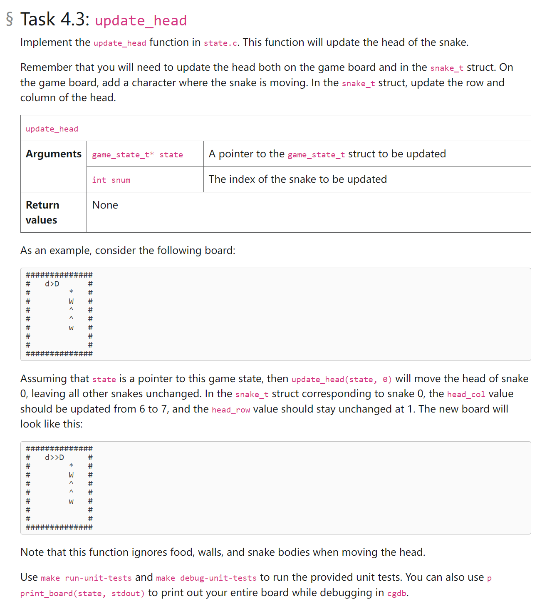
> 逻辑很简单，就是将当前的蛇头向字母代表的方向移动一格，同时将当前的蛇头更新成原来蛇头的方向对应的蛇身。比如`W`更新成`^`, `A`更新成`<`, `S`更新成`v`, `D`更新成`>`。
> 要注意，我们在对蛇这个结构体本身进行修改的时候必须要借由指针实现。
> 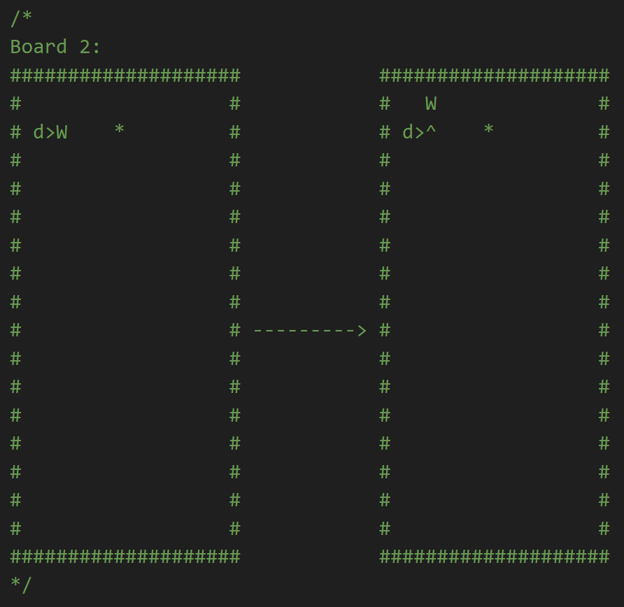

```c
/*
  Task 4.3

  Helper function for update_state. Update the head...

  ...on the board: add a character where the snake is moving

  ...in the snake struct: update the row and col of the head

  Note that this function ignores food, walls, and snake bodies when moving the head.
*/
static void update_head(game_state_t* state, unsigned int snum) {
  // TODO: Implement this function.
  snake_t curr_snake = (state -> snakes)[snum];
  snake_t* next_snake_pointer = state -> snakes + snum;

  unsigned int curr_snake_head_row = curr_snake.head_row;
  unsigned int curr_snake_head_col = curr_snake.head_col;

  char curr_snake_head = get_board_at(state, curr_snake_head_row, curr_snake_head_col);
  
  unsigned int next_snake_head_row = get_next_row(curr_snake_head_row, curr_snake_head);
  unsigned int next_snake_head_col = get_next_col(curr_snake_head_col, curr_snake_head);
  
  next_snake_pointer -> head_row = next_snake_head_row;
  next_snake_pointer -> head_col = next_snake_head_col;

  set_board_at(state, next_snake_head_row, next_snake_head_col, curr_snake_head);
  switch (curr_snake_head) {
    case 'W':
      set_board_at(state, curr_snake_head_row, curr_snake_head_col, '^');
      break;
    case 'A':
      set_board_at(state, curr_snake_head_row, curr_snake_head_col, '<');
      break;
    case 'S':
      set_board_at(state, curr_snake_head_row, curr_snake_head_col, 'v');
      break;
    case 'D':
      set_board_at(state, curr_snake_head_row, curr_snake_head_col, '>');
      break;
  }

  return;
}
```
> 


## Task 4.4 update_tail
> 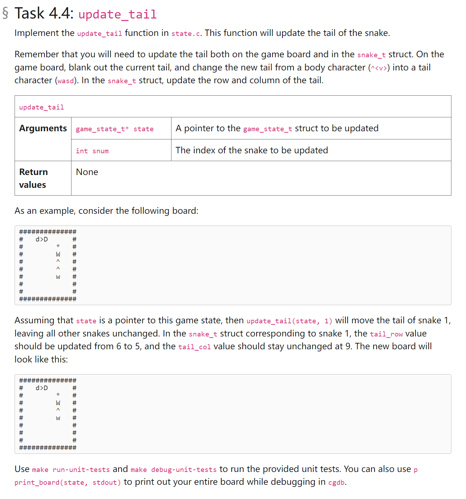
> 实现的时候需要考虑到下列情况:
> 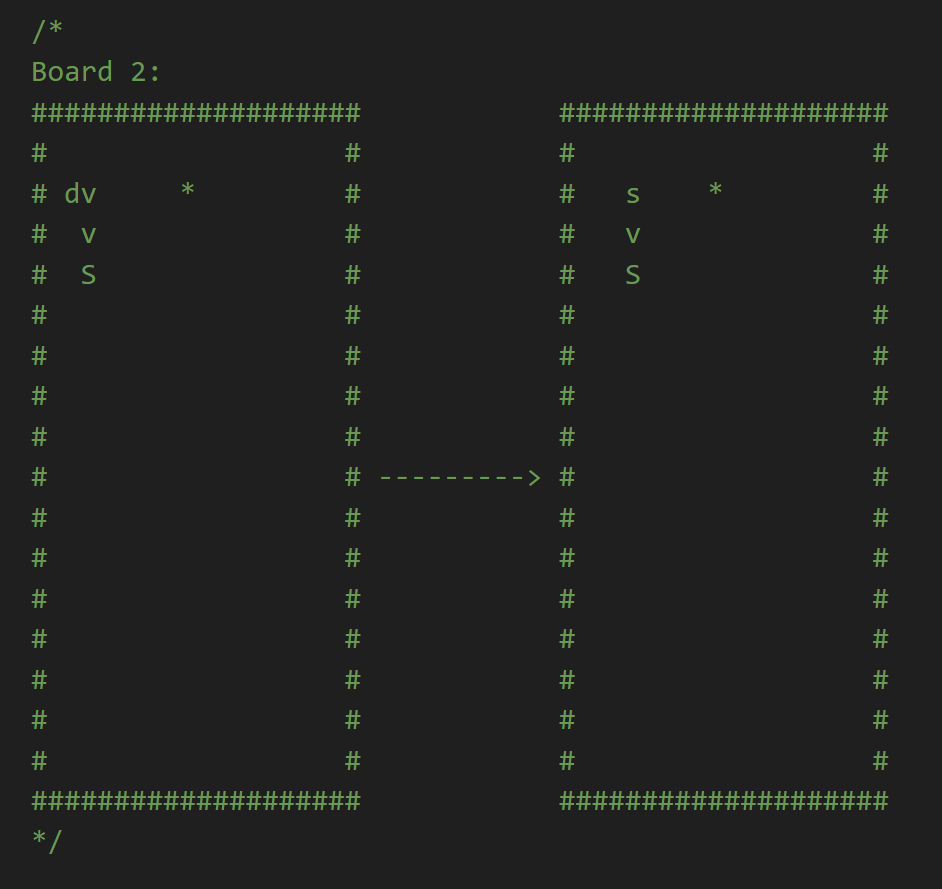

```c
/*
  Task 4.4

  Helper function for update_state. Update the tail...

  ...on the board: blank out the current tail, and change the new
  tail from a body character (^<v>) into a tail character (wasd)

  ...in the snake struct: update the row and col of the tail
*/
static void update_tail(game_state_t* state, unsigned int snum) {
  // TODO: Implement this function.
  snake_t curr_snake = (state -> snakes)[snum];
  snake_t* next_snake_pointer = state -> snakes + snum;

  unsigned int curr_snake_tail_row = curr_snake.tail_row;
  unsigned int curr_snake_tail_col = curr_snake.tail_col;

  char curr_snake_tail = get_board_at(state, curr_snake_tail_row, curr_snake_tail_col);
  
  unsigned int next_snake_tail_row = get_next_row(curr_snake_tail_row, curr_snake_tail);
  unsigned int next_snake_tail_col = get_next_col(curr_snake_tail_col, curr_snake_tail);

  char next_snake_body = get_board_at(state, next_snake_tail_row, next_snake_tail_col);

  switch (next_snake_body) {
    case '^':
      set_board_at(state, next_snake_tail_row, next_snake_tail_col, 'w');
      break;
    case '<':
      set_board_at(state, next_snake_tail_row, next_snake_tail_col, 'a');
      break;
    case 'v':
      set_board_at(state, next_snake_tail_row, next_snake_tail_col, 's');
      break;
    case '>':
      set_board_at(state, next_snake_tail_row, next_snake_tail_col, 'd');
      break;
  }

  next_snake_pointer -> tail_row = next_snake_tail_row;
  next_snake_pointer -> tail_col = next_snake_tail_col;

  set_board_at(state, curr_snake_tail_row, curr_snake_tail_col, ' ');
  return;
}
```
> 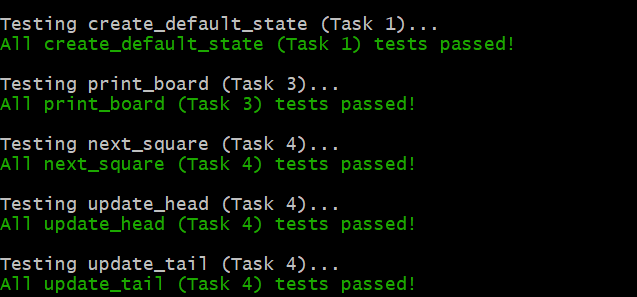


## Task 4.5 update_state
> 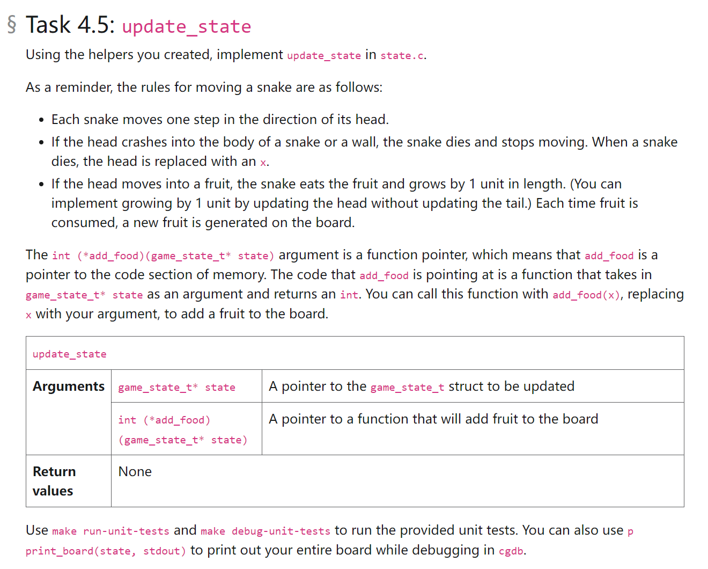

```c
/* Task 4.5 */
void update_state(game_state_t* state, int (*add_food)(game_state_t* state)) {
  // TODO: Implement this function.

  snake_t* all_snakes_arr_pointer = state -> snakes;
  unsigned int snakes_num = state -> num_snakes;

  for (unsigned int i = 0; i < snakes_num; i++) {
    snake_t* curr_snake_pointer = all_snakes_arr_pointer + i; 
    char next_square_value = next_square(state, i);
    if (next_square_value == '*') {
      // If the next square for i-th snake is a fruit, lengthen the snake by 1
      update_head(state, i);
      // Generate a random fruit elsewhere.
      add_food(state);
    } else if (next_square_value == '#' || is_snake(next_square_value)) {
      // If the next square for i-th snake is a wall/snake body, update the head to be 'x' and declare its death
      set_board_at(state, curr_snake_pointer -> head_row, curr_snake_pointer -> head_col, 'x');
      curr_snake_pointer -> live = false;
    } else {
      update_head(state, i);
      update_tail(state, i);
    }
  }
  return;
}
```
> 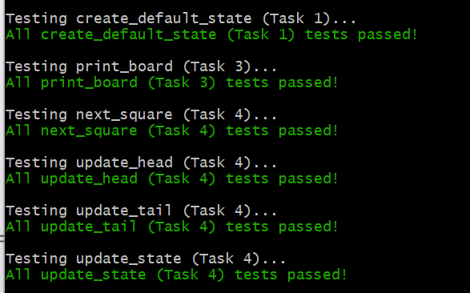


# Task 5 load_board(Hard)
> 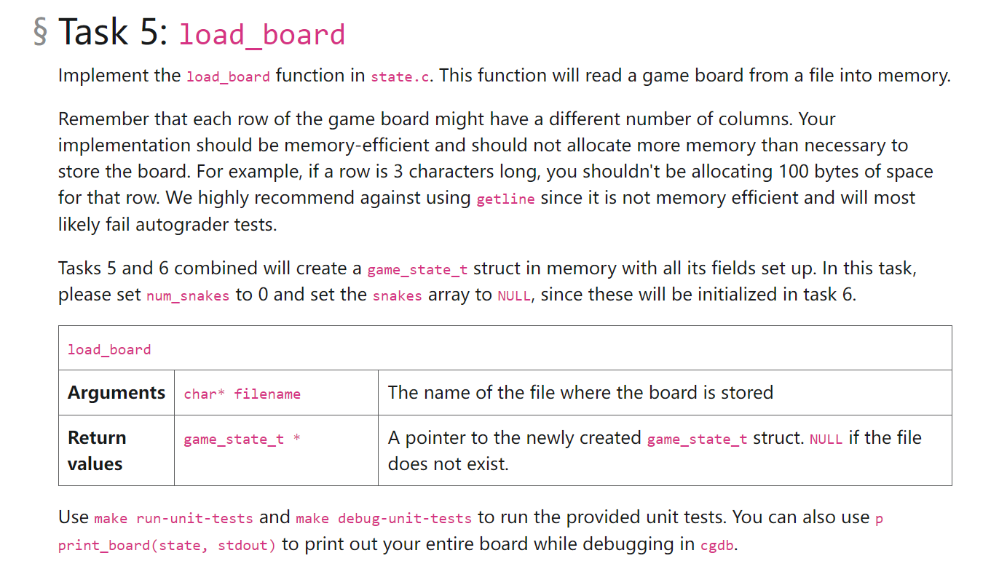
> **本题有几个难点，这里记录一下我的思路:**
> 1. 本题要求我们读取文件时要`Memory Efficient`, 于是我们可以考虑使用`malloc/realloc`的组合。
> 2. 如何一行一行读取地图内容，在`\n`及时终止并开始下一行读取。读取文件有很多方法，`fgets()/getline()`，但是`fgets()`需要我们事先知道每一行有多长，这对于非组织化的数据来说是不现实的。`getline()`题目中说了会导致一些奇怪的问题。所以我们可以采用最传统也最方便后续优化的方法`fgetc()`一个字符一个字符的读取。
> 3. 不要忘记`fclose()`! 这也会导致`Memory Leak`的发生。
> 
**下面是算法流程:**
> 1. 首先实例化一个`game_state_t*`结构体指针用于返回，因为是函数内返回的地址，为了保证函数调用结束后这个地址仍然有效，需要将结构体指针指向堆内存的空间，于是我们使用`malloc`分配内存。
> 2. 填充一些`game_state_t`结构体内部的字段，其中最重要的是分配`board`的内存空间。由于`board`是一个`char**`, 可以看成是`char*`组成的数组。因为我们提前并不知道`board`会有几行，所以我们需要动态分配`board`的内存，再次使用`malloc/realloc`组合。
> 3. 打开文件
> 4. 开始读取步骤。对于每一行我们使用一个`buf`来存放`fgetc()`读取到的内容。由于我们不知道每一行有几列，我们的`buf`仍然需要动态增长。当`ch=='\n'`时表示我们已经读取到了地图某一行的末尾，此时需要将`buf`的内容全部转移到`game_state -> board`中完成保存。然后我们需要为新一行的数据再初始化一个`buf`。
> 
**总的来说，我们需要为每一行的内容进行动态内存分配，以及**`**board**`**内部有多少行进行动态内存分配。难度不小。**

```c
/* Task 5 */
game_state_t* load_board(char* filename) {
  // TODO: Implement this function.
  // 1. Initialize the game_struct_t
  game_state_t* game_state = (game_state_t*) malloc(sizeof(game_state_t));

  int board_capacity = 1;
  game_state -> board = (char**) malloc(sizeof(char*) * board_capacity);
  game_state -> num_snakes = 0;
  game_state -> snakes = NULL;

  // 2. Load the board from file
  FILE* fp = fopen(filename, "r");
  int ch;
  if (fp == NULL) {
    perror("Error opening file.");
    return NULL;
  }

  // 3. Get the board dpointer
  // 3.1 Allocate memory for borad_pointer
  char** board_pointer = game_state -> board;

  unsigned int row_index = 0;

  size_t len = 0;
  
  size_t capacity = 16; // Initial buffer size, can be extended or shrinked.
  char* buf = (char*) malloc(capacity + 1); // Initial buffer, allowing for null terminator
  
  // 4. Start injecting into the game_state_object
  while ((ch = fgetc(fp)) != EOF) {
    if (ch == '\n') {
      char* row_string = (char*) malloc(len + 1); // Allow for the null terminator.
      strncpy(row_string, buf, len);
      row_string[len] = '\0';
      board_pointer[row_index] = row_string;
      free(buf);
      len = 0;  // Reset the length accumulator for the current row
      row_index++;
      // Allocate new memory for new buffer
      buf = (char*) malloc(capacity + 1);
      // Allocate new memory for new row
      board_capacity++;
      board_pointer = (char**) realloc(board_pointer, sizeof(char*) * board_capacity);
      game_state -> board = board_pointer; // Be really careful, we have to update the memory pointer.
    } else {
      buf[len] = (char) ch;
      len++;
      if (len >= capacity) {
        // Expand the buffer
        size_t new_capacity = capacity * 2;
        buf = (char*) realloc(buf, new_capacity);
        capacity = new_capacity;
      }
    }
  }

  // Initialize the height
  game_state -> num_rows = row_index;

  free(buf);

  fclose(fp); // Don't forget to do it!

  return game_state;
}

```
> 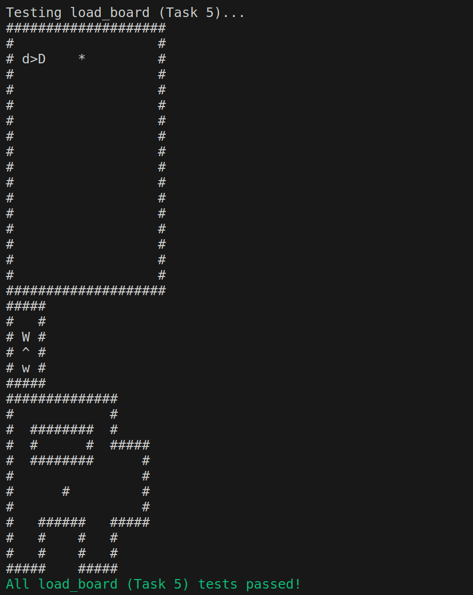


# Task 6 initialize_snake(Medium)
## Task 6.1 find_head
> 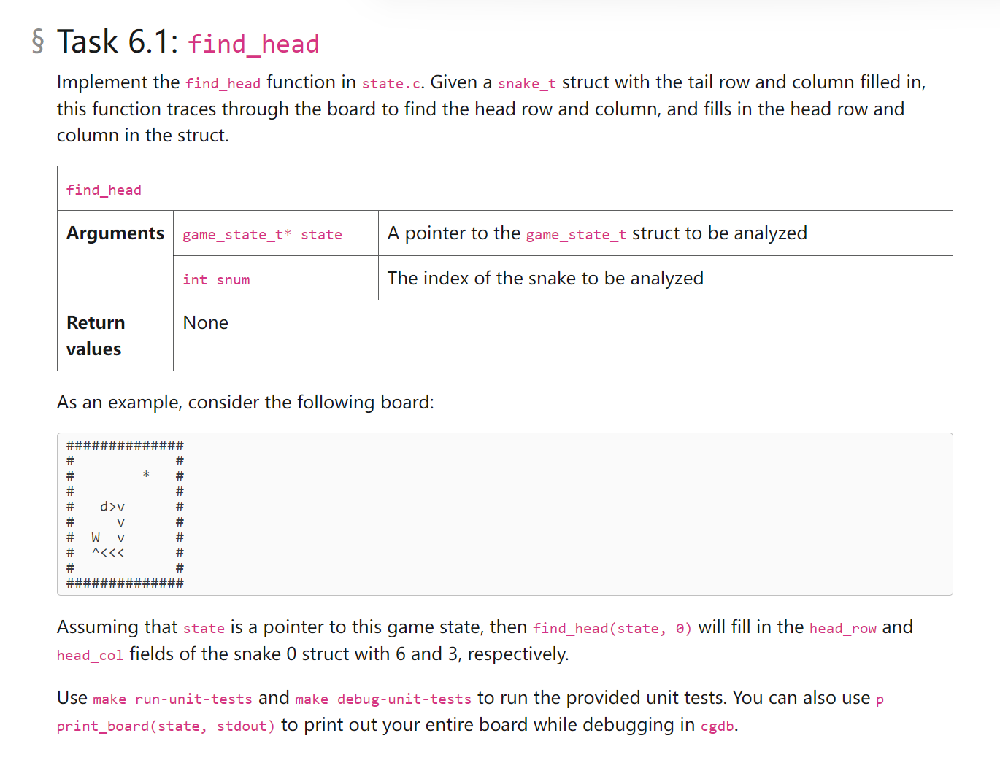
> 本题只要从一个蛇的尾部(给定)开始，沿着蛇的行进方向找到蛇头的位置即可。

```c
/*
  Task 6.1

  Helper function for initialize_snakes.
  Given a snake struct with the tail row and col filled in,
  trace through the board to find the head row and col, and
  fill in the head row and col in the struct.
*/
static void find_head(game_state_t* state, unsigned int snum) {
  // TODO: Implement this function.
  snake_t* snake_pointer = state -> snakes + snum;
  char** board = state -> board;

  unsigned int start_row = snake_pointer -> tail_row; 
  unsigned int start_col = snake_pointer -> tail_col;

  char curr_char = get_board_at(state, start_row, start_col);

  while (curr_char != 'W' && curr_char != 'A'
  && curr_char != 'S' && curr_char != 'D') {
      start_row = get_next_row(start_row, curr_char);
      start_col = get_next_col(start_col, curr_char);
      curr_char = get_board_at(state, start_row, start_col);
  }

  snake_pointer -> head_row = start_row;
  snake_pointer -> head_col = start_col;

  return;
}
```
> 


## Task 6.2 initialize_snake
> 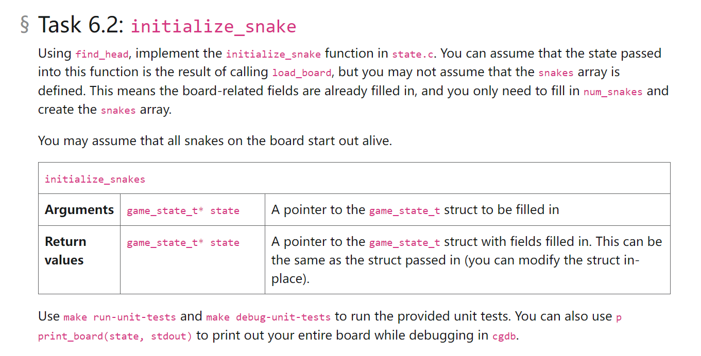

```c
/* Task 6.2 */
game_state_t* initialize_snakes(game_state_t* state) {
  // TODO: Implement this function.
  char** board = state -> board;

  int snake_capacity = 1;
  int snake_num = 0;
  state -> snakes = (snake_t*) malloc(sizeof(snake_t) * snake_capacity);

  int board_row_length = state -> num_rows;

  for (unsigned int i = 0 ; i < board_row_length; i++) {
    char* row_pointer = board[i];
    for (unsigned int j = 0; j < strlen(row_pointer); j++) {
      if (row_pointer[j] == 'w' || row_pointer[j] == 'a' 
      || row_pointer[j] == 's' || row_pointer[j] == 'd') {
        if (snake_num > snake_capacity) {
          state -> snakes = (snake_t*) realloc(state -> snakes, sizeof(snake_t) * snake_capacity * 2);
        }
        // Find tails
        (state -> snakes + snake_num)->tail_row = i;
        (state -> snakes + snake_num)->tail_col = j;
        // FInd heads
        find_head(state, snake_num);
        snake_num++;
        }
      }
    }

    state -> num_snakes = snake_num;
  
  return state;
}
```
> 


# Task 7: main(Easy)
> 
> 判断一个文件是否存在的方法就是看其能否正常打开，即`fopen(filename, "r")!=NULL`

```c
#include <stdio.h>
#include <string.h>

#include "snake_utils.h"
#include "state.h"

int main(int argc, char* argv[]) {
  char* in_filename = NULL;
  char* out_filename = NULL;
  game_state_t* state = NULL;

  // Parse arguments
  for (int i = 1; i < argc; i++) {
    if (strcmp(argv[i], "-i") == 0 && i < argc - 1) {
      in_filename = argv[i + 1];
      i++;
      continue;
    }
    if (strcmp(argv[i], "-o") == 0 && i < argc - 1) {
      out_filename = argv[i + 1];
      i++;
      continue;
    }
    fprintf(stderr, "Usage: %s [-i filename] [-o filename]\n", argv[0]);
    return 1;
  }

  // Do not modify anything above this line.

  /* Task 7 */

  // Read board from file, or create default board
  if (in_filename != NULL) {
    // TODO: Load the board from in_filename
    FILE* fp = fopen(in_filename, "r");
    if (fp != NULL) {
      state = load_board(in_filename);
      fclose(fp);
    } else {
      // TODO: If the file doesn't exist, return -1
      return -1;
    }
    // TODO: Then call initialize_snakes on the state you made
    initialize_snakes(state);
  } else {
    // TODO: Create default state
    state = create_default_state();
  }

  // TODO: Update state. Use the deterministic_food function
  // (already implemented in snake_utils.h) to add food.
  update_state(state, deterministic_food);


  // Write updated board to file or stdout
  if (out_filename != NULL) {
    // TODO: Save the board to out_filename
    save_board(state, out_filename);
  } else {
    // TODO: Print the board to stdout
    print_board(state, stdout);
  }

  // TODO: Free the state
  free_state(state);
  return 0;
}
```
> **Output Test:**
> 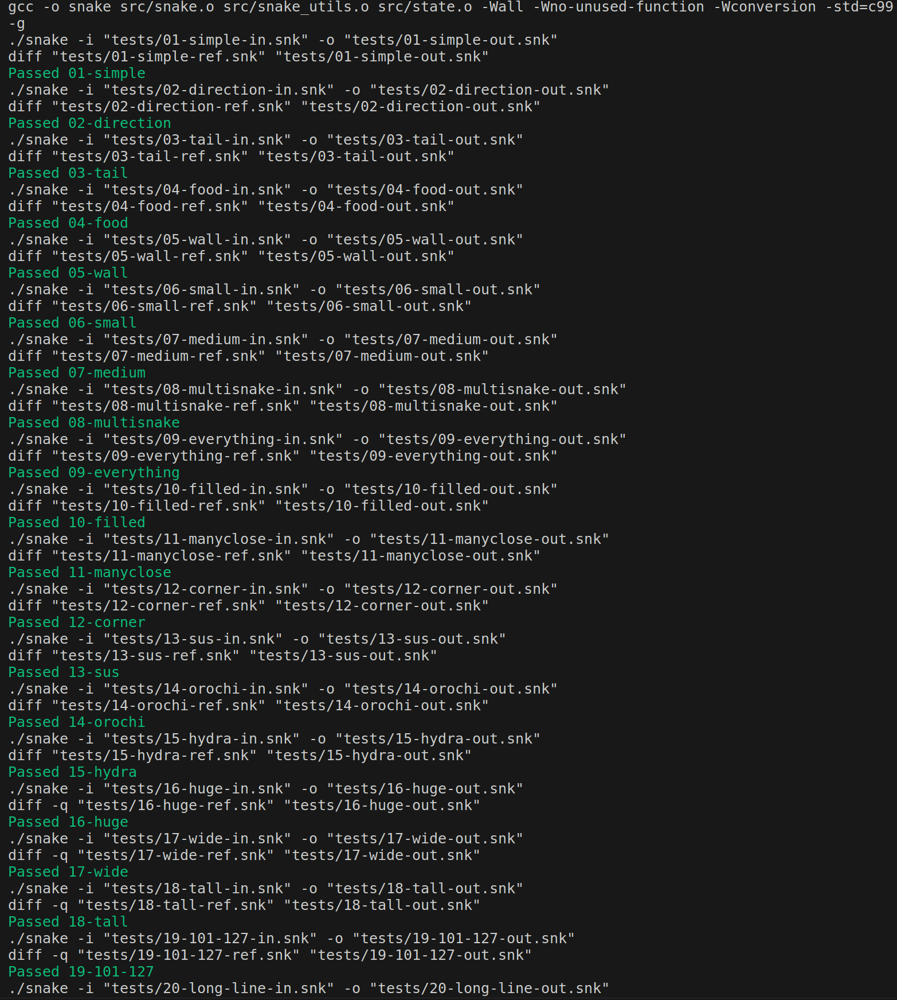
> **Memory Test:**
> 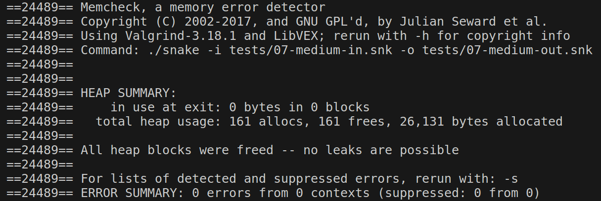


# Play the Game
> 

