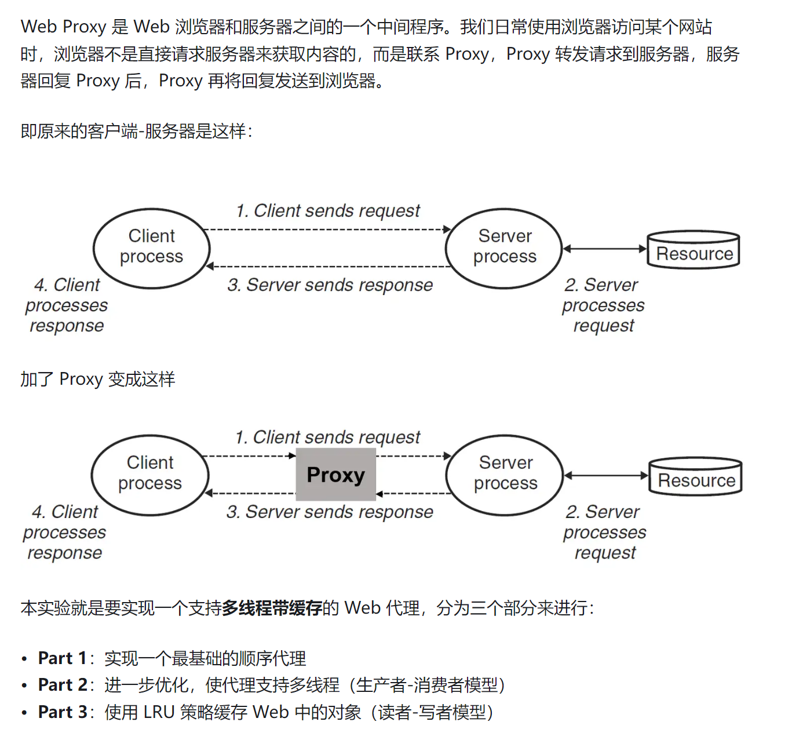
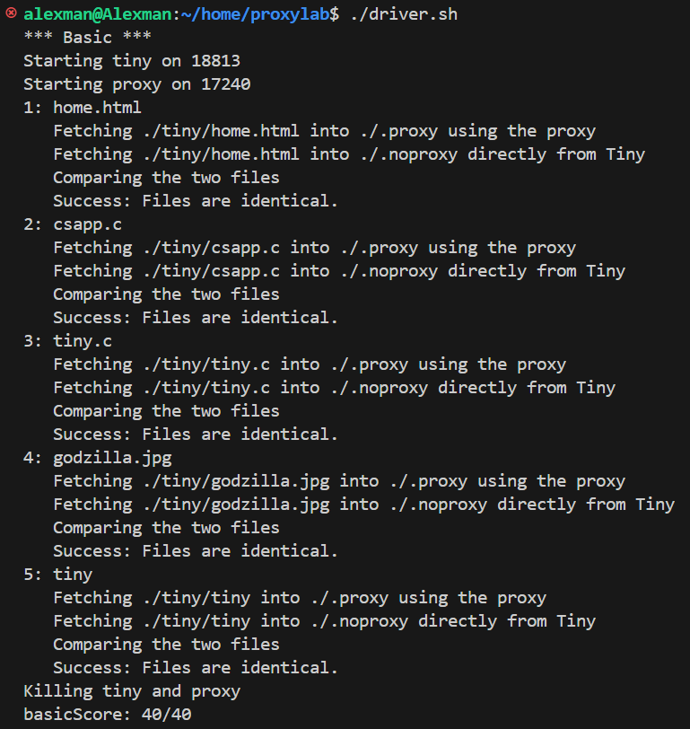
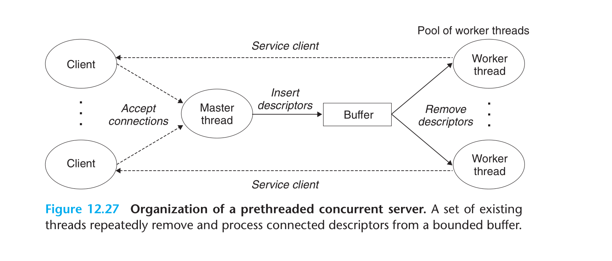
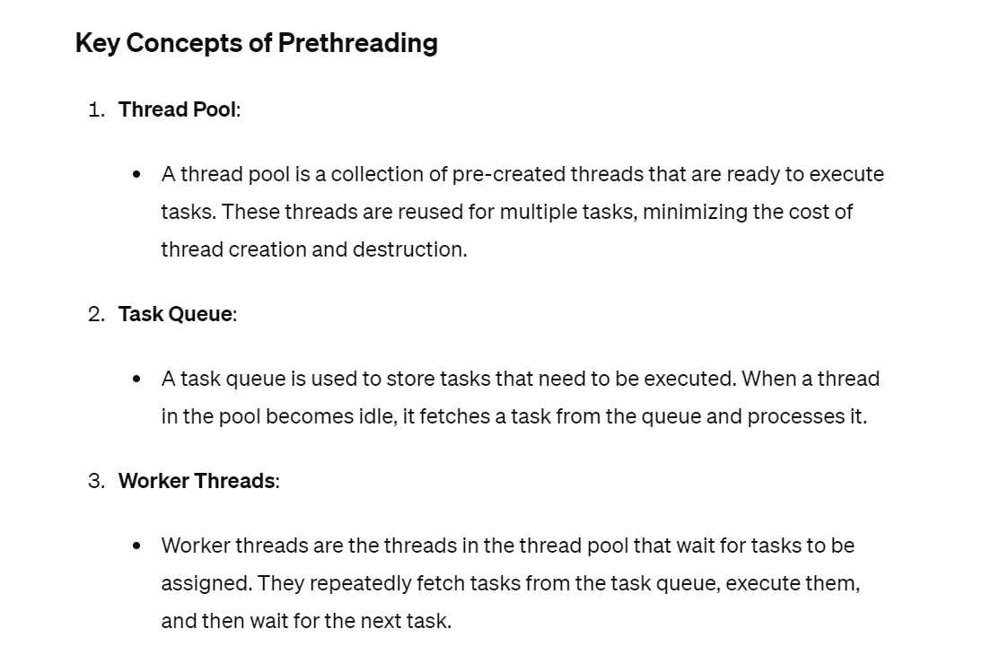
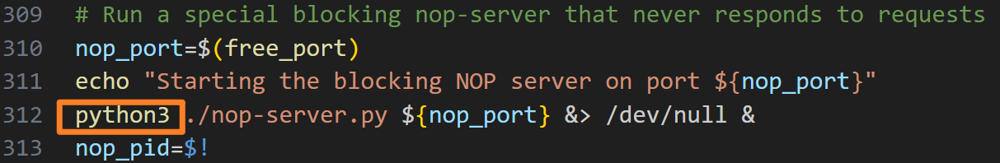
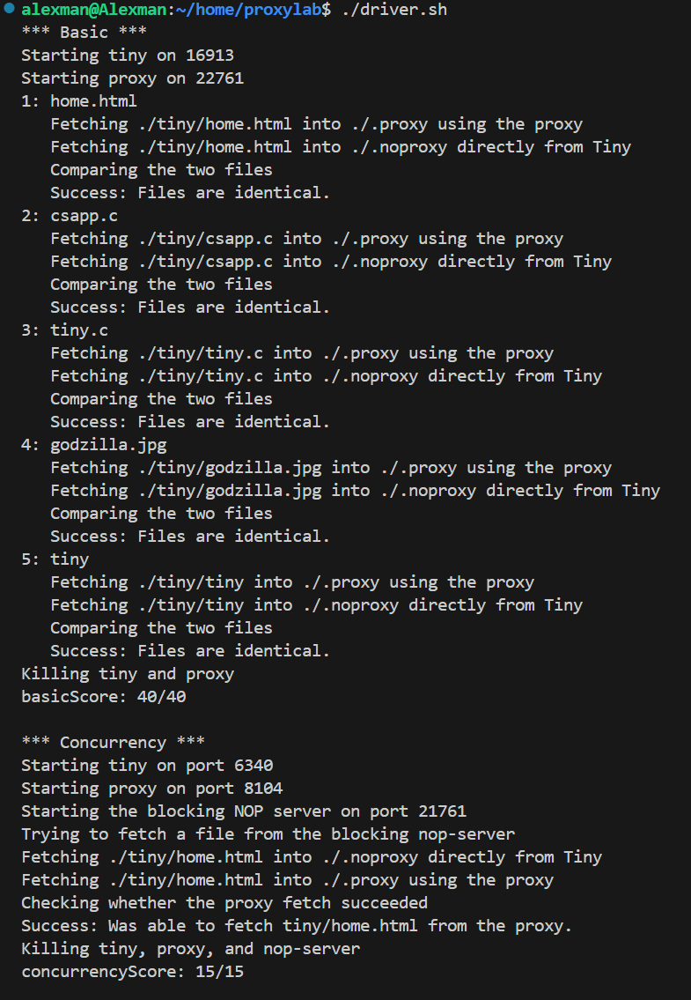
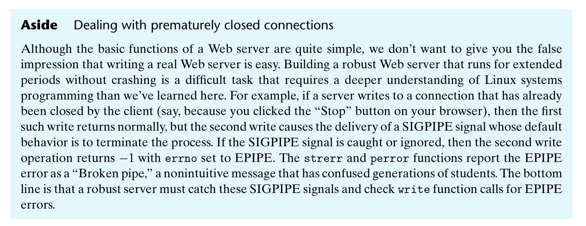
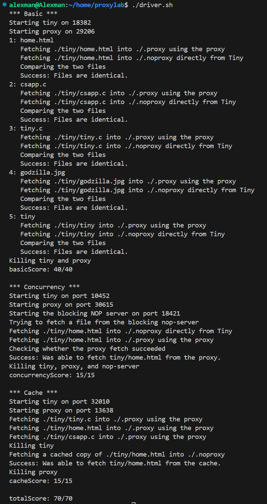

# Preliminaries
> [!important]
> References: https://zhuanlan.zhihu.com/p/497982541
> [Sockets](../../../../Machine_Structures/11_Network_Programming/Sockets.md)

## What is Proxy
> [!def]
> 


## Serving Static Content


## Serving Dynamic Content
> [!important]


## Test and Debugging
> [!important]
> 1. `./proxy portnum` to start the server at localhost:portnum
> 2. `telnet localhost 61230` to connect to the server and send HTTP requests
> 3. `./driver.sh` to test the basic functionality of the program.(Remember to save all the files related to testing as `LF` instead of `CRLF`). Including `driver.sh, free-port.sh, port-for-user.pl`
> 4. If there is `netstat: command not found`, then execute `sudo apt install netstat`.


# Part I: Sequential Proxy Server
## Design Idea
> [!algo]
> 本质上就是在`Client Side`和`Server Side`中加入了一个中转站，做一个请求转发。


## Code Implementation
> [!code]
```c
#include <stdio.h>
#include "csapp.h"

/* Recommended max cache and object sizes */
#define MAX_CACHE_SIZE 1049000
#define MAX_OBJECT_SIZE 102400

/* You won't lose style points for including this long line in your code */
static const char *user_agent_hdr = "User-Agent: Mozilla/5.0 (X11; Linux x86_64; rv:10.0.3) Gecko/20120305 Firefox/10.0.3\r\n";


/* 
   Proxy Server Helper Functions
*/
void doit(int fd);
void read_requesthdrs(rio_t *rp);
int parse_line(char* lineBuf, char* key, char* value);
int parse_uri(char *uri, char *hostname, char *filepath, char* port);
void get_filetype(char *filename, char *filetype);
void clienterror(int fd, char *cause, char *errnum, char *shortmsg, char *longmsg);


/*
  Newly Added: Proxy
*/

/**
   Forward the message from client to the server
   - client_rfd: Reliable communication channel between proxy and client
   - client_fd: Socket channel between proxy and client
   - conn_fd: 
*/
void forwardRequestHeaders(rio_t* client_rio, int server_fd, char* hostname);
void forwardResponse(rio_t* server_rio, int client_fd);


int main(int argc, char **argv)
{
    int listenfd, connfd;
    char hostname[MAXLINE], port[MAXLINE];
    socklen_t clientlen;
    struct sockaddr_storage clientaddr;

    /* Check command line args */
    if (argc != 2) {
	fprintf(stderr, "usage: %s <port>\n", argv[0]);
	exit(1);
    }

    listenfd = Open_listenfd(argv[1]);
    while (1) {
        clientlen = sizeof(clientaddr);
        connfd = Accept(listenfd, (SA *)&clientaddr, &clientlen); //line:netp:tiny:accept
        Getnameinfo((SA *) &clientaddr, clientlen, hostname, MAXLINE, 
                    port, MAXLINE, 0);
        printf("Accepted connection from (%s, %s)\n", hostname, port);
        doit(connfd);                                             //line:netp:tiny:doit
        Close(connfd);                                            //line:netp:tiny:close
    }
}
/* $end tinymain */

/*
 * doit - handle one HTTP request/response transaction
 */
/* $begin doit */
void doit(int client_fd) 
{
    // int is_static;
    // struct stat sbuf;
    char buf[MAXLINE], method[MAXLINE], uri[MAXLINE], version[MAXLINE];
    char hostname[MAXLINE], port[MAXLINE], filepath[MAXLINE];
    rio_t rio_client;  // Reliable channel between proxy and client
    rio_t rio_server;  // Reliable channel between proxy and tiny server

    /* 1. Read request line */
    Rio_readinitb(&rio_client, client_fd);
    if (!Rio_readlineb(&rio_client, buf, MAXLINE))  //line:netp:doit:readrequest
        return;
    // printf("%s", buf);

    // e.g. GET https://www.cmu.edu/hub/index.html HTTP/1.1
    sscanf(buf, "%s %s %s", method, uri, version);       //line:netp:doit:parserequest
    
    // Add support for GET and POST requests
    if (strcasecmp(method, "GET") && strcasecmp(method, "POST")) {                     //line:netp:doit:beginrequesterr
        clienterror(client_fd, method, "501", "Not Implemented",
                    "Tiny does not implement this method");
        return;
    }

    // Parse URI
    // printf("Parsing URI");
    memset(port, 0, strlen(port));
    if (parse_uri(uri, hostname, filepath, port)) {
        // error handling
    }

    /* 2. Read/Forward Requests Line and open connection  */ 
    // printf("Reading Request Line...");
    // Request Line:  GET /hub/index/html HTTP/1.0
    char requestLine[MAXLINE];
    strcat(requestLine, method);
    strcat(requestLine, " ");
    strcat(requestLine, filepath);
    strcat(requestLine, " ");
    strcat(requestLine, "HTTP/1.0\r\n");

    // Open connection to the server
    // printf("Open connection to tiny server at %s:%s", hostname, port);
    int server_fd = Open_clientfd(hostname, port);
    // printf("Success openning");

    // Forward Requestline to the tiny server
    // printf("\n Now forwarding the requests\n");
    Rio_writen(server_fd, requestLine, strlen(requestLine));
    memset(requestLine, 0, strlen(requestLine));

    /* 3. Forward the request headers to the server */
    // Forward the request headers to Tiny Server
    forwardRequestHeaders(&rio_client, server_fd, hostname);

    /* 4. Receive the response from the tiny server */
    // printf("Receiving and forwarding Responses\n");
    // Initialize buffered channel
    Rio_readinitb(&rio_server, server_fd);

    // Forward response header and body
    forwardResponse(&rio_server, client_fd);
}
/* $end doit */


/*
  forwardRequestHeaders -  Forwarding Request to the Target Server from Client
  client_rio: Buffered input from client(Rio_readlineb)
  server_fd: Socket descriptor to tiny server(Rio_writen)
*/
void forwardRequestHeaders(rio_t* client_rio, int server_fd, char* hostname) {

    char buf[MAXLINE], lineKey[MAXLINE], lineValue[MAXLINE];

    int isHost = 0;
    int isUserAgent = 0;
    int isConnection = 0;
    int isProxyConnection = 0;
    

    // Parse Request Headers and send to the tiny server
    while(1) {       
        Rio_readlineb(client_rio, buf, MAXLINE);

        // Request header end
        if (!strcmp(buf, "\r\n")) {
            break;
        }

        printf("%s", buf);
        parse_line(buf, lineKey, lineValue);

         if (strcmp(lineKey, "Host") == 0) {
            isHost = 1;
        } else if (strcmp(lineKey, "User-Agent") == 0) {
            isUserAgent = 1;
        } else if (strcmp(lineKey, "Connection") == 0) {
            isConnection = 1;
        } else if (strcmp(lineKey, "Proxy-Connection") == 0) {
            isProxyConnection = 1;
        }

        Rio_writen(server_fd, buf, strlen(buf));
    }

    // If user doesn't provide any of Host/User-Agent/Connection/Proxy-Connection
    if (!isHost) {
        strcpy(buf, "Host: ");
        strcat(buf, hostname);
        Rio_writen(server_fd, buf, strlen(buf));
    }

    if (!isUserAgent) {
        strcpy(buf, "User-Agent: ");
        strcat(buf, user_agent_hdr);
        Rio_writen(server_fd, buf, strlen(buf));
    }

    if (!isConnection) {
        strcpy(buf, "Connection: close\r\n");
        Rio_writen(server_fd, buf, strlen(buf));
    }

    if (!isProxyConnection) {
        strcpy(buf, "Proxy-Connection\r\n");
        Rio_writen(server_fd, buf, strlen(buf));
    }

    // Terminate the request header
    strcpy(buf, "\r\n");
    Rio_writen(server_fd, buf, strlen(buf));

    return;
}


/*
  forwardResponse - Parsing the response from the target server and send it to client
  server_rio: Buffered Input from the server(Rio_readlineb/Rio_readnb)
  client_fd: Socket descriptor of client connection(Rio_writen)
*/
void forwardResponse(rio_t* server_rio, int client_fd) {

    char line[MAXLINE], buf[MAXBUF];

    // Forward response line
    if (!Rio_readlineb(server_rio, line, MAXLINE))  //line:netp:doit:readrequest
        return;
    printf("%s", line);
    Rio_writen(client_fd, line, strlen(line));

    // Forward response header
    while (1) {
        Rio_readlineb(server_rio, line, MAXLINE);
        // Response header end
        if (!strcmp(line, "\r\n")) {
            break;
        }
        Rio_writen(client_fd, line, strlen(line));
    }

    // Separate the response header with response body
    strcpy(line, "\r\n");
    Rio_writen(client_fd, line, strlen(line));


    int nread;
    // Forward Response body, using Rio_readnb since the file is binary
    while((nread = Rio_readnb(server_rio, buf, MAXBUF)) > 0) {
        Rio_writen(client_fd, buf, nread);
    }

    // Rio_readnb returns 0 only on EOF
    return;
}


/*
  Parse one line of request header, extracting its key and value
*/
int parse_line(char* lineBuf, char* key, char* value) 
{
    char buf[MAXBUF];
    memcpy(buf, lineBuf, strlen(lineBuf) + 1); // +1 to include null terminator
    char* delimit = strchr(buf, ':');
    *delimit = 0;
    strcpy(key, buf);
    strcpy(value, delimit + 2);

    return 0;
}


/*
 * parse_uri - parse URI into 
    Host: www.cmu.edu
    pathname: /hub/index.html
 */
/* $begin parse_uri */
int parse_uri(char *uri, char *hostname, char *filepath, char* port) 
{
    // uri : http://www.cmu.edu/hub/index.html
    char* loc = strchr(uri, '/');
    char* start = loc + 2;

    char* end = strchr(start, '/');
    strcpy(filepath, end);
    *end = '\0';

    // See if there is a specified port in the URL
    char* p = strchr(start, ':');
    if (p) {
        strcpy(port, p + 1);
        *p = 0;
    }

    strcpy(hostname, start);

    return 0;
}
/* $end parse_uri */


/*
 * clienterror - returns an error message to the client
 */
/* $begin clienterror */
void clienterror(int fd, char *cause, char *errnum, 
		 char *shortmsg, char *longmsg) 
{
    char buf[MAXLINE];

    /* Print the HTTP response headers */
    sprintf(buf, "HTTP/1.0 %s %s\r\n", errnum, shortmsg);
    Rio_writen(fd, buf, strlen(buf));
    sprintf(buf, "Content-type: text/html\r\n\r\n");
    Rio_writen(fd, buf, strlen(buf));

    /* Print the HTTP response body */
    sprintf(buf, "<html><title>Tiny Error</title>");
    Rio_writen(fd, buf, strlen(buf));
    sprintf(buf, "<body bgcolor=""ffffff"">\r\n");
    Rio_writen(fd, buf, strlen(buf));
    sprintf(buf, "%s: %s\r\n", errnum, shortmsg);
    Rio_writen(fd, buf, strlen(buf));
    sprintf(buf, "<p>%s: %s\r\n", longmsg, cause);
    Rio_writen(fd, buf, strlen(buf));
    sprintf(buf, "<hr><em>The Tiny Web server</em>\r\n");
    Rio_writen(fd, buf, strlen(buf));
}
/* $end clienterror */
```


## Testing Results
> [!test]
> 


# Part II: Concurrent Proxy Server
## Design Idea I: Prethreading
> [!important]
> 
> **Prethreading**, also known as **thread pooling**, is a technique used in concurrent programming where a fixed number of threads are created and maintained in a pool to handle tasks or requests. Instead of creating a new thread for each task, tasks are assigned to existing threads from the pool.
> 
> This approach **improves performance by reducing the overhead associated with creating and destroying threads.**
> 


## Design Idea II: Producer&Consumer
> [!important]
> See [Semaphores in Producer and Consumer Problem](../../../3_Synchronizations/Synchronization_Problems.md#Solution%202%20-%20Semaphores)
> The functionalities of semaphore is integrated into a `sbuf` package, which uses the idea of circular buffer.
> https://csapp.cs.cmu.edu/3e/code.html

> [!algo]
> 本质上我们只需要使用把`doit()`函数作为线程的任务，然后使用`sbuf`管理任务的执行即可。
> - 原来的`doit(int connfd)`有一个参数，表示`Client`连接，但是现在这个参数会被存放在一个多线程共享的`Circular Buffer`中，每个线程从这个数据结构中取`clientfd`(如果有的话)即可，所以我们可以将这个参数去掉。
> - 定义线程的时候只需要`Pthread_create(&tid[i], NULL, doit, NULL)`即可。


## Code Implementation
### proxy.c
> [!code]
```c
#include <stdio.h>
#include "csapp.h"
#include "sbuf.h"

/* Recommended max cache and object sizes */
#define MAX_CACHE_SIZE 1049000
#define MAX_OBJECT_SIZE 102400
#define NTHREADS 8
#define SBUFSIZE 32

/* You won't lose style points for including this long line in your code */
static const char *user_agent_hdr = "User-Agent: Mozilla/5.0 (X11; Linux x86_64; rv:10.0.3) Gecko/20120305 Firefox/10.0.3\r\n";
sbuf_t sbuf; /* Circular Buffer used for Thread Pooling */

/* 
   Proxy Server Helper Functions
*/
void* thread_func(void* args);
void doit(int fd);
void read_requesthdrs(rio_t *rp);
int parse_line(char* lineBuf, char* key, char* value);
int parse_uri(char *uri, char *hostname, char *filepath, char* port);
void get_filetype(char *filename, char *filetype);
void clienterror(int fd, char *cause, char *errnum, char *shortmsg, char *longmsg);


/*
  Newly Added: Proxy
*/

/**
   Forward the message from client to the server
   - client_rfd: Reliable communication channel between proxy and client
   - client_fd: Socket channel between proxy and client
   - conn_fd: 
*/
void forwardRequestHeaders(rio_t* client_rio, int server_fd, char* hostname);
void forwardResponse(rio_t* server_rio, int client_fd);


int main(int argc, char **argv)
{
    int listenfd, connfd;
    char hostname[MAXLINE], port[MAXLINE];
    socklen_t clientlen;
    struct sockaddr_storage clientaddr;
    pthread_t threads[NTHREADS];


    /* Check command line args */
    if (argc != 2) {
        fprintf(stderr, "usage: %s <port>\n", argv[0]);
        exit(1);
    }


    /* Don't forget to initialize the sbuf */
    sbuf_init(&sbuf, SBUFSIZE);


    // Create a thread pool with NTHREADS in it.
    for (int i = 0; i < NTHREADS; i++) {
        Pthread_create(&threads[i], NULL, thread_func, NULL);
    }

    listenfd = Open_listenfd(argv[1]);
    while (1) {
        clientlen = sizeof(clientaddr);
        connfd = Accept(listenfd, (SA *)&clientaddr, &clientlen); //line:netp:tiny:accept
        sbuf_insert(&sbuf, connfd);      
        Getnameinfo((SA *) &clientaddr, clientlen, hostname, MAXLINE, 
                    port, MAXLINE, 0);
        printf("Accepted connection from (%s, %s)\n", hostname, port);
        // Insert the task(connfd) into the circular buffer                                                          
    }
}
/* $end tinymain */


/*
 * thread_func
*/
void* thread_func(void* args) {
    // Detach the thread, so that it will free up all the resources
    // (like those allocated on the stack above) immediately after it
    // terminates.
    Pthread_detach(Pthread_self());
    // Constantly fetching connection descriptor from the circular buffer to do the work
    while(1) {
        /* Get the connfd */
        int client_fd = sbuf_remove(&sbuf);
        doit(client_fd);
            
        // Don't forget the close the connection 
        Close(client_fd);   
    }
}


// ... 下面的都一样
/*
 * doit - handle one HTTP request/response transaction
 */
/* $begin doit */
//void doit(int client_fd)
```


### sbuf.h
> [!code]
```c
#ifndef __SBUF_H__
#define __SBUF_H__

#include "csapp.h"

/* $begin sbuft */
typedef struct {
    int *buf;          /* Buffer array */         
    int n;             /* Maximum number of slots */
    int front;         /* buf[(front+1)%n] is first item */
    int rear;          /* buf[rear%n] is last item */
    sem_t mutex;       /* Protects accesses to buf */
    sem_t slots;       /* Counts available slots */
    sem_t items;       /* Counts available items */
} sbuf_t;
/* $end sbuft */

void sbuf_init(sbuf_t *sp, int n);
void sbuf_deinit(sbuf_t *sp);
void sbuf_insert(sbuf_t *sp, int item);
int sbuf_remove(sbuf_t *sp);

#endif /* __SBUF_H__ */

```


### sbuf.c
> [!code]
```c
/* $begin sbufc */
#include "csapp.h"
#include "sbuf.h"

/* Create an empty, bounded, shared FIFO buffer with n slots */
/* $begin sbuf_init */
void sbuf_init(sbuf_t *sp, int n)
{
    sp->buf = Calloc(n, sizeof(int)); 
    sp->n = n;                       /* Buffer holds max of n items */
    sp->front = sp->rear = 0;        /* Empty buffer iff front == rear */
    Sem_init(&sp->mutex, 0, 1);      /* Binary semaphore for locking */
    Sem_init(&sp->slots, 0, n);      /* Initially, buf has n empty slots */
    Sem_init(&sp->items, 0, 0);      /* Initially, buf has zero data items */
}
/* $end sbuf_init */

/* Clean up buffer sp */
/* $begin sbuf_deinit */
void sbuf_deinit(sbuf_t *sp)
{
    Free(sp->buf);
}
/* $end sbuf_deinit */

/* Insert item onto the rear of shared buffer sp */
/* $begin sbuf_insert */
void sbuf_insert(sbuf_t *sp, int item)
{
    P(&sp->slots);                          /* Wait for available slot */
    P(&sp->mutex);                          /* Lock the buffer */
    sp->buf[(++sp->rear)%(sp->n)] = item;   /* Insert the item */
    V(&sp->mutex);                          /* Unlock the buffer */
    V(&sp->items);                          /* Announce available item */
}
/* $end sbuf_insert */

/* Remove and return the first item from buffer sp */
/* $begin sbuf_remove */
int sbuf_remove(sbuf_t *sp)
{
    int item;
    P(&sp->items);                          /* Wait for available item */
    P(&sp->mutex);                          /* Lock the buffer */
    item = sp->buf[(++sp->front)%(sp->n)];  /* Remove the item */
    V(&sp->mutex);                          /* Unlock the buffer */
    V(&sp->slots);                          /* Announce available slot */
    return item;
}
/* $end sbuf_remove */
/* $end sbufc */
```


## Testing Results
> [!test]
> Remember to add a `python3` at the front to perform the testing as expected.
> 
> Testing Result:
> 
> 


## Caveats I: Prematurely Closed Connections
> [!important]
> 
> **CSAPP pp1000**
> 
> So even if we pass the test above, we still need to handle this scenario in order to be a robust server.
> 
```c
/*
    sigpipe_handler: Handle the prematurely closed connection
    instead of ignoring it(otherwise it will terminate the main process)
    and all the threads(casuse the server to shut down)

    So we need to at least capture it instead of the default behavior of the
    SIGPIPE(terminate the process).
*/
void sigpipe_handler(int signum) {
    printf("Caught SIGPIPE signal %d\n", signum);
}


/* Main function begins */
int main(int argc, char **argv)
{
    int listenfd, connfd;
    char hostname[MAXLINE], port[MAXLINE];
    socklen_t clientlen;
    struct sockaddr_storage clientaddr;
    pthread_t threads[NTHREADS];


    /* Check command line args */
    if (argc != 2) {
        fprintf(stderr, "usage: %s <port>\n", argv[0]);
        exit(1);
    }

    /* Install the SIGPIPE Handler */
    Signal(SIGPIPE, sigpipe_handler);


    /* Don't forget to initialize the sbuf */
    sbuf_init(&sbuf, SBUFSIZE);


    // Create a thread pool with NTHREADS in it.
    for (int i = 0; i < NTHREADS; i++) {
        Pthread_create(&threads[i], NULL, thread_func, NULL);
    }

    listenfd = Open_listenfd(argv[1]);
    while (1) {
        clientlen = sizeof(clientaddr);
        connfd = Accept(listenfd, (SA *)&clientaddr, &clientlen); //line:netp:tiny:accept
        sbuf_insert(&sbuf, connfd);      
        Getnameinfo((SA *) &clientaddr, clientlen, hostname, MAXLINE, 
                    port, MAXLINE, 0);
        printf("Accepted connection from (%s, %s)\n", hostname, port);
        // Insert the task(connfd) into the circular buffer                                    
    }
}
```


# Part III: Caching 
## Design Idea I: Proxy Caching
> [!algo]
> When a user request a resource URI that has been requested before, for performance consideration, the proxy server should not request that resource again from tiny server. Instead, the proxy server should cache this object. The logic flow is like this:
> - Client send a request `uri` of the resource `obj`.
> - Proxy **read** the cache, trying to find the `obj` associated with `uri`
> 	- If cache hit, then return the response line, header, and `obj` itself.
> 	- If cache miss, send the request to the tiny server and wait for response from the tiny server.
> 		- Upon response, **write** the `obj` and associated metadata(including `response` and cache block information) to the cache.


## Design Idea II: Reader and Writer Problem
> [!algo]
> Here since multiple threads may be reading or writing from the cache, we have to develop a thread synchronization to manage the order of there operations. 
> 
> For a cache server like this, we will favor readers then writers since we want to serve the client as fast as possible, so we want to read from the cache to check if the requested resources have been cached as quickly as possible.
> 
> See [Readers and Writers Problem](../../../3_Synchronizations/Synchronization_Problems.md#Readers%20and%20Writers%20Problem)


## Code Implementation
### proxy.c
> [!code]
```c
#include <stdio.h>
#include "csapp.h"
#include "sbuf.h"   /* Part 2: Concurrency */
#include "cache.h"  /* Part 3: Cache */


/* Concurrency-Related Macros */
#define NTHREADS 8
#define SBUFSIZE 32

/* You won't lose style points for including this long line in your code */
static const char *user_agent_hdr = "User-Agent: Mozilla/5.0 (X11; Linux x86_64; rv:10.0.3) Gecko/20120305 Firefox/10.0.3\r\n";
sbuf_t sbuf; /* Circular Buffer used for Thread Pooling */

/* Semaphores for readers and writers */
int read_cnt;    
sem_t lock, cnt;

/* 
   Proxy Server Helper Functions
*/
void doit(int fd, cache_t* cache);
void read_requesthdrs(rio_t *rp);
int parse_line(char* lineBuf, char* key, char* value);
int parse_uri(char *uri, char *hostname, char *filepath, char* port);
void get_filetype(char *filename, char *filetype);
void clienterror(int fd, char *cause, char *errnum, char *shortmsg, char *longmsg);


/*
  Newly Added: Proxy
*/


/*
  Part 1: Request and Response Forwarding
*/
/**
   Forward the message from client to the server
   - client_rio: Reliable communication channel between proxy and client
   - server_fd: Socket channel between proxy and server
   - hostname: The tiny server hostname 
*/
void forwardRequestHeaders(rio_t* client_rio, int server_fd, char* hostname);

/**
   Forward the respnose from server to the client, cache the response if possible
   - server_rio: Reliable communication channel between proxy and server
   - client_fd: Socket channel between proxy and client
*/
void forwardResponse(rio_t* server_rio, int client_fd, cache_t* cache,char* uri);

/*
    thread_func: The function that's executed by worker threads
    - args: The arguments that are passed in 
*/
void* thread_func(void* args);


/*
    Part 2: Concurrency
*/
/*
    sigpipe_handler: Handle the prematurely closed connection
    instead of ignoring it(otherwise it will terminate the main process)
    and all the threads(casuse the server to shut down)

    So we need to at least capture it instead of the default behavior of the
    SIGPIPE(terminate the process).
*/
void sigpipe_handler(int signum) {
    printf("Caught SIGPIPE signal %d\n", signum);
}


/*
    Part 3: Caching
*/
int Reader(cache_t* cache, char* userBuf, char* uri, char* response) {
    while (1) {
        P(&cnt);
        read_cnt++;
        if (read_cnt == 1) {
            /*
               If writer get the lock first, then block until the writer release the lock
               If reader get the lock first, block future writers but grant access to future readers
            */
            P(&lock);
        }
        V(&cnt);

        /* Critical Section Begins */
        // printf("Reading");
        int hit = read_cache(cache, userBuf, uri, response);

        /* Critical Section Ends */

        P(&cnt);
        read_cnt--;
        if (read_cnt == 0) {
            V(&lock);
        }
        V(&cnt);
        return hit;
    }
}


void Writer(cache_t* cache, char* objbuf, char* uri, char* meta) {
    while(1) {
        P(&lock);

        /* Critical Section Begins */
        // printf("Executing");
        write_cache(cache, objbuf, uri, meta);
        /* Critical Section Ends */

        V(&lock);
    }
}


/* Main function begins */
int main(int argc, char **argv)
{
    int listenfd, connfd;
    char hostname[MAXLINE], port[MAXLINE];
    socklen_t clientlen;
    struct sockaddr_storage clientaddr;
    pthread_t threads[NTHREADS];
    /* Proxy Caching */
    cache_t cache;  // Allocate on the stack, will be freed automatically

    /* Check command line args */
    if (argc != 2) {
        fprintf(stderr, "usage: %s <port>\n", argv[0]);
        exit(1);
    }

    /* Install the SIGPIPE Handler */
    Signal(SIGPIPE, sigpipe_handler);


    /* Don't forget to initialize the sbuf */
    sbuf_init(&sbuf, SBUFSIZE);

    /* Initialize the semaphores */
    Sem_init(&lock, 0, 1);
    Sem_init(&cnt, 0, 1);

    /* Initialize the cache */
    init_cache(&cache);

    // Create a thread pool with NTHREADS in it.
    for (int i = 0; i < NTHREADS; i++) {
        Pthread_create(&threads[i], NULL, thread_func, &cache);
    }

    listenfd = Open_listenfd(argv[1]);
    while (1) {
        clientlen = sizeof(clientaddr);
        connfd = Accept(listenfd, (SA *)&clientaddr, &clientlen); //line:netp:tiny:accept
        sbuf_insert(&sbuf, connfd);      
        Getnameinfo((SA *) &clientaddr, clientlen, hostname, MAXLINE, 
                    port, MAXLINE, 0);
        printf("Accepted connection from (%s, %s)\n", hostname, port);
        // Insert the task(connfd) into the circular buffer                                                          
    }
}


/*
 * thread_func
*/
void* thread_func(void* args) {
    // Detach the thread, so that it will free up all the resources
    // (like those allocated on the stack above) immediately after it
    // terminates.
    Pthread_detach(Pthread_self());
    while(1) {
        /* Get the connfd */
        int client_fd = sbuf_remove(&sbuf);
        doit(client_fd, (cache_t*)args);
            
        // Don't forget the close the connection 
        Close(client_fd);   
    }
}


/*
 * doit - handle one HTTP request/response transaction
 */
/* $begin doit */
void doit(int client_fd, cache_t* cache) 
{
    // int is_static;
    // struct stat sbuf;
    char buf[MAXLINE], method[MAXLINE], uri[MAXLINE], version[MAXLINE];
    char hostname[MAXLINE], port[MAXLINE], filepath[MAXLINE];
    rio_t rio_client;  // Reliable channel between proxy and client
    rio_t rio_server;  // Reliable channel between proxy and tiny server

    /* 1. Read request line */
    Rio_readinitb(&rio_client, client_fd);
    if (!Rio_readlineb(&rio_client, buf, MAXLINE))  //line:netp:doit:readrequest
        return;
    // printf("%s", buf);

    // e.g. GET https://www.cmu.edu/hub/index.html HTTP/1.1
    sscanf(buf, "%s %s %s", method, uri, version);       //line:netp:doit:parserequest
    
    // Add support for GET and POST requests
    if (strcasecmp(method, "GET") && strcasecmp(method, "POST")) {                     //line:netp:doit:beginrequesterr
        clienterror(client_fd, method, "501", "Not Implemented",
                    "Tiny does not implement this method");
        return;
    }

    // Parse URI
    memset(port, 0, strlen(port));
    if (parse_uri(uri, hostname, filepath, port)) {
        // error handling
    }


    // Check the cache to see if the requested object exists on proxy's cache
    char objBuf[MAX_OBJECT_SIZE];
    char response[MAXBUF];
    if (Reader(cache, objBuf, uri, response) == 1) {
        // If cache hit, write that object back directly
        /* Write response header first, note that if here the third parameter is MAXBUF or something
         * that is way larger than curl's maximum buffer size, we cannot receive the response correctly.
        So here using strlen is a must. */
        Rio_writen(client_fd, response, strlen(response));
        Rio_writen(client_fd, objBuf, strlen(objBuf));
        return;
    } 


    /* 2. Read/Forward Requests Line and open connection  */ 
    // printf("Reading Request Line...");
    // Request Line:  GET /hub/index/html HTTP/1.0
    char requestLine[MAXLINE];
    strcat(requestLine, method);
    strcat(requestLine, " ");
    strcat(requestLine, filepath);
    strcat(requestLine, " ");
    strcat(requestLine, "HTTP/1.0\r\n");

    // Open connection to the server
    // printf("Open connection to tiny server at %s:%s", hostname, port);
    int server_fd = Open_clientfd(hostname, port);
    // printf("Success openning");

    // Forward Requestline to the tiny server
    // printf("\n Now forwarding the requests\n");
    Rio_writen(server_fd, requestLine, strlen(requestLine));
    memset(requestLine, 0, strlen(requestLine));

    /* 3. Forward the request headers to the server */
    // Forward the request headers to Tiny Server
    forwardRequestHeaders(&rio_client, server_fd, hostname);

    /* 4. Receive the response from the tiny server */
    // printf("Receiving and forwarding Responses\n");
    // Initialize buffered channel
    Rio_readinitb(&rio_server, server_fd);

    // Forward response header and body
    forwardResponse(&rio_server, client_fd, cache, uri);
}
/* $end doit */


/*
  forwardRequestHeaders -  Forwarding Request to the Target Server from Client
  client_rio: Buffered input from client(Rio_readlineb)
  server_fd: Socket descriptor to tiny server(Rio_writen)
*/
void forwardRequestHeaders(rio_t* client_rio, int server_fd, char* hostname) {

    char buf[MAXLINE], lineKey[MAXLINE], lineValue[MAXLINE];

    int isHost = 0;
    int isUserAgent = 0;
    int isConnection = 0;
    int isProxyConnection = 0;
    

    // Parse Request Headers and send to the tiny server
    while(1) {       
        Rio_readlineb(client_rio, buf, MAXLINE);

        // Request header end
        if (!strcmp(buf, "\r\n")) {
            break;
        }

        printf("%s", buf);
        parse_line(buf, lineKey, lineValue);

         if (strcmp(lineKey, "Host") == 0) {
            isHost = 1;
        } else if (strcmp(lineKey, "User-Agent") == 0) {
            isUserAgent = 1;
        } else if (strcmp(lineKey, "Connection") == 0) {
            isConnection = 1;
        } else if (strcmp(lineKey, "Proxy-Connection") == 0) {
            isProxyConnection = 1;
        }

        Rio_writen(server_fd, buf, strlen(buf));
    }

    // If user doesn't provide any of Host/User-Agent/Connection/Proxy-Connection
    if (!isHost) {
        strcpy(buf, "Host: ");
        strcat(buf, hostname);
        Rio_writen(server_fd, buf, strlen(buf));
    }

    if (!isUserAgent) {
        strcpy(buf, "User-Agent: ");
        strcat(buf, user_agent_hdr);
        Rio_writen(server_fd, buf, strlen(buf));
    }

    if (!isConnection) {
        strcpy(buf, "Connection: close\r\n");
        Rio_writen(server_fd, buf, strlen(buf));
    }

    if (!isProxyConnection) {
        strcpy(buf, "Proxy-Connection\r\n");
        Rio_writen(server_fd, buf, strlen(buf));
    }

    // Terminate the request header
    strcpy(buf, "\r\n");
    Rio_writen(server_fd, buf, strlen(buf));

    return;
}


/*
  forwardResponse - Parsing the response from the target server and send it to client
  server_rio: Buffered Input from the server(Rio_readlineb/Rio_readnb)
  client_fd: Socket descriptor of client connection(Rio_writen)
*/
void forwardResponse(rio_t* server_rio, int client_fd, cache_t* cache, char* uri) {
    char line[MAXLINE], response_buf[MAXBUF];
    memset(response_buf, 0, sizeof(response_buf));

    // Forward response line
    if (!Rio_readlineb(server_rio, line, MAXLINE)) {
        return;
    } //line:netp:doit:readrequest

    strcat(response_buf, line);
    Rio_writen(client_fd, line, strlen(line));

    // Forward response header
    while (1) {
        Rio_readlineb(server_rio, line, MAXLINE);
        // Response header end
        if (!strcmp(line, "\r\n")) {
            break;
        }
        // 
        strcat(response_buf, line);
        Rio_writen(client_fd, line, strlen(line));
    }

    // Separate the response header with response body
    strcpy(line, "\r\n");
    strcat(response_buf, line);
    Rio_writen(client_fd, line, strlen(line));


    int nread;
    int flag = 1;
    int nleft = MAX_OBJECT_SIZE;
    char objbuf[MAXBUF];
    // Forward Response body, using Rio_readnb since the file is binary
    while((nread = Rio_readnb(server_rio, objbuf, MAXBUF)) > 0) {
        // 
        if ((nleft = nleft - nread) < 0) {
            // Don't cache
            flag = 0;
        }
        // printf("#################%d\n", nleft);
        Rio_writen(client_fd, objbuf, nread);
    }

    // Rio_readnb returns 0 only on EOF
    if (flag) {
        // Cache
        // printf("Will cache***************\n");
        Writer(cache, objbuf, uri, response_buf);
    }
    return;
}

// The rest are unchanged
```


### cache.h
> [!code]
```c
#include "csapp.h"

/* Recommended max cache and object sizes */
#define MAX_CACHE_SIZE 1049000
#define MAX_OBJECT_SIZE 102400

typedef struct pair {   
    char obj[MAX_OBJECT_SIZE]; 
    char uri[MAXLINE];
    char meta[MAXBUF];  // Response headers
    int LRU;
    int valid;
} pair_t;


// The byte size of pair_t is defined as obj field size(MAX_OBJECT_SIZE)
#define MAX_NUM_PAIRS (MAX_CACHE_SIZE / MAX_OBJECT_SIZE)

typedef struct cache {
    pair_t data[MAX_NUM_PAIRS];  // Capacity
    int num; // Number of actual elements
} cache_t;

/*
  Define cache operations
*/
void init_cache(cache_t* cache);
int read_cache(cache_t* cache, char* userBuf, char* uri, char* response);
int write_cache(cache_t* cache, char* userBuf, char* uri, char* meta);
void insert_pair(cache_t* cache, char* userBuf, char* uri, char* meta, int index);
void evict_pair(cache_t* cache, int index);

```


### cache.c
> [!code]
```c
#include "cache.h"

void init_cache(cache_t* cache) {
    cache -> num = 0;
    memset(cache -> data, 0, sizeof(cache -> data));
    for (int i = 0; i < MAX_NUM_PAIRS; i++) {
        pair_t* entry = (cache -> data) + i;
        memset(entry -> obj, 0, MAX_OBJECT_SIZE);
        memset(entry -> uri, 0, MAXLINE);
        memset(entry -> meta, 0, MAXBUF);
        entry -> LRU = 0;
        entry -> valid = 0;
        
    }
}


int read_cache(cache_t* cache, char* userBuf, char* uri, char* response) {
    int hit = -1;
    for (int i = 0; i < MAX_NUM_PAIRS; i++) {
        pair_t* entry = (cache -> data) + i;
        if ((entry -> valid) == 1) {
            if (!strcasecmp(uri, entry -> uri)) {
                // Cache hit
                strcpy(userBuf, entry -> obj);
                strcpy(response, entry -> meta);
                entry -> LRU = 0;
                hit = 1;
            } else {
                (entry -> LRU) += 1;
            }
        }
    }

    // printf("Hit or not: %d", hit);
    // Cache miss
    return hit;
}


int write_cache(cache_t* cache, char* userBuf, char* uri, char* meta) {
    int firstAvailableIndex = -1;
    int evictIndex = -1;
    int maxLRU = -1;
    int hit = -1;
    for (int i = 0; i < MAX_NUM_PAIRS; i++) {
        pair_t* entry = (cache -> data) + i;
        if (entry -> valid) {
            if (!strcasecmp(uri, entry -> uri)) {
                // Cache Write Hit
                strcpy(entry -> obj, userBuf);
                strcpy(entry -> meta, meta);
                entry -> LRU = 0;
                hit = 1;
            } else {
                if ((entry -> LRU) > maxLRU) {
                    maxLRU = (entry -> LRU);
                    evictIndex = i;
                }
                (entry -> LRU) += 1;
            }
        } else if (firstAvailableIndex == -1){
            firstAvailableIndex = i;
        }
    }
    // Cache Miss
    if (hit == -1) {
        if (firstAvailableIndex == -1) {
            // Cacher full, Capacity Miss
            evict_pair(cache, evictIndex);
            insert_pair(cache, userBuf, uri, meta,  evictIndex);
        } else {
            // Write Miss, Find the first available slot
            insert_pair(cache, userBuf, uri, meta, firstAvailableIndex);
            cache -> num += 1;
        }
    }
    return hit;
}

void insert_pair(cache_t* cache, char* userBuf, char* uri, char* meta, int index) {
    pair_t* entry = (cache->data) + index;
    strcpy(entry->obj, userBuf);  
    strcpy(entry->uri, uri);
    strcpy(entry -> meta, meta);       
    entry->LRU = 0;
    entry->valid = 1;
}

void evict_pair(cache_t* cache, int index) {
    pair_t* entry = (cache->data) + index;
    memset(entry->obj, 0, MAX_OBJECT_SIZE);
    memset(entry->uri, 0, MAXLINE);
    entry->LRU = 0;
    entry->valid = 0;
}


```


## Testing Results
> [!test]
> 


# Further Optimizations
## Adding Dynamic Content Support
